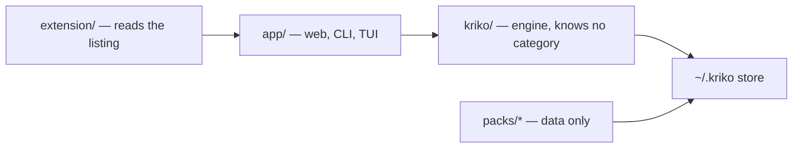

# Kriko

[](backlog.md)
[](pyproject.toml)
[](../../releases/latest)

**A local-first knowledge engine for any manufactured product on any listing
site.** It answers one question, *what is known to go wrong with this specific
one?*, entirely on your machine. Knowledge comes from **catalogs** (a pack is
what the code calls one) and site reading from **site adapters**, both
delivered as data. Nothing runs in the cloud, nothing is uploaded, and there
is no account.

Every answer carries the quote it came from. A claim that cannot be shown to
exist in a document that was actually read is refused before it reaches the
store, and every refusal is written down with its reason, so "why does it not
know this" is answerable.

## Contents

- [What it looks like](#what-it-looks-like) · [Download](#download) · [Quick start](#quick-start)
- [What a catalog is](#what-a-catalog-is) · [Research, not release](#to-do--research-not-release) · [Docs](#where-to-go-next)

## What it looks like

An example against an installed catalog, from the CLI. A lookup names the
product with the identity keys the catalog declares, in whatever keys it
declares; the engine has no idea what a key means.

```bash
$ kriko lookup <key>=<value> <key>=<value> --limit 3

match: exact  (1 subject(s))  coverage: RISKS_FOUND

1. [high] <the claim title, verbatim from the catalog>
   <subject label>  ·  <area>  ·  relevance 0.270
```

Add `-v`: each claim shows its check, its sources and their trust tier, and why
an unconfirmed claim is shown anyway but ranked lower.





## Download

The desktop app carries its own Python. **No Docker, no Postgres, no
service.** Grab the installer from the [latest release](../../releases/latest):

| Platform            | File                              |
|---------------------|-----------------------------------|
| Windows             | `Kriko_<version>_x64-setup.exe`   |
| macOS (Apple Silicon) | `Kriko_<version>_aarch64.dmg`   |
| Debian / Ubuntu     | `Kriko_<version>_amd64.deb`       |
| Any Linux           | `Kriko_<version>_amd64.AppImage`  |

Builds are **unsigned**: macOS reports an unidentified developer (right-click,
then Open) and Windows SmartScreen warns (More info, then Run anyway). Signing
is a policy decision and is not part of 1.0.

Everything lives in `~/.kriko`. `knowledge.sqlite` (installed catalogs) and
`app.sqlite` (your history) are separate files, so uninstalling a catalog
cannot drop your history.

**Staying current, two clocks.** *Catalogs* are checked against the latest
release's index: only genuinely newer ones are downloaded, and each is verified
by `sha256` before install (the same path as `kriko install`; override with
`KRIKO_PACK_INDEX`). The *app* checks on startup against a minisign key baked
in at build time. Neither touches `~/.kriko`.

## Quick start

```bash
tools/setup.sh                   # venv, locked deps, npm trees, version check
kriko build packs/<name>         # a catalog directory -> dist/<name>.kpack
kriko install dist/<name>.kpack
kriko lookup <key>=<value> -v
kriko tui                        # operator console: planes, jobs, operations, shell
kriko prefs                      # chosen providers, measured spend, sites, drafts
python -m app.web                # dashboard + the check endpoint on 127.0.0.1:8787
```

`kriko` is on `PATH` after setup; `python -m app.cli` is the same command
otherwise. Then load the extension: Chrome, `chrome://extensions`, Developer
mode, Load unpacked, `extension/`; or stage a copy from the app's Browser
extension screen (`~/.kriko/extension/`).

<details>
<summary><strong>Install from source (details)</strong></summary>
Requires Python 3.13+. The CLI and the desktop app share `~/.kriko`, so a
catalog installed in one is visible in the other. Identity is bare `key=value`
pairs, declared by the catalog and passed through opaquely, which is why there
are no per-category flags on `lookup`. Only the research path needs keys, and
serving a lookup never does; the app's Settings screen stores them. Run
`tools/gate.sh` before pushing.
</details>

## What a catalog is

A catalog is data plus a builder, never code that runs in the engine: subjects
(`packs/<name>/data/`), vocabulary, source-trust tiers, its own bar for what is
worth surfacing, and a `build.py` that turns YAML into a `.kpack`. Two ship
today, and they are deliberately unlike each other: one is a mature pack with
its own pipeline, the other a tiny synthetic category with no pipeline at all,
which is what proves the engine holds no assumption about the kind of product
it answers about. Contract: `docs/PACK_CONTRACT.md`.

<details>
<summary><strong>Research planes (details)</strong></summary>
The default plane costs **nothing extra**: a coding agent you already have a
subscription for does the reading, through the MCP server (System, then Agents)
and the research agent. Every write is re-checked in code: quotes must be
verbatim, figures sourced, unit codes exact.

The same three operations exist as a CLI fallback: `agenda`, `brief`, `submit`.
A local model on your own machine is the first plane (System, then Settings, to
set its address), and a paid API researcher exists for unattended runs and is
never the default.

In-app *Research* runs as a job and produces a brief before anything is spent.
Full walkthrough: `docs/USAGE.md`.
</details>

## To do, research rather than release

Ideas worth a month, no promises. Each was measured before it was written down;
the details are in `backlog.md`.

| Idea | What was measured |
|------|-------------------|
| A small local model as the extractor, then fine-tuned | A 4B-class local model on a consumer GPU: about 49 s for 6 pages, 7 of 8 quotes grounded, 3 accepted by the gate. A 3B-class model returned nothing usable. The engine still has no way to pass context length or reasoning effort through. |
| A principle filter as an optional add-on | Zero-shot on 40 real claims from a mature catalog: AUC 0.46 to 0.61, which is chance. It needs a labelled per-catalog set and a fine-tune before it is worth anything. |
| MCP demoted, then removed | The CLI's `agenda`/`brief`/`submit` already match the MCP tools, so MCP is a thin wrapper. It goes when nothing uses it. |
| A third-party fetcher: tested, not adopted | 20 URLs: the same 6 quotes as the built-in reader, 3x slower (5.6 s against 1.7 s median). At most a flagged fallback for pages that need scripting. |

## Desktop build

`kriko-gpui/` is the desktop app: a native GPUI window that spawns the frozen
Python sidecar, waits for `/api/health`, and draws every screen from the same
`~/.kriko/` store over HTTP. Installers come from `.github/workflows/desktop.yml`
(**hand-run only**, no Actions minutes) or locally from
`powershell -File kriko-gpui/package.ps1`;
`packaging/freeze.sh` builds the sidecar alone, with no Rust needed. The
sidecar is also the console (`kriko-sidecar --tui`, and a Start-menu shortcut
on Windows). See `kriko-gpui/README.md`.

## Where to go next

| Doc                     | For                                                        |
|-------------------------|------------------------------------------------------------|
| `CLAUDE.md`             | The principles every change is judged against              |
| `CONTRIBUTING.md`       | Branches, commits, test gates, what CI checks              |
| `backlog.md`            | Open work. The only status file; `git log` is the rest     |
| `docs/ARCHITECTURE.md`  | Reading the code: package layout and a reading map         |
| `docs/USAGE.md`         | Operating it, and growing the knowledge base end to end    |
| `docs/HOW_IT_WORKS.md`  | Four diagrams: matching, catalog lifecycle, a run, layering |
| `docs/STYLE.md`         | How these documents are written. Rules, not taste          |
| `docs/INSTALL_WINDOWS.md` | Installing on Windows, including the extension step      |
| `docs/PACK_CONTRACT.md` | Authoring a catalog for a new product category             |
| `kriko-gpui/README.md`  | The desktop app: engine supervision, screens and build     |
