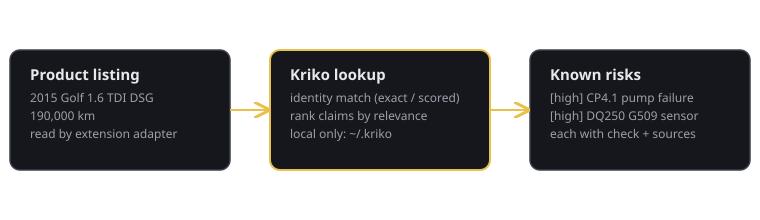

<div align="center">


### What is known to go wrong with this specific product?

A knowledge engine for manufactured products, read beside any listing.<br>
Every risk it shows carries the quote it came from.

[](../../releases/latest)
[](../../releases/latest)

[Download](#download) · [Build it yourself](#build-it-yourself) · [Quick start](#quick-start) · [Catalogs](#what-a-catalog-is) · [Model benchmarks](#model-benchmarks) · [Docs](#documentation)

</div>

---

## Overview

| | |
|---|---|
| **Self-contained** | The engine, the reader's history and every catalog live in `~/.kriko`. There is no server to run and no database to provision. |
| **Quoted, or refused** | A risk (`claim` in the code) that cannot be shown in a document that was actually read is refused before it reaches the store. Every refusal is recorded with its reason. |
| **Any category, as data** | Knowledge comes from **catalogs** (`pack` in the code) and site reading from **site adapters**. Both are data. The engine knows no category, so a new one is a directory, never a code change. |
| **Beside the listing** | The browser extension reads the listing, queries the engine on `127.0.0.1`, and shows the risks next to it. |

## How a lookup reads

A lookup names the product with the identity keys the catalog declares. The
engine passes them through without interpreting them.

```console
$ kriko lookup <key>=<value> <key>=<value> --limit 3

match: exact  (1 subject(s))  coverage: RISKS_FOUND

1. [high] <the risk title, verbatim from the catalog>
   <subject label>  ·  <area>  ·  relevance 0.270
```

Add `-v` to see each risk's check, its sources and their trust tier, and why
an unconfirmed risk is shown anyway, ranked lower.




## Download

Kriko 1.1.0 is the first beta, a Windows x64 release. The installer carries its own Python,
the engine and the first-party catalogs, so a fresh install opens with
knowledge in it. Both files are on the [latest release](../../releases/latest):

| File | What it is |
|------|------------|
| `kriko-1.1.0-x86_64.msi` | Per-user installer. Start menu entries and a tray icon; no administrator rights needed. |
| `kriko-1.1.0-win64-portable.zip` | Both executables, no install. Unzip and run `kriko.exe`. |

> **SmartScreen shows "Windows protected your PC".** The build is unsigned.
> Choose **More info**, then **Run anyway**.

On macOS or Linux, run it [from source](#quick-start). The engine, CLI,
dashboard and extension all work there.

## Using it

| Where | What it does |
|-------|--------------|
| **Run** | One check, from the product to stored risks. The Live actions bar beside every screen shows each running agent with an animated progress bar, its logs, a Stop key, and a reply box while something is running. |
| **Agents** | Every agent on the machine, including the **Local model** when a model server holds a model. Pick the one checks run with, its **model** and its **effort**, and the **research sources** every agent run reads: which kinds go first (forums, reviews, recalls, manufacturer documents, video, news) and how many sources at most. |
| **Compare** | Line up saved checks and ask about them with any agent or the local model. The agent reads each risk's recorded sources and cites them. |
| **Browser extension** | Reads the listing beside you. For a product no catalog knows, a **quick look** answers in a minute or two and is saved on its own; **Add to a pack** files it into the category's catalog only when you ask. Progress is an animated bar beside the current stage and the time it has taken. |

**Closing the window does not quit.** The engine keeps serving the browser
extension. Quit from the tray icon.

**Where data is kept.** Everything is in `~/.kriko`. `knowledge.sqlite` holds
the installed catalogs and `app.sqlite` holds the reader's history. They are
separate files, so uninstalling a catalog cannot drop history.

**Updates run on two clocks.**

- *Catalogs* are checked weekly against the latest release's index. Only newer
  ones download, and each is verified by `sha256` before install (the same
  path as `kriko install`; override the index with `KRIKO_PACK_INDEX`).
- *The app* checks on startup against a minisign key set at build time.
  Neither update touches `~/.kriko`.

## Build it yourself

The installer is built on a Windows host by one script,
`kriko-gpui/package.ps1`. `.github/workflows/desktop.yml` runs the same steps
in the same order, and is hand-run only for now. PyInstaller cannot
cross-compile, so the Windows build has to run on Windows.

**Prerequisites**

| Tool | Version | Check |
|------|---------|-------|
| Python | 3.13+ | `python --version` |
| Node | 20+ | `node --version` |
| Rust toolchain | stable, MSVC target | `cargo --version` |
| cargo-wix | any | `cargo install cargo-wix` |
| WiX Toolset | 3.x (3.14 is tested) | `candle.exe -?` |

**Build**

```powershell
git clone <this repository> kriko
cd kriko
powershell -ExecutionPolicy Bypass -File kriko-gpui\package.ps1 -WixBin C:\path\to\wix314
```

The script checks that every version agrees, installs the Python side into
`.venv` (creating it if missing), builds the dashboard and the catalogs,
freezes the sidecar and checks that it answers, builds the app, wraps the MSI,
and confirms the built app starts. Each step prints a `===` header; the script
stops at the first failure.

| Output | Path |
|--------|------|
| Installer | `kriko-gpui\builds\kriko-<version>-x86_64.msi` |
| Portable | `kriko-gpui\builds\kriko-<version>-win64-portable.zip` |

| Parameter | Use |
|-----------|-----|
| `-WixBin <dir>` | The folder holding `candle.exe` and `light.exe`. Without it, the `WIX` environment variable or `PATH` is used. |
| `-Python <exe>` | The interpreter to build with. Default `.venv\Scripts\python.exe`. |
| `-Version <x.y.z>` | The version this build is meant to be. A check, not a stamp: it must equal `pyproject.toml`. |
| `-SkipUi` | Reuse the committed dashboard bundle. Safe only when `ui/` has not changed since it was built. |

> **WiX is not found.** Pass `-WixBin`, or set `WIX` to the folder holding
> `candle.exe`. Only WiX 3.x is supported.

> **The version check fails.** `tools/bump.py <x.y.z>` sets the version in
> every file that carries it. Re-run `tools/setup.sh` so the installed
> metadata agrees.

The MSI installs per user under `%LOCALAPPDATA%\Programs\Kriko`, creates the
Start menu shortcuts "Kriko" and "Kriko Console", and stops a running Kriko
before it replaces files. `packaging/freeze.sh` builds the sidecar alone, with
no Rust needed. The sidecar is also the operator console
(`kriko-sidecar --tui`). See [the desktop app's README](kriko-gpui/README.md)
for engine supervision and the installer's internals.

## Quick start

From a checkout, with Python 3.13+ and Node:

```bash
tools/setup.sh                   # venv, locked deps, npm trees, version check
kriko build packs/<name>         # a catalog directory -> dist/<name>.kpack
kriko install dist/<name>.kpack
kriko lookup <key>=<value> -v
```

Then pick an interface. They share one store:

```bash
python -m app.web                # dashboard and the check endpoint on 127.0.0.1:8787
kriko tui                        # operator console: planes, jobs, operations, shell
kriko prefs                      # chosen providers, measured spend, sites, drafts
```

`kriko` is on `PATH` after setup; `python -m app.cli` is the same command
otherwise.

**Load the extension.** In Chrome, open `chrome://extensions`, turn on
Developer mode, choose **Load unpacked** and pick `extension/`. Or stage a copy
from the app's Browser extension screen (`~/.kriko/extension/`).

> **The panel says "Kriko is not running".** Start the desktop app or
> `python -m app.web` first. The extension talks to a fixed port on
> `127.0.0.1` and nowhere else.

The CLI and the desktop app share `~/.kriko`, so a catalog installed in one is
visible in the other. Identity is bare `key=value` pairs, declared by the
catalog and passed through opaquely, which is why `lookup` has no
per-category flags. Only the research path needs API keys; serving a lookup
never does. The app's Settings screen stores them. Run `tools/gate.sh` before
pushing.

## What a catalog is

A catalog is data plus a builder, never code that runs in the engine:

| Part | Where |
|------|-------|
| Name, version and identity keys | `packs/<name>/pack.toml` |
| Subjects | `packs/<name>/data/` |
| Vocabulary | `packs/<name>/vocabulary/` |
| Its own bar for what is worth surfacing | `packs/<name>/research/principle.md` |
| Built from YAML to one `.kpack` file | `kriko build packs/<name>` (a catalog may bring its own `build.py` and trust tiers) |

Two ship today, and they are deliberately unlike each other. One is a mature
catalog with its own research pipeline. The other is a small synthetic category
with no pipeline at all. Together they show the engine holds no assumption
about the kind of product it answers about. See
[the pack contract](docs/PACK_CONTRACT.md) for what a catalog must and may
contain.

### Research planes

New knowledge is read by one of three planes. Every write is re-checked in
code: quotes must be verbatim, figures sourced, unit codes exact.

| Plane | What does the reading | Cost |
|-------|-----------------------|------|
| Harness | A coding agent CLI already installed, through the MCP server (System, then Agents) | The existing subscription |
| Local model | A model server on the same host (System, then Settings, to set its address) | None |
| Paid API | A hosted model, for unattended runs only; never the default | Metered |

The CLI exposes the same three operations as the MCP server: `agenda`,
`brief`, `submit`. In-app *Research* runs as a job and produces a brief before
anything is spent. Full walkthrough:
[operating Kriko and growing its knowledge](docs/USAGE.md).

## Model benchmarks

The Benchmark screen (System, then Benchmark) runs the engine's fixed test set
against each configured plane and records every run in `app.sqlite`
(`bench_runs`). The same run is `POST /api/bench`, priced first by
`POST /api/bench/estimate`. Results are per machine: they depend on the
installed agents, the hardware and the catalogs.

**Benchmark screen, reference Windows host**

| Version | Plane | Protocol | Runs | Errors | Median time per case | Median tokens | Findings accepted |
|---------|-------|----------|------|--------|----------------------|---------------|-------------------|
| 1.0.0 | Harness (a coding agent CLI) | standard | 3 | 0 | 29.6 s | 103,741 | 5 of 5 |

**Earlier extraction measurements, before the Benchmark screen existed**

| Model | Hardware | Result |
|-------|----------|--------|
| Local, 4B class | Consumer GPU | About 49 s for 6 pages; 7 of 8 quotes grounded; 3 findings accepted by the gate |
| Local, 3B class | Consumer GPU | Nothing usable returned |

Two further measurements shaped the design:

| Question | Result |
|----------|--------|
| Can a zero-shot principle filter rank risks? | On 40 real risks from a mature catalog, AUC 0.46 to 0.61, which is chance. It needs a labelled per-catalog set and a fine-tune first. |
| Is a third-party page fetcher better than the built-in reader? | On 20 URLs it found the same 6 quotes, 3x slower (5.6 s against 1.7 s median). At most a flagged fallback for pages that need scripting. |

## Documentation

| Doc | For |
|-----|-----|
| [`CLAUDE.md`](CLAUDE.md) | The principles every change is judged against |
| [`docs/DOCTRINE.md`](docs/DOCTRINE.md) | Making a change: the issue, setup, branches, commits, the gate, the PR |
| [`docs/ARCHITECTURE.md`](docs/ARCHITECTURE.md) | Reading the code: package layout and a reading map |
| [`docs/USAGE.md`](docs/USAGE.md) | Operating it, and growing the knowledge base end to end |
| [`docs/HOW_IT_WORKS.md`](docs/HOW_IT_WORKS.md) | Four diagrams: matching, catalog lifecycle, a run, layering |
| [`docs/INSTALL_WINDOWS.md`](docs/INSTALL_WINDOWS.md) | Installing on Windows, including the extension step |
| [`docs/PACK_CONTRACT.md`](docs/PACK_CONTRACT.md) | Authoring a catalog for a new product category |
| [`docs/STYLE.md`](docs/STYLE.md) | How these documents are written |
| [`kriko-gpui/README.md`](kriko-gpui/README.md) | The desktop app: engine supervision, screens and build |
