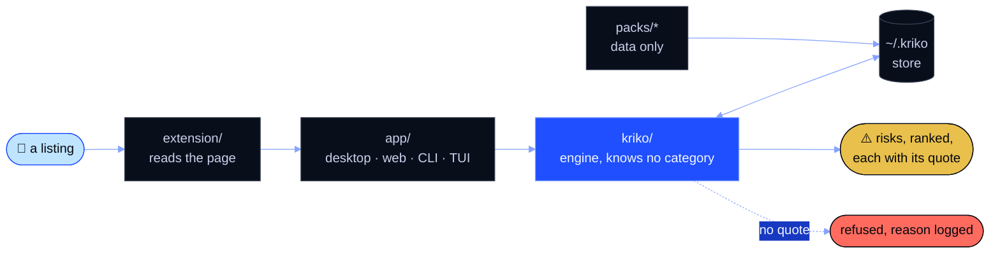

<div align="center">


### What is known to go wrong with *this specific one*?

**A local-first knowledge engine for manufactured products, on any listing site.**<br>
Every answer carries its quote. Nothing leaves your machine.

[](../../releases/latest)
[](../../releases/latest)
[](pyproject.toml)<br>
[](#-download)
[](#-download)
[](#-download)

[**Download**](#-download) · [**Quick start**](#-quick-start) · [**Catalogs**](#-what-a-catalog-is) · [**Research**](#-research-ideas-not-promises) · [**Docs**](#-where-to-go-next)

</div>

---

## ✨ Why Kriko

| | |
|---|---|
| 🏠 **Local first** | The engine, your history and every catalog live in `~/.kriko`. No Docker, no Postgres, no service, no account. |
| 🔎 **Quoted, or refused** | A risk (`claim` in the code) that cannot be shown in a document that was actually read is refused before it reaches the store. Every refusal is written down with its reason, so "why does it not know this" has an answer. |
| 🧩 **Any category, as data** | Knowledge comes from **catalogs** (`pack` in the code) and site reading from **site adapters**. Both are data. The engine knows no category, so a new one is a directory, never a code change. |
| 🧭 **On the page you are reading** | The browser extension reads the listing, asks the engine on `127.0.0.1`, and shows the risks beside it. |

## 👀 What it looks like

A lookup names the product with the identity keys the catalog declares. The
engine passes them through and has no idea what a key means.

```console
$ kriko lookup <key>=<value> <key>=<value> --limit 3

match: exact  (1 subject(s))  coverage: RISKS_FOUND

1. [high] <the risk title, verbatim from the catalog>
   <subject label>  ·  <area>  ·  relevance 0.270
```

Add `-v` to see each risk's check, its sources and their trust tier. It also
says why an unconfirmed risk is shown anyway, ranked lower.




## 📦 Download

**Kriko 1.0.0 is a Windows release.** The installer carries its own Python,
the engine and the first-party catalogs, so a fresh install opens with
knowledge in it. Get both files from the [latest release](../../releases/latest):

| File | What it is |
|------|------------|
| `kriko-1.0.0-x86_64.msi` | 🪟 Per-user installer. Start menu entry, tray icon, no admin rights. |
| `kriko-1.0.0-win64-portable.zip` | 🎒 Both executables, no install. Unzip and run `kriko.exe`. |

> **Windows SmartScreen says "Windows protected your PC"?** The build is
> unsigned. Choose **More info**, then **Run anyway**. Signing is a policy
> decision and is not part of 1.0.

On macOS or Linux, run it [from source](#-quick-start): the engine, CLI,
dashboard and extension all work there.

**Closing the window is not quitting.** The engine keeps serving the browser
extension. Quit from the tray icon.

**Where things live.** Everything is in `~/.kriko`. `knowledge.sqlite` holds
the installed catalogs and `app.sqlite` holds your history. They are separate
files, so uninstalling a catalog cannot drop your history.

**Staying current, two clocks.**

- 📚 *Catalogs* are checked weekly against the latest release's index. Only
  newer ones download, and each is verified by `sha256` before install (the
  same path as `kriko install`; override the index with `KRIKO_PACK_INDEX`).
- 🔄 *The app* checks on startup against a minisign key baked in at build
  time. Neither update touches `~/.kriko`.

## 🚀 Quick start

From a checkout, with Python 3.13+ and Node:

```bash
tools/setup.sh                   # venv, locked deps, npm trees, version check
kriko build packs/<name>         # a catalog directory -> dist/<name>.kpack
kriko install dist/<name>.kpack
kriko lookup <key>=<value> -v
```

Then pick an interface. They share one store:

```bash
python -m app.web                # dashboard + the check endpoint on 127.0.0.1:8787
kriko tui                        # operator console: planes, jobs, operations, shell
kriko prefs                      # chosen providers, measured spend, sites, drafts
```

`kriko` is on `PATH` after setup; `python -m app.cli` is the same command
otherwise.

**Load the extension.** In Chrome, open `chrome://extensions`, turn on
Developer mode, choose **Load unpacked** and pick `extension/`. Or stage a copy
from the app's Browser extension screen (`~/.kriko/extension/`).

> **The panel says "Kriko is not running"?** Start the desktop app or
> `python -m app.web` first. The extension talks to a fixed local port, never
> to the internet.

<details>
<summary><strong>Install from source, the details</strong></summary>

The CLI and the desktop app share `~/.kriko`, so a catalog installed in one is
visible in the other. Identity is bare `key=value` pairs, declared by the
catalog and passed through opaquely, which is why `lookup` has no
per-category flags. Only the research path needs API keys; serving a lookup
never does. The app's Settings screen stores them. Run `tools/gate.sh` before
pushing.
</details>

## 🧩 What a catalog is

A catalog is data plus a builder, never code that runs in the engine:

| Part | Where |
|------|-------|
| 🪪 Name, version and identity keys | `packs/<name>/pack.toml` |
| 📇 Subjects | `packs/<name>/data/` |
| 🗣️ Vocabulary | `packs/<name>/vocabulary/` |
| 🎯 Its own bar for what is worth surfacing | `packs/<name>/research/principle.md` |
| 🔨 Built from YAML to one `.kpack` file | `kriko build packs/<name>` (a catalog may bring its own `build.py` and trust tiers) |

Two ship today, and they are deliberately unlike each other. One is a mature
catalog with its own research pipeline. The other is a tiny synthetic category
with no pipeline at all. Together they prove the engine holds no assumption
about the kind of product it answers about. See
[the pack contract](docs/PACK_CONTRACT.md) for what a catalog must and may
contain.

<details>
<summary><strong>🔬 Research planes, the details</strong></summary>

The default plane costs **nothing extra**. A coding agent you already have a
subscription for does the reading, through the MCP server (System, then
Agents) and the research agent. Every write is re-checked in code: quotes
must be verbatim, figures sourced, unit codes exact.

- 🖥️ **Local model.** A model server on your own machine is the first plane
  (System, then Settings, to set its address).
- ⌨️ **CLI fallback.** The same three operations: `agenda`, `brief`, `submit`.
- 💳 **Paid API.** For unattended runs only, and never the default.

In-app *Research* runs as a job and produces a brief before anything is spent.
Full walkthrough: [operating Kriko and growing its knowledge](docs/USAGE.md).
</details>

## 🧪 Research ideas, not promises

Ideas worth a month, each measured before it was written down. Open work is
tracked in the repo's issues.

| Idea | What was measured |
|------|-------------------|
| 🤏 A small local model as the extractor, then fine-tuned | A 4B-class local model on a consumer GPU: about 49 s for 6 pages, 7 of 8 quotes grounded, 3 accepted by the gate. A 3B-class model returned nothing usable. |
| 🎯 A principle filter as an optional add-on | Zero-shot on 40 real risks from a mature catalog: AUC 0.46 to 0.61, which is chance. It needs a labelled per-catalog set and a fine-tune first. |
| ✂️ MCP demoted, then removed | The CLI's `agenda`/`brief`/`submit` already match the MCP tools, so MCP is a thin wrapper. It goes when nothing uses it. |
| 🌐 A third-party fetcher: tested, not adopted | 20 URLs: the same 6 quotes as the built-in reader, 3x slower (5.6 s against 1.7 s median). At most a flagged fallback for pages that need scripting. |

## 🛠️ Desktop build

`kriko-gpui/` is the desktop app. It is a native GPUI window that:

1. spawns the frozen Python sidecar,
2. waits for `/api/health`, showing the engine's stderr if it fails,
3. draws every screen from the same `~/.kriko/` store over HTTP.

```powershell
powershell -File kriko-gpui/package.ps1   # -> kriko-gpui/builds/*.msi and *.zip
```

`packaging/freeze.sh` builds the sidecar alone, with no Rust needed.
`.github/workflows/desktop.yml` is the same recipe, **hand-run only** for now.
The sidecar is also the console (`kriko-sidecar --tui`, with a Start-menu
shortcut on Windows). See [the desktop app's README](kriko-gpui/README.md).

## 📚 Where to go next

| Doc | For |
|-----|-----|
| [`CLAUDE.md`](CLAUDE.md) | The principles every change is judged against |
| [`docs/DOCTRINE.md`](docs/DOCTRINE.md) | Making a change: the issue, setup, branches, commits, the gate, the PR |
| [`docs/ARCHITECTURE.md`](docs/ARCHITECTURE.md) | Reading the code: package layout and a reading map |
| [`docs/USAGE.md`](docs/USAGE.md) | Operating it, and growing the knowledge base end to end |
| [`docs/HOW_IT_WORKS.md`](docs/HOW_IT_WORKS.md) | Four diagrams: matching, catalog lifecycle, a run, layering |
| [`docs/INSTALL_WINDOWS.md`](docs/INSTALL_WINDOWS.md) | Installing on Windows, including the extension step |
| [`docs/PACK_CONTRACT.md`](docs/PACK_CONTRACT.md) | Authoring a catalog for a new product category |
| [`docs/STYLE.md`](docs/STYLE.md) | How these documents are written. Rules, not taste |
| [`kriko-gpui/README.md`](kriko-gpui/README.md) | The desktop app: engine supervision, screens and build |

<div align="center">

---

<sub>Made to answer one question well, on your own machine. 🟦⬛</sub>

</div>
