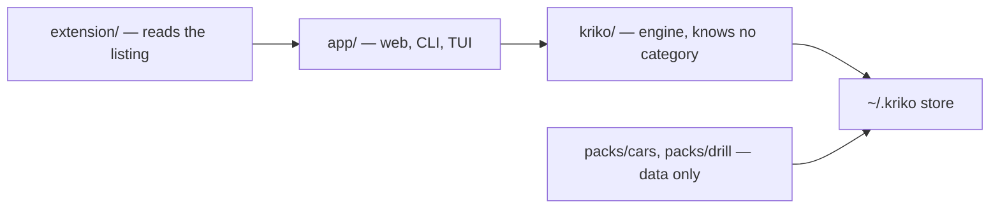

# Kriko

[](backlog.md)
[](pyproject.toml)
[](../../releases/latest)

**Local-first knowledge engine for manufactured products.** It answers one question —
*what is known to go wrong with this specific one?* — from knowledge **packs** you install,
entirely on your machine. Pack #1 is `cars`: known reliability risks for a specific used-car
variant on Sahibinden.com, **before** the buyer books an inspection.

## Contents

- [What it looks like](#what-it-looks-like) · [Download](#download) · [Quick start](#quick-start)
- [What a pack is](#what-a-pack-is) · [Supported cars](#supported-cars-tr-market)
- [Research, not release](#to-do--research-not-release) · [Docs](#where-to-go-next)

## What it looks like

A real lookup against the installed `cars` pack (2015 Golf, diesel, DSG, 190,000 km):

```bash
$ python -m app.cli lookup make=volkswagen model=golf year=2015 fuel=diesel \
      transmission=automatic --ctx usage_km=190000 --limit 3

match: exact  (1 subject(s))  coverage: RISKS_FOUND

1. [high] CP4.1 pump failure contaminates EA288 fuel system
   Volkswagen EA288 TDI  ·  fuel system  ·  relevance 0.270
```

Add `-v`: each claim shows its check ("scan for DTC P0087..."), its sources and trust
tier, and why an unconfirmed claim is shown anyway but ranked lower.





## Download

The desktop app carries its own Python. **No Docker, no Postgres, no service.**
Grab the installer from the [latest release](../../releases/latest):

| Platform            | File                              |
|---------------------|-----------------------------------|
| Windows             | `Kriko_<version>_x64-setup.exe`   |
| macOS (Apple Silicon) | `Kriko_<version>_aarch64.dmg`   |
| Debian / Ubuntu     | `Kriko_<version>_amd64.deb`       |
| Any Linux           | `Kriko_<version>_amd64.AppImage`  |

Builds are **unsigned**: macOS reports an unidentified developer (right-click → Open),
Windows SmartScreen warns (More info → Run anyway). Signing is backlog B52.

Everything lives in `~/.kriko`: `knowledge.sqlite` (installed packs) and `app.sqlite`
(your lookup history) are separate files, so uninstalling a pack cannot drop history.

**Staying current — two clocks.** *Packs → Check for updates* reads `packs.json` from the
latest release, downloads only genuinely newer packs, and verifies `sha256` before install
(same path as `kriko install`; override with `KRIKO_PACK_INDEX`). App updates on startup are
verified against a baked-in minisign key. Both leave `~/.kriko` alone.

## Quick start

```bash
tools/setup.sh                   # venv, locked deps, npm trees, version check
kriko build packs/cars           # → dist/cars.kpack
kriko install dist/cars.kpack
kriko lookup make=volkswagen model=golf year=2015 fuel=diesel \
    transmission=automatic --ctx usage_km=190000 -v
kriko tui                        # operator console: planes, agenda, jobs, ops, shell
kriko prefs                      # costs, sites, verify, drafts, operations
python -m app.web                # dashboard + /analyze on 127.0.0.1:8787
```

`kriko` is on PATH after setup; otherwise `python -m app.cli` is the same command.
Then load the extension: Chrome → `chrome://extensions` → Developer mode → Load unpacked
→ `extension/`, or stage a copy via **Check → Browser extension** (`~/.kriko/extension/`).

<details>
<summary><strong>Install from source (details)</strong></summary>

Requires Python 3.13+. The CLI and desktop app share `~/.kriko`, so a pack installed in
one is visible in the other. Identity is bare `key=value` pairs (pack-declared, passed
through opaquely — no `--make/--model` flags). Only the research pipeline needs API keys
(`MISTRAL_API_KEY`, `EXA_API_KEY` in repo-root `.env`); serving a lookup never does.
Run `tools/gate.sh` before pushing (pytest, JS suites, types, bundle check — what
`.github/workflows/ci.yml` used to run; see `CONTRIBUTING.md`).

</details>

## What a pack is

A pack is data plus a builder, never code that runs in the engine: subjects
(`packs/<name>/data/`), vocabulary, source-trust tiers, its own surfacing bar, and a
`build.py` turning YAML into `.kpack`. Two ship today: `cars` (mature) and `drill`
(tiny synthetic drill — no engine, no fuel — proving the core has no car assumptions).
Contract: `docs/PACK_CONTRACT.md`.

<details>
<summary><strong>Research planes (details)</strong></summary>

Default plane costs **$0**: a Claude Code / opencode / Codex / Cline subscription does the
reading via the MCP server (**System → Connect an agent**) and the `kriko_research` agent;
every write is re-checked in code (quotes must be verbatim, figures sourced, unit codes
exact). Same three operations exist as CLI fallback: `agenda`, `brief`, `submit`
(`python -m app.cli agenda --pack cars`). A paid API researcher (`backend: "api"`) exists
for unattended runs and is never the default. In-app *Research* buttons run as jobs and
produce a brief, never a surprise bill. Full walkthrough: `docs/USAGE.md` §4.

</details>

## Supported cars (TR market)

| Make       | Model  | Generation    | Engines                                                        | Gearboxes                    |
|------------|--------|---------------|----------------------------------------------------------------|------------------------------|
| Renault    | Mégane | IV (2016–2023) | K9K 1.5 dCi · R9M 1.6 dCi · H5F 1.2 TCe · H5H 1.3 TCe          | manual · DC4 EDC · DW5/DW6*  |
| Renault    | Clio   | V (2019–)      | H4D 1.0 SCe · H5D 1.0 TCe · H5H 1.3 TCe · K9K 1.5 dCi          | manual · DC4 EDC             |
| Volkswagen | Golf   | VII (2013–2020) | EA211 1.0/1.2/1.4 TSI · EA288 1.6/2.0 TDI · EA888 2.0 TSI (GTI/R) | manual · DQ200 · DQ250 · DQ381 DSG |

\* DW5/DW6 part files exist but are **unresearched stubs**, owned by the auto-remediation
loop (backlog B19) rather than per-model fixes.

## To do — research, not release

Ideas worth a month, no promises. Measured 2026-09-23; details in `backlog.md`.

| Idea | What was measured |
|------|-------------------|
| Small local models as extractors, then fine-tuned | `qwen3.5:4b` (16k ctx, no thinking, RTX 3060): 49 s / 6 pages, 7/8 grounded, gate took 3; `granite4.2:3b`: `[]`; engine lacks `num_ctx`/`reasoning_effort` passthrough (B126) |
| Laya / Jev as principle filter (optional add-on) | Zero-shot on 40 cars claims: AUC 0.46–0.61, chance-level; needs per-pack labelled set + fine-tune |
| MCP demoted, then deleted | CLI `agenda`/`brief`/`submit` already match MCP tools; MCP becomes a thin wrapper, removed when unused |
| Obscura as fetcher: tested, not adopted | 20 URLs: same 6 quotes as built-in reader, 3× slower (5.6 s vs 1.7 s median); at most a flagged JS fallback; surfaced B140 |

## Desktop build

`tauri/` wraps the same server: Rust shell spawns a PyInstaller sidecar, waits for
`/api/health`, shows the UI from the same `~/.kriko/` store. Installers come from
`.github/workflows/desktop.yml` (**hand-run only** — no Actions minutes) or locally via
`pwsh packaging/build_desktop.ps1`; `packaging/freeze.sh` builds the sidecar alone (no
Rust needed). The sidecar is also the console (`kriko-sidecar --tui`; Start-menu
**Kriko Console**). See `tauri/README.md`.

## Where to go next

| Doc                     | For                                                        |
|-------------------------|------------------------------------------------------------|
| `docs/ARCHITECTURE.md`  | Reading the code — package layout, reading map             |
| `CLAUDE.md`             | The principles every change is judged against              |
| `CONTRIBUTING.md`       | Branches, commits, test gates, what CI checks              |
| `backlog.md` / `done.md` | Open work and finished work — status, always current      |
| `docs/USAGE.md`         | Operating it, and growing the knowledge base end to end    |
| `docs/HOW_IT_WORKS.md`  | Four diagrams: matching, pack lifecycle, a run, layering   |
| `docs/STYLE.md`         | How these docs are written. Rules, not taste               |
| `docs/INSTALL_WINDOWS.md` | Installing on Windows, including the extension step      |
| `docs/PACK_CONTRACT.md` | Authoring a pack for a new product category                |
| `tauri/README.md`       | The desktop shell — launch sequence, build                 |
