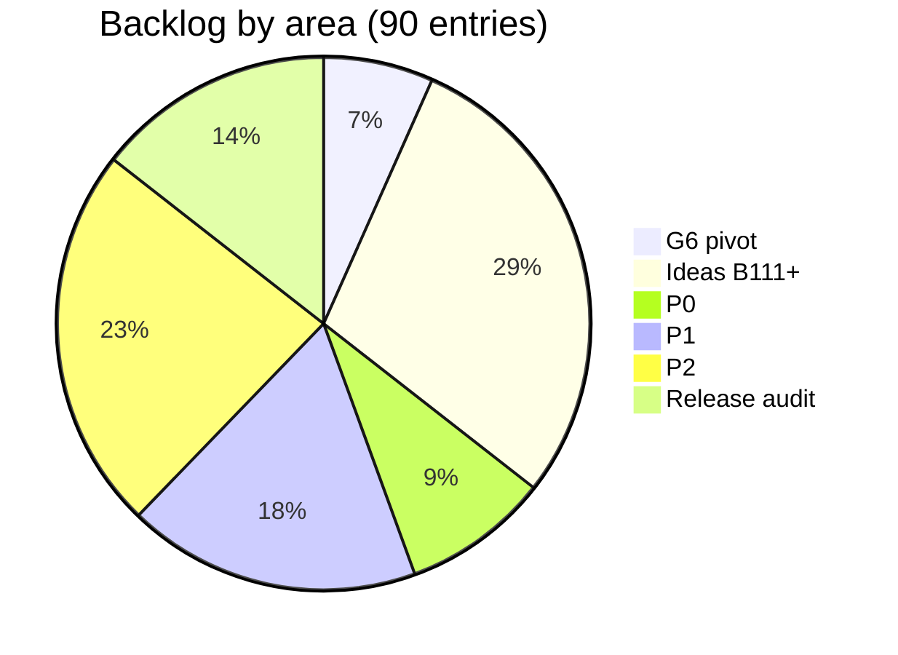

# Kriko — Backlog

Prioritized open work. Read `CLAUDE.md` (product, scalability, automation principles)
before picking anything up. When an item is finished, move it to `done.md` with the
date and commit hash.

- **P0** — actively hurting buyers or blocking everything else
- **P1** — the next round of high-leverage work
- **P2** — real, but can wait

Evidence for many items comes from production logs: `logs/analyses.jsonl`
(`python -m ops.reports.analyses --last 20`).

---




| Area | Entries | Open | Done-tagged | IDs |
|---|---|---|---|---|
| Ideas B111+ | 26 | 4 | 22 | B18-B139 (31) |
| P2 | 21 | 19 | 2 | B1-B53 (30) |
| P1 | 16 | 15 | 1 | B5-B144 (23) |
| Release audit | 13 | 2 | 11 | B63-B91 (13) |
| P0 | 8 | 6 | 2 | B2-B109 (14) |
| G6 pivot | 6 | 2 | 4 | B9-B33 (9) |

_Full verbose logs live in git history (`git show 27799af:backlog.md`). Entries compressed 2026-09-25: problem, decision/measurement, next step._


## Goals (2026-08)
**G1 — Quality over quantity.** A buyer sees at most ~8 risks, and they are the *general chronics*: config-specific, high-consequence, multi-source-corroborated issues.
Today a DSG Golf gets 39–86 cards; nobody reads 39 cards.
**G2 — Cut pipeline cost per car by ~10×.** Classification spend must be budgeted, cached, and reported.
**(Landed 2026-07-22 — B1 closed.)**
**G4 — One trunk.** **(Done 2026-07-22 — all branches merged, worktrees pruned.)**
This retires HUMAN DECISION #6/#7 (B17/B11) and all "manual audit/spot-check" backlog steps.
Refs: B2, B3, B19.

## Goal G6 — Kriko becomes a product knowledge engine *(new 2026-08-26)*
Kriko stops being a car product and becomes an open-source, local-first knowledge engine for any manufactured product.
Design and phases: `~/.claude/plans/let-s-go-with-the-eager-torvalds.md` (to be moved into `docs/superpowers/specs/` when Phase 1 lands).
The pivot rests on one change: **slots become rows, not columns.** `variants` assumes every subject has a make, a model, an engine code and a displacement — already false for an EV, hopelessly false for a cordless drill with no components.
Two contributors modelling a category differently must still produce mergeable databases; columns cannot union, rows can.
Locked: subject/attribute/value rows in SQLite;
`pack_id` on every row; no central authority (contradicting claims coexist, ranking happens at read time); packs authored as a directory and shipped as one `.kpack` file;

### Current delivery constraint — web-first minimal slice
The next milestone is a usable local browser workflow, not another CLI-only path.
Every operation must be operable and inspectable from the dashboard with a visible result, error, and durable status.
The minimal slice covers: health and installed pack state; pack build/install/revision/enable/disable/uninstall; generic product/listing analysis; identity, coverage, flags, ranked claims, reasons, and sources; subject browsing; coverage gaps; recent activity; and explicit empty/unknown results.
Research execution and the remaining pipeline separation stay behind browser-visible job state rather than requiring a terminal, MCP client, or manual data-path step.

### B29 — Phase 1: the `kriko/` core `[G6]` **(LANDED 2026-08-26)**
`kriko/store/{schema.sql,ids.py,db.py,packstore.py}` + 28 tests.
WAL on; two databases, never merged.
`test_kriko_core_never_imports_a_domain_layer` in `ops/tests/test_repo_invariants.py` is the mechanical guarantee that adding a category stays a data-only change.
Corrected while writing the tests: identical facts from two packs do **not** collapse to one row.
`pack_id` is in every primary key, so each pack keeps its own row with the same content hash — otherwise uninstalling one pack would delete a fact the other still asserts.
Dedup is a read-time `GROUP BY` on the agreeing hash, never a storage-time merge.

### B30 — Phase 2: pack format and the drill pack `[G6]` **(LANDED 2026-08-26)**
`kriko/pack/{manifest,build}.py` + `packs/drill/` + 24 tests.
Authoring a pack is data-only: YAML in, SQLite out, no Python.
The builder validates strictly — a claim pointing at a nonexistent subject, or an attribute using an undeclared term, fails the build rather than shipping a row nobody would see.
The drill pack is deliberately **synthetic** (`synthetic = true`, every URL on the reserved `example.invalid` domain, pinned by a test).
It exists to falsify a car-shaped format, not to inform: no engine/fuel/displacement, wear measured in `charge_cycles`/`usage_hours`, and one product with zero relations.
Rebuild it from real sources once the researcher interface lands in Phase 5.

### B31 — Phase 3: generic lookup `[G6]` **(LANDED 2026-08-26)**
`kriko/lookup/{conditions,match,rank,query}.py` + 52 tests.
Replaces `matcher.py` (226) + `resolver.py` (650) with no car knowledge in either.
`stance='refutes'` halves rank and shows the rebuttal.
The condition evaluator answers in **three** states, not two: `met`, `unmet`, `unknown`.
Unknown is where an engine starts lying — an unstated mileage makes a "fails after 150k" claim neither true nor false, so it is served and downranked with the reason attached, per the fail-open rule in G5.
`test_packs_that_disagree_on_identity_keys_still_both_answer` covers the design's riskiest property (two authors, different identity keys, different hashes, must still union).
`test_core_is_domain_free.py` walks kriko/'s AST for car vocabulary in executable positions and carries its own negative test.

### B32 — Phase 4: cars pack + parity `[G6]` **(LANDED 2026-08-26)**
`packs/cars/` — 699 claims, 26 variants, 21 parts, 89 relations, 676 conditions, 725 evidence rows.
`parity_golden.jsonl` captured (98 rows) while both engines still exist.
Two gates green over 98 real listings: wherever the old engine matched, the new one resolves the identical car; and all 2,121 old claim instances are represented.
Three deliberate divergences, each asserted by a test rather than assumed: status became rank (**closes B26**), year windows are soft (**B9**), and part attribution is stricter — the old sync served DC4 gearbox faults to a diesel Mégane out of the *h5f petrol engine's* part file, a car not fitted with that engine.
Five titles listed in `KNOWN_ATTRIBUTION_FIXES`; the list must shrink to nothing when the catalog is refiled.
Found while measuring: compatibility gates must be suppressed for any attribute the part is fitted *across* (a gearbox shared by petrol and diesel spans both fuels, so a text signal naming a petrol engine describes the source, not the part).
Derived from fitment, never an exception list.

### B33 — Phases 5–6: interfaces, then delete the old path `[G6]`
CLI + web (finishing `ops/hub/web.py`, which lands B28) + MCP on the new core; extension becomes a cars-pack site adapter.
Then `backend/`, `knowledge/catalog/`, `ops/swap.py`, `ops/process.py` go.
`background.js` POSTs that to `/api/analyze` on 8787 and asks `/api/adapters` which sites are worth scraping at all; the panel renders the resolved identity rather than its own reading of the page.
Verified end to end against the real cars pack: both captured fixtures resolve to a full identity with **zero unmapped labels** and 8 ranked claims.
Five bugs the rewire found, each fixed as a mechanism:
- **`packs/cars` could not be built.** Phase 6a moved `trust/source_tiers.yaml` in from `backend/` unchanged and the builder expected a different shape; nothing noticed, because every suite built its own fixture and the one pack that ships was never built in CI.
`test_every_pack_in_the_repo_builds_and_is_not_empty` is the mechanism (it also catches the empty-build case, since a pack may ship its own `build.py`), and an unreadable trust file is now a build error rather than a pack that silently trusts nothing.
**HUMAN DECISION #8 — resolved 2026-08-29.** Choose the long-term split: generic
- [x] Phases 5a–5d **(landed 2026-08-26)** — CLI, MCP, the two research planes, the local dashboard, and the pack-declared site adapter.
- [x] **Phase 6a landed 2026-08-27** (`e5d7951`): `backend/` and `deploy/` deleted, `ops/{hub,mcp,reports,swap}` gone, the car catalog moved to `packs/cars/data/`, the coverage report moved to `packs/cars/coverage.py` and now derives servability from the pack manifest. Layering re-derived from a column to a fan and re-enforced in `test_repo_invariants.py`, with
- [x] **Phase 6 docs landed 2026-08-27** — `README.md` and `CLAUDE.md` rewritten for the pack architecture (every command in the README verified to run).
- [x] **Phase 6b landed 2026-08-29** (`f038df9`) — generic ledger/extraction primitives moved to `kriko/ledger/` and `kriko/extract/`; car catalog, sources, parts, fitment, acquisition, export, resolution, and research policy moved to `packs/cars/pipeline/`; `knowledge/` is deleted. Pack vocabulary and gate
- [x] **Phase 6c landed 2026-08-27** — the Chrome extension is on the new protocol and the client keeps no site knowledge of its own. `content.js` reports the page's own label/value pairs and interprets nothing (697 -> 426 lines; `mapTurkishKeys`, `mapTechnicalDetails`, `parseMakeModelFromTitle` and its hardcoded make list are gone);
- [ ] **Phase 6c follow-up — the manifest is the last hardcoded site list.** `extension_ui/manifest.json` still names `*.sahibinden.com` in `content_scripts.matches` and `host_permissions`, so installing a pack for a second listing site does nothing until someone edits it. Every other layer is now adapter-driven. The fix is
- [x] Architecture and usage docs rewritten for the new `app/`, `kriko/`, `packs/`, and `extension/` layout; old interface references removed from active documentation. Older product-quality work is re-filed against the new core where still applicable.
Refs: B15.

## Ideas from the reader, 2026-09-14 (B111-B119)
Nine, written down the evening before the 0.8.1 install was tried.
Filed rather than built, except B114's launch bug, which was reproduced and fixed the same day.
Several already have most of their machinery in the tree; where that is true it is said, because the expensive mistake here is building a second copy of something that exists.

### B120 / B121 — **DONE 2026-09-14** (0.8.3)
The document that proved the quote is kept (`app.sqlite`'s `documents`, keyed by `source_id`, bounded), and the check can be made again offline through `findings.regrounded`.
The harness run streams: `--output-format stream-json`, read line by line, narrated into the job log both clients already show.
What is *not* done, and is worth its own row when someone wants it: a run that stops to ask a question still cannot be answered — the prompt goes in on stdin and the transcript comes out, so this is a window rather than a conversation.
See `done.md`, and `git show` for the entry that stated both defects in full.

### B122 — **DONE 2026-09-14** (0.8.4): the operations feed
`app/operations.py` records one row per operation — opened before the work, closed after it — and the recorder wraps every MCP tool, every job the runner starts and every `/api/analyze`.
`GET /api/operations` + `/stream`, and **Activity → Live** is the default lens.
A tool call from the reader's own agent is now visible while it runs, which was the whole gap.
Left open on purpose: `kriko tui` has no Live tab yet (it polls the same endpoint; the work is a fourth tab in `app/tui/screen.py`), and the feed cannot *cancel* an operation it is watching — an MCP call belongs to the process that made it.

### B123 / B124 — **DONE 2026-09-14** (0.8.5)
Protocols (`kriko.research.Spend` + `app/protocols.py`, the paid plane batching) and the harness-as-a-function instrument (`bench.verdict`'s failure classes).
See the B111 entry above and `done.md`.
**B124's experiment is unrun**: it needs a real CLI on a real subscription.
B126 is what turns both into measurements of correctness rather than of discipline.

### B125 — **DONE 2026-09-15** (0.8.6): the prompt no longer goes through a pipe
*"RuntimeError: Claude Code exited 1: Warning: no stdin data received in 3s … Error: Input must be provided either through stdin or as a prompt argument."*
Stdin fixed B92 and introduced a pipe.
On Windows that pipe crosses a `claude.cmd` shim into node, and when it does not arrive the CLI waits three seconds, proceeds **with no prompt**, and fails with B92's own message — on a machine where the same path had worked minutes earlier.
The prompt now goes after `--`, which ends option parsing (so the variadic `--allowedTools` still cannot eat it) and cannot be lost in transit.
Stdin remains for a prompt over 24,000 characters, because Windows caps a command line at 32,767.

### B134 — **DONE 2026-09-15** (0.8.7): an installer named for a version it does not contain
The reader's build log: `Compiling kriko v0.8.0`, one line above `Kriko_0.8.5_x64-setup.exe`.
`-Version` only reaches `tauri.conf.json`, which names the bundle;
Cargo.toml, pyproject and the frozen sidecar's metadata come from the *tree*.
So a stamp on a checkout that has not been pulled produces an installer labelled with fixes it does not carry — which is what "you forgot to update the version number" actually was, and it cost a full build plus a round of misattributed bug reports.
`build_desktop.ps1` now refuses the mismatch before anything is compiled, and names the two moves that fix it: `git pull`, or `tools/bump.py <version>`.
Also from that log, unfixed and cosmetic: Tauri warns that the bundle identifier `org.kriko.app` ends in `.app`, which collides with the macOS bundle extension.
It changes nothing on Windows and changing it is not free — the identifier is what an installed app is *keyed* by, so a new one is a new app to the OS.

### B135 — **DONE 2026-09-15**: the skill on disk follows the code
*"I believe you did not make any changes to skill text?"* — correct about the reader's machine, and the reason is the bug.
The skill is generated from the installed packs and from this app's code, and it was written exactly **once**: when Connect was pressed.
An overhauled protocol, a tool that did not exist last month and a pack that updated yesterday all reached the app and none of them reached the agent.
`agentskill.stamped()` puts a content digest in the file, `agentconfig.skill_status` compares it, `/api/agent-targets` reports `present` / `stale` per harness, and **startup refreshes every wired copy that has fallen behind** — because a protocol that needs the reader to remember a button is a protocol that drifts.
A harness that was never connected is still left alone: writing into the config directory of a CLI nobody wired would be installing something they did not ask for.
Also: the preferred-agent choice was in Settings, which is not where anyone goes to think about agents.
The same panel now renders on the Agents screen — one component in both places rather than two that can disagree.

### B126 — Benchmarks against ground truth `[G2][G5]` **(DONE 2026-09-16, 0.10.0)**
`app/gold.py` loads a pack's `research/gold.yaml`, judges produced claims against it (domain+word, phrase-in-title, phrase-in-quote — never an LLM scoring another LLM), and reports recall, precision, hallucination and `unlisted` separately.
`bench` takes `--reps`, records `gold_json` and `rep` per row, and `scored()` aggregates with Wilson intervals.
Still open: `bulk` and `validation` case kinds, `Spend.preamble` as a sweep axis, and `protocols.choose` reading the intervals instead of a flat margin.
Original entry: *"Benchmarks should be done against ground truth … measuring cost and hallucination at arbitrary rates, using statistical methods … output the optimal batch sizes and api calls as well as the precontext query."*
B111 measures discipline (what share of what a plane returned survived the gate) and cannot measure correctness, recall, or whether a difference is real.
Design: `docs/superpowers/specs/2026-09-15-ground-truth-benchmark-design.md` — a pack-authored `research/gold.yaml` (a one-time authoring decision, never a per-datum review, so the automation principle holds), three case kinds (`specific`, `bulk`, `validation`), precision/recall/hallucination as separate numbers with Wilson intervals over repetitions, and a sweep whose axes are batch size, context, **the preamble** and the search provider.
`protocols.choose` reads that instead of a flat 5% margin.

### B127 — **DONE 2026-09-15** (0.9.0): cover the gaps
*"This pack seems very solid but it includes 19 products and lacks the 20th.
I don't want to rebuild the whole thing — what about I tell the agent it lacks some products and it covers those gaps."*
Pack authoring is all-or-nothing: `pack_author` writes a draft from a category and the only way to change it is to run it again from scratch, which re-spends the whole run and can come back *worse* (the reader's second attempt returned nothing at all).
What is missing is an **amend** operation: hand the agent the draft it already wrote plus a sentence about what is absent, and let it add subjects or claims to that draft.
Not a new plane and not a new acceptance path — the same brief, the same gate, with the existing draft as context.
It is the difference between a generator and a tool.

### B128 — **DONE 2026-09-15** (0.9.0): verify the knowledge here
*"As well as the button: verify the knowledge here — again an agent operation."*
`app/factcheck.py` already re-reads the page behind one claim and answers `quoted | missing | unreadable | unreachable`, and B120 kept the document so the check can also be made offline.
What does not exist is the *operation*: verify everything on this screen, as a job, with its own row in the feed.
It is the third operation kind in `docs/AGENT_OPERATIONS.md` §1 (`recheck`) and the one already half-built.

### B129 — **DONE 2026-09-15** (0.9.0): an installed draft says so
The reader installed the Samsung draft, saw the pack appear in Knowledge, and the "…was drafted for you" card stayed.
The drafts list is not refreshed after an install and nothing marks a draft as consumed.
Small, and exactly the kind of thing that makes a working feature feel broken.

### B130 — **DONE 2026-09-15** (0.9.0): scope and naming are enforced
*"The output lacks many headphones but also includes a Samsung watch; and the pack itself is named very poorly."*
Two scope failures in one run: the category was "samsung headphones" and the draft contains a wearable, and the name is a sentence ("Samsung Galaxy Buds and wireless headphones common problems") rather than a name.
`packauthor` validates *structure* and not *scope*, and the brief asks for a name without saying what a name is.
Both are checkable mechanically: a subject whose identity does not share the category's own vocabulary is a scope escape, and a name over N words or containing "common problems" is a description.

### B131 — **DONE 2026-09-16** (0.10.0): the config Windows could not start
The reader's Claude desktop app cannot reach the installed server.
`/api/agent-config` advertises the frozen binary with `--mcp` and `app/agentconfig.py` can *verify* the advertised command by running it and completing an `initialize` — so the next step is the reader pressing that and sending what it says, rather than a guess.
Filed so the verify path is what answers it.

### B132 — **DONE 2026-09-16** (0.10.0): the extension does something everywhere
The deeper half of the reader's report was not the launcher: *"I cannot open the web extension on the pages that aren't registered, so basically it opens on sahibinden only."* That is now answered — the toolbar button reports any page, an unreadable site becomes a row on **Sites**, and an agent can be asked to learn it (`site_register`).
What remains of B132 proper is the launcher flag and the Web Store route.
Original entry: B114 found the cause (Chrome disables `--load-extension` by default) and the fix launches with `--disable-features=DisableLoadExtensionCommandLineSwitch`.
The reader reports it still does not do the trick.
Two honest options: find what their browser does with that flag (measurable, as B114 was), or stop fighting it and ship through the Web Store (B114's other half), which is a one-click install that needs no flags at all.

### B133 — **DONE 2026-09-15**: the terminal takes a column, not a sheet
The panel was `position: fixed` over the work area, so the page stayed full width underneath it — headings wrapped under the panel and buttons could not be reached.
It is a grid column now (`.shell.with-terminal`), so the page reflows; below 60rem it still covers, because there is no room for two columns and a shadow says it is on top of something.
Original entry: *"UI has several margin problems."* Reported against the Browser extension screen with the terminal open; the panel and the page fight for width.
Needs the screenshots rather than a guess.

### B136 — **DONE 2026-09-16**: when a source was published
The scraping pipeline reads a date at acquisition (page metadata via trafilatura, a video's upload date via yt-dlp), bounded to 1995..today because a date in the future or before the web existed is a parser that has misread something rather than an antique page; an older ledger gets the column with an honest empty default.
The research plane an agent drives had the same date available for about one function call — the reader downloads markup and hands back prose, and by then the metadata is gone with it — so the date is read where the markup still exists, and a reader may now answer with text *and* a date.
Optional, so every existing reader still returns a bare string.
Nothing fills it in with the fetch time, which is the whole point: a fetch date standing in for a publication date makes every source look current, and that is worse than an empty column because it cannot be told from an answer.
Nothing ranks on it; it is there to be shown.

### B137 — **MOSTLY DONE 2026-09-16**: the gate compiles the shell now `[G5]`
`cargo` turned out to be available, and `cargo check` never reaches the link phase — so it needs neither a Windows box nor `webkit2gtk` linking.
The gate gained a `tauri` step: `cargo check --locked --offline` native *and* cross-compiled for `x86_64-pc-windows-gnu`, plus clippy.
Sub-second warm, ~2 minutes from a cold `target/`, and it skips with a printed remedy rather than failing where the toolchain, a rustup target, or a warm registry is missing — a gate that cannot run is worse than no gate.
Measured, not assumed: a deliberately injected type error fails it with `error[E0308]`, and a `Cargo.toml` naming a feature the crate does not have is refused before anything compiles — exactly the class the per-file `rustc` gate could never see.
Drift found while there: `desktop.yml` verifies the crate lock is the one that was committed as its first step, and `build_desktop.ps1` — the hand-run equivalent, and the one that actually builds every installer — never did.
The existing drift test could not have caught it, because it only matches file references and npm/tauri subcommands, not a bare `cargo` call.
**The honest remainder**, narrower than the entry it replaces: a green gate now catches Rust compile-time and crate-graph defects locally; it still cannot see a **link-time, bundling or runtime** defect — whether the crate links on Windows, whether NSIS bundles a binary the build actually produced, whether `tauri.conf.json` matches the schema the pinned CLI expects, whether PyInstaller freezes `pywinpty` correctly, or whether WebView2 renders anything.

### B138 — **DONE 2026-09-16**: ruff and mypy run before the tests
Curated rather than maximal, deliberately: a 20k-line codebase linted for the first time at full strength produces hundreds of findings, gets ignored, and becomes the always-red gate this project already learned is worse than none.
No mass reformat either — whitespace across 20k lines would bury every real change in this branch.
What it caught on the first run, which is the argument for having it: `urlparse(url).netloc.lstrip("www.")` — `lstrip` strips a *set of characters*, so `webflow.io` became `ebflow.io`, corrupting the domain used to decide whether two sources are independent.
A lambda closing over a loop variable in the pack-update path.
A `None`-safety guarantee silently defeated because a parameter was annotated `dict` when it was always a `Mapping`, so the narrowing gave up.
And a stale `_fetch_page_text` reference in the remediation path — a runtime `ImportError` that pytest could never see, because that call is monkeypatched in its own test.
Two orphans surfaced and were left, deliberately, as their own question: the body of `app/pipeline/process.py` below its two unconditional `raise`s, and `dedup.py`'s `merge_candidates`/`is_independent`/`same_claim`, imported from nowhere.

### B139 — Delete the two orphans the linter found `[G5]`
`src/app/pipeline/process.py`'s ~350 lines below the `raise` in `run`/`run_part` reference names that exist nowhere in the tree;
`packs/cars/pipeline/claims/ dedup.py`'s `merge_candidates`/`is_independent`/`same_claim` are imported by nothing.
Both were retired with the judge/promote pipeline on 2026-08-03 and kept compiling ever since.
They are currently held out of the lint gate by a named per-module ignore, which is the honest interim state: the gate says what it is not looking at.
Deleting them is a small, separate change that wants its own diff rather than riding inside a lint pass.

### B112 — Make the research protocol enforced rather than advised `[G2]`
*"Regulation of agents; protocols that force them to do arbitrary actions => MCP guidances and skills."*
Partly done, and the done part is the model for the rest.
`app/findings.py` already *enforces* the one rule that matters most: a claim whose quote cannot be found verbatim in the document is refused, not trusted.
That is a protocol with teeth, and it works because the check is mechanical.
The rest is still advice: `harness.py`'s `CONTRACT`, the brief from `kriko/research/agent.py`, `app/agentskill.py`.
**Did it search at all?** `queries` is already collected and already ignored.
**Are the sources real?** A `source_url` that was never fetched is a fabrication with a plausible shape.

### B113 — Extension and app: one system, visually and algorithmically `[G4]`
*"Harmony and compatibility between the web extension and the app.
Both visually and algorithmically.
**Design written 2026-09-14:** `docs/superpowers/specs/2026-09-14-extension-and-app-harmony-design.md`.
Reading the code changed the thesis, so the summary filed here earlier is superseded by it.
**The visual convergence already happened — by copy.** `ui/src/styles/themes/panel.css` says in its own opening comment that it was ported from `extension/hover_lite/hover_lite.css`.
**Two vocabularies, two shared names.** 38 tokens one side, 28 the other, and exactly two names in both (`--accent`, `--font-mono`).
So this is not a divergence to repair — it is a fork with no mechanism, caught before it moved, which makes the first generated output provably a no-op.

### B114 — **DONE 2026-09-16** (0.10.0)
*"It does open a chrome page with sahibinden but kriko isn't loaded."*
**Root cause found and fixed 2026-09-14.** Chrome disabled `--load-extension` by default as an anti-malware measure: the `DisableLoadExtensionCommandLineSwitch` feature turns the flag into a silent no-op.
The window opens, the landing page loads, the extension is absent, and every visible step appears to have worked — the worst shape a failure can take.
Measured rather than assumed.
Chromium 141 was launched with `--remote-debugging-port` and its target list counted: **0** `chrome-extension://` targets without `--disable-features=DisableLoadExtensionCommandLineSwitch`, **2** with it.
The flag is now in `launch_with_extension`'s argv, with a test.
**Still open, and it is a policy decision, not a fix.** The counter-flag is a stopgap — a switch that re-enables a switch, and itself on the way out.
**HUMAN DECISION #9:** publish to the Chrome Web Store, or keep the
Refs: B18.

### B115 — **PARTLY DONE 2026-09-15**: an agent authors the adapter, into `app.sqlite`
The agent half is built (`site_register` + `app/sites.py`'s brief and checks).
What is deliberately *not* done is the second half of the title — adapters do not ship like packs yet.
Making one publishable is a pack-authoring question and is still open.
Agents should figure out the general rule for identification and store this algorithm to share like the packs."*
This is the right idea and it is already most of the way built, which is worth saying before anyone starts from scratch: **adapters are already pack data.** `kriko/adapters.py` reads them off installed packs; the content script is handed selectors, labels and the `local_panel` block at runtime and interprets none of it itself.
**An agent-authored adapter.** `app/packdraft.py` and `draft_pack` already let an agent write a pack draft and build it.
**That self-check is the whole difficulty.** A selector that matches nothing is obvious; a selector that matches the wrong thing is not.
Refs: B114.

### B116 — **DONE 2026-09-16** (0.10.0)
*"Assume the web page isn't registered in kriko or that specific product hasn't been added to the db.
Users might want to know it, so this feature does the research and saves it in real time.
All handled in the web extension."*
The door exists: `POST /api/extension/research-plane` and `EXTENSION_RESEARCH_BUDGET_USD = 0.20` were built for exactly this, and `/api/analyze` already knows when it has nothing (`coverage_state`, `NOT_MATCHED`).
What is missing is the path from *that* answer to a job, and the panel showing the job running.
Three things to get right, and they are all about cost and consent:
* **The cap is per press and visible before the press.** The 0.20 constant is currently a number in a file with a comment admitting it is not an estimate.
Refs: B115, B118.

### B117 — **DONE 2026-09-15**: preferred agent, LLM and search provider
`app/prefs.py` + `GET|PUT /api/prefs` + the Settings panel.
All three fall back to the previous behaviour when unset, so an installation that never opens the screen is unaffected.
Tavily is wired beside Exa (`app/providers/tavily.py`), and `keys.ready()` now takes *either* search key rather than both — requiring both would have made adding a provider a way to break a working install.
Original entry: *"I register 5 agents via api or subscription, one must be my preferred one to handle tasks."*
Two thirds of this exists and the missing third is small.
`/api/research-planes` lists what is available, `harness.chosen(preferred)` already takes a preference, and `tasks.default_backend()` resolves what an unnamed run uses.
What there is no such thing as is a *stored* preference: the choice is made per request or derived per machine.

### B118 — **DONE 2026-09-16** (0.10.0)
`app/costs.py` + `GET /api/costs` + the Settings panel: measured spend by plane, an estimate from *this installation's* own runs (never a vendor price list, and `None` under two runs), and the honest note that **no provider exposes a credit balance to an API key** — so the screen says where the balance lives instead of inventing one.
Runs that counted nothing are counted as runs, not as zeros.
Still open: a per-operation cost stamped on every row in the feed.
Original entry: *"API agent usage system needs identificators; price, token usage etc.
Actually this is needed for every operation."*
The `runs` table has `model`, `usd` and tokens for *research*.
The `jobs` table has none of it, and a job is what the reader actually watches.
Refs: B116.

### B119 — A glossary, because the words are load-bearing `[G6]`
*"Naming things, I believe we need better naming system to achieve better communication, which requires more documentation."*
There is a vocabulary and it is mostly consistent — pack, subject, claim, evidence, plane, harness, adapter, agenda, store, sidecar, shell.
The problem is that it is defined *in situ*: you learn what a plane is by reading the module that has three of them, and what a subject is by reading the schema.
Nothing lists them, so a new session (human or agent) infers them, and inference drifts.
Two specific confusions already live in the tree and are worth fixing by name:
* **"agent" means three things.** The `agent` research plane (you run it yourself), the `harness` plane (Kriko runs your CLI), and the coding agent writing this code.
* **"shell" means two.** The desktop shell (`tauri/`) and the PTY shell in the terminal panel.

## The adapters nobody read *(2026-09-20)* — **closed, uncommitted**
biggest block: new packs are not working, new added sites arent working too
**§A.1 — a registered site read nothing.** `sites.BRIEF` asked an agent for `fields` and `title_patterns`;
So an adapter validated, stored, listed on the Sites screen, earned a host permission and injected a content script — and then resolved an empty identity on every page, while `declared_labels()` returned `[]` so the content script was not even told which labels to look for.
Measured on the reader's own `arabam.com` row: six correctly chosen identity keys, `adapt()` returning `{}`.
Closed by `sites.normalise()` (a fold applied on read, so a stored row heals itself rather than needing the reader to notice and re-register), `sites.local_rows()` as the single read path for all three consumers, a `check()` that tests for rules the engine will *act* on rather than for a key's presence, and a brief rewritten to the engine's real seven-key vocabulary.
**§A.3 — the dials.** `--effort` is declared by both `claude` (low, medium, high, xhigh, max) and `agy` (low, medium, high) and was never passed; added as `Harness.effort_flag`/`effort_choices` + `efforts_for()`, probed against the real `--help` and refused rather than silently dropped where unsupported.

## The 0.10.0 work order *(2026-09-16; corrected 2026-09-18)* — P0 + §2.1–§2.6 + §2.9 + §3.2–§3.4 closed, §2.10/§3.5 part-done, 4 open
A 23-item reader work order. §1.1, §1.2, §1.3, §1.4, §1.6 and §1.7 are in `done.md`.
Correction 2026-09-18: the 0.10.0 merge message claimed "20 of 23", but §2.2's per-role models were saved and never executed, several run kinds ignored Cancel, and the extension had search-without-research.
Those are closed for real in `done.md` (2026-09-18 entries: effective model selection, reliable Cancel, the panel's "Research this product" flow).
**~~§2.3 — scale control.~~ DONE — see `done.md`.** One dial, named presets mapping to source count, breadth, depth and ceilings, with an estimate from `app/costs.py`'s measured actuals and a hard per-run cap that degrades cleanly into §1.2's partial.
**Mechanism done 2026-09-19**: Settings has a per-provider Test button running a cheap live call server-side (`POST /api/keys/test`, counted in the operations feed with tokens/priced USD), with distinct errors for bad key/timeout/garbage/empty.
**Mistral Vibe verified and driven 2026-09-20** against the real CLI (2.25.5): the builtin `auto-approve` agent rather than a custom profile nobody had read, `--enabled-tools web_search web_fetch` as the sandbox (the CLI documents it as disabling everything it does not name in programmatic mode), `--trust` for the trust prompt headless mode cannot answer, and `--output streaming` read back out of its history entries — it prints no result object at the end, so `_unwrap` gre...
Refs: B113.

## P0

### B109 — Terminal: CLOSED 2026-09-13 by dropping the WebSocket (0.7.12)
**Resolved.** Six entries below chased a cause inside `terminal_ws`; the seventh answer was that the handler was never the component at fault.
The socket's own evidence said so: the fifth entry's raw probe got `101` and real PTY bytes out of the frozen binary on the reader's machine, and the sixth entry's banner came back `1006` — the handshake never finished, at a layer below anything this app controls.
The terminal was also the only WebSocket in the tree, next to a `/api/jobs/{id}/stream` that works in the same install.
So it is SSE + `POST` now (`docs/INTERNALS.md`, and the 2026-09-13 entry in `done.md`), with a polling fallback under that and a relative URL that cannot disagree about the port.
The transcript lives on the session, so a failure is a field one GET can read rather than a frame someone had to be connected for.
**What is left is verification, not cause-hunting**: 0.7.12 has to reach the reader in an installer (app-first rule 4) and open a shell.
If it does not, the next fact to get is `GET /api/terminal/state` — which answers with the reason whether or not anything is connected, and which the reader can reach from a browser.

#### Original entry — Terminal (B107): still shows "disconnected" on 0.7.5, cause unknown
Reported live 2026-09-11, right after the 0.7.5 hotfix (which fixed a confirmed, verified bug — `winpty-agent.exe` missing from the frozen sidecar, see done.md).
The reader installed 0.7.5, and the terminal panel now shows an explicit "disconnected" state (`ui/src/lib/shell/TerminalPanel.svelte`'s `ws.onclose` path) rather than a bare black screen — progress, but the terminal still does not work, and the *reason* is not yet known.
Next step: ship the visibility fix, ask the reader to reproduce again and send the new `app.log`, which should now actually name the exception.
**Second gap found while chasing this one, closed 2026-09-11**: `app.log` was never the *only* way to learn the reason — the terminal websocket handler ran `SESSION.start()` with no `try`/`except`, so a crash there just dropped the connection and the panel printed the same bare `[disconnected]` regardless of cause.
**Third gap, found from the reader's own 0.7.7 report, closed 2026-09-12**: 0.7.7 shipped the start()-side fix above; the reader reproduced and still saw only "disconnected", no red text.
This closes the diagnostic-visibility half of B109 completely (every path out of `terminal_ws` that isn't a clean shutdown now reports why) — root cause of the reader's actual crash is still open pending their next reproduction on a build with *this* fix.
**Fourth gap, found from the reader's own 0.7.8 report ("still says [disconnected]"), closed 2026-09-12**: the third gap's fix shipped in 0.7.8 and the reader still saw the bare, dim "[disconnected]" line with no red text at all — the tell that `sawError` never flipped on the client, meaning no `{"type": "error"}` frame ever arrived, meaning the connection never even reached the two fixes above.
Refs: B108.

### B108 — Agents/Connect: `claude` runs fail, cause not yet confirmed
**2026-09-13 — one silent failure mode removed (0.7.12).** `available()` was `shutil.which()` and nothing else, and the sidecar's `PATH` is whatever the file manager handed the desktop shell *at login*.
A reader who installs Claude Code and comes back to Kriko without logging out has the binary on disk and no harness plane, with no error anywhere, because nothing in the process knew a CLI existed.
`harness.locate()` now searches `PATH`, `$KRIKO_HARNESS_DIRS`, and the directories these CLIs install into, `command_for` runs the resolved path, and `/api/research-planes` reports which binary was found.
This is a mechanism, not a per-machine patch — but it is not a confirmed fix for the original report either, and the leading explanation for *that* remains an expired CLI login (see the 2026-09-11 repro below).
**2026-09-13 — the plane has instruments now.** `kriko tui` (`src/app/tui/`, see `done.md`) puts the harness binary's resolved path on screen, and where `locate()` looked when it found none.
The commonest form of "agent operations do nothing" is now a sentence the operator can read rather than a silence.
**Still open, and the thing to build next:** a harness run is still a *captured* subprocess with a 600s (or 2400s) ceiling and no output until it ends, so its remaining failure modes still reach the reader as "succeeded / 0 claim(s) kept" or a raw traceback — the TUI can only tail what the job writes to its log row.

#### Original entry — `claude` still hits the stdin race B106 was meant to close
Reported live 2026-09-11, on 0.7.4: running a harness task through the `claude` CLI (not opencode) failed with
which is exactly the failure `_run`'s own docstring in `src/app/providers/harness.py` describes fixing for B92/B106 — the prompt is written to a temp file and handed to the subprocess as `stdin=`, not as an argument, specifically so no CLI flag or quoting can eat it.
It happened anyway, on the reader's own Windows machine, so either the fix does not cover the `claude` executable's path (npm ships it as a `.cmd` shim wrapping `node`;
B106's fix, per its done.md entry, was demonstrated against opencode) or the CLI's own stdin-readiness heuristic treats a real file handle differently from a pipe on Windows specifically.
Needs reproduction on Windows (this session had no `powershell.exe`/shell access to the reader's machine to test `claude.cmd` invocation directly) before a fix — guessing at subprocess plumbing without seeing it fail is how B92 shipped broken the first time.
**Checked 2026-09-11, still needs a real repro**: this session's WSL2 host exposes a real Windows filesystem at `/mnt/c`, so it was checked for a shim to test against — no `claude`/`claude.cmd` anywhere on that machine (no `@anthropic-ai/claude-code` under its npm global `node_modules`, nothing named `claude.cmd` on the whole drive) and no `powershell.exe`/`cmd.exe` interop available from this shell either, so there is still no way to run the real CLI through Python's `sub...
Deliberately not guess-patching `_run`'s subprocess call over unverified theories about `.cmd` shims — the next thing this needs is the reader's own repro (does `claude -p` with a piped/redirected stdin, run by hand in their own terminal, show the same warning outside of Kriko entirely?), not another blind fix attempt.
Refs: B108.

### B16 — Catalog swap: serve the ledger export instead of legacy part YAMLs `[G1][G2]`
The ledger export (knowledge/ledger_export/, 568 claims) is acceptance-ready per the parity report; the serving-gate schema gap is closed.
pipeline-derived, no hand list).
overwrites non-split ids in place, rewrites fitment axes (revertible, and default off the real catalog — runs on a copy unless `--in-place`);
`check` is the **automated acceptance gate** (no human sign-off): (a) parity: every legacy claim absent from the export must be attributable to a named gate — "never extracted/ingested/no matching evidence" are LOST and fail;
(b) serving: the 43-listing baseline replayed against the current catalog AND the post-swap catalog on fresh DBs — the swap's own delta, with a monotonicity rule (a listing that matches today must still match after the swap);
(c) coverage: post-swap must not add findings.
Tests: `knowledge/tests/test_ledger_swap.py`.
- [x] Export rewritten to the part-dict schema with serving-gate fields grounded at export. **Done 2026-08-02.** Regenerated 2026-08-03 from the ledger (19 parts, 536 claims — the checked-in copy had gone stale; the fresh export covers dq200/dq250/dq381/ea211/ea888/k9k) and each file now carries `legacy_part_ids` (which legacy power-split files it supersedes —
- [x] **Swap mechanism landed 2026-08-03** (`ops/swap.py`): `plan` derives the legacy→merged fitment remap mechanically (power-collapse rule via the export's `legacy_part_ids`), classifies every legacy file (superseded/retained), counts fitment edits; `apply` writes the export into `parts/<type>/`, deletes superseded power-split files,
- [x] **Swap LANDED 2026-08-03** — `apply --in-place` replaced `backend/data/parts/` with the export (25 legacy files superseded, dw5/dw6 retained-then-covered, fitment remapped k9k_110→k9k etc.). Acceptance gate **PASS** under the $0 gate policy: 0 lost claims (URL-less legacy claims = unverifiable provenance; pending/mixed
- [ ] **Post-swap maintenance**: re-run `swap check` after any re-export; `python -m ops.ledger_run remediate` keeps coverage + parity gaps closed (default $0/import-only mode).

### B11 — Emissions/SCR values: derive or fail open — no sign-off `[G3][G5]`
The mechanism landed 2026-08-02 (`Variant.emissions`/`aftertreatment` + `_scr_compatible`/`_default_aftertreatment` in `backend/sync.py`, `write_variants.py` support, `test_scr_gate.py`).
The old HUMAN DECISION #7 sign-off is cancelled under G5:
- [x] Hand-typed Megane 4 values removed (2026-08-03) — all variants fail open again (no SCR grounding), which is strictly safer than the unverified `scr` value on `megane4_k9k_110_edc` for 2016–18 cars.
- [x] Year-split row support landed in `write_variants.py` (2026-08-03) — `emissions` may be a list of year-bounded segments; each segment emits its own variant row (`{id}__{emissions}` suffix), aftertreatment derived per segment, windows validated against the trim. Tests: `knowledge/tests/test_write_variants_emissions.py`.
- [x] Coverage report lists diesel variants with no emissions value (2026-08-03) — new `variant_no_emissions` finding kind (`ops/reports/coverage.py`); the gap is visible, never a quiet wrong value.
- [ ] Derive emissions values from sources via the ledger for Clio 5 + Golf 7 + Megane 4 (evidence path, then `write_variants.py` regen). Until then, fail-open stands and the coverage report shows exactly which variants lack data.

### B19 — Auto-remediation loop: coverage gaps fix themselves `[G3][G5]` *(absorbs B2/B3)*
The detection mechanisms exist: B7's coverage report (`zero_claim_part`, `auto_variant_no_tx_part`, `ops/reports/coverage.py`) and B6's ad-vs-catalog contradiction surfacing.
The former B2/B3 manual steps are cancelled; this loop replaces them:
plan, empty plan = no spend.
Every run appends `logs/remediation.jsonl` (findings, parts, rows gained, spend).
Findings carry `part_id`/`axis` metadata for the loop (`coverage.Finding`);
`orphan_part` and `variant_no_emissions` are deliberately not part-driven research.
Tests: `knowledge/tests/test_ledger_remediate.py`, coverage metadata tests.
- [x] **Driver landed 2026-08-03** — `python -m ops.ledger_run remediate` (`ops/remediate.py`): turns every part-level finding (zero_claim/missing part, auto-variant-without-tx-part) into an unattended acquire → extract → resolve → cluster → verdict → export pass. Budget-capped (`--max-usd`), resumable (existing stage guarantees), `--dry-run` prints the
- [ ] First live instances the loop must fix: `dw5`/`dw6` (empty EDC transmission parts) + the other 7 empty Megane 4 parts — a scheduled remediate run with EXA/DeepSeek credentials resolves them; the B16 swap then makes the export the serving catalog and completes the loop.
- [ ] "Manual only in TR" notes in `volkswagen_golf_7.yaml` (esp. 1.6 TDI DSG) and Clio 5 diesel rows: no manual audit; contradiction + coverage signals drive any regen. (Transmission coverage is already enforced by B6/B7 checks.)

### B17 — Official recall feeds: DROPPED `[G3]` *(HUMAN DECISION #6 resolved 2026-08-03)*
All official sources are dropped — TR SGM, EU Safety Gate, and NHTSA.
TR SGM was already blocked by an anti-bot challenge; the decision now removes the whole class.
The 50 ingested EU Safety Gate rows stay in `ledger.db` as history, but:
---
- [ ] Retire `knowledge/ledger/feeds/` ingesters and their `run.py feeds` wiring (remove, or leave dormant — they must not run).
- [ ] Recall coverage ends here unless a non-official automated source is later onboarded (B18-adjacent); no human recall checking exists.

## P1
*From B141 on, every item follows `docs/DOCTRINE.md` §1: the reader's words quoted, **Where**, **Done when**, **Not this**, **Owner**.
`test_every_new_backlog_item_says_when_it_is_done` enforces the **Done when**.*

### B145 — "A seamless experience and ready to ship": every screen audited, every finding fixed `[G5]`
**Asked:** "We need to identify each performance issues, broken
buttons/functions, bad designs and everything. It should be a seamless
experience and ready to ship product as a final result." (2026-09-25)
**Where:** every screen the app's rail lists (`ui/src/routes/`: Overview,
Check, Result, Compare, Knowledge, Packs, Agents, Activity/Jobs, Operations,
Pipeline, Questions, Submissions, Sites, Extension, Connect, Health, Bench,
Settings, About, Welcome), the shell around them (sidebar, palette, theme), the
browser extension's panel and popup, and the installed Windows app (window,
tray, first run).
**Done when:**
1. The audit's findings are listed under this entry: each performance problem,
   broken button or function, and design defect, with its screen and how it
   was reproduced.
2. Each finding is either fixed, with the check that failed before the fix and
   passes after it, or moved to its own backlog item with the reason it could
   not ship here.
3. `tools/walk.sh`, run on this Windows machine, reports no console errors, no
   failed or 5xx requests, no button that errors, never settles or does
   nothing visible, and no screen that takes 1 s or more to settle.
4. An installer built from the fixed tree is on the reader's desktop, and a
   double-clicked install of it opens and runs an analysis.
**Not this:** a report with no fixes; fixes proven only by unit tests; a
redesign of the app's layout or navigation the reader did not ask for.
**Owner:** this session (2026-09-25).
**Findings (done-when 1, 2026-09-26):** 200, in
[`docs/audits/2026-09-26-b145-audit.md`](docs/audits/2026-09-26-b145-audit.md):
3 blockers, 50 major, 114 minor, 33 polish. Eleven areas, one finder each and
a second agent that reproduced every finding independently; 8 are marked
unclear and are re-checked before they are fixed. The blockers:
- **check-1** — "Check this listing" never answers: every Sahibinden URL gets
  a false "No installed pack recognised this one", and that empty answer is
  saved to history.
- **shell-1** — in any window shorter than about 750px, including the app's
  own 620x520 minimum, the rail is clipped: Agents, Benchmark, Settings, About
  and the Buyer/Author switch cannot be reached.
- **ops-2** — cancelling a harness research run on Windows never completes,
  and it wedges the single job worker until the app restarts.
Among the majors: the frozen sidecar ships without `app/models.toml`, so every
installed app has an empty model catalogue (desktop-1). Every screen makes
16–28 requests, including a GitHub pack-index fetch that 404s and can block
the landing screen for 15s (perf-3, desktop-2). "Check for updates" always
shows a raw `HTTPError` (apicode-1). Packs Disable/Enable fails silently
(knowledge-4). The extension badges every non-listing page with a red "!"
(extension-5).


**2026-09-27, after the reader's "nothing works again or half works" on 0.10.3** (0.10.4, `b8e93f8`):
- The one-click opened a separate profile that Chrome 153 will not load Kriko into
  (measured: 4 built-in extension targets, no Kriko). It now opens the listing in the
  browser Kriko has checked in from; the separate profile is only for a first install.
- Bench/Vibe failed every case: a Python CLI decoded the piped brief as cp1252. Every
  harness child gets `PYTHONUTF8=1`.
- The installed app wrote no log: a rollover blocked by another handle dropped every
  record. A failed rollover now keeps appending.
- The gate was red on 4 leftover tests (0.10.3 was built without it); now green, 2043
  Python + 570 JS. The installer is 33 MB (0.10.3: 66 MB).
Still open: an observed double-click install and a finished analysis on 0.10.4; walk.sh; round 2.

### B152 — "Just look into each and if they are usable implement and merge": the abandoned worktrees land, and the rest of the reader's list is a work order `[G5]`
**Asked:** "ok lets tidy up this mess. just look into each and if they are usable implement and merge. let set a to do list after that lean into the performance issues, half working buttons. go monster mode; remember the previous things that ive said I told you to. take the control of the computer to test." (2026-09-28)
**Where:** `.claude/worktrees/*` → branch `b145/ship-ready`; then the installed app and the extension panel.
**Merged (worktree → what the reader sees):**
- r2-settings: Welcome's pack-file picker names a wrong file as a wrong file (`PackInstallFailedError`, no Retry) and accepts the same file twice; a CLI found as `CLAUDE.EXE` is still found.
- r2-extension: the panel stops polling in a background tab and resumes when looked at, backs off to 30 s when the app is down; a malformed app address is refused, not fetched; "Compare" appears only once two listings exist to compare; the manifest reads "Kriko", not a car product.
- r2-shell: the palette ranks and scrolls to its selection and keeps the current mode; "Agents" everywhere a screen said something else; the Connect link keeps the mode.
- r2-ops: a job's live log sends only new bytes after the first event; Bench's estimate clears its error on success.
- screen-walker: `Async` keeps the last answer on screen while the next loads (a dropdown no longer vanishes under the pointer); two packs reading one site no longer crash Extension; radios and checkboxes lose the text-field box; the CLI writes `logs/analyses.jsonl` like the app; `ui/walker/walk.mjs` presses every control against a scratch copy of `~/.kriko`, with a PATH that finds no agent CLI.
- Dropped: r2-ops' auto-open of an authoring `<details>` (HEAD's is a plain section); screen-walker's model-list cache (HEAD has one).
**Done when:** the gate is green on `b145/ship-ready` with all of the above; the walker runs clean or its findings are rows below.
**Work order (in this order, each observed on the installed build):**
1. the extension's app requests time out (hung app ≠ app not running);
2. the walker's findings: half-working buttons, slow screens;
3. close warning: "don't show again", a styled box, no OS sound;
4. instant updates: a card the agent adds appears in the app and the panel without a refresh;
5. one theme for the extension and the app;
6. a simpler UI (fewer screens, fewer words);
7. re-time the slow agents after B151;
8. docs: short, with diagrams;
9. release.

**B152.4 — instant updates.** *Asked:* "Instant actions between the web extension and the app, like a card added by the agent we instantly see the new card, and many more action like this."
*Where:* an open Result screen in the app, and the extension panel showing an answer on a listing, while an agent (MCP or a research job) writes to the knowledge.
*Done when:* within about 2 s of any write to the knowledge store, both re-read their answer in place (no reload, no new history row), and a card that was not there before is marked **New**. `GET /api/knowledge/clock` is the one marker (`PRAGMA data_version` on one held read-only connection, so a write from any process counts), `POST /api/lookup/{id}/refresh` re-answers a saved lookup, and the extension's live poll carries the clock. Tests for each.

### B151 — "We are not reading enough data from the page to identify the product. plus opencode isnt working at all": the listing's facts reach the agent, and every agent gets its whole brief `[G5]`
**Asked:** "well, we are not reading enough data from the page to identify the product. plus opencode isnt working at all. other llms are taking too long to read. so much that i couldnt test the other features." (2026-09-28, on 0.10.9)
**Where:** the extension panel on a Sahibinden car listing → **Research this product**, with each agent picked in Settings → Research; the run on Activity → Runs.
**Reproduced (2026-09-28, installed 0.10.9, read-only):**
- the research job's params held empty `page.facts`: Chrome runs the extension from `~/.kriko/extension` staged by an earlier app (content digest `220aff…`), and the app carries `f86dd…`. An app update never restages that folder, and both copies say 0.3.0, so `/api/extension` reported "current". B150's fact-sending worker never ran;
- with no facts the name reached research as field values run together ("2011 2967 Dizel Audi Q7 245 Otomatik"), and the tie between readings fell to the first pack (`apple.iphone15`);
- opencode: its own `opencode.db` holds each session's user message as the brief's **first line only**. The npm shim `opencode.cmd` goes through cmd.exe, which ends an argument at its first newline. The run's working folder was `~`, a git repo that opencode snapshots whole before it answers. The two 17:50 runs: the quick look `5a5200f5` hit its 240 s timeout, and the deep run `1065777c` failed with "opencode exited 1: The command line is too long." (cmd.exe stops at 8191 characters).
**Done when:**
- an app update restages a folder the reader already staged when its files differ; every answer to the extension carries the staged digest (`x-kriko-staged-digest`), and a worker running other files reloads itself, then the listing tabs; `/api/extension` says `stale_files` (not "current") while the browser runs older files;
- a tie between readings where the winner's pack knows none of the values it read chooses no pack, not the first;
- a `.cmd`/`.bat` npm shim is run as its target (`.exe`, or `node` + script), so a multi-line brief arrives whole; a run's working folder is an empty temporary one, never home;
- tests for each; observed on the installed build: the research job's params carry the listing's facts, and an opencode session's user message is the whole brief.
**Still open inside this row:** "other llms are taking too long" — timed once the brief and folder above are fixed; the home-folder snapshot may have been most of it.
**Progress (2026-09-28, uncommitted):** `app.extension.refresh` / `target_for` / `STAGED_HEADER` / `compatibility(... loaded_digest, carried_digest)` → `stale_files`; the lifespan restages; the middleware sends and exposes the header; `background.js` `_noteStaged` self-reloads (at most once per digest per 10 minutes) and reloads matching tabs on `onInstalled`. `harness.unshim` + a temporary cwd. `_listing_pack` returns "" on a tie it cannot ground. Tests: `test_the_staged_extension_follows_the_app.py` (4), `test_a_shimmed_cli_gets_the_whole_brief.py` (6), two in `test_listing_facts.py`, `extension/tests/background_self_reload.test.js` (6).

### B150 — "Figure out which information the agent needs by its own from the product page": research reads the listing, and the right pack reads it `[G5]`
**Asked:** "its working way better. but i feel like we can step up the speed and figure it out which more information agents needs by its own from the product page? becasue i may not know which engine code is this etc." — then the deep run's failure: "Research failed. ValueError: the agent did not produce a usable pack: every subject was quarantined rather than added: 2008 Audi Q7 3.0 TDI Quattro Tiptronic (BUG) (not named anywhere in this pack's own line-up …) though i have some cards appear on live" (2026-09-27, on 0.10.8)
**Where:** the extension panel on a Sahibinden car listing Kriko has no subject for (the 2008 Audi Q7 3.0 TDI) → **Research this product**; its deep run on Activity → Runs.
**Reproduced (2026-09-27, installed 0.10.8):**
- the research request carries only the listing's title (`"2008 Audi Q7 3.0 TDI Quattro Otomatik SUV - Emsalsiz Temizlik"`), so the agent asked the reader "Does the listing or spec sheet show 233 hp or 211 hp?" — the listing states its engine power, and the agent never saw it (job `21e8a1152d046fa7`);
- the deep run failed: line-up `"Audi Q7 4L (2005-2015) 3.0 TDI Quattro Tiptronic, 2008 model year, BUG engine code (233 hp)"` and subject `"2008 Audi Q7 3.0 TDI Quattro Tiptronic (BUG)"` name the same car, but `_in_scope` asks for one string inside the other, so the only subject was quarantined;
- the quick look was held to the **iPhone** pack's principle (`pack_id: apple.iphone15`, job `8bae8cfc41fd9e08`): the agent-written `apple.iphone15` pack ships a `*://*.sahibinden.com/ilan/*` adapter, and the first match wins;
- the same shadowing on every Sahibinden car listing: `POST /api/analyze` for a Clio reads with that iPhone adapter (`identity {"brand":"Renault","model":"Clio"}`, `context {}`), so year, km, fuel and gearbox are lost, and the extension scrapes with that adapter's labels and panel.
**Done when:**
- **Research this product** sends the listing's own facts (the scraped label/value pairs and the description) with the name; both the quick look and the deep run see them, and are told to settle engine code, power and variant from them and a search — never to ask the reader for a technical fact they may not know;
- where several adapters match one address, each reads the page and the fullest reading wins (identity and context keys read); the extension scrapes with the union of their labels. A car listing on Sahibinden is read by the cars adapter again (context has km and year), whatever other pack also claims the host;
- the quick look is held to the pack that reads the listing best, not the first by pack id;
- a subject naming the same product as a line-up entry in other words (every word of one inside the other) is in scope; a different product from the same brand stays quarantined;
- tests for each; observed on the installed build: research on that Q7 listing asks no engine-code question and its deep run installs.
**Not this:** deleting the iPhone pack's adapter by hand (a per-pack patch — the mechanism is choosing the reading, for every pack).
**Progress (2026-09-28, 0.10.9, not yet observed installed):** `kriko.adapters.adapters_for` + `best_reading` (score = identity values the adapter's *own* pack holds, then keys read); `/api/analyze`, `diagnose_identity` and the research door's quick-look pack all choose by it; the extension's `adapterFor` scrapes the union of every matching adapter's labels. The worker keeps each read page's facts (`krikoFacts:<url>`, 40 rows) and **Research this product** sends them; `app/pagefacts.py` trims them and writes one "What the listing itself says" section into the quick look, the disambiguation pass (which may no longer ask for a code, part number or unprinted figure) and the deep run's brief. `packauthor._same_thing`: substring or word-subset, for scope and coverage. Tests: `src/app/tests/test_listing_facts.py` (7), two in `extension/tests/background.test.js`, one in `background_host_match.test.js`. Gate: all green (2066 passed). `packs/cars/pipeline/tests/test_dates.py` fails on clean HEAD too in the hour after local midnight — a timezone flake, not this change.

### B149 — "New products aren't recognised, in new sites products can't be grabbed": any product page read, anything unknown one button from an answer `[G5]`
**Asked:** "nre products arent recognised, in new sites products cant be grabbed" (2026-09-27). Asked what happens, the reader said **"Panel, but empty"** and **"Wrong product read"**, on **other car sites** and **big retail**; unrecognised means both **a new category** and **a known category, new model**; a new site should work **"Automatic on any page"** — "Grant permission once; Kriko reads any product page itself (page title + structured data), learning the site in the background".
**Where:** the extension panel on a product page of a site no pack ships an adapter for (AutoScout24, MediaMarkt, Trendyol), and on a listing whose product no pack has a subject for.
**Reproduced (2026-09-27):** on a site with no adapter the toolbar click ends at "Kriko cannot read this site yet… ask an agent to learn it" and the panel at "Not read here / Add this site": the product is never read. A site learned on the Sites screen gets only the label scanner and the title vocabulary, which read junk. Yet the pages carry the product: AutoScout24's detail page has schema.org `Car` (manufacturer `Mercedes-Benz`, model `EQA 350`, productionDate, vehicleTransmission, mileageFromOdometer, fuelType); MediaMarkt's has `Product` (brand `BOSCH`, name, gtin13) plus a BreadcrumbList; Trendyol's static HTML has no JSON-LD but an `h1` and `og:title`.
**Done when:**
- on any https product page the toolbar click opens the panel there (no "cannot read this site"), and asks once for every-site permission; after it, a page carrying schema.org product data is analysed without a click (the toolbar badge shows the answer; the panel opens on click);
- the page is read from schema.org JSON-LD, then `og:title`/`h1` — no site's own class names or words; a pack reads it through an **any-site adapter** it ships (`packs/cars`: schema.org `Car`), tried only when no host adapter matches;
- a product no pack recognises — new category or new model — shows its own name read off the page and the one **Research this product** button (B148) filled with it, never "Add this site";
- tests: the AutoScout24, MediaMarkt and Trendyol pages (saved to `extension/tests/pages/`) read to the right product name; the AutoScout24 one to cars identity make/model/year/fuel/transmission; a phone page never reads as a car;
- observed on the installed build on a site with no adapter.
**Not this:** per-site adapters for these sites (the mechanism is the page's own structured data, for every site).
**Progress (2026-09-27):** in code. `content.js` reads schema.org JSON-LD into `ld:*` labels plus the product's name (`og:title`/`h1`). `background.js` asks once for `https://*/*` on the first toolbar click on an unknown https site, puts the panel in that tab straight away, and registers one every-site content script that skips hosts already covered. The server tries a pack's any-site adapter (`packs/cars/adapters/any_site.json`: vehicle page types only, and make/model must be values the pack already holds), then the product's name against every subject's label and aliases (`kriko.lookup.find.by_name`: an alias must appear whole, and one word counts only if it is a model code). Anything else answers `unknown_product` with its name. The panel shows **New to Kriko** for it, with **Research this product** filled with that name, and the badge shows "?". Cars pack 0.1.3 carries the adapter. Tests: `test_any_site_reading.py`, `content_any_site.test.js` (the saved AutoScout24, MediaMarkt and Trendyol pages), and the background/panel B149 tests. Open: observed on the installed build.

### B148 — "Research this product" on an unknown product: a quick answer on the listing, then deeper research `[G5]`
**Asked:** "In the app it takes minutes and maybe more agents are acting slow where as in normal claude or Mistral vibe chat they can search web and answer instatly." Asked how an unknown product should be researched, the reader chose **"Quick answer, then deepen"**: "Show a quick 1–2 minute answer on the listing right away, then keep researching in the background and add more cards as they arrive." (2026-09-27)
**Where:** the extension panel on a listing Kriko has no subject for → **Research this product**; the same run on Activity → Runs.
**Reproduced (2026-09-27):** for an unknown product the panel offers two buttons, and the draft one runs `pack_author` with `product_only`, a whole-pack authoring brief with a 40-minute ceiling, queued behind any other job on the runner's **single** worker. What it produces is an uninstalled draft, so the listing shows nothing either way (job `2479221ca673a120`; the "Volkswagen Passat 2020" draft pack).
**Done when:**
- one **Research this product** button for an unknown product starts a *quick look* (one short, low-effort agent call, own lane, never queued behind another job) and the deeper draft run at the same press;
- the quick look's risks appear on the listing as cards, each with the page it came from, without leaving the listing; a risk without a source URL and a quote is dropped, never shown;
- the panel says the deeper run is still going and follows it;
- a test proves the quick look is not queued behind a long job, and one proves an unsourced risk is dropped;
- observed on the installed build.
- **the deeper draft installs itself** when it builds — asked "should the deeper draft install itself?", the reader said: "yes it should install itslef" (2026-09-27) — and the listing re-analyses so its new cards appear without a press; a draft that does not build stays a draft and says why.
**Progress (2026-09-27):** in code, gate green (2051 pytest, 576 UI, 181 extension). `quick_look` job (`app/quicklook.py`, `tasks.quick_look`) at effort `low`, 240 s ceiling, held to the listing's pack principle; `jobs.QUICK_KINDS` gives it its own two-worker lane. `POST /api/extension/research-plane` submits the draft then the quick look at one press and answers with both ids. The panel has one **Research this product** button, renders the quick risks as claim cards with their quote and link, then follows the draft run. Tests: `test_a_quick_kind_is_not_queued_behind_a_long_job`, `test_a_risk_without_a_page_and_a_quote_is_dropped`, the door test's quick-look assertions, and the panel test "an unknown product gets one button". Open: observed on the installed build.

### B147 — "Research this product works so slow": a run that goes silent after its question `[G5]`
**Asked:** "\" research this product\" button works so slow" — "In the app it takes minutes and maybe more agents are acting slow where as in normal claude or Mistral vibe chat they can search web and answer instatly. Literally i didnt finish a run beacuse of the bugs (answering bug isnt animated and interactive and returns this error { \"questions\": [ … ], \"stopped_at\": \"disambiguation\" })" (2026-09-27, on 0.10.5)
**Where:** Activity → Runs, a "New pack" run started by **Research this product** (job `2479221ca673a120`, Audi Q7 3.0 TDI, 20:37–20:47 local).
**Reproduced (2026-09-27):** that job's log ends at `category: …` after the disambiguation pass, with no `started`, no 30 s heartbeat and no line for ten minutes until the app was closed. The disambiguation brief is 2,378 bytes; the authoring brief is 9,714. `_stream` wrote the opening message to the child's stdin *before* starting the stdout reader, the stderr drain, the heartbeat or the cancel check — a brief larger than the pipe buffer blocks that write while the child blocks writing its own `init` event, and neither side reads again.
**Done when:**
- a conversational run whose brief is larger than the pipe buffer, against a child that prints a large event before reading, returns its answer (test fails on the old order);
- while a run waits, the heartbeat and Cancel still work from the first second;
- the question the run asked shows as the answer form on its card, never as the raw result JSON, including on a run that was interrupted or cancelled;
- observed on the installed build: **Research this product** on an unknown product shows log lines within seconds of the question.
**Not this:** making research itself cheaper (next item, asked separately).
**Progress (2026-09-27):** (1) the opening message goes to stdin from its own thread, so the stdout reader, heartbeat and cancel run from the first second; `test_a_brief_larger_than_the_pipe_does_not_deadlock_a_chatty_child` hung past a 120 s kill before the fix and returns in about a second after it. (3) Runs shows the question as answer chips (`radiogroup`). On a live run a press is said to the run through `/say` ("It heard you."); on a finished or interrupted run it feeds **Answer and run again**. The raw result JSON is no longer printed under a run that asked something; any other result sits folded under "What the run returned". The extension panel's research box shows the same chips (`JOB_SAY` / `JOB_RETRY` via background.js), so the question is answered on the listing without opening the app. Open: (2) observed-on-installed, (4).

### B146 — "Agents are very slow, like it seems like they are stuck": runs that show they are alive, limits where runs start `[G5]`
**Asked:** "ok, they seem to do better but agents are very slow, like it seems like they are stuck and im unable to see the options for resource and effort limit plus agent and settings section are very crowded and ugly." (2026-09-27, on 0.10.4)
**Where:** Activity → Runs (a live run card; "Start a new pack"); Agents (the plane's **Research the top N**, the agent list); a subject's **Run my agent on this** (Brief); Settings.
**Done when:**
- a live run card shows an elapsed clock ticking each second and its last log line, and a CLI that prints nothing for 30 s logs "still working — Xm in";
- agent, LLM, effort (and, for pack authoring, "Stop after") sit visible beside each of those run buttons, with nothing to expand;
- Agents holds one row per agent (name, LLM, effort) and Settings no longer repeats the agent list, measured at 1200×800 (Agents 8 → 5 screens, Settings 6 → 4);
- a harness failure's login hint names the CLI that failed (Vibe said "run `claude`").
**Progress (2026-09-27):** all four landed on `b145/ship-ready` (`RunWith.svelte`, heartbeat in `harness.py`, `Agents.prefs.svelte` rows, `_hint(reason, harness)`); tests fail without each. Observed on the installed 0.10.5 (2026-09-27, real window via windows-mcp): Activity → Runs shows "Start a new pack" open with Agent / LLM / Effort / Stop after beside the run button; Agents shows one row per agent and the Planes choices row carries Effort; Settings is three plain sections. Same pass found and fixed for 0.10.6: agenda "Not in the catalog" rows printed the identity as raw JSON (now its values as words); New check opened on a one-subject pack (now the pack with the most claims); result-page "Question sheet"/"Compare with another" links sat off the button row (`.button-like` now wears the button face). Open: observed on the installed 0.10.6.

### B141 — "Sliders on every research button": sources, effort, context `[G5]`
**Asked:** "the page count limiter, effort limiter, context limiter slides for agent research", and "sliders on every research button" (2026-09-24).
**Where:** beside every control that starts a research run, visible without expanding anything:
- Agents → each plane's **Research the top N** (`ui/src/lib/Planes.svelte`);
- Knowledge → a subject's **Research** → **Run my agent on this** (`ui/src/lib/Brief.svelte`);
- Activity → Runs → **Have my agent write it** (`ui/src/routes/Jobs.svelte`), which today sits inside the collapsed "Start a new pack": the button and its sliders move out of it, or the section opens by default;
- the browser extension's research buttons (`extension/hover_lite/hover_lite.js`, posting to `/api/extension/research-plane` and `/api/research`);
A test fails if a component in `ui/src` or `extension/` that calls a research endpoint does not render the limits.
**Done when:** each of those buttons has three sliders (sources to read, effort,

### B142 — "Haven't worked the first try": CI on the reader's Windows machine `[G5]`
**Asked:** implied by "many implementations haven't worked the first try" (2026-09-24); the doctrine's rule 2.4 needs it.
**Where:** GitHub → the repo's Actions;
`ci.yml` and `desktop.yml` restored.
that ran on the Windows machine, with its log readable on the PR, and the installer smoke steps of `desktop.yml` run on a tag.
**Not this:** a hosted runner (no minutes), or a check that goes red without a runner ever being allocated (the 2026-09-08 to 09-13 failure `CLAUDE.md` describes).
**Owner:** the reader (registering a runner is a one-time step on their PC), then free for the workflow edits.
**Note:** GitHub does not bill minutes on self-hosted runners.
**Done when:** a PR opened on any branch gets a green or red check from a job

### B143 — "Not giving the final result": journey checks that assert it `[G5]`
**Asked:** "some buttons do something but not working good or not giving the final result" (2026-09-24).
**Where:** `tools/journeys/`, run by `tools/walk.sh --journeys`, and on the Windows runner once B142 exists.
real app, and fails when its end result does not happen.
Proven by breaking each one once (e.g. stopping the extension from checking in) and watching it go red.
**Not this:** another "did the page change" check;
`tools/walk.sh` already does that and it is what let "opens a browser with no extension" count as working.
**Owner:** free.
**Done when:** each journey in `docs/DOCTRINE.md` §4 exists, runs against the

### B144 — "Go with step 1": the extension tested in a real browser, on saved pages of the big retail sites `[G5]`
**Asked:** "an environment for the agents to test app … the app and extension itself", then "Go with step 1, cover all big retail sites, trendyol in turkiye and the others in Europe and USA" (2026-09-24).
Windows first, then macOS;
**Where:** `tools/journeys/extension.mjs`, run by `tools/walk.sh --journeys` (B143), with the saved pages in `extension/tests/pages/<site>/`.
For a site with no adapter yet (every retail site today) the journey fails unless the extension says so on the page and the site appears on the app's **Sites** screen, which is B132's "does something everywhere" promise.
The library holds at least one product page per site below, captured from a real browser on the reader's PC by `tools/capture_pages.mjs`, with its address and capture date.
**Not this:**
**Owner:** this session for items 1–3 and 5.
**Done when:**
Refs: B142.

### B140 — Half the cars pack's quotes cannot be re-proven: they are stored in quotation marks `[G3]`
Found 2026-09-23 while testing Obscura as a fetcher.
Of 20 sampled `(url, quote)` evidence pairs, 14 were not on their own page with *either* fetcher, and most of those begin with a literal `"`.
Counted across the source: **398 of 730** `quote:` values in `packs/*/data/**/*.yaml` open with a quotation mark, 395 are wrapped at both ends — all in `cars` (drill: 0 of 5).
In the installed store it is 395 of 719 `org.kriko.cars` evidence rows.
On 9 fetched pages, 0 of the wrapped quotes grounded as stored and 5 grounded once the outer marks were stripped (the other 4: the page has changed or the quote was never on it — the B120 re-proof question).
The cause is the path, not a model: `packs/cars/build.py` `_emit_claim_evidence` copies `quote` into `evidence` unchecked, because a build has no page to check it against.
So the one rule the evidence chain rests on holds at every door except the oldest one.

### B140 — Half the cars pack's quotes cannot be re-proven: they are stored in quotation marks `[G3]`
Found 2026-09-23 while testing Obscura as a fetcher. Of 20 sampled
`(url, quote)` evidence pairs, 14 were not on their own page with *either*
fetcher, and most of those begin with a literal `"`. Counted across the
source: **398 of 730** `quote:` values in `packs/*/data/**/*.yaml` open with a
quotation mark, 395 are wrapped at both ends — all in `cars` (drill: 0 of 5).
In the installed store it is 395 of 719 `org.kriko.cars` evidence rows. On 9
fetched pages, 0 of the wrapped quotes grounded as stored and 5 grounded once
the outer marks were stripped (the other 4: the page has changed or the quote
was never on it — the B120 re-proof question).

The cause is the path, not a model: `packs/cars/build.py` `_emit_claim_evidence`
copies `quote` into `evidence` unchecked, because a build has no page to check
it against. Everything that comes in through `app/findings.accept_findings`
is strict-substring checked and would have refused these. So the one rule the
evidence chain rests on holds at every door except the oldest one.

**Mechanism, not a data edit:** (1) the builder unwraps one matched pair of
enclosing marks (`"…"`, `“…”`, `'…'`) before minting `evidence_id` — a quote
wrapped in marks is a quotation *of* the text, not the text; (2) a ratchet
test that no pack's YAML `quote:` is so wrapped, so a third pack cannot
reintroduce it; (3) bump the cars pack version, since `evidence_id` and
`content_digest` change. Then the 4-in-9 residue is B120's job: re-fetch,
re-prove, and fail open (downrank or drop) what no longer grounds.

### B34 — Re-wire or drop the two orphaned gate capabilities from the deleted `gates.py` `[G2]`
`check_evidence`'s vocabulary became `packs/cars/vocabulary/gates.yaml` rows, its thresholds became `limits` rows, and its rule shapes became `kriko.gates.structural_reasons`.
Two of the old module's three public functions, plus one supporting mechanism, were **not** ported and now have no caller anywhere (so nothing running today changed — this is a capability gap, not a live bug):
- `check_document(url, raw_text, target_hint, existing_for_target)` — rejected blocked/forum domains, rejected snippets-instead-of-article-text, and enforced a server-side per-part research budget.
- `duplicate_of(title, known_titles)` plus `DUPLICATE_THRESHOLD` — title-level dedupe against claims already on file for the same target.
- The advisory-warning mechanism (`WEAK_TIERS` + `resolve_tier` integration) that warned on weak source tiers and on a missing `inspection_advice`.
`resolve_tier` itself still exists in `packs/cars/pipeline/sources/tiers.py` but now has no caller outside its own module.
- `title_has_dtc_code` (a raw diagnostic-trouble-code shape check on the title) — a fourth lost rule, omitted from this inventory until the final review of this pass caught it.
This pass (`2a88372`) removed `packs/cars/pipeline/agent/gates.py` after re-wiring it —
All three are fully recoverable — the deleted file existed at commit `367e62f`.

### B35 — Gate calibration: false-rejection rate when a claim carries no `component` anchor `[G2]`
`packs/cars/tests/test_gate_calibration.py` (not `packs/cars/pipeline/tests/...` — that path was a mislabel) measures the write-path gate's false-rejection rate across every claim in `packs/cars/data/parts/**/*.yaml`.
Two numbers, remeasured 2026-08-30 after the `noise`-scoping fix and the `has_anchor` threading through `gate_reason` (final review of this pass, finding 1/2):
- **Anchored** (claim has a `component` field): **1.29%** (9/699) — asserted in the test, ceiling 5% in aggregate, plus a per-kind bound per rule (added by the same fix).
Was 3.29% (23/699) before the fix — the drop is `noise` losing its false rejections of rationale text mentioning a warning light while describing a real chronic.
- **Unanchored** (no `component`): **21.46%** (150/699) — measured and reported by the test, deliberately *not* asserted (would make the suite depend on catalog content that is expected to keep changing).
Was 23.03% (161/699) before the fix.
`app/mcp_server.py`'s `submit_findings` docstring was updated this pass to tell agents to always send `component`, which is why the anchored number is the one that should apply in practice going forward.

### B36 — Product-principle question: does a bare mileage figure earn the specificity escape? `[G3]` **(HUMAN DECISION #9 — open)**
a bare mileage figure in a claim's title satisfies the "config-specific" escape that waives the ekspertiz-routine (`covered`) rejection — so *"Brake pad wear at 60,000 km"* surfaces while a bare *"Brake pad wear"* is dropped.
`CLAUDE.md`'s product principle explicitly names brake-pad wear as routine pre-purchase-inspection ground that Kriko should not surface ("Anything the standard pre-purchase mechanic inspection already catches as routine — fluid levels/leaks, **brake-pad wear**, injector bench tests, compression").
Read literally, that principle says neither phrasing should surface — a mileage figure alone doesn't make routine wear config-specific in the sense the principle means (engine/gearbox/fuel/market variant), it just adds a number.
This is **pre-existing behaviour**, not introduced by the current pass — both the original gate (before this pass) and the restored one preserve it identically.
It is a **taste decision for the project owner**, not a refactoring decision: does "mileage present in the title" count as the kind of specificity the product principle asks for, or does it need to be tightened so routine-wear items still get dropped even with a mileage figure attached?
Whichever way this is decided, the fix is a one-line change to `kriko/gates.py`'s specificity check (or to `packs/cars/vocabulary/gates.yaml`'s `covered` rows) plus a calibration-test update (B35) to confirm the rejection rate doesn't regress.
Under both the original write-path gate and the one restored by this pass (`2a88372`),

### B26 — Settle the 696 `status: review` claims deterministically `[G1][G5]` **(CLOSED 2026-08-26 by B32 — status became rank, not a gate)**
The claim inspector (done.md B25) made the size of this visible: **696 of ~699 catalog claims sit at `status: review`**, i.e. the pipeline never settles a claim and the serving tier is doing that judgement implicitly.
The mechanism now exists — `knowledge/agent/gates.py` gives a deterministic keep/drop verdict with reasons, and the hub records where a human disagrees with it (`ops/hub/claim_signals.jsonl`).
- [ ] Run the gate over the catalog as a pipeline step that writes a settled status/`value_tier`, not a hub button (no human in the data path).
- [ ] Feed `claim_signals.jsonl` disagreements into the gate's calibration test (the 10/699 rejection rate is pinned; a signal that contradicts it is a failing case to add).
- [ ] Fold into B5's ranking: settle first, then budget the survivors.

### B27 — Golf 8's gearbox code is unresearched `[G3]` *(new 2026-08-19; test case, not a fix target)*
`golf8_ea211evo2_150_auto` carries `transmission_code: 7_speed_dsg`, which names three different gearboxes.
The doctor fails it open (`draft: true`, kept out of serving) and reports it as `invalid_code` needing research.
Per the generalization principle this is a **test case for the remediation loop** (B19), not a car to hand-fix: the loop must be able to take an `invalid_code` finding and drive a research pass that resolves it.
- [ ] Teach `ops/remediate.py` to consume doctor findings (`invalid_code`, `draft_variant`) alongside coverage findings.

### B5 — Per-part claim budget: keep the chronics, archive the tail `[G1]`
896 claims across part files for 3 models (~300/model) is the volume problem at its source.
Rank claims within each part by consequence × independent-source count × specificity; keep the top ~15 servable, move the tail to a non-synced archive section.
Corroboration count *is* the "general chronic" signal.
Respect the product principle test in `CLAUDE.md` ("would the standard inspection catch this anyway?").
Fully automated — ranking is a deterministic pipeline step, no review.

### B9 — Year-window near-miss policy: ADOPTED `[G3][G5]`
A 2024 Megane 1.3 TCe listing no_matched ("No renault megane petrol for 2024" — `year_to: 2023`).
Policy (no further decision): a listing outside the known window still matches the variant, carries a "year outside known window" note in the response, and logs a demand signal for the catalog.
Windows may later be extended from TR-market data — also automatically, via the demand miner (B10).

### B20 — kriko-hub: clickable pipeline dashboard `[G2][G5]`
**Landed 2026-08-04** (`ops/hub/`, USAGE §4d).
**Web edition is the live one**: `ops/hub/web.py` (fastapi+uvicorn, 127.0.0.1:8787) — six browser tabs (Overview/Parts/Sources/Run/Ledger/Coverage) over the test-pinned `metrics.py`, run buttons spawning `ops.ledger_run` (`--max-usd` caps, streamed output, stop), 1s polling.
The DearPyGui app (`app.py`) is deprecated — GL rendering on WSLg was unusable (GLX missing, scaling breakage, per-second rebuild stalls swallowing clicks); the web version renders in the host browser instead.
`run.py` gained `verdict --import-only` for the $0 button.

### B21 — MCP server + kriko_research agent: subscription-LLM engine, $0 research `[G2][G5]`
**Landed 2026-08-04** (`ops/mcp/server.py`, USAGE §4e, opencode.json → `mcp.kriko`, `.opencode/agents/kriko_research.md`).
13 stdio tools; the full agent loop tested end-to-end: `add_document` (hash-idempotent) → `add_evidence` (extractor_version=1, deduped) → `run_pipeline_pass` (resolve/cluster/import-verdicts/export, logged `model=agent, usd=0`).
Import-verdict predicate generalized `{0}` → `⊆ {0,1}`;
LLM-eligible clusters still queue paid verdicts only for extractor-version-2 evidence.
`pip install mcp>=1.0,<2.0` (2.0 dropped FastMCP).
**Closed by B23** (harness wiring + model entry point); see `done.md`.

### B23 — Agent-driven model onboarding: no hand-edited trim table `[G2][G3][G5]`
**Landed 2026-08-16.** B21's agent could only start from a coverage finding that already named a `part_id`, so a car with **no scaffold** was unreachable, and scaffolding one meant a human editing `TR_MARKET_TRIMS` in `knowledge/catalog/write_variants.py` — the exact hand-enumerated per-model list the scalability rule forbids.
Now the researcher agent supplies the lineup:
- `write_variants.run(trims=...)` injection;
`TR_MARKET_TRIMS` demoted to the CLI fallback (row content verified byte-identical for every onboarded car).
- MCP `onboard_model()` (work list: scaffold state, draft rows, part codes tagged missing/zero_claim/has_claims) and `submit_trims()` (validate → write variants + fitment → record lineup sources as `spec` documents).
- **Task/harness/model picker + command preview** (2026-08-16): both agent task forms as buttons, harness and LLM model as dropdowns, and the exact argv shown before it runs (`POST /api/agent-preview` shares the run endpoints' argv builder, so preview and execution cannot drift).
Model lists come from `opencode models`, never shipped here.
- [x] First live run happened (VW Golf 8) and **failed quality**: the lineup came back as marketing trims, with a description in place of a gearbox code. Fixed as a mechanism, not a patch — see done.md B24 (identity module, catalog doctor, server-side product-principle gates, derived research brief). Re-run it through the gated path to confirm
- [ ] Re-onboard already-catalogued cars through the agent path, then delete their `TR_MARKET_TRIMS` entries (the fallback keeps them working until then).

### B22 — MCP-driven extraction: budget-capped paid tools on the MCP server `[G2][G5]` *(deprioritized 2026-08-16)*
**Deprioritized by B23:** the point of the agent path is the $0 plane — a subscription harness doing the research is what makes onboarding cheap, so adding paid tools to the MCP surface works against it.
Revisit only if subscription throughput (rate limits, session ceilings) proves insufficient in practice.
`ops/mcp/server.py` (B21) is the **$0 plane by construction**: every write tool is deterministic or import-only, `add_evidence` writes `extractor_version=1` rows that skip the paid extractor, and `run_pipeline_pass` / `run_remediate_import_only` never spend tokens.
The paid engine (chunked DeepSeek extraction, batched verdicts) is reachable only from the CLI (`python -m ops.ledger_run extract|verdict|remediate --max-usd`) and the hub Run buttons.
There is **no plan for an MCP path to the paid stages** — this item is that decision + mechanism.
- **Option A — one wrapper tool (recommended first step).** `kriko_remediate(max_usd, dry_run=False)` calls the B19 loop unchanged (coverage findings → acquire → extract → resolve → cluster → verdict → export; budget-capped, resumable, appends `logs/remediation.jsonl`).
Natural follow-up on A — both stages already exist as `run.py` commands.
- [ ] Decide A vs B (recommendation: A first; B only if doc-driven extraction proves valuable).
- [ ] Wire the tool(s) to the existing `run.py` entrypoints with `--max-usd` enforced server-side.
- [ ] `kriko_research.md` contract: "never invoke paid stages" → "never exceed the passed budget".
- [ ] Hub cost panel shows agent-paid spend (runs already carry `model=agent`; verify `usd > 0` renders).
- [ ] Tests in `test_mcp_server.py`: budget-capped paid tool with a mocked LLM stage — cap honored, spend logged, dry-run free.

## P2

### B37 — Long-function readability residue: eight (now more) functions over 90 lines `[G5]`
Tasks 10–11 of the 2026-08-29 simplification pass split the two functions the spec scoped (457 → 65 lines, 300 → 28 lines).
The plan named eight more, all outside that scope, with line counts measured when the plan was written: `validate_part()` (194), `process.run()` (153), `process.run_part()` (152), `ledger_run.main()` (144), `export_all()` (142), `submit_findings()` (128), `lookup()` (119), `build_report()` (114).
Re-measured 2026-08-30 with the same AST walk (`ast.FunctionDef`/`AsyncFunctionDef`, excluding `/tests/`), those eight are all still present — `submit_findings()` grew to **155 lines** (a later fix in this same pass lengthened its docstring to document the `component` anchor requirement, B35) — and the same walk with the plan's >80-line threshold now also catches nine more that were not named in the plan (`build_report()` above is the one already named — these are new to t...
None of this is a correctness bug — it's readability.
Splitting seventeen unrelated functions with no behaviour test behind most of them is a different, larger piece of work than the simplification pass funded, and doing it without tests first would be trading a readability problem for a regression risk.
If this is picked up, write characterization tests per function before splitting (test-driven-development skill), and do not attempt all seventeen in one pass — group by module/owner instead.

### B38 — Measure how much the offline ledger's low-value gate widened `[G2]`
`packs/cars/pipeline/ledger/extraction.py:_low_value_reason` (`extract_document`'s `gate_reason` callback) now routes through the full `kriko.gates.gate_reason`, which means the offline ledger's chunk-extraction path flags evidence under `covered` and `ambiguous` too — two rule kinds the old `_deterministic_low_value_reason` this replaced never applied there (it only ever caught `noise`-shaped warning-light language at extraction time;
`covered`/`ambiguous` were write-path-only checks before this pass).
Flagged evidence is excluded from clustering (`kriko/ledger/cluster.py:41`), so a false-positive `covered`/`ambiguous` flag here can never reach export — this is a silent widening of what evidence gets dropped before a human or agent ever sees it, not a live bug, and nothing currently measures its rate.
Found during the final review of the 2026-08-29 simplification pass (finding 4); filed rather than fixed per that review's own instruction not to fix findings 4/8 in the same wave.
Next step: instrument or backfill a measurement of how often `covered`/`ambiguous` (as opposed to `noise`) fire on this path across a ledger run, then decide whether the widening is wanted — it may well be (evidence that reads as routine-and-unspecific is plausibly not worth clustering either), but that is a decision to make with the number in hand, not by default.

### B39 — The research brief still tells agents to call tools that don't exist `[G2]`
`kriko/research/agent.py:53` (`research_brief`'s generated prompt) still tells research agents to call `add_document` then `add_evidence` — neither tool exists; the real (and only) write path is `submit_findings`.
It also lists only `quote`/`title`/`domain`/`severity` as the fields to send, omitting `document_text` (without which `submit_findings` refuses every finding — see the grounding check at `app/mcp_server.py`) and `component` (the anchor field that waives the specificity/ generic/ambiguous escapes, per B34/finding 2 of the 2026-08-29 pass's final review).
Two other surfaces carrying the same contract were already corrected in that pass — `submit_findings`' own docstring and `.claude/agents/kriko_research.md` — this third one (the brief the engine itself generates and hands to an agent at the start of a research session) was missed.
An agent following this brief literally would call tools that raise `AttributeError`/tool-not-found, then likely improvise a shape that `submit_findings` refuses for missing `document_text`.
Fix: rewrite the brief's tool-call example to name `submit_findings` with its real field list (`title`, `rationale`, `quote`, `document_text`, `source_url`, `component`, plus `domain`/`severity`).

### B40 — `packs/cars/pipeline/ledger/export.py`'s `errors`/`path` may be read unbound `[G5]`
Same bug family as the `component_part_meta` fix in the 2026-08-31 decontamination
in sorted(by_component.items()):` loop of the export function around lines 438-455 are only assigned inside the `for _attempt in range(2):` sub-loop, then read after it at `if errors or not kept:`.
`range(2)` always runs at least once in the reachable path today, so this has not fired — but that is exactly the shape that hid the `component_part_meta` bug for however long it went unguarded (a branch that happens to always run, verified by nothing).
Deliberately left alone rather than guessed-and-fixed in this pass: the fix belongs with a test that actually forces the
`test_component_part_meta_power_collapsed` to force its branch by construction rather than by accident of current data.
pass (`2f0d061`, filed in `done.md`): `errors` and `path` inside the `for comp, claims
sub-loop to be skippable (or proves it can't be), the same way `2f0d061` rebuilt

### B41 — Coverage loss: `test_adapters.py` no longer covers "two mutually plausible
values, identical digit format" `[G5]` Pre-pivot, `test_range_bounds_disambiguate_identical_digit_patterns` fed `"1.461 Nm"` and `"148.000"` — two independently plausible readings (a real torque, a real mileage) sharing one dot-grouped digit pattern, disambiguated only by which field's declared range believed which.
The 2026-08-31 decontamination pass (Task 7) moved this fixture to `packs/drill/`'s vocabulary; drill's magnitude profile (torque ~1-200, charge cycles ~0-2000) has no pair of dot-grouped integers that are each independently plausible for a *different* field — any value plausible for one is
demonstration: `"1.200"` fed to both fields, believed for `charge_cycles`, correctly absent from `max_torque_nm` (an accept/reject split on one shared value, not two independently-valid readings).
If the engine's adapter-parsing test suite ever needs this exact case back, it needs either a fixture category whose two fields' plausible ranges genuinely overlap in one digit-grouped format, or a synthetic (non-pack) SPEC built for the purpose rather than borrowed from an installed pack's real vocabulary.
implausible for the other. Round 2 (`11c8b6f`) replaced it with a real but weaker

### B42 — `pip install .` (non-editable) is unverified `[G5]`
`pyproject.toml`, added in the 2026-08-31 decontamination-and-packaging pass, has no `package-data` or `MANIFEST.in` entry.
`src/kriko/store/schema.sql` and `src/app/web/static/*` are non-`.py` files the serving path needs at runtime; without an explicit data-files declaration, a built wheel would plausibly ship without them while `pip install -e .`'s editable `.pth` (which points straight at the source tree) would still find them and hide the gap.
Every command this pass verified went through the editable install only.
Needs: build a real wheel (`python -m build`), install it into a clean venv with no source checkout on the path, and run the server/build commands against that install.

### B43 — The prose gate is a worklist, not a proof `[G5]`
`src/kriko/tests/test_core_is_domain_free.py`'s `_prose_offences` check (added 2026-08-31) is real and load-bearing, but its guarantee is narrower than it sounds: green means "no un-allowlisted `PROSE_BANNED` word appears in a `kriko/` docstring or comment," not "no category leakage." It cannot catch a leak phrased without any banned word (an explanation that names a mechanism by *behaviour* specific to one category rather than by vocabulary), and every `ALLOWED_PROSE` entry is a judgment call about whether an example "genuinely clarifies," not a mechanically checked property.
Worth restating for whoever runs the next pass: a green gate narrows the search, it does not end it.
No action item — this is a documentation gap in what the gate proves, not a bug in the gate.

### B28 — Split `ops/hub/web.py` into routers `[G5]` **(SUPERSEDED 2026-08-26 by B33 — `apps/web/` ships the router split on the new core; the blocker was import-time path constants, now a Settings value passed through an app factory)**
`web.py` is 831 lines and ~28 endpoints after the 2026-08-22 helper extraction (1151 originally;
`textfmt.py`/`agents.py`/`claimview.py` took the pure helpers).
Splitting the endpoints themselves is blocked on a test-coupling problem, not a code problem:
Endpoints read `DATA_DIR`, `RUNS_LOG`, `CLAIM_SIGNAL_LOG` and `AGENT_RUN_LOG` from module scope, and `ops/tests/test_hub_web.py` patches them with `monkeypatch.setattr(web, "DATA_DIR", tmp_path)`.
A function resolves globals from the module it was **defined** in, so moving `/api/models` to a `routes_catalog.py` detaches it from the patch — it would read the real `backend/data/` instead of the fixture and still return 200.
A test that passes while testing nothing is worse than a red one.
Doing this properly means moving the config globals to an `ops/hub/config.py` and repointing ~8 `monkeypatch` targets from `web` to that module — mechanically simple, arguably better tests (patch config, not the app module), but it is a test change, so it was held back from the behaviour-preserving pass.

### B13 — Remaining design-flaw work (`docs/design_flaws.md`)
- Flaw 5: judge too weak → whack-a-mole patches.
The ledger's verdict stage is now on `main` (B1, 2026-07-22) — closes for the pipeline; the *served* catalog inherits the fix at the B16 catalog swap.
- Flaw 6: pipeline keeps what sources mention, not what Kriko exists to show.
The deterministic product-value gate is on `main`, dropping ~230 claims in the export; closes at B16 + B5.

### B14 — Documentation audit: docs must match the code
2026-07-16 pass fixed the worst drift.
Remaining (all one-time doc work, allowed under G5):
- [ ] Verify every INTERNALS.md mechanism section against current code — it predates the part-centric flow in places.
- [ ] USAGE.md §5/§7 still document the model-centric legacy mode prominently; restructure around the part-centric flow.
- [ ] Decide whether `docs/historical/handover.md` earns a rewrite or deletion (B12 landed).

### B18 — Source adapter ToS decisions: wire recalls/specialists/forums into the pipeline `[G2]`
Three source adapters exist (`knowledge/sources/recalls.py`, `specialists.py`, `forums.py`) with working `fetch()` methods, blocked on **HUMAN DECISION #5** — the only remaining human decision, and the only allowed kind under G5: a one-time licensing/policy gate, not per-car review.
Once confirmed, wiring into `knowledge/ledger/acquire.py` (with a `--sources` flag) is fully automated.
Note: with B17, the official recalls adapter is retired — specialists/forums remain.

### B44 — No LICENSE file `[G5]` **(HUMAN DECISION #10 — open)**
There is no `LICENSE` file anywhere in the repo, and no licence is named in `README.md`, `CLAUDE.md`, or `pyproject.toml`.
`README.md` calls Kriko "open," but with no licence granted, default copyright applies — all rights reserved — which is the opposite of what "open" implies to a reader on GitHub.
Per the 2026-08-31 branch review that caught this: an earlier ruling had promised to file this decision and did not — filing it here for real.
One-time policy decision, same category as B18's source-ToS call: which licence (if any) to publish under, and whether `pyproject.toml`'s classifiers/`license` field should be updated to match.
Not a mechanism gap — nothing to automate here.

### B45 — `sources.published_at` is written by nobody
The ledger has no publication-date extractor, so the tree reports it always empty.
Derive it from page metadata during ingest, or drop the column.

### B46 — `evidence.independent` is `1` on all 719 rows; nothing ever computes independence
Until it does, "independent sources" means "distinct sources", and the health view says so.
Deriving it (same domain, same syndicated text, same author) is the real fix.

### B47 — no producer emits `stance = 'refutes'`, so the sharpest signal in the health view has zero live hits
The verdict step already sees contradicting evidence within a cluster; it should record the rebuttal rather than discarding it.

### B48 — feed observed weakness back into `relevance()`
Deliberately out of scope for the knowledge-tree observability pass (spec non-goal), but a claim with one forum source ranking beside one with three bulletins is a ranking question, not only a reporting one.

### B49 — `rank.py`'s `score_sources` and `tree.py` disagree about what "independent" means
`src/kriko/lookup/rank.py:score_sources` increments its `independent` counter once per *evidence row*, with no deduplication by source URL.
Two quotes extracted from one page therefore count as two independent sources and earn the claim a corroboration step on the serving path buyers actually see.
`kriko/lookup/tree.py` does dedupe (`len({e.url for e in supporting if e.url and e.independent})`), so the health view and the ranking now disagree on the same claim.
Fix `rank.py` to dedupe by URL, and add a test asserting the two agree.

### B50 — URL-less sources count as zero sources in the health view
`tree.py`'s `supporting_sources`/`independent_sources` dedupe on `e.url` and filter `if e.url`, so a source with no URL contributes to neither count.
The schema does not require one: `source_type` includes `manual|structured|dataset`, `ids.source_id` falls back to hashing the quote text when there is no URL, and `packs/cars/build.py` happily accepts a quote-only source.
Three scanned service bulletins with no URLs would report `independent_sources=0` and rank as maximally uncorroborated even though three genuinely independent sources back the claim.
Nothing has caught this yet because nothing has to: 0 of the 193 live sources have an empty `url`.
Fix by deduping on a source identity that falls back to the quote hash (`ids.source_id`'s own logic) instead of `url` directly.

### B51 — `lang` is hardcoded `"en"` in `tree.py`, unlike `/api/query`
`_nodes()` takes a `lang` parameter but neither `GET /api/health/weakest` / `GET /api/health/subject/{id}` nor the `subject_health`/`weakest_claims` MCP tools expose it — every caller gets `lang="en"`.
The store holds 699 `en` and 699 `tr` `claim_text` rows, so a pack shipping only `tr` claims yields `title=''` on every health row: blank table cells, and an evidence `<details>` with an empty, unclickable summary.
Add a `lang` parameter to both surfaces, matching `/api/query`'s existing precedent, with a fallback to any available language rather than an empty title when the requested one is missing.

### B52 — The standalone app: signing, and a window nobody has opened `[G6]`
Phases 0–5 landed and **all four installers now build** — see `done.md` (2026-09-01).
**0.5.1 was built by hand on 2026-09-09** — `Kriko_0.5.1_x64-setup.exe`, 22.6 MB, from `packaging/build_desktop.ps1` on the Windows host with no CI at all (there are no credits), carrying everything 0.5.0's runner-less tag never shipped.
The bundled shell was launched and stayed up, and the run found two defects in the script's own reporting (a success report naming last release's file, and mojibake on codepage 1254) — both fixed and gated, see `done.md`.
- **v0.2.4 on Windows did not open at all, and now the shell's own start is checked.** The app panicked in `build().expect(..)` before it drew anything: `PluginInitialization("updater", "invalid type: null, expected struct Config")`.
The *mechanism*, since "the installers built" was never evidence that the app opens: `packaging/smoke_app.py` launches the bundled shell on the Linux and Windows runners and fails on a panic or an early exit.
Two causes, both fixed in v0.2.2: a leaked sidecar kept its own onefile image mapped (now: `--exit-with-parent`, a Windows tree kill, and an NSIS pre-install hook), and `start_engine` returned its error into a window that is created hidden, so "no sidecar" rendered nowhere (now: every failure path goes through `emit_failure`, which shows the window).
**Still unconfirmed by a human: the success path** — window appears with "Starting Kriko…", the shell reads `KRIKO_PORT`, `/api/health` answers, `location.replace` swaps in the dashboard.
hardcodes `http://127.0.0.1:8787` because a page cannot be told a random

### B53 — The desktop shell has no `Cargo.lock` — **Done 2026-09-08**
`tauri/src-tauri/Cargo.lock` is committed (501 packages), `cargo metadata --locked` gates the release workflow before it builds, and `src/app/tests/test_shell_is_locked.py` holds the invariant with no Rust toolchain installed.
Also open from the phase-2 work: the report screen makes weak claim selection obvious, which is the product principle's open work (B36), not this item's.
---

## The 0.6.0 reader report *(2026-09-10)* — **all five closed, 0.7.0; delivery closed in 0.7.1**
The reader installed 0.6.0 and reported: *"run nothing again… did nothing again, am i doing simething wrong, package bulding still expects user raw input to create which i said many times, its gotta be automated with agents man… this section is still car fixated. bro please fix this completely and make agent usage very easy and fast I beg… queries are still fucked up."*
- **B99** — the harness never received the prompt (`--allowedTools` is variadic and ate the brief).
Closed: stdin. → `done.md`
Closed: `default_backend()` resolves to `harness`, and the screen marks it. → `done.md`
Closed: the `search_name` alias tier, narrowest-first, capped. → `done.md`
Closed: `app/packauthor.py`, one category field. → `done.md`
Refs: B100, B101, B102, B103, B104.

## The 0.7.1 pack-authoring failure *(2026-09-11)* — **closed, 0.7.2**
The reader pressed **Author a pack** on 0.7.1, typed `Gaming Monitors`, and got
- **B105** — the failure said everything except why.
Closed as 0.7.2, in four parts:
**The detail was the front of the output.** `_run` reported `(stderr or stdout)[:2000]`, and on a CLI that prints its whole message stream the first 2000 characters are the tool list and the session id.
**The output shape was one Kriko never saw here.** The reader's build prints a JSON *array* of stream messages under `--output-format json`; this machine's prints the result object alone.
**"No `--mcp-config`" was not "no MCP servers".** Their own failed `kriko` server is in that banner, loaded from their global config because the spawn's working directory is their home — and the same door hands over their `CLAUDE.md`, hooks, skills and output style.
```
RuntimeError: Claude Code exited 1: [{"type":"system","subtype":"init",
"cwd":"C:\\Users\\beraat","session_id":"01275c13-...","tools":["Task","Bash",
```

## The 0.5.3 reader audit *(2026-09-10)* — **all seven closed, 0.6.0**
The reader installed 0.5.3, pressed Research, and reported: *"research does nothing unfortunately. it says done but logs return nothing. plus the researches making turkish-english queries, agent should decide the queries, it's fixated on the car still. plus the pack building must be guided with agents.
I see no token info, no usage info etc."*
The headline finding is worth keeping here because it outlived the rows:
**nothing on that machine could run an agent.** Kriko had two research planes — `agent`, which gathered nothing by design, and `api`, which spends money — and `app/agentconfig.py` wrote MCP config *into* harnesses so a harness could call Kriko, while nothing anywhere called a harness.
Pressing Research could only ever render a brief and stop, and the job then reported `succeeded / 0 claim(s) kept` for a run that structurally could not do anything.
One missing direction caused the reader's first, second and fifth complaints at once.
| Row | | Commit |
|-----|---|--------|
| B92 | No plane drives a harness | `e9f6eb9` |
Refs: B93, B94, B95, B96, B97, B98.
Hashes: 2b4ed8e, 7de3699, ff807c6.

## P0 — the 1.0.0 release audit *(2026-09-08)*
The full assessment, with the finding-by-finding reasoning, the seven-phase plan and the six open questions, is the published artifact
("Kriko 1.0.0 Readiness").
**The headline finding, kept here because it outlives the rows.** Every automated gate was green — pytest, vitest, node, svelte-check — and *all four reported defects passed all of them*.
Four defects, four missing categories of gate.
So each row that fixed behaviour also named the gate that was absent, and a row without one was not treated as finished.
**B54–B62, B65–B80 are done** and moved to `done.md` — two sections dated
`https://claude.ai/code/artifact/b4a4aa7d-18cc-4c2e-b22c-14549587e4c8`
2026-09-08, the second covering [PR #12](https://github.com/Berbadov/kriko/pull/12).
Refs: B44, B53, B57.

### B83 — Closing the window killed the extension's engine — **Done 2026-09-09**
and `installer.nsh` became the primary way a running engine is stopped before an install.
**Still unverified on hardware**: no Rust toolchain here and no CI credits, so the tray has never been seen.
Needs a 0.5.2 hand build.
Moved to `done.md` (`85c0ced`). The window hides, a tray icon owns the process,

### B84 — The rail marker drifted and the shell showed document scrollbars — **Done 2026-09-09**
Both defects were invisible to jsdom, which is the general lesson: a layout bug needs a stylesheet assertion, not a DOM test.
Moved to `done.md` (`2f9a995`). The measured marker is now pure CSS; `html` and

### B90 — The research brief named MCP tools that do not exist — **Done 2026-09-10**
The $0 plane's only output is the brief, and it told agents to call `add_document` and `add_evidence` — gone since the MCP surface consolidated on `submit_findings`, and confirmed absent from the reader's own installed binary.
`app/agentskill.py` was correct throughout; nothing compared the two, so `test_agent_instructions_name_real_tools.py` now checks every agent-facing document against the tools the server registers, deriving the legitimate non-tool vocabulary rather than listing it.
`kriko pack scaffold` also never wrote `research/templates.yaml`, so every new pack rendered zero searches; it does now, and the brief states the absence when a pack ships none.
**Follow-up:** rowed and closed as B91 below.

### B91 — The docs where B90's phantom names came from — **Done 2026-09-10**
`docs/USAGE.md` Step 4e documented a nineteen-tool pipeline MCP server that no longer exists, and `docs/INTERNALS.md` documented four `normalize_*` functions deleted with the pivot.
Both rewritten from what the tree exports.
The mechanism is `test_docs_name_real_symbols.py`: a backticked call in a current doc must resolve to a registered MCP tool or a `def`/`function` in the tree, with `docs/historical/`, dated design specs and blockquoted passages out of scope.
Resolution against ~2,970 scraped symbols, not a whitelist — a maintained list is the failure this closes.

### B89 — The desktop shell had not compiled since B83 — **Done 2026-09-10**
Three adjacent string literals with no `concat!` in
guards passed, because each only asserts a string is present.
`test_the_shell_is_valid_rust.py` parses every `.rs` with bare `rustc`, which needs no dependencies and no `webkit2gtk`, and skips rather than passes where there is no toolchain.
`Kriko_0.5.2_x64-setup.exe` then built, 22.8 MB, both smoke steps green.
`desktop.yml` builds on tags, so nothing ever compiled the tree.
A version bump with no tag needs a gate.
`main.rs` — a parse error that shipped in `a062b86` and that all twelve tray
**Follow-up, unrowed:** `581e76d` bumped both version files to 0.5.2 and never

### B88 — The extension spoke the site's language — **Done 2026-09-10**
regexes and alert thresholds moved out of `extension/` and into the adapter's `local_panel` block, which the client already fetches.
Two gates: no non-ASCII *word* anywhere in `extension/` (a lone character is a fold and stays legal), and the shipped alert keys must equal the keys the interpreter reads, derived from its own source.
The rewrite passed the old suite 12/12 first try, because the old test only asserted `damage_info` was truthy.
Moved to `done.md` (`ed3bb15`). The Turkish damage-state words, part-name

### B85 — The install prompt kept asking readers who already installed — **Done 2026-09-09**
and dismissal persisted per step id in `app.sqlite`.
Moved to `done.md` (`69a1789`). `ever_connected` instead of the liveness badge,

### B87 — The one click opened a second copy of the app — **Done 2026-09-09**
The launched browser lands on a listing site read off the adapter rows, so the hover panel is what the reader sees; the app screen stays the fallback for an installation with no packs.

### B86 — Building knowledge with an agent is not a system yet — **Done 2026-09-09**
key store, an unattended agenda run under one shared ceiling, provenance that makes every run reversible, and a per-pack product-identity skill.
Spec: `docs/superpowers/specs/2026-09-09-knowledge-building-design.md`.
Moved to `done.md` (`0ab613d`, `b945408`). Two research planes side by side, a

### B82 — The data pipeline still needs a person to aim it — **Done 2026-09-09**
`app/agenda.py` ranks what to research next by what this installation was actually asked about, through three doors (`research_agenda`, `GET /api/agenda`, the generated skill).
Spec: `docs/superpowers/specs/2026-09-09-research-agenda-design.md`.

### B81 — Only CI could build an installer — **Done 2026-09-09**
The v0.5.0 tag produced nothing: no runner was ever assigned, and `desktop.yml` was the sole path to a bundle.
`packaging/build_desktop.ps1` runs that job on a Windows box, and `src/app/tests/test_the_installer_can_be_built_by_hand.py` reads the workflow to fail the script when the two drift.
Then it was actually run, on the Windows host WSL2 exposes at `/mnt/c`, and it was wrong three times — a codepage parse error, an elided empty argument, and a PyInstaller orphan holding its own `.exe` — none of which any runner-based gate could have seen.
All three shipped with a gate;
Does not remove the *OS* from the critical path — PyInstaller cannot cross-compile — only the runner.
What stays open here is the two rows nobody can write code for:

### B63 — The updater and `packs.json` URLs 404 for a running app
**Blocked on Q1.** The repository is private, so both point at endpoints a reader's app cannot reach.
Recommendation in the artifact: a releases-only public mirror.

### B64 — Nothing is signed, so nothing can self-update
**Blocked on Q2.** minisign now (free, and the key must never be lost); the ~$200–400/yr Windows authenticode certificate can wait.
---

## Human decisions — status under G5
| # | Topic | Status |
|---|-------|--------|
| 5 | Source ToS (B18) | **Open** — one-time policy, the only allowed kind under G5 |
| 6 | TR SGM recall feed | **Resolved 2026-08-03** — dropped with all official recall sources (B17) |
| 7 | B11 emissions sign-off | **Resolved 2026-08-03** — cancelled; derive or fail open (G5) |
| 8 | Split point for `knowledge/`'s deletion (B33 Phase 6b) | **Resolved 2026-08-29** — generic ledger/extract to `kriko/`, cars-specific pipeline to `packs/cars/pipeline/` |
| 9 | Does a bare mileage figure earn the specificity escape for routine-wear claims? (B36) | **Open** — product-principle taste call, not a mechanism gap |
| 10 | No LICENSE file, despite README calling Kriko "open" (B44) | **Open** — which licence (if any) to publish under |