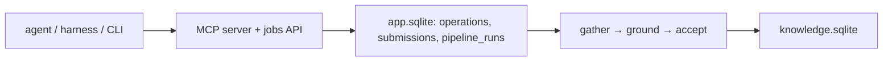

# Agent operations — the words, the caveats, the open questions

2026-09-14 note, **not a design** (unimplemented except where stated).
Premise: *"the data operations by agents are the strong side of the app."*

## 1. Naming: an **operation**

| Operation | What it does | Today |
|---|---|---|
| `research` | Grow one subject's claims | implemented (three planes) |
| `agenda` | Batch of `research`, weakest-first | implemented |
| `author` | Write a whole pack | implemented |
| `recheck` | Cited page still says it? | implemented (`app/factcheck.py`) |
| `adapt` | Author/repair a site adapter | B115, not implemented |

"Operation", not "job": a job is the durable *row*; one operation may be many
jobs or none ("agent" already means three things — `docs/GLOSSARY.md`).

## 2. Where an operation is watched

**The terminal is for you, the app is for the operations.** Your own harness
in Kriko's terminal is a *feature*. Missing: the app showing MCP operations
**as they happen** (arrived/asked/answered/refused+why) — today only
afterwards in `submissions` (**B122**), whatever the door, including you.

## 3. Protocols — the thing with no name yet

Narrow middle between **burning tokens** (re-sent context, big batches) and
**hallucinating from a context pile** (too much at once → composing not
quoting; grounding refuses the batch, tokens still spent). A **protocol** =
how one operation spends one model — a property of *the model*.

Built (B123/B111, 0.8.5): `kriko.research.Spend` + `app/protocols.py` picker
over this install's `bench_runs` (default `STANDARD`; honest iff ≥2 runs and
vs the *same-model default*). Paid plane batches accordingly, quotes checked
vs named URL text (`kriko bench` / `POST /api/bench`, store-derived cases,
throwaway copies). Search choice (Exa done, Tavily not) belongs to the
protocol, not a call site.

## 4. The suspicion worth testing

*"Code agent harnesses do not like to be used as functions."* Built for a
person in a loop; Kriko wants one prompt in, one JSON out. Every harness
defect is that mismatch (swallowed prompts, home-dir servers, envelope drift,
human-only OAuth). Instrument built (B124, 0.8.5), **experiment unrun**:
`bench.verdict()` classes per-plane failures
(`auth`/`start`/`shape`/`timeout`/`limit`/`other`). Spread = unlucky;
concentrated = **mis-used** (harness is a person's door;
unattended belongs to the API plane). Run `kriko bench --cases 5`.

## 5. Known compromises

Documents kept but unsurfaced (`regrounded()` caller-less); 5000-row (not
byte) bound; refusals keep no document; **harness never run end-to-end vs real
`claude`** (hypotheses with instruments); no app screen for bench;
`narrow`/`wide` are one dial — a third row needs a measurement.
