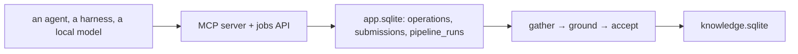

# Agent operations: the words, the caveats, the open questions

A note dated 2026-09-14. It is **not a design**. Premise: *"the data
operations by agents are the strong side of the app."*

## 1. Naming: an **operation**

| Operation | What it does | State |
|---|---|---|
| `research` | Grow one subject's claims | implemented, over four planes |
| `agenda` | A batch of `research`, weakest first | implemented |
| `author` | Write a whole pack | implemented |
| `recheck` | Does the cited page still say it | implemented (`app/factcheck.py`) |
| `adapt` | Author or repair a site adapter | implemented; the Sites screen can also amend a learned adapter |

Say "operation", not "job": a job is the durable *row*, and one operation
may be many jobs or none. "Agent" already means four things
(`docs/GLOSSARY.md`).

## 2. Where you watch an operation

**The terminal is for you; the app is for the operations.** A harness that
runs in Kriko's own terminal is a feature. The app shows operations as they
happen, whatever door they came through, including your own: `GET
/api/operations` and `GET /api/operations/stream`. One row opens before the
work and closes after it, so a call in flight reads `running`, and a hung
one says so.

## 3. Protocols: the thing that had no name yet

A protocol sits in the narrow middle between two failure modes. The first
is **burning tokens**: re-sending context, batching too much. The second is
**hallucination out of a context pile**: too much at once, so the model
writes its own text rather than quote the source. Grounding refuses the
batch, and the tokens are already spent. A **protocol** is how one operation
spends one model, so it is a property of the model, not of the call site.

Built: `kriko.research.Spend` (three numbers, in the engine) and the picker
in `app/protocols.py`, which reads this installation's own `bench_runs`,
because choosing means reading interface state and `kriko/` may not. Two
rules keep the picker honest: nothing is promoted on fewer than two runs,
and the code compares a candidate against the default measured *on the same
model*. Without that rule, one mediocre measurement of one protocol promotes
it. That is how a benchmark comes to recommend the only thing anybody
bothered to run.

## 4. The suspicion worth testing

*"Coding agent harnesses do not like to be used as functions."* They are
built for a person in a loop; Kriko wants one prompt in and one structured
result out. Every harness defect found so far is that same mismatch: a
swallowed prompt, a server that starts in the home directory, an envelope
that drifts, or a sign-in only a person can complete.

The instrument is built (`bench.verdict()`, with one failure class per
plane: `auth`, `start`, `shape`, `timeout`, `limit`, `other`). The
experiment is still unrun. A spread across classes is bad luck; a
concentration in one class is **mis-use**, because a harness is a person's
door, and unattended work belongs to the API plane. Run it with `kriko bench
--cases 5`.

## 5. Known compromises

The app keeps documents but does not show them (`regrounded()` has no
caller yet). The bound on them is 5000 rows, not bytes. A refusal keeps no
document. The harness path has never run end to end against a real installed
CLI, so those parts remain hypotheses with instruments, not results. The
benchmark has no screen of its own outside the Benchmark route. And
`narrow`/`wide` are one dial, where a third row needs a measurement before
anyone offers it.

## 6. The local agent: components, because the model is small *(2026-10-04)*

The reader's words: *"I'd like to enrichen our structure and the add many
components possible to make sure that it works yet being a small model."*
`app/providers/local_agent.py` was one 190-line script doing three steps. It
is now a package, and each component does the legwork a coding agent's own
harness does for it — done *around* the model, not asked *of* it:

| Component | What it does for a small model |
|---|---|
| `plan.propose` | Asks for search queries, and repairs: when a reply is not a JSON array, it quotes the reply back and asks again, bounded, before a plain-query fallback runs the search anyway |
| the reasoning effort | A reasoning model asked for *low* effort treated it as a hint and burned the reply's whole budget on thinking; *none* answered the same task in a fraction of it. Sent on the OpenAI surface, dropped when a server does not know it |
| `search.gather` | One round: search, dedupe, fetch side by side. State (urls read, queries searched) crosses rounds, so round two never pays for round one |
| `plan.refine` | Round two, only when round one found little: queries for what was missed |
| `triage.choose` | Ranks pages lexically and fits them to the model's *own* context (`context_chars`), so a small context is spent on a few good pages, whole. What `sources` keeps is what the model saw |
| the answer's shape repair | A reply with no JSON object in it — the small model's prose answer, real risks and all — is asked for the shape once, against the one fence reader every door reads with. A bare JSON reply never pays for it |
| `verify.check` | The model reads its own answer against the pages it cites. The verdict is kept beside the answer and said in the run's log. Enforcement stays with `quicklook.parse`, which holds the mechanical half |

Every stage is said aloud through `on_action`, which is the job's log and so
the Local LLM screen's own data. A run starts through `POST /api/quick-look`
(backend `local`), you watch it on `GET /api/jobs/{id}`, and the result
carries `verification` beside the risks.
