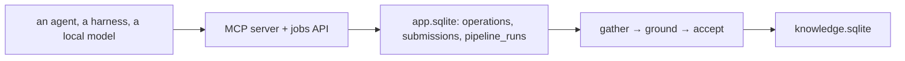

# Agent operations: the words, the caveats, the open questions

A note dated 2026-09-14, **not a design**. Premise: *"the data operations by
agents are the strong side of the app."*

## 1. Naming: an **operation**

| Operation | What it does | State |
|---|---|---|
| `research` | Grow one subject's claims | implemented, over four planes |
| `agenda` | A batch of `research`, weakest first | implemented |
| `author` | Write a whole pack | implemented |
| `recheck` | Does the cited page still say it | implemented (`app/factcheck.py`) |
| `adapt` | Author or repair a site adapter | implemented; a learned adapter can also be amended from the Sites screen |

"Operation", not "job": a job is the durable *row*, and one operation may be
many jobs or none. "Agent" already means four things
(`docs/GLOSSARY.md`).

## 2. Where an operation is watched

**The terminal is for you; the app is for the operations.** A harness running
in Kriko's own terminal is a feature. The app shows operations as they happen,
whatever the door they came through, including your own: `GET /api/operations`
and `GET /api/operations/stream`, one row opened before the work and closed
after it, so a call in flight reads `running` and a hung one says so.

## 3. Protocols, the thing that had no name yet

The narrow middle between **burning tokens** (re-sending context, batching too
much) and **hallucinating out of a context pile** (too much at once, so the
model composes instead of quoting: grounding refuses the batch and the tokens
are already spent). A **protocol** is how one operation spends one model, so it
is a property of the model rather than of a call site.

Built: `kriko.research.Spend` (three numbers, in the engine) and the picker in
`app/protocols.py`, which reads this installation's own `bench_runs` because
choosing means reading interface state and `kriko/` may not. Two rules keep the
picker honest: nothing is promoted on fewer than two runs, and a candidate is
compared against the default measured *on the same model*. Without that, one
mediocre measurement of one protocol promotes it, which is how a benchmark
comes to recommend the only thing anybody bothered to run.

## 4. The suspicion worth testing

*"Coding agent harnesses do not like to be used as functions."* They are built
for a person in a loop; Kriko wants one prompt in and one structured result
out. Every harness defect found so far is that same mismatch: a swallowed
prompt, a server that starts in the home directory, an envelope that drifts, or
a sign-in only a person can complete.

The instrument is built (`bench.verdict()`, with one failure class per plane:
`auth`, `start`, `shape`, `timeout`, `limit`, `other`). The experiment is still
unrun. A spread across classes is bad luck; a concentration in one class is
**mis-use**, because a harness is a person's door and unattended work belongs
to the API plane. Run it with `kriko bench --cases 5`.

## 5. Known compromises

Documents are kept but not surfaced (`regrounded()` has no caller yet); the
bound on them is 5000 rows rather than bytes; a refusal keeps no document; the
harness path has never been run end to end against a real installed CLI, so
those remain hypotheses with instruments rather than results; the benchmark has
no screen of its own outside the Benchmark route; and `narrow`/`wide` are one
dial, where a third row needs a measurement before it is offered.
