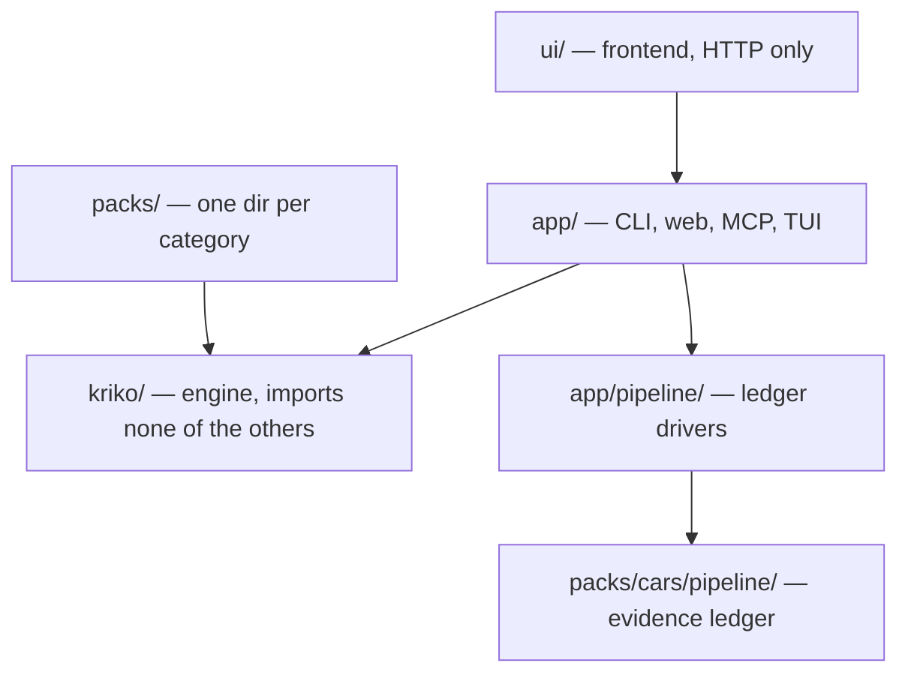

# Architecture — a reading map

Kriko is a local-first knowledge engine for manufactured products: it answers "what is known to go wrong with *this specific one*" from installed packs (`cars` is pack #1). One invariant explains the layout: **`kriko/` knows no category** — no `make`, no `engine_code`, no `fuel`. Adding a category is a data change (`packs/<name>/`), not an engine change. Enforced by `src/kriko/tests/test_core_is_domain_free.py`, which walks `kriko/`'s AST.

## The fan

Dependencies point down and in, never up or sideways (if this drifts from `CLAUDE.md`'s layering principle, `CLAUDE.md` wins):

## Package → what it owns → read this first

| Package | Owns | File to read first |
|---|---|---|
| `ui/` | Svelte source; `npm --prefix ui run build` writes `src/app/web/static/` | `ui/src/lib/shell/nav.ts` (route table for rail + router) |
| `src/app/` | Interfaces: CLI, FastAPI dashboard, MCP server, operator TUI | `src/app/cli.py` |
| `src/app/pipeline/` | Pipeline drivers orchestrating the ledger and cars pipeline | `src/app/pipeline/ledger_run.py` |
| `src/kriko/` | Engine: pack store, generic lookup/ranking, gates, research interface | `src/kriko/store/packstore.py` |
| `packs/` | One dir per category — data, vocabulary, trust tiers, builder | `packs/drill/README.md` (smallest complete example) |
| `packs/cars/pipeline/` | Evidence ledger + grounded extraction for the cars pack | `packs/cars/pipeline/ledger/acquire.py` |
| `extension/` | Scrapes listings; background worker calls the web API, renders risk cards | `extension/content.js` |

### `ui/` — the frontend

Svelte 5 + Vite, built into `src/app/web/static/`. Hash-routed shell over the route table in `lib/shell/nav.ts`. `styles/` holds the only colour file (`tokens.css`); `lib/` the typed API client plus pure derivation (`report.ts`, `verdict.ts`, `compare.ts`, `health.ts`, `fields.ts`); `routes/` one component per destination. Only the report surface is editorial (68ch, print sheet).

## Chasing X? read these

**Listing → risk cards:** `extension/content.js:423-428` (scrape, message background) → `extension/background.js:266-268` (`requestAnalysis()`, `POST /api/analyze`) → `src/app/web/routers/analyze.py:88` (scrape → `Query` via `kriko.adapters.adapt()`, then `kriko.lookup.lookup()`) → `src/kriko/adapters.py` (label/parse rules) → `src/kriko/lookup/__init__.py:97`.

**Why a claim did/didn't show:** `src/kriko/lookup/rank.py:137` (`relevance()`) and `:162` (`explain()`); `src/kriko/lookup/conditions.py:103` (`evaluate()`); `src/kriko/gates.py:91` (`structural_reasons()`) and `:137` (`is_specific()`); `lookup/tree.py` (support read, no score). Ranked-low → `tree.py`, then `src/app/web/routers/health.py`.

**What a pack contains:** `docs/PACK_CONTRACT.md`; `packs/drill/`; `src/kriko/pack/manifest.py:37` (`load()`).

**Build + install:** `src/kriko/pack/build.py:481` (`build()`, `_emit_*` stages); `src/kriko/store/packstore.py:176` (`install()`) and `:377` (`activate()`); `packs/cars/build.py:863` (cars' own build — a parallel "migration, not the general pack builder" for legacy YAML shapes).

**Evidence:** `packs/cars/pipeline/ledger/acquire.py` (fetch); `packs/cars/pipeline/ledger/ingest.py` (~40-line adapter over `src/kriko/ledger/db.py`); `src/kriko/ledger/extraction.py` + `chunking.py` (shared grounded-extraction machinery); `src/app/pipeline/ledger_run.py` (`acquire`, `remediate`, `all`, `extract`, `report`).

**Refusals:** `src/app/mcp_server.py:262` (`submit_findings()` — grounds every quote first); `src/kriko/gates.py` (`gate_reason()`, `structural_reasons()`); `packs/cars/vocabulary/gates.yaml` (cars' own routine/generic vocabulary).

## Entry points

| Command | What it does |
|---|---|
| `kriko` (`python -m app.cli`) | CLI — pack install/build/list, lookup queries |
| `kriko tui` / `kriko-sidecar --tui` | Operator console — planes, agenda, jobs, shell (see `docs/INTERNALS.md`) |
| `python -m app.mcp_server` | MCP server for research agents |
| `python -m app.pipeline.ledger_run` | Ledger pipeline: acquire, extract, cluster, verdict, remediate, report |
| `python -m app.pipeline.panel` | Ledger review/inspection panel |
| `python -m app.pipeline.process` | End-to-end onboarding driver for one part/model |
| `python -m app.web` | FastAPI dashboard (`http://127.0.0.1:8787`) |
| `python -m packs.cars.build` | Builds the cars pack (also `app.cli build packs/cars`) |
| `python -m packs.cars.coverage` | Cars pack coverage report |
| `packs/cars/pipeline/catalog/{discover,doctor,write_variants,repair_missing_stub_scaffold}.py` | Catalog discovery, health, variant/stub generation |
| `packs/cars/pipeline/fitment/validate_fitment.py`, `packs/cars/pipeline/parts/validate_part_yaml.py` | Validate fitment/part YAML |
| `packs/cars/pipeline/ledger/{eval_verdict,parity}.py`, `packs/cars/pipeline/sources/curated.py`, `packs/cars/pipeline/scaffold.py`, `packs/cars/pipeline/agent/render.py` | One-off ledger/scaffold/render tools (`--help`) |

## How to run things

- Repo venv, not bare `python`: `.venv/bin/python`.
- Full suite, no args: `.venv/bin/python -m pytest` (`pytest.ini` pins `testpaths`; see `CONTRIBUTING.md`).
- Cars pack: `python -m app.cli build packs/cars`, then `python -m app.cli packs` (full walkthrough: `docs/USAGE.md`).
