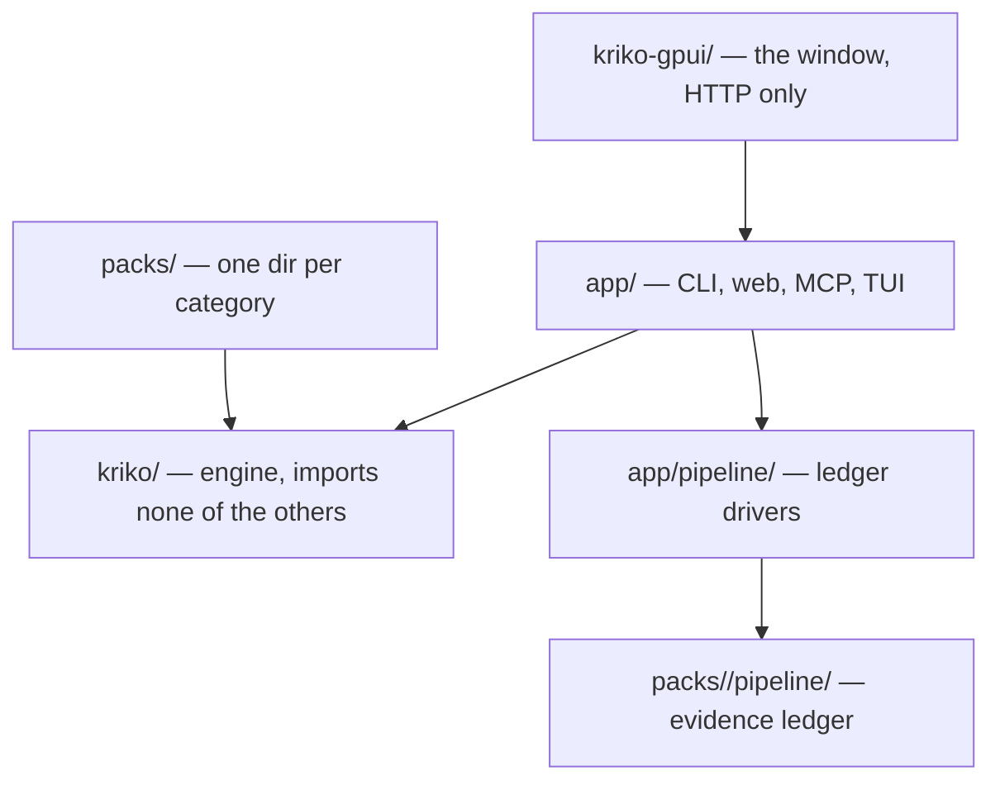

# Architecture, a reading map

Kriko is a local-first knowledge engine for manufactured products: it answers
*what is known to go wrong with this specific one* from installed catalogs. One
invariant explains the layout: **`kriko/` knows no category.** A new category
is a data change (a directory under `packs/`), never an engine change. The
invariant is not a convention, it is a test:
`src/kriko/tests/test_core_is_domain_free.py` walks `kriko/`'s AST and fails
on category-shaped vocabulary.

Line numbers below are a starting point, not a contract. They were true on
2026-10-01 and a file that has moved since is found by the symbol name beside
the number.

## The fan

Dependencies point down and in, never up or sideways. Where this and the
layering principle in `CLAUDE.md` disagree, `CLAUDE.md` wins.

## What each package owns, and where to start reading it

| Package | Owns | Read first |
|---|---|---|
| `kriko-gpui/` | The window: GPUI screens over the engine's HTTP API | `kriko-gpui/src/app.rs` |
| `src/app/` | Interfaces: CLI, FastAPI dashboard, MCP server, operator TUI | `src/app/cli.py` |
| `src/app/pipeline/` | Drivers that orchestrate a category's ledger and remediate its gaps | `src/app/pipeline/ledger_run.py` |
| `src/kriko/` | Engine: pack store, generic lookup and ranking, gates, research interface | `src/kriko/store/packstore.py` |
| `packs/` | One directory per category: data, vocabulary, trust tiers, builder | `packs/drill/README.md`, the smallest complete example |
| `packs/<name>/pipeline/` | Evidence ledger and grounded extraction for one category | that pack's `pipeline/ledger/acquire.py` |
| `extension/` | Reads a listing page; a background worker calls the web API and renders the risk cards | `extension/content.js` |

### `kriko-gpui/`, the window

Rust and GPUI. `app.rs` holds the tabs and their state, `screens/` one module
per tab, `theme.rs` the palette and `engine.rs` the engine's lifetime. See
`kriko-gpui/README.md`.

## Chasing a question? read these

**A listing becomes a card.** `extension/content.js` scrapes and messages the
background worker, which `POST`s to `/api/analyze`
(`src/app/web/routers/analyze.py`). That turns the scrape into a `Query`
through `kriko.adapters.adapt()`, resolves subjects in
`src/kriko/lookup/match.py`, and reads ranked claims from
`src/kriko/lookup/__init__.py`.

**Why a claim did or did not show.** `src/kriko/lookup/rank.py`
(`relevance()`, `explain()`), `src/kriko/lookup/conditions.py` (`evaluate()`),
`src/kriko/gates.py` (`structural_reasons()`, `is_specific()`), and
`lookup/tree.py` for the support read, which carries no score. A claim ranked
low goes to `tree.py`, then to `src/app/web/routers/health.py`.

**What a catalog contains.** `docs/PACK_CONTRACT.md`, then `packs/drill/`,
then `src/kriko/pack/manifest.py` (`load()`).

**Build and install.** `src/kriko/pack/build.py` (`build()` and its `_emit_*`
stages) turns a directory into a `.kpack`; `src/kriko/store/packstore.py`
(`install()`, `activate()`) puts it in the store. A pack with its own legacy
data shapes may carry a parallel builder, which is a migration rather than the
general path.

**Evidence.** A category's `pipeline/ledger/acquire.py` fetches, and
`ingest.py` is a thin adapter over the engine's `src/kriko/ledger/db.py`.
`extraction.py` and `chunking.py` hold the shared grounded-extraction
machinery, and `src/app/pipeline/ledger_run.py` drives the stages.

**Refusals.** `src/app/mcp_server.py` (`submit_findings()`, which grounds
every quote first), `src/kriko/gates.py` (`gate_reason()`,
`structural_reasons()`), and the pack's own routine vocabulary, which is data
rather than Python.

## Entry points

| Command | What it does |
|---|---|
| `kriko` (`python -m app.cli`) | CLI: catalog install, build, list, lookup |
| `kriko tui` / `kriko-sidecar --tui` | Operator console (see `docs/INTERNALS.md`) |
| `python -m app.mcp_server` | MCP server, for an agent that does its own reading |
| `python -m app.pipeline.ledger_run` | Ledger stages: acquire, extract, cluster, verdict, remediate, report |
| `python -m app.pipeline.panel` | Ledger review and inspection panel |
| `python -m app.pipeline.process` | End-to-end onboarding driver for one product |
| `python -m app.web` | FastAPI dashboard on `http://127.0.0.1:8787` |
| `python -m packs.<name>.build` | Builds one catalog (also `kriko build packs/<name>`) |
| `python -m packs.<name>.coverage` | That catalog's coverage report |
| `packs/<name>/pipeline/catalog/*.py` | Catalog discovery, health, variant and stub generation |
| `packs/<name>/pipeline/fitment/`, `parts/` | Validate a pack's own fitment and part data |
| `packs/<name>/pipeline/ledger/{eval_verdict,parity}.py`, `sources/curated.py`, `scaffold.py`, `agent/render.py` | One-off ledger, scaffold and render tools; each has `--help` |

## How to run things

- Repo venv, not bare `python`: `.venv/bin/python` on POSIX,
  `.venv\Scripts\python.exe` on Windows.
- Full suite, no arguments: `python -m pytest` (`pytest.ini` pins
  `testpaths`; see `CONTRIBUTING.md`).
- A catalog: `kriko build packs/<name>`, then `kriko packs`. The full
  walkthrough is `docs/USAGE.md`.
