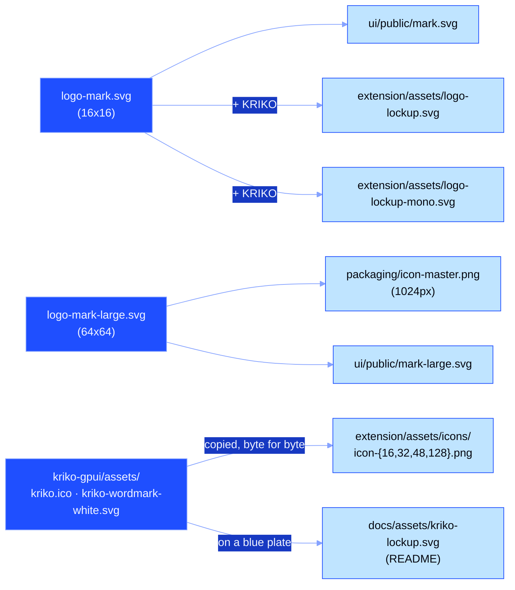

# Use the mark

Everything shown (toolbar tile, taskbar icon, favicon, rail) is generated.
Change a source, re-render, commit the output:

```bash
python packaging/render_icon.py
python packaging/render_lockup.py
```

**Three sources.** The desktop app's identity in `kriko-gpui/assets/` (the
white K on the blue tile) is what a reader sees first: the taskbar, the
installer, the toolbar and this repository's README. The two grid marks still
feed the dashboard. Everything else is output:



> **Tests fail and you did not touch the mark?** Somebody edited an output.
> Run both scripts again and commit. If a test still fails, somebody edited a
> source without re-rendering.

## Which file to use

| You want | Use | Source? |
|---|---|---|
| Toolbar icon | `extension/assets/icons/icon-*.png` (the ICO's own images) | rendered |
| README header | `docs/assets/kriko-lockup.svg` | drawn from the app's wordmark |
| Change the app's icon or wordmark | `kriko-gpui/assets/kriko.ico`, `kriko-wordmark-white.svg` | **source** |
| Favicon | `ui/public/mark.svg` | rendered |
| Rail (32px, smooth) | `ui/public/mark-large.svg` | rendered |
| App icon master | `packaging/icon-master.png` | rendered |
| Logo with name | `extension/assets/logo-lockup.svg` | rendered |
| Logo on a background of unknown colour | `extension/assets/logo-lockup-mono.svg` (`currentColor`, no background) | rendered |
| Change mark ≤48px | `extension/assets/logo-mark.svg` | **source** |
| Change mark ≥128px | `extension/assets/logo-mark-large.svg` | **source** |

## The three colours

`ui/src/styles/themes/panel.css` owns them, and the mark borrows them, so it
never sits on the rail as a foreign object. A test asserts that the mark's hex
values and the theme tokens agree.

The desktop app's own palette lives in `kriko-gpui/src/theme.rs`. Diagrams in
these documents use it; see [how the docs are written](STYLE.md).

| Role | Token | Value |
|---|---|---|
| Ground | `--n-2` | `#15171C` |
| Letter | `--n-9` | `#E7E9ED` |
| Rising arm | `--accent` | `#E8C04B` |

## Two marks, one design

Integer scaling is the only method that keeps pixel art intact. So the
16×16 grid became eight hard blocks at 1024px ("pixelated and very ugly",
correctly). The mark is therefore drawn twice: same letter, same colours,
same slab-stem-with-rising-arm idea. The two versions differ only in what
each size can show. A true diagonal is blur below 48px; a stepped diagonal
is a mistake above 128px.

| Size | Source | Rasterisation |
|---|---|---|
| 16–128px: toolbar, favicon | `logo-mark.svg` | integer nearest-neighbour, exactly three colours |
| 1024px master: installer, taskbar, rail | `logo-mark-large.svg` | scanline fill, 4× supersampled, real diagonals |

The large mark uses only `rect` and `polygon` vocabulary. `render_icon.py`
ships its own rasteriser, and a `path` would need a bezier flattener in a
build script. The mark is tested, not trusted: the colour test fails when
somebody moves a hex value in one mark only; `test_the_app_icon_is_actually_antialiased`
counts the master's colours (three colours means somebody pointed it at the
grid).

## The grid

Small mark: a 16×16 grid of rects, cap height 14 cells, 3-cell stroke. The
wordmark is drawn on the same grid: no font file, no network, no drift with
the display face. Clear space is one stroke (3 cells) on all sides, with 10
cells between mark and word. At a normal gap the word "KRIKO" reads as
"KKRIKO".

## Why it looks like this

A slab K, with the upper arm in the accent colour. Solid forms survive 16px,
where thin lines blur. The whole arm rises like a step chart, not one
detached terminal block, because a detached block reads as a loose square
below 48px. The rising arm uses the panel's existing warning colour.

## Next

- [How the docs are written](STYLE.md) · [How it works](HOW_IT_WORKS.md)
