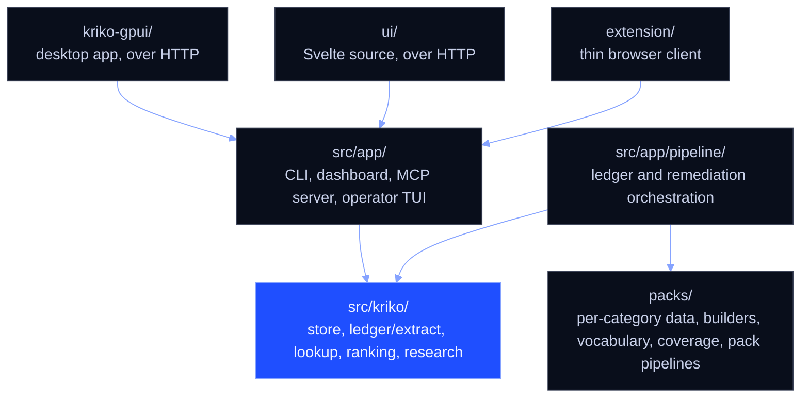

# From request to done

How work gets from "the reader asked for it" to "the reader has it", every
session, human or agent. Until 2026-09-24 the norm was tests-green yet
ask-missed. Cause: no fixed **what was asked, what counts as done, who
checks.** Short rules; each enforceable one has a test. The mechanics (setup,
the gate, branches, commits) follow the rules, from
[the working tree](#set-up-the-working-tree) on.

```mermaid
%%{init: {"theme":"base","themeVariables":{"fontFamily":"ui-monospace, SFMono-Regular, Consolas, monospace","primaryColor":"#090E1B","primaryTextColor":"#F2F5FF","primaryBorderColor":"#1F4FFF","lineColor":"#86A3FF","secondaryColor":"#1739C2","tertiaryColor":"#080B16","noteBkgColor":"#BFE4FF","noteTextColor":"#05070F","actorBkg":"#090E1B","actorTextColor":"#F2F5FF","actorBorder":"#1F4FFF","signalColor":"#86A3FF","signalTextColor":"#86A3FF"}}}%%
flowchart LR
    A["1. Open an issue<br/>Asked, Where, Done when"]:::brand --> B{"Done when<br/>written?"}
    B -->|no| Q["Ask. Never guess."]:::danger
    Q --> A
    B -->|yes| C["3. Reproduce<br/>a check that fails first"]:::plain
    C --> D["Fix"]:::plain
    D --> E["tools/gate.sh<br/>+ tools/walk.sh"]:::plain
    E --> F["5. PR with proof<br/>quote, observation, screenshot"]:::ice
    F --> G["Second agent reviews<br/>does it do what was asked,<br/>where it was asked?"]:::plain
    G --> H["Reader merges to main"]:::plain
    H --> I["2. Observed on the Where screen,<br/>on Windows where it differs"]:::ice
    I --> J["Shipped: a double-clicked installer"]:::mark

    classDef brand  fill:#1F4FFF,stroke:#86A3FF,color:#F2F5FF
    classDef plain  fill:#090E1B,stroke:#3A4156,color:#C9D1EA
    classDef ice    fill:#BFE4FF,stroke:#1F4FFF,color:#05070F
    classDef danger fill:#FF6B5E,stroke:#05070F,color:#05070F
    classDef mark   fill:#E8C04B,stroke:#05070F,color:#05070F
```



| # | Rule | One line |
|---|---|---|
| 1 | Request first | An issue (GitHub, mirrored to Linear) before any code |
| 2 | Done is observed | On the **Where** screen, on `main`, on Windows where it differs |
| 3 | Reproduce first | A bug fails on purpose before it is fixed |
| 4 | Know what a test proves | Green is necessary, not sufficient |
| 5 | Proof in the PR | Quote, observation, screenshot, second reviewer |
| 6 | One area per agent | Claimed, merged the same day |
| 7 | Say when it fails | Partial is partial |

## 1. A request is written down before any code

First act: an issue on GitHub, from the **Request** template
(`.github/ISSUE_TEMPLATE/request.md`), mirrored to the Linear team with a link
each way. Open work lives there and nowhere in the repo.

```
Title:      <a short title, ideally the reader's own phrase>
Asked:      "<the reader's words, verbatim, never a paraphrase>" (date)
Where:      <exact screen(s), e.g. "every research button: Browse, subject, Research">
Done when:  <a reader-visible outcome, check-decidable>
Not this:   <the likeliest misreading>
```

Quote, don't paraphrase ("Sliders" becomes "chips"). Read it back before
starting. No "Done when" means not understood: ask, never guess. The template
asks for every field, enforced by
`test_the_request_template_asks_where_and_done_when`.

## 2. "Done" is observable, and it is observed where the reader is

All four required.

| # | Done means | Example |
|---|---|---|
| 1 | **The end result happened** | the extension checks in; the claims are in the pack |
| 2 | **It is seen, as is, on the "Where" screen** | not on a neighbouring screen |
| 3 | **It is on `main`** | branch work does not exist for the reader or the next session, which is why an item written on a branch is still open |
| 4 | **It was checked in the reader's environment** | Windows, their browser, their own CLIs, wherever that can differ |

A stub is a rehearsal and a cloud session cannot do (4). Until a Windows
runner exists, the reader or a hand build does, and the PR says plainly
"not yet checked on Windows". "Shipped" is fifth: a double-clicked installer.

## 3. Reproduce first, then fix

A bug fails on purpose first (a test, `tools/walk.sh`, a symptom script). No
prior failure is a guess. Three failed fixes in one place means the model of
the problem is wrong. A fact about an outside tool is read from that tool, with
a test that fails when the tool drifts.

## 4. Tests: which kind proves what

| Kind | Proves | Does **not** prove |
|---|---|---|
| Unit / component (pytest, vitest) | logic, world stubbed | world matches stub |
| Source-reading guard (`test_repo_invariants.py` et al.) | code rule holds | anything *works* |
| `tools/walk.sh` | screens load, buttons respond, no errors/hangs | the button's purpose |
| **Journey check** (below) | reader's end result happened | (the one that counts) |
| Reader's Windows install | works where used | |

Green suite is necessary, not sufficient. A never-failed test tests nothing:
break the code once per guard (#48). Stub the edge (network, CLI), not the
middle (collaborators).

### Journey checks

One reader task start to finish in `tools/journeys/`, run by `tools/walk.sh`,
stated the way a "Done when" is:

- load the extension and check in;
- check a listing and read the risks;
- research one subject and see the catalog gain claims;
- change a model or an effort and read the next command line;
- install, disable and update a catalog and see checks follow;
- register a site and see the extension read it.

No journey pass, checked on Windows as in §2, means not done. Until those
scripts exist, the PR hand-walks the journey and shows the steps, the
observed result and a screenshot.

## 5. Every PR carries its own proof

Merge requires:

- the quoted request and its id;
- the "Done when" and what was observed;
- a screenshot of the "Where" screen (`.walk/`) or the journey's output;
- where it was checked;
- what it still does not do, stated rather than left for the reader to find.

Then **an uninvolved second agent reviews** the entry, the proof and the diff,
and answers one question: *does this do what was asked, where it was asked?*

## 6. Several agents at once, without colliding

One area, one agent: the Agents screen, the research harness, the extension,
knowledge and catalogs, packaging and the shell. Claim it (assign
the issue to yourself) first. Mergeable within a day, one request per PR. The PR goes to `main` the
same day and is merged daily; the reader merges. A day-old branch merges,
rebases, or closes, and nobody builds on unmerged work. LF endings
(`.gitattributes`).

## 7. When it does not work, say so

Partial is partial: what is missing and why. "It should work" is not a status.
A button that cannot work on this reader's machine says so on screen, with the
alternative next to it.

## Checklist, before saying "done"

- [ ] The entry quotes the reader, has a **Done when**, and was read first; a
  failing check pre-existed (for a bug); the "Done when" is seen on the
  **Where** screen; it is checked on Windows or the PR says it is not; the
  journey passes, or is hand-walked until the journey scripts exist.
- [ ] `tools/gate.sh` is green and `tools/walk.sh` is clean on the screens this
  touches; the PR carries the quote, the observation and the screenshot; a
  second agent has reviewed it; it is on `main`; the PR closes the issue (`Closes #n`) and its Linear twin
  is done; and the commit says what was observed.

## Set up the working tree

Three commands cover a working tree:

```bash
tools/setup.sh                 # working tree (idempotent: run whenever something feels wrong)
tools/gate.sh                  # everything the branch used to be checked for
python tools/bump.py X.Y.Z     # version, in all four places it lives
```

`setup.sh` pins what six failed discoveries taught: the interpreter floor from `pyproject.toml`, `requirements.lock` as the frozen closure, `-e .` so `app.version` reports the tree, the `pipeline` extra required for the *suite* (six modules will not import without it), separate `node_modules` for `ui/` and the root, and wiping stale `src/*.egg-info`. It never touches `~/.kriko`: the store, history and keys are not a dev environment.

`python tools/bump.py --show` checks three committed files (`pyproject.toml` and the app's `Cargo.toml` and `Cargo.lock`) plus installed-distribution metadata (what `/api/health` reports; a tree at 0.8.1 with a 0.8.0 editable install serves 0.8.0). It never commits or tags.

The MCP server (`.mcp.json`) runs `.venv/bin/python -m app.sidecar --mcp` relative to the repo root, so it works in any checkout `setup.sh` touched.

## Branches and commits

Branch off `main`. Nothing reaches `main` without the author asking.

Conventional commits with scope, as history uses:

| Prefix | For |
|---|---|
| `feat(hub):` | a new behaviour |
| `fix(hub):` | a bug; name the cause |
| `refactor(ops):` | structure, same behaviour |
| `docs:` | documents only |
| `chore(git):` | housekeeping |
| `perf(hub):` | measured, with numbers |

The body is for `git log` in six months: the cause, not the symptom (*"the picker armed an unsucceedable onboarding run"* over *"fix picker bug"*), and what you chose not to do when the choice is not obvious.

## Tests

```bash
python -m pytest        # all tests, no arguments
npm test                # extension scraper + panel
npm --prefix ui test    # dashboard Svelte components
```

Run `pytest` bare: `pytest.ini` pins `testpaths`, and naming directories skips `app/pipeline/tests` silently (576 of 761 tests once). The suite must pass with **no API keys and no `.env`**; a keyed test reaches the network and belongs behind a marker.

After moving a serving-path module, also run:

```bash
python -c "import app.web.app, kriko.lookup, kriko.store"
python -m pytest src/app/pipeline/tests/test_repo_invariants.py
```

Serving is the local FastAPI app on the SQLite pack store; the pipeline stays separate, so importing `app.web.app` must not load `app.pipeline` or the LLM stack.

## The frontend

`ui/` is Svelte + Vite source; `src/app/web/static/` is committed build output (the wheel serves the UI with no Node toolchain, which is only true while the output matches the source). After touching `ui/src/`:

```bash
npm --prefix ui test
npm --prefix ui run build      # rewrites src/app/web/static/
git add ui src/app/web/static
```

`tools/gate.sh ui` rebuilds and fails on a dirty diff. `ui/package-lock.json` is committed (overriding the repo ignore) for reproducible asset hashes. `ui/src/` holds **no vocabulary from any catalog**: forms come from `/api/identity-keys/{pack_id}` and `/api/packs/{pack_id}/vocabulary` at runtime, checked by `test_ui_contains_no_pack_vocabulary` in `test_repo_invariants.py`.

### Pressing every button: `tools/walk.sh`

Component tests stub fetch, so they miss slow screens and dead buttons. `walk.sh` starts the app on a throwaway home (never `~/.kriko`) with the first-party catalogs freshly installed, opens every rail screen in headless Chromium, presses every button from a fresh load, and writes `.walk/walk.md`. The report lists load time, console errors and requests over 400; per button: errored, never settled, slow, or changed nothing.

```bash
tools/walk.sh             # all screens, ~15 min
tools/walk.sh agents      # addresses containing "agents"
KRIKO_WALK_REAL_CLIS=1 tools/walk.sh agents   # the real agent CLIs on this machine
```

The default run puts instant stand-in CLIs on `PATH`. Buttons named quit, uninstall, delete, remove, forget, reset, revoke or undo are listed, never pressed. It needs Playwright (`npm i -g playwright && npx playwright install chromium`), which is not a repo dependency and not in the gate.

## Dead code

`grep` for a dotted path misses `from x import y` and falsely reports live modules as dead. Before deleting on "nothing imports this", check all import styles, entry points and doc mentions; the record of past findings is in `git log`.

## Architecture

Dependencies flow one way; import down, never up.



Needing something from above means **the module is in the wrong layer, so move it.** An upward deferred import (a function-body import hiding `partially initialized module`) is the smell; a downward one is just startup cost. `test_repo_invariants.py` enforces this. `CLAUDE.md` has the exact `grep` checks and the packs-through-the-store rule.

## The gate

```bash
tools/gate.sh            # everything
tools/gate.sh py         # version strings, ruff, mypy, pytest
tools/gate.sh node       # scraper and extension panel
tools/gate.sh ui         # vitest + types + palette + stale-bundle check
tools/gate.sh wheel      # the shipped wheel imports and runs
tools/gate.sh gpui       # cargo check and cargo test, offline
```

| Gate | Catches |
|---|---|
| `tools/bump.py --show --strict` | version strings that disagree |
| `ruff`, `mypy` | lint, and types in `src/kriko`, `src/app` and `packs` (three runs) |
| `pytest` | full suite + the layering and testpaths invariants |
| `tools/smoke_wheel.sh` | a wheel that no longer imports what the checkout does |
| `npm test` | scraper and extension-panel tests (jsdom); a run of zero tests fails |
| `npm --prefix ui test` | Svelte component tests |
| `svelte-check` | type errors at `--threshold error` |
| `python tools/tokens.py --check` | the extension's palette stale against the app's theme |
| rebuild + `git diff` | a committed bundle that no longer matches `ui/src/` |
| `cargo check`, `cargo test` | the desktop app; skipped, with the remedy, when there is no `cargo` or the registry cache is cold |

**It runs on your machine, as a deliberate retreat.** These were `ci.yml`'s
three jobs, moved verbatim into `tools/gate.sh` on 2026-09-13 when the
account's Actions minutes ran out: every run failed in under 15 seconds with
no logs, which is red ticks on untested commits, and a signal that is always
red teaches ignoring red. The obligation moved with them, so run it before you
push. Restoring the workflow is `git revert` then the billing change, in that
order. Do not block on CI: push, tag, keep working.

No docker-build job, ever: Kriko is a standalone app, not a deployment
(`test_the_app_stays_standalone` fails on a Dockerfile, compose files, a
`deploy/` directory or a Postgres driver).

The `desktop` workflow is untrimmed but **hand-run only** (`workflow_dispatch`;
the tag and pull-request triggers were removed 2026-09-13 for the same minutes
reason). It runs the same recipe as `kriko-gpui/package.ps1`, step for step:

| Job | Does |
|---|---|
| `bundle` | Windows: freezes the sidecar, builds the app and the installer, runs both smoke checks (`packaging/smoke_sidecar.py`, `packaging/smoke_app.py`) |
| `packs` | builds every catalog and writes the index |
| `release` | tags only: collects the installers into a release |

Run it from the Actions tab, or build on a Windows host per
[`kriko-gpui/README.md`](../kriko-gpui/README.md), which is how every installer so
far was made.

The gate runs with no secrets. Root `npm test` uses `npm install` (its lockfile
is gitignored); the `ui` gate uses `npm ci` (lockfile committed), because
floating dependencies would change asset hashes and fail the bundle check
spuriously.
