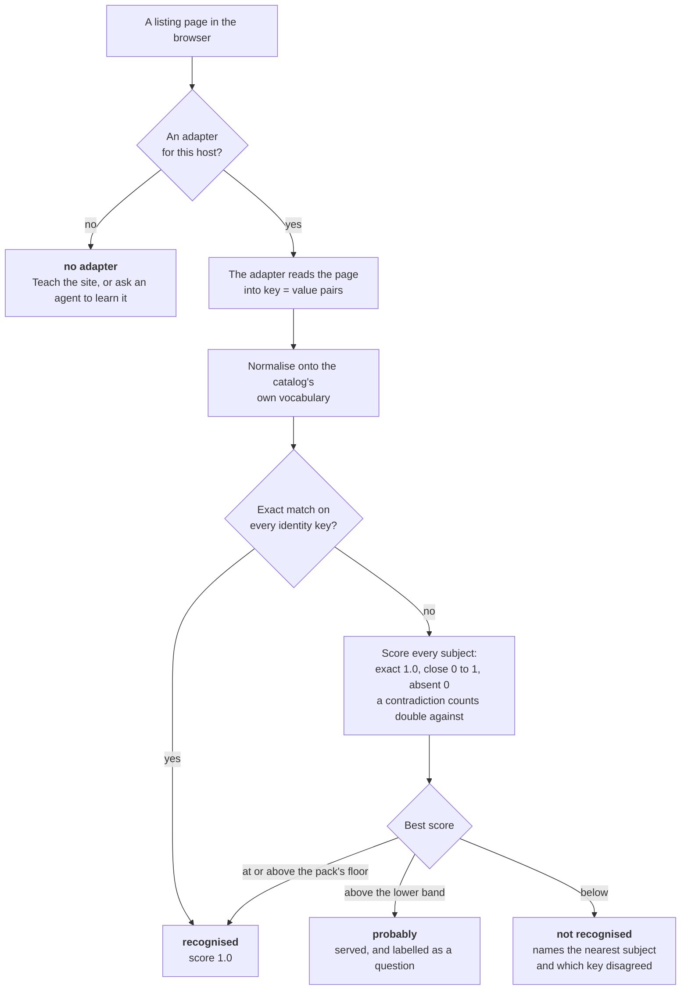
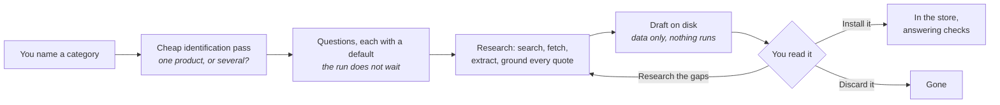
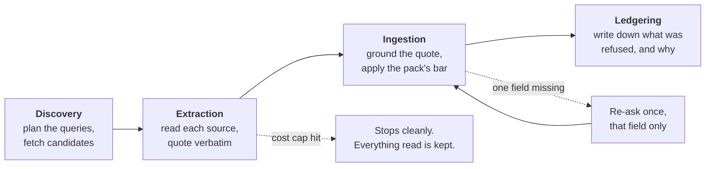
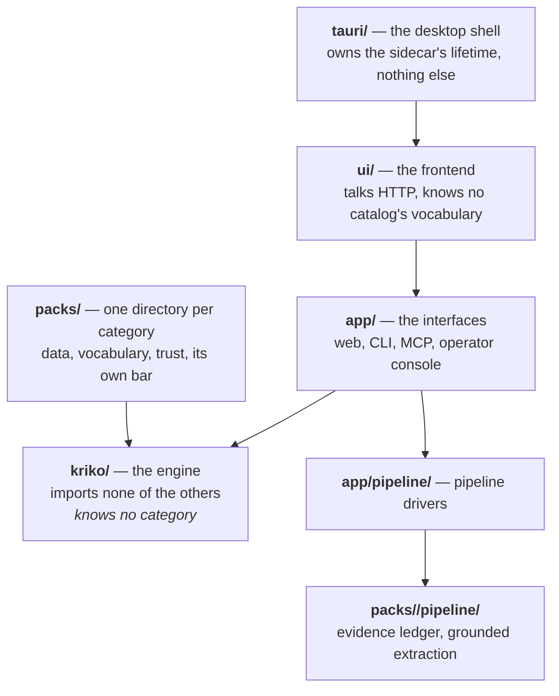

# How Kriko works

Four pictures, one per question people actually ask.

## How does a page find its catalog?

The floors (`match_floor`, `match_probable` in the pack's `gates.yaml`) belong
to the pack. There is no silent no: `POST /api/diagnose/identity` returns the
whole weighing, and the panel shows a short form of it.

## Where does a catalog come from?

The agent proposes and Kriko writes: a confined directory, fixed file names,
nothing executable. The identification pass states the scope it assumed on the
pack itself rather than stopping to ask, so an assumption is visible instead of
invisible.

## What happens during a run?

The refusals are the point: without them, keeping nothing looks like keeping
everything. An ungrounded quote is refused, always. An early stop is the cost
cap, and the work already done stays as a partial rather than dying with the
request.

## What is each part of the code?

The engine importing anything above it is the unforgivable violation: the greps
are in `CLAUDE.md` and an AST test holds them. A pack is consumed through the
store, never imported.

## Where things live on disk

| Path | What it is | Survives uninstalling a pack |
|---|---|---|
| `~/.kriko/knowledge.sqlite` | The store: packs, subjects, claims | the pack's rows do not |
| `~/.kriko/app.sqlite` | History, settings, saved comparisons | yes |
| `~/.kriko/models.toml` | What each model costs. Yours to edit, copied once and never rewritten | yes |
| `~/.kriko/drafts/` | Agent proposals, before install | yes |
| `~/.kriko/env` | Research keys, written by the app's Settings screen | yes |

Two databases, on purpose: uninstalling a pack cannot drop history, and history
cannot change a pack's `content_digest`.

## Next

- [Install it on Windows](INSTALL_WINDOWS.md)
- [Operate it](USAGE.md), including growing the knowledge base
- [What a pack must contain](PACK_CONTRACT.md)
- [Mechanism-level reference](INTERNALS.md), every endpoint and every table
