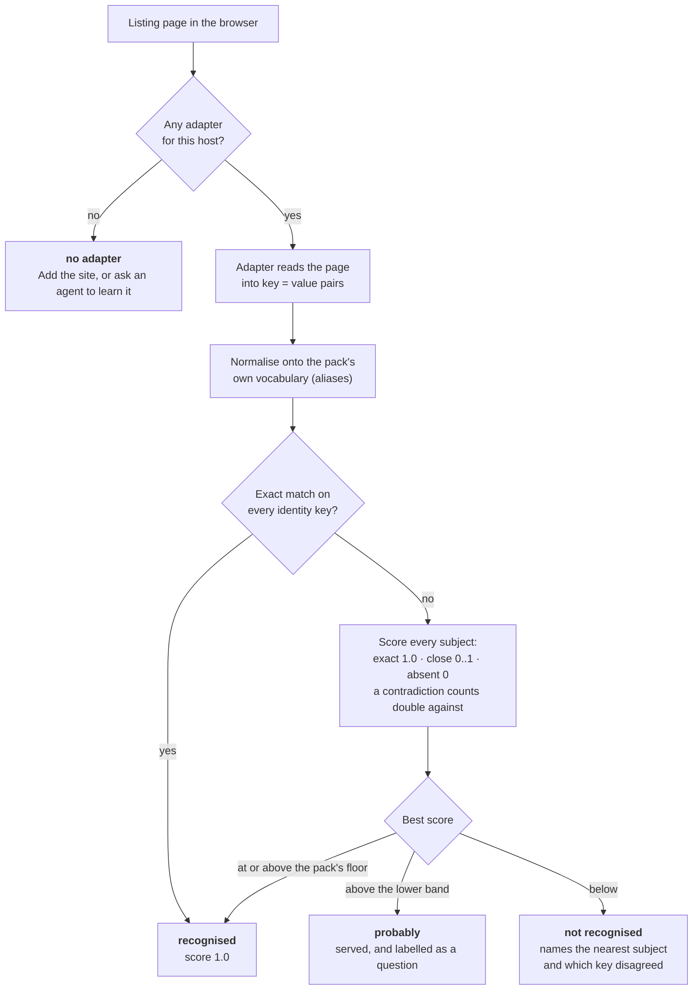
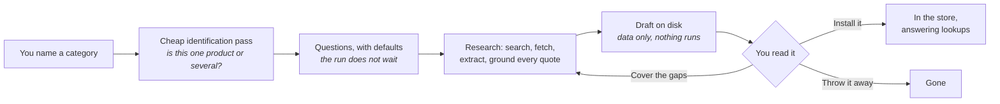
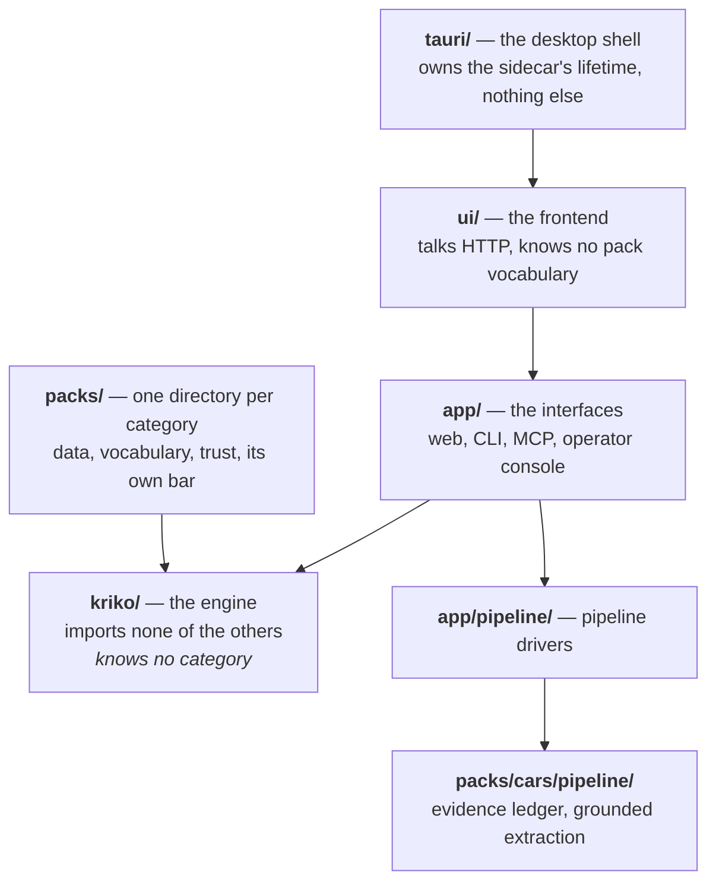

# How Kriko works

Four pictures. Each is the answer to a question people actually ask.

---

## How does a page find its pack?

The one that matters. A reader stands on a listing, and either the panel fills
or it does not — and until 0.10.0 the second case looked identical whether the
pack was missing, the page was misread, or one value was spelled differently.

**The thresholds belong to the pack**, not the engine. How near is near enough
is a statement about a product category, and two categories answer it
differently. They ride in `gates.yaml` as `match_floor` and `match_probable`.

**Nothing is ever a silent no.** Every outcome above names what to do next —
that is what `/api/diagnose/identity` returns in full, and what the panel shows
in short.

> **It said "not recognised" and I know the pack covers it.**
> Open the diagnostic. It lists every subject weighed, what the page said, what
> the catalog holds, and which key disagreed. A key reading *conflict* is
> usually the page; a key reading *absent* is usually the adapter.

---

## Where does a pack come from?

Three different authorities, on purpose: **the agent proposes**, **Kriko
writes** (confined directory, fixed filenames, nothing executable), **you
install**. Nothing an agent produces reaches the store without a press.

The identification pass never blocks. It states what it assumed — *"built for
the 2014–2017 1.6 TDI, Turkish market"* — at the top of the pack, because an
assumed scope that is invisible is worse than a wrong one you can see.

---

## What happens during a run?

Four stages, and the last one is not an afterthought. **The refusals are the
point**: a run that kept nothing and a run that kept everything produce
identical logs without them.

A quote that does not appear in the page it claims to come from is refused, and
that cannot be negotiated. Everything else is the pack's own bar.

> **My run stopped early.**
> That is the cost cap doing its job. What it had gathered was kept — it is on
> the run as a partial. Raise the cap or pick a smaller scale and run it again.

---

## What is each part of the code?

Dependencies point one way. A package may use what it points at, never the
reverse.

**The engine importing anything on this list is the one unforgivable
violation.** The moment it knows what a car is, adding a category stops being a
data change and nobody notices until somebody tries a second one. Four greps in
`CLAUDE.md` enforce it, and a test walks the engine's syntax tree looking for
category vocabulary in executable positions.

A pack is consumed *through the store*, never imported.

---

## Where things live on disk

| Path | What it is | Survives uninstalling a pack |
|---|---|---|
| `~/.kriko/knowledge.sqlite` | The engine's store — packs, subjects, claims | the pack's rows do not |
| `~/.kriko/app.sqlite` | Your history, settings, saved grids | yes |
| `~/.kriko/models.toml` | What each model costs. Yours to edit | yes |
| `~/.kriko/drafts/` | What agents proposed, before you installed it | yes |

Two databases on purpose. Uninstalling a pack must not drop your history, and a
history row must not change a pack's `content_digest`.

---

## Next

- [Install it on Windows](INSTALL_WINDOWS.md)
- [Operate it](USAGE.md) — running analyses, growing the knowledge base
- [What a pack must contain](PACK_CONTRACT.md)
- [Mechanism-level reference](INTERNALS.md) — every endpoint and table
