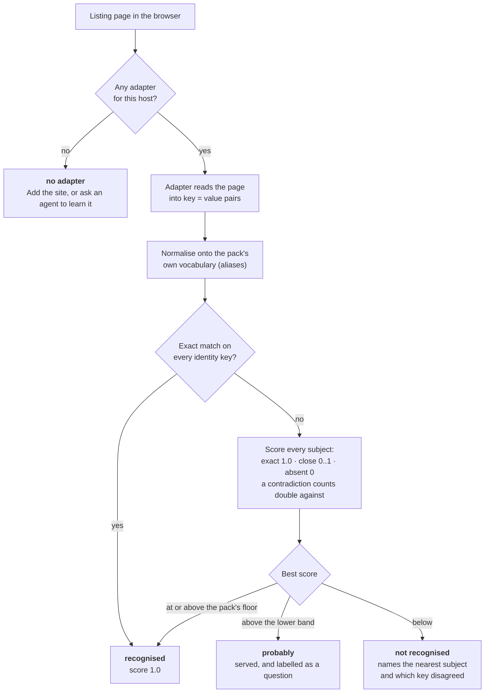
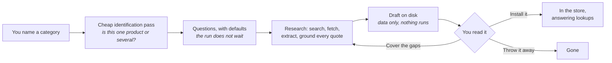
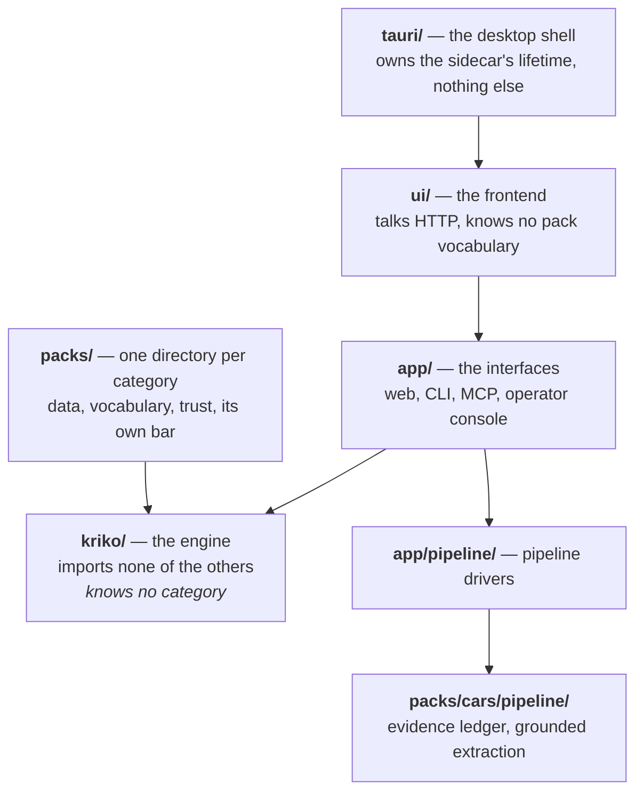

# How Kriko works

Four pictures, one per question people actually ask.

## How does a page find its pack?

Floors (`match_floor`, `match_probable` in `gates.yaml`) belong to the pack. No silent nos: `/api/diagnose/identity` returns the full weighing; the panel shows it short.

## Where does a pack come from?

Agent proposes, Kriko writes (confined dir, fixed names, nothing executable), you install. The identification pass states its assumed scope on the pack instead of blocking.

## What happens during a run?

The refusals are the point — without them, keeping nothing looks like keeping everything. Ungrounded quotes are refused, always. Early stops are the cost cap; kept work stays as a partial.

## What is each part of the code?

The engine importing anything above it is the unforgivable violation (greps in `CLAUDE.md` + an AST test). Packs are consumed through the store, never imported.

## Where things live on disk

| Path | What it is | Survives uninstalling a pack |
|---|---|---|
| `~/.kriko/knowledge.sqlite` | The store — packs, subjects, claims | the pack's rows do not |
| `~/.kriko/app.sqlite` | Your history, settings, saved grids | yes |
| `~/.kriko/models.toml` | What each model costs. Yours to edit | yes |
| `~/.kriko/drafts/` | Agent proposals, before install | yes |

Two databases: uninstalling a pack can't drop history, and history can't change a pack's `content_digest`.

## Next

- [Install it on Windows](INSTALL_WINDOWS.md)
- [Operate it](USAGE.md) — running analyses, growing the knowledge base
- [What a pack must contain](PACK_CONTRACT.md)
- [Mechanism-level reference](INTERNALS.md) — every endpoint and table
