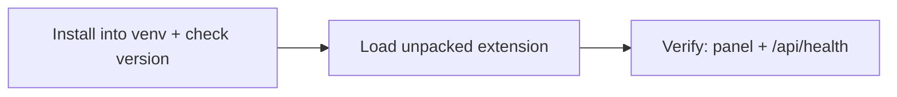

# Installing Kriko on Windows

Top to bottom. If a step fails, **stop** and read the box under it.



## 1. Check your Python
```powershell
py -3.12 --version
```

Want 3.12+ (3.13+ for the test suite).

> **`py` is not recognised** — install from [python.org/downloads](https://www.python.org/downloads/) with **Add python.exe to PATH** ticked.

## 2. Install into its own place
```powershell
py -3.12 -m venv $HOME\kriko-env
$HOME\kriko-env\Scripts\pip install --upgrade pip
$HOME\kriko-env\Scripts\pip install kriko
```

From a checkout: `$HOME\kriko-env\Scripts\pip install C:\path\to\kriko`.

## 3. Check it worked
```powershell
$HOME\kriko-env\Scripts\kriko --version
```

No data, packs or network needed — a version number means a sound install.

> ### `ModuleNotFoundError: No module named 'kriko'`
> ```powershell
> $HOME\kriko-env\Scripts\pip show -f kriko
> $HOME\kriko-env\Scripts\python -c "import kriko, app; print('both import')"
> where.exe kriko
> ```
> * No `kriko\` files in `pip show -f` — bad artifact, report it.
> * Both import but `kriko.exe` fails — another install earlier on PATH.
> * `pip show` finds nothing — wrong interpreter; redo step 2 with full paths.

## 4. Start it
```powershell
$HOME\kriko-env\Scripts\python -m app.web
```

Keep that window open; open **http://127.0.0.1:8787** (or `$HOME\kriko-env\Scripts\kriko tui` for a terminal UI).

## 5. Install the browser extension

Not on the Web Store — load from disk:

1. App → **Browser extension** → **Put the files somewhere I can load them**. Copy the shown folder path.
2. `chrome://extensions` → **Developer mode** on → **Load unpacked** → that folder (the one *containing* `manifest.json`). Pin Kriko.
### Then grant it the sites

App-side registration is never enough — Chrome grants site permission only from inside the extension:
1. Right-click Kriko toolbar button → **Options** → **Grant** each waiting site → confirm. Works from the next page load.
2. Panel still missing? App → **Sites** tells why: *needs permission* (redo above) or *no adapter* (unreadable yet).

## 6. Uninstall
```powershell
Remove-Item -Recurse $HOME\kriko-env
```

`$HOME\.kriko` (knowledge + history) survives; delete it too for a full wipe.

## Reporting a problem
```powershell
$HOME\kriko-env\Scripts\kriko --version
$HOME\kriko-env\Scripts\pip show -f kriko
```

Plus **http://127.0.0.1:8787/api/health**, if the app started.
