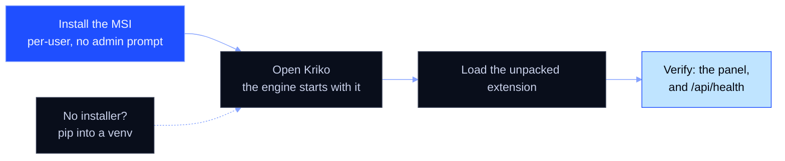

# Installing Kriko on Windows

Double-click the MSI, open Kriko, load the extension. Work top to bottom. If
a step fails, **stop** and read the box under it.



| You have | Use |
|---|---|
| `kriko-<version>-x86_64.msi` | Path A, steps 1 to 3 |
| `kriko-<version>-win64-portable.zip` | Path A, step 1 (unzip), then step 2 |
| Neither, but Python | Path B, steps 4 to 6 |

Path A needs nothing else. The app carries its own Python, and a lookup needs
no network.

## Path A: the desktop app

### 1. Install it

Double-click `kriko-<version>-x86_64.msi`. It is a per-user install: no
administrator prompt, nothing under Program Files, and it installs into
`%LOCALAPPDATA%\Programs\Kriko`. Two programs go there, with three shortcuts.

| Shortcut | Opens |
|---|---|
| **Kriko** (Start menu, desktop) | `kriko.exe`, the app. It starts the engine, `kriko-sidecar.exe`, and stops it again |
| **Kriko Console** (Start menu) | The operator console, in a terminal window on purpose |

A newer MSI replaces an older one and stops a running Kriko first. An older
MSI refuses to install over a newer one.

**Portable:** unzip `kriko-<version>-win64-portable.zip` anywhere. It holds
`kriko.exe` and `kriko-sidecar.exe`. Keep the two side by side and run
`kriko.exe`.

> **"A newer version of Kriko is already installed."** You ran an older MSI.
> Keep the newer one, or uninstall it first (step 3).

### 2. Open it

Start **Kriko**. The window says it is starting, then shows the app. Your
data lives in `$HOME\.kriko`: the store `knowledge.sqlite` and your history
`app.sqlite`.

Closing the window hides it. The engine keeps serving, because the browser
extension needs it. Use the tray icon (**Open**, **Quit**) to end it.

In the native app, **Settings → General → Launch at login** offers **Off**,
**Window**, and **Tray**. Tray starts the engine without opening the window
when you sign in to Windows. Click the tray icon to open it; use **Quit Kriko**
to stop the engine. A manual launch still opens the window. The login setting
points to the executable you are running, so set it from your installed or
permanent portable copy. Moving that copy requires choosing the mode again.

> **The window shows a failure screen instead of the app.** It prints the
> engine's own error. A common cause is another program holding port 8787,
> the one port the extension talks to. Stop that program and open Kriko
> again.

> **An update fails because Kriko is still running.** Quit it from the tray.
> The installer also stops it. A stray `kriko-sidecar.exe` in Task Manager
> can be ended by hand.

Check the engine from a browser: **http://127.0.0.1:8787/api/health** answers
`{"ok":true,...}`.

### 3. Uninstall

**Settings, Apps, Installed apps, Kriko, Uninstall.** The installer stops
Kriko first. `$HOME\.kriko` (the store and your history) survives. Delete it
too for a full wipe.

## Install the browser extension

The extension is not on a web store. Load it from disk.

**Firefox 140 or newer:** In the native **Extension** screen, choose
**Prepare Firefox**. Open `about:debugging#/runtime/this-firefox`, choose
**Load Temporary Add-on**, and select the `manifest.json` shown in the app
(normally `~/.kriko/extension-firefox/manifest.json`). **Show files** and
**Copy path** help locate it. The toolbar button opens the product panel.
Keep Kriko running, including in the tray, while using the add-on.

Preparing also creates `~/.kriko/extension-firefox.xpi`. It is unsigned:
temporary installation lasts until Firefox restarts. A permanent install in
Firefox Release or Beta requires Mozilla signing. The app does not disable
signature checks. See [Firefox add-on packaging](FIREFOX_ADDON.md).

1. In the app, open **Check**, then **Browser extension**, then **Add the
   extension**. The files are staged under `~/.kriko/extension/`.
2. Open `chrome://extensions`, turn on **Developer mode**, choose **Load
   unpacked**, and pick that folder (the one *containing* `manifest.json`).
   Pin the extension.

> After an app update the card says the staged files are older. Press **Add
> again**, then the browser's Reload (the circular arrow on the extension's
> card). That is the whole repair. The card also compares a content digest,
> so the app catches an extension older than this build even when the version
> numbers agree.

### Then grant it the sites

Registering a site in the app is never enough: the browser grants a site
permission only from inside the extension.

1. Right-click the extension's toolbar button, then **Options**, then
   **Grant** each waiting site and confirm. It works from the next page load.
2. The panel is still missing? **System**, then **Sites** says which of the
   two it is: the site needs a permission, or no adapter reads it yet.

## Path B: from Python, without the app

For a terminal and a browser tab. Needs Python 3.13 or newer.

### 4. Check your Python

```powershell
py -3.13 --version
```

You want 3.13 or newer. That is the floor `pyproject.toml` sets, and the
interpreter the test suite is verified on.

> **`py` is not recognised.** Install from [python.org/downloads](https://www.python.org/downloads/) with **Add python.exe to PATH** ticked.

### 5. Install into its own place

```powershell
py -3.13 -m venv $HOME\kriko-env
$HOME\kriko-env\Scripts\pip install --upgrade pip
$HOME\kriko-env\Scripts\pip install kriko
```

From a checkout, point the last line at the directory instead:
`$HOME\kriko-env\Scripts\pip install C:\path\to\kriko`.

Check that it worked:

```powershell
$HOME\kriko-env\Scripts\kriko --version
```

No data, no catalogs and no network are needed. A version number means a
sound install.

> ### `ModuleNotFoundError: No module named 'kriko'`
> ```powershell
> $HOME\kriko-env\Scripts\pip show -f kriko
> $HOME\kriko-env\Scripts\python -c "import kriko, app; print('both import')"
> where.exe kriko
> ```
> * No `kriko\` files in `pip show -f`: the artifact is bad. Report it.
> * Both import but `kriko.exe` fails: an earlier install is earlier on `PATH`.
> * `pip show` finds nothing: the wrong interpreter. Redo step 5 with full paths.

### 6. Start it

```powershell
$HOME\kriko-env\Scripts\python -m app.web
```

Keep that window open and open **http://127.0.0.1:8787**. For a terminal
interface instead, run `$HOME\kriko-env\Scripts\kriko tui`. Then load the
extension as above.

Uninstall:

```powershell
Remove-Item -Recurse $HOME\kriko-env
```

`$HOME\.kriko` survives, as in step 3.

## Reporting a problem

```powershell
$HOME\kriko-env\Scripts\kriko --version
$HOME\kriko-env\Scripts\pip show -f kriko
```

Add **http://127.0.0.1:8787/api/health**, if the app started. On Path A, say
whether you used the MSI or the zip.
