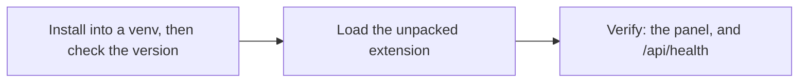

# Installing Kriko on Windows

Top to bottom. If a step fails, **stop** and read the box under it.



## 1. Check your Python
```powershell
py -3.13 --version
```

Want 3.13 or newer, which is the floor `pyproject.toml` sets and the
interpreter the test suite is verified on.

> **`py` is not recognised.** Install from [python.org/downloads](https://www.python.org/downloads/) with **Add python.exe to PATH** ticked.

## 2. Install into its own place
```powershell
py -3.13 -m venv $HOME\kriko-env
$HOME\kriko-env\Scripts\pip install --upgrade pip
$HOME\kriko-env\Scripts\pip install kriko
```

From a checkout, point the last line at the directory instead:
`$HOME\kriko-env\Scripts\pip install C:\path\to\kriko`.

## 3. Check it worked
```powershell
$HOME\kriko-env\Scripts\kriko --version
```

No data, no catalogs and no network are needed. A version number means a sound
install.

> ### `ModuleNotFoundError: No module named 'kriko'`
> ```powershell
> $HOME\kriko-env\Scripts\pip show -f kriko
> $HOME\kriko-env\Scripts\python -c "import kriko, app; print('both import')"
> where.exe kriko
> ```
> * No `kriko\` files in `pip show -f`: the artifact is bad. Report it.
> * Both import but `kriko.exe` fails: an earlier install is earlier on `PATH`.
> * `pip show` finds nothing: the wrong interpreter. Redo step 2 with full paths.

## 4. Start it
```powershell
$HOME\kriko-env\Scripts\python -m app.web
```

Keep that window open and open **http://127.0.0.1:8787**. For a terminal
interface instead, `$HOME\kriko-env\Scripts\kriko tui`.

## 5. Install the browser extension

Not on a web store: load it from disk.

1. In the app, **Check**, then **Browser extension**, then **Add the
   extension**. The files are staged under `~/.kriko/extension/`.
2. `chrome://extensions`, **Developer mode** on, **Load unpacked**, and pick
   that folder (the one *containing* `manifest.json`). Pin the extension.

> After an app update the card says the staged files are older, and **Add
> again** followed by the browser's Reload (the circular arrow on the
> extension's card) is the whole repair. The card also compares a content
> digest, so an extension older than this build is caught even when the version
> numbers agree.

### Then grant it the sites

Registering a site in the app is never enough: the browser grants a site
permission only from inside the extension.

1. Right-click the extension's toolbar button, then **Options**, then **Grant**
   each waiting site and confirm. It works from the next page load.
2. The panel is still missing? **System**, then **Sites** says which of the two
   it is: the site needs a permission, or no adapter reads it yet.

## 6. Uninstall
```powershell
Remove-Item -Recurse $HOME\kriko-env
```

`$HOME\.kriko` (the store and your history) survives. Delete it too for a full
wipe.

## Reporting a problem
```powershell
$HOME\kriko-env\Scripts\kriko --version
$HOME\kriko-env\Scripts\pip show -f kriko
```

Plus **http://127.0.0.1:8787/api/health**, if the app started.
