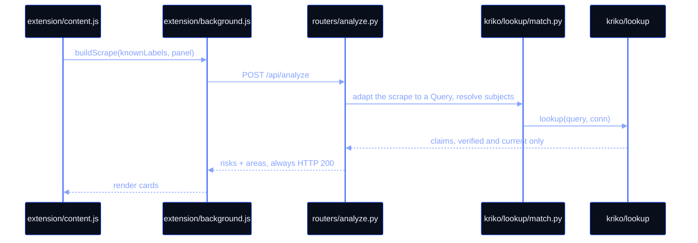
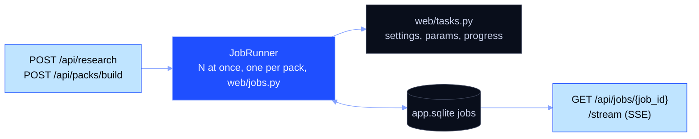
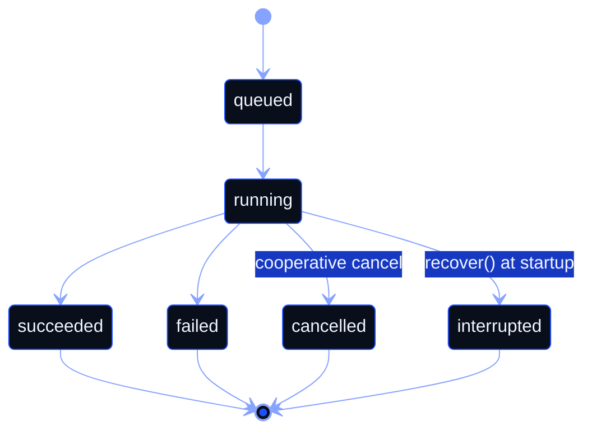
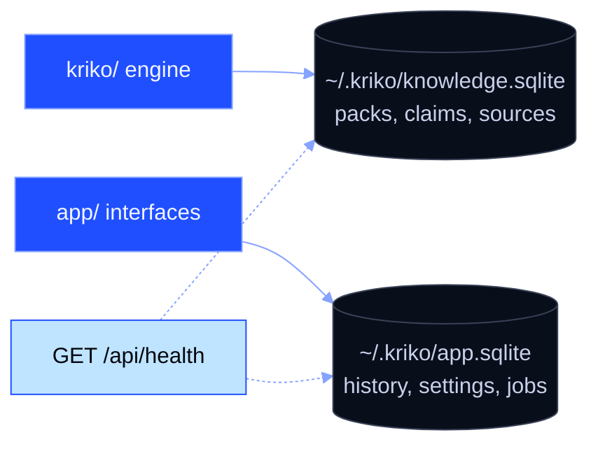
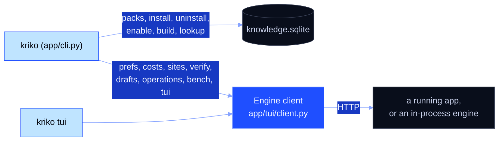
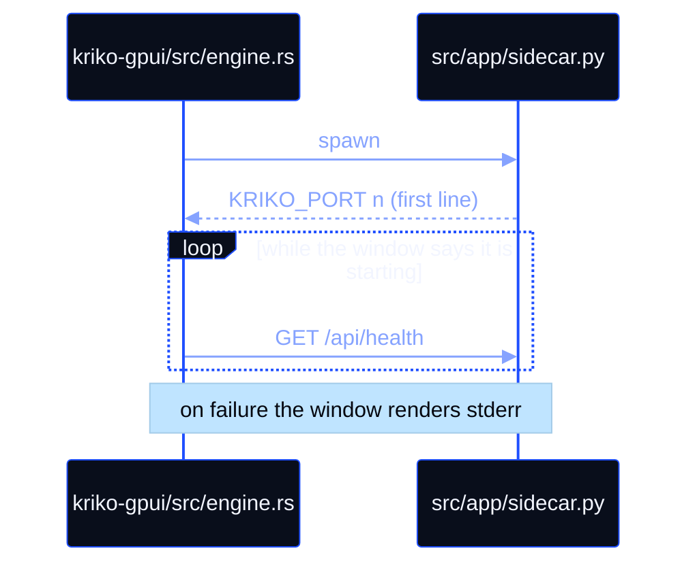

# Kriko, internals

Data flow, file paths and the invariants the code relies on. Package layering
is in [ARCHITECTURE.md](ARCHITECTURE.md) and `CLAUDE.md`; this page is the
mechanism.

## The request path, serving plane



Serving never calls a model: `/api/analyze` reads the store.

| Step | File | Rule |
|---|---|---|
| Scrape | `extension/content.js` | Raw `label -> value`, uninterpreted. `knownLabels` (from `GET /api/adapters`) only says which labels are worth digging for; the adapter decides what a label means (`kriko/adapters.py`). |
| Panel rules | the adapter's `local_panel` block | Selectors, the site's own words and thresholds ride in the adapter, opaque to the engine, and are never compiled from pack patterns into a `RegExp`. `test_the_extension_speaks_no_sites_own_language` fails on a non-ASCII word in `extension/`. |
| Request | `extension/background.js` | Labels and panel travel per request, never cached. |
| Endpoint | `src/app/web/app.py` | Always 200; an exception becomes `coverage_state: unavailable`. |
| Identity | `src/kriko/lookup/match.py` | Matches on attribute overlap, never on `subject_id` equality. Narrowing is soft: an unmatched hint flags a contradiction, it never produces `no_match`. The result is a `Resolution` (`lookup/query.py`): `subject_ids`, `method` (`exact`/`ambiguous`/`no_match`), `notes`, `flags`. |
| Claims | `src/kriko/lookup/__init__.py` | Reads `claim_variants`, `verified` and `is_current` only. |
| Ranking | `src/app/web/routers/analyze.py` | Severity, times the pack's own gate, times detection (lower for a component that has to be seen rather than measured), times source trust (a null tier is neutral). Sorted by `relevance_score` and capped at `MAX_RISKS_PER_LISTING`. Every risk carries `why_shown`; the response adds `subsystems` beside the flat `risks`. |
| Render | `extension/hover_lite/hover_lite.js` | Risk cards plus local blocks. Alerts walk `listing.panel.alerts` in order, and `unless: [rule-id]` is an else-branch written as data. |

**Claim health** (`kriko/lookup/tree.py`) keeps four signals per claim, and
never combines them: contradiction (`stance='refutes'`), corroboration, best
trust tier, and staleness (`sources.retrieved_at`). Read them at
`GET /api/health/weakest` and `GET /api/health/subject/{subject_id}`, or
through the `subject_health` and `weakest_claims` MCP tools. `stance` is
written at acceptance (`app/findings.py`).

## The jobs plane

Long work is a row, not a request. How many run at once is the reader's
Settings choice (`run_concurrency`, 1 to 4, one by default); each job claims
the pack it writes (`jobs.claims`), two overlapping claims never run
together, and a kind whose target cannot be named runs alone. Quick looks
keep their own lane.





States are `queued`/`running`, then `succeeded`, `failed`, `cancelled` or
`interrupted`; `recover()` marks a dead process's rows `interrupted` at
startup. Cancel is cooperative (`Progress.check`) and kills the child process
tree. `POST /api/jobs/{job_id}/say` queues a message from the reader and the
handler reads it between steps, so a run can be answered while it runs.
`research` feeds `app/findings.py`, the same grounding path as the MCP
`submit_findings`; `pack_build` mirrors `kriko build`.

## API surfaces

Each `app/web/routers/*.py` module is one surface.
`test_docs_match_the_code.py` fails until every surface has an endpoint named
in a document, because a surface nobody knows exists cannot be reasoned about.

| Surface | Endpoints | Notes |
|---|---|---|
| analyze | `POST /api/analyze`, `GET /api/adapters`, `GET /api/adapters/unmapped`, `POST /api/diagnose/identity` | The check itself, the adapters a page may use, the labels no adapter reads, and the full identity weighing behind a "not recognised". |
| subjects | `GET /api/subjects`, `GET /api/subjects/{subject_id}`, `GET /api/subjects/{subject_id}/brief`, `GET /api/subjects/filters`, `GET /api/search` | Pack knowledge, the $0 brief, the filter vocabulary and the catalogue-wide search. |
| query | `POST /api/lookup`, `GET /api/identity-keys/{pack_id}`, `GET /api/kinds` | A lookup, the keys a pack declares, the subject kinds it has. |
| history | `GET /api/history`, `GET /api/history/{lookup_id}`, `GET /api/lookup/{lookup_id}`, `POST /api/lookups/{lookup_id}/notes`, `GET\|POST /api/lookups/{lookup_id}/checked`, `GET /api/lookups/{lookup_id}/triage`, `GET\|POST /api/settings` | Backed by `app.sqlite`. |
| live | `GET /api/knowledge/clock`, `GET /api/lookup/{lookup_id}/refresh` | What changed in the store, and re-read one past check. |
| marks | `GET\|POST /api/marks`, `DELETE /api/marks/{pack_id}/{claim_id}`, `GET /api/marks/signals` | Author verdicts, pack-keyed, and the research signals they feed. |
| compare | `GET\|POST /api/compare-drafts`, `PUT\|DELETE /api/compare-drafts/{draft_id}` | Named comparisons of saved checks. App state, never knowledge. |
| queue | `GET\|POST /api/queue`, `PATCH\|DELETE /api/queue/{queue_id}` | The research queue: products queued from the extension's panel (Add to queue), researched in turn, then compared. One row per listing address; a second press answers `added: false`; PATCH sets `state` (waiting, researching, done) and the fresh `lookup_id` as the window researches them. App state, never knowledge. |
| jobs | `POST /api/research`, `POST /api/packs/build`, `POST /api/packs/author`, `POST /api/packs/update`, `GET /api/packs/updates`, `GET /api/jobs`, `GET /api/jobs/{job_id}`, `POST /api/jobs/{job_id}/cancel`, `POST /api/jobs/{job_id}/retry`, `POST /api/jobs/{job_id}/say`, `GET /api/jobs/{job_id}/stream` | SSE polls the row, so a reconnect is safe. |
| pipeline | `GET /api/pipeline/runs`, `GET /api/pipeline/runs/{run_id}`, `GET /api/pipeline/stream` | What came of a run: sources, kept findings, refusals with their reason. |
| agenda | `GET /api/agenda`, `GET\|DELETE /api/research-runs`, `GET /api/research-runs/{run_id}` | Computed on read from demand, gaps and thinness. `DELETE` is undo, through `retract_claim`. |
| research | `GET /api/research-planes`, `GET /api/local-plane`, `GET /api/usage` | The planes read off the researcher classes, with a cost sentence and `ready` each; the local plane's own state; measured spend. |
| prefs | `GET\|PUT /api/prefs`, `GET /api/costs`, `GET /api/scales` | Chosen providers, measured spend and next estimate, the scale presets. No credit balance, because no vendor exposes one. |
| factcheck | `GET\|POST /api/factcheck`, `GET /api/factcheck/grounding`, `GET /api/factcheck/document`, `POST /api/verify` | The quote comes from the store, never from the caller. Verdicts are `quoted`/`missing`/`unreadable`/`unreachable`, and `missing` means the page changed, not that the claim is false. |
| sites | `GET /api/sites`, `GET /api/sites/activation`, `GET\|POST /api/sites/seen`, `GET\|DELETE /api/sites/{host}`, `GET\|POST /api/sites/{host}/activation`, `POST /api/sites/{host}/register` | A pack's adapter always beats a learned one (`app/sites.py`). |
| control | `GET /api/status`, `GET /api/activity`, `GET /api/packs/{pack_id}/revisions`, `POST /api/packs/{pack_id}/activate`, `POST /api/packs/{pack_id}/rollback`, `GET /api/packs/{pack_id}/events` | Pack revisions and rollbacks, the activity lens, the install's own status. |
| packs | `GET /api/packs`, `GET /api/packs/{pack_id}`, `POST /api/packs/install`, `GET\|PUT /api/packs/{pack_id}/enabled`, `GET /api/packs/{pack_id}/gaps`, `GET /api/packs/{pack_id}/vocabulary`, `POST /api/packs/scaffold`, `GET /api/packs/drafts`, `GET /api/packs/drafts/{slug}`, `POST /api/packs/drafts/{slug}/build`, `POST /api/packs/drafts/{slug}/amend`, `POST /api/packs/drafts/{slug}/install`, `GET /api/packs/drafts/{slug}/artifact`, `DELETE /api/packs/drafts/{slug}` | Drafts live in `~/.kriko/drafts/<slug>/`. An adapter is `adapters/*.json`, not `.yaml`. A draft with no `principle` or no `lineup` is refused, and a subject named by neither the line-up nor `coverage.out_of_scope` is quarantined in `research/coverage.yaml`. |
| submissions | `GET /api/submissions` | Legible refusals only (`app/findings.py`). |
| keys | `GET\|PUT /api/keys`, `POST /api/keys/test`, `DELETE /api/keys/{provider_id}` | Stored in `~/.kriko/env`. No response ever carries a key: presence, source and the last four only. `test` makes one cheap live call server-side, so a key never leaves the machine. |
| agent | `GET /api/agent-config`, `GET /api/agent-targets`, `POST /api/agent-targets/{target_id}/connect`, `POST /api/agent-targets/{target_id}/skill`, `GET /api/agent-skill`, `POST /api/agent-verify` | `agent-verify` runs a real MCP `initialize` and `tools/list`. |
| operations | `GET /api/operations`, `GET /api/operations/stream` | The any-door live feed of agent work (`docs/AGENT_OPERATIONS.md`). |
| bench | `GET\|POST /api/bench`, `GET /api/bench/configs`, `GET /api/bench/configs/{name}`, `POST /api/bench/estimate` | The sweep runs on a throwaway copy of the store. `estimate` is a separate endpoint so that asking what a grid would cost can never start it. |
| machine | `GET /api/machine` | The GPU (name, VRAM total and used from `nvidia-smi`), system memory, the processor, and which local runtimes are installed with their path. A figure the machine does not report is `null`, never a guess. Cached for 60 seconds; `?fresh=true` skips the cache (`app/machine.py`). |
| local-models | `GET /api/local-models`, `POST /api/local-models/pull` | `GET` is what Ollama holds, with the bytes, parameter count and quantisation it reports. `POST` starts a `model_pull` job: Ollama's own streamed `/api/pull`, progress as the share of bytes, cancel stops the stream, a failure carries Ollama's words. Ollama only; any other runtime is refused with where to get the model (`app/modelpull.py`). |
| extension | `GET /api/extension`, `POST /api/extension/stage`, `POST /api/extension/reveal`, `POST /api/extension/launch`, `POST /api/extension/research-plane` | The staged directory, the version verdict, opening a browser with it, and the door a check starts from. |
| terminal | `GET /api/terminal/state`, `GET /api/terminal/stream`, `POST /api/terminal/input`, `POST /api/terminal/resize`, `POST /api/terminal/restart`, `POST /api/terminal/close` | One PTY per session (`app/providers/termpty.py`), for a one-time sign-in. The client is `kriko tui`; scrollback is bounded and resumable with `?offset=`. The origin check excludes extension origins. |
| focus | `POST /api/focus`, `GET /api/focus`, `GET /api/window`, `POST /api/window/close-notice` | "Open in Kriko": the extension posts a route, the shell raises the window, and the window consumes the route once. |

## Interface state, `app.sqlite`

Two SQLite files, on purpose. `~/.kriko/knowledge.sqlite` is the engine store;
`~/.kriko/app.sqlite` (`src/app/web/state.py`) is interface state.
Uninstalling a pack must not drop history, and history must not move a
`content_digest`. `/api/health` reports both paths.



| Table | Holds |
|---|---|
| `settings` | The reader's preferences, as key and value. |
| `lookups` | Every check request and its response (History). |
| `claim_notes`, `claim_checks` | A reader's note and their tick-off, per check. |
| `claim_marks` | Author verdicts; they outlive the check that prompted them. |
| `jobs` | Job rows that outlive the request and the process. |
| `job_messages` | Reader-to-run messages. `taken_at` is set inside the read transaction, so a message is never delivered twice. |
| `pipeline_runs`, `pipeline_stages`, `pipeline_events` | What a run did, stage by stage, and what it printed. |
| `submissions` | Agent-door input and the verdicts it drew. |
| `fact_checks` | The last "the page still says this" per (pack, claim). A dead link is a signal, not a retraction. |
| `extension_seen` | Extension origins, hit counts and versions. |
| `research_runs`, `research_run_claims` | Plane, model, budget against spend, outcome; per claim a `removed_at` for undo. Install-local. |
| `bench_runs` | Every benchmark row: plane, model, protocol, context size, cost, and the per-reason refusals. `rep` marks a repeat of the same case. `detail_json` keeps the versioned case, run settings, answer, evidence, runtime and diagnostics. |
| `operations` | The any-door work feed, bounded to 2000 rows. |
| `documents` | Quote-proving page text, one row per `source_id`, bounded. |
| `unmapped_labels` | Labels seen on pages that no adapter reads. |
| `local_adapters` | Site readers this installation taught itself. They never travel and never enter a digest. |
| `site_requests` | Unreadable sites the reader stood on, so "which site next" is answerable. |
| `site_activation` | The browser's per-site permission verdict. |
| `compare_drafts` | Named comparisons: which checks, in which order. |
| `queue_history` | Durable queue entries, including completed and removed products; active entries are reconciled from `research_queue`. |
| `research_queue` | Products queued from the extension, in research order, with the site each came from. |
| `compare_questions` | The reader's own questions about a comparison, and the answers their agent gave. |
| `compare_boards` | One comparison's pen marks and typed notes over the table, one JSON document per draft. Cleared when the draft is saved over, because a mark on a column that is gone is a mark about nothing. |

**Migration.** `connect()` stamps `PRAGMA user_version` with
`schema_stamp(SCHEMA)`, and `add_missing_columns()` reconciles
`declared_columns()` against `PRAGMA table_info`, additions only. History is
never dropped.

**Version handshake**, no polling. Requests carry `x-kriko-extension`
(`extension.VERSION_HEADER`) and responses `x-kriko-minimum-extension`
(`extension.MINIMUM_HEADER`); the floor is `extension.MINIMUM_VERSION`.

## The interfaces beside the web app



Only the store commands open the database directly; everything else goes over
HTTP, because a second direct open is a second writer. Discovery order is
`--url`, `KRIKO_URL`, `EXTENSION_PORT` (8787), then an in-process engine
(`--no-start` fails instead of starting one).

**The operator console** (`src/app/tui/`) speaks the same HTTP API as the
dashboard: `client.py` holds discovery and calls, `term.py` raw mode and the
frame differ, `screen.py` is a pure function of state, `app.py` is the loop.
Its tabs are Planes, Agenda, Jobs and Ops, and `s` hands the terminal to the
PTY until Ctrl-]. It is reachable as `kriko tui` or `kriko-sidecar --tui`, and
the Windows installer adds a Start-menu shortcut for it.

## The desktop shell



`src/app/sidecar.py` binds port 0, prints `KRIKO_PORT <n>` first and hands the
bound socket to uvicorn. `kriko-gpui/src/engine.rs` spawns it, polls
`/api/health` while the window says it is starting; a failure renders stderr. `--mcp` runs
the MCP stdio server from the same binary and `--exit-with-parent` is the crash
belt. `packaging/kriko-sidecar.spec` freezes it,
`packaging/smoke_sidecar.py` gates the handshake, health and frontend, and
`.github/workflows/desktop.yml` is the hand-run installer recipe. The
supervisor rules are in `CLAUDE.md` and `kriko-gpui/README.md`.

## The knowledge plane, the ledger

No human sign-off anywhere (`CLAUDE.md`, automation). The generic machinery is
in `src/kriko/ledger/`; the policy is the pack's own, in
`packs/<name>/pipeline/`.


| Stage | Where |
|---|---|
| acquire | the pack's own `pipeline/ledger/acquire.py`, with no model involved |
| chunk, extract | `src/kriko/ledger/chunking.py` and `extraction.py`; the noise gates run `kriko.gates` over the pack's own vocabulary file |
| resolve | the pack's `pipeline/ledger/resolve.py`, from the evidence text against the catalog's own codes, never from the query |
| verdict | the pack's `pipeline/ledger/verdict.py`, with `eval_verdict.py` checking it against that pack's gold set |
| export, parity | `ledger/export.py` writes the pack's own data files; `ledger/parity.py` diffs those files against the export by a stable identity |
| build | `src/kriko/pack/build.py` (`kriko build packs/<name>`). The ledger's database is never on the request path |

## Data formats

A **subject** is whatever the pack declares it to be. A mature pack's shape
happens to carry a variant record and a claim record; neither name is required
and neither is understood by the engine.

A claim, as one pack writes it (`packs/<name>/data/parts/**/*.yaml`):

```yaml
- id: <claim_key>_v<version>     # {claim_key}_v{version}
  claim_key: <claim_key>         # stable across versions
  version: 1
  is_current: true
  title: "<the claim, in the pack's own words>"
  domain: <the pack's own area vocabulary>
  severity: high                 # the pack's own scale
  confidence: 0.72
  status: verified               # verified | draft | held | review | rejected
  variants:
    - variant_id: <the subject this claim is about>
  sources:
    - source_url: "https://..."
      quote: "verbatim quote..."
      independent: true
```

What the engine guarantees about a claim is what is in that record: a stable
key, a current flag, a status, and at least one source whose quote is present
in a document that was actually read.

## Invariants

1. A subject's identity is permanent. A rename silently breaks every claim that
   referenced it.
2. Pack data is the source of truth. Rebuild; never edit the store.
3. Serving never calls a model or the ledger.
4. Verdicts are pipeline-owned.
5. Vocabulary is pack-owned. `kriko/` holds no category constant.
6. Nothing is deployed: one process, two SQLite files, no container and no
   database server (`test_the_app_stays_standalone`).
