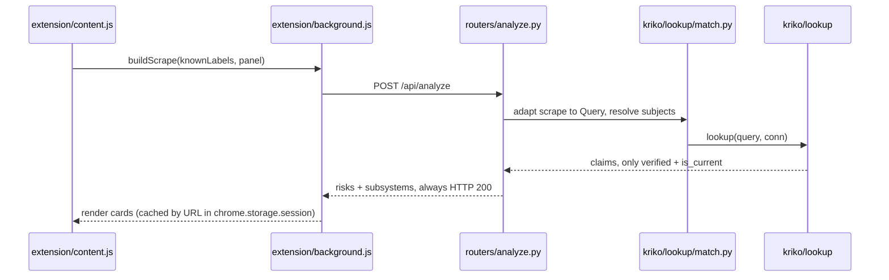
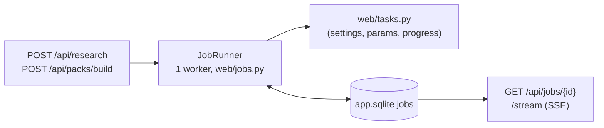
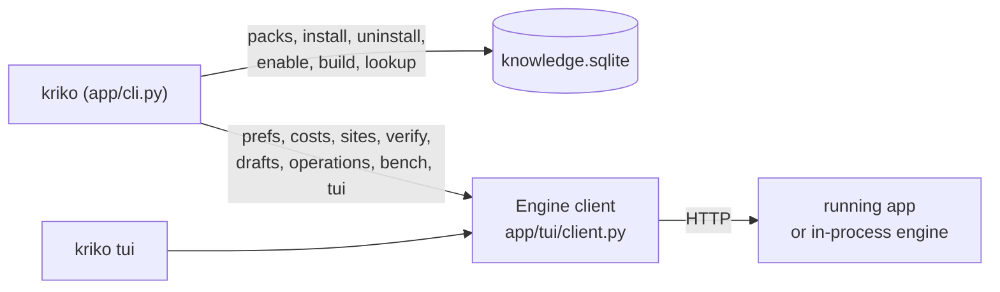
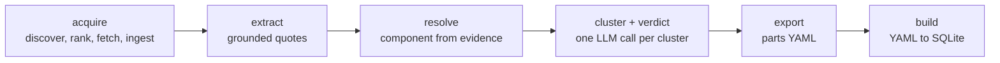

# Kriko — internals

Data flow, file paths and the invariants the code relies on. Read before
touching the pipeline. Package layering lives in
[ARCHITECTURE.md](ARCHITECTURE.md) and `CLAUDE.md`; this page is the mechanism.

## Request path (serving plane)



Serving never calls an LLM: `/api/analyze` reads the store.

| Step | File | Rule |
|---|---|---|
| Scrape | `extension/content.js` | Raw `label -> value`, uninterpreted. `knownLabels` (from `GET /api/adapters`) only says which labels are worth digging for; the adapter decides what a label means (`kriko/adapters.py`). |
| Panel rules | adapter `local_panel` block | Selectors, damage words, thresholds ride in the adapter, opaque to the engine, never compiled from pack patterns into a `RegExp`. `test_the_extension_speaks_no_sites_own_language` fails non-ASCII words in `extension/`. |
| Request | `extension/background.js` | Labels and panel travel per request, never cached. `listing` stays out of the request. |
| Endpoint | `src/app/web/app.py` | Always 200; exceptions become `coverage_state: unavailable`. |
| Identity | `src/kriko/lookup/match.py` | Match on attribute overlap, never `subject_id` equality. Narrowing is soft: an unmatched hint flags a contradiction, never `no_match`. Result is `Resolution` (`lookup/query.py`): `subject_ids`, `method` (`exact`/`ambiguous`/`no_match`), `notes`, `flags`. |
| Claims | `src/kriko/lookup/__init__.py` | Reads `claim_variants`, only `verified` and `is_current`. |
| Ranking | `src/app/web/routers/analyze.py` | severity (0.3 / 0.6 / 1.0) x mileage gate (1.0, or 0.7 unknown) x detection (0.35 for `detection: visual` components, else 1.0) x source trust (NULL neutral). Sorted by `relevance_score`, capped at `MAX_RISKS_PER_LISTING`. Every risk carries `why_shown`; the response adds `subsystems` next to the flat `risks`. |
| Render | `extension/hover_lite/hover_lite.js` | Risk cards plus local blocks; alerts walk `listing.panel.alerts` in order, `unless: [rule-id]` is an else-branch as data. |

**Claim health** (`kriko/lookup/tree.py`) keeps four uncombined signals per
claim: contradiction (`stance='refutes'`), corroboration, best trust tier,
staleness (`sources.retrieved_at`). Read them at `GET /api/health/weakest` and
`GET /api/health/subject/{id}`, or the `subject_health` and `weakest_claims`
MCP tools. `stance` is written at acceptance (`app/findings.py`).

## Jobs plane

Long work is a row, not a request.



States: `queued`/`running` then `succeeded | failed | cancelled | interrupted`
(`recover()` marks a dead process's rows `interrupted` at startup). Cancel is
cooperative (`Progress.check`) and kills the harness process tree.
`research` feeds `app/findings.py`, the same grounding path as MCP
`submit_findings`; `pack_build` mirrors `kriko build`.

## API surfaces

Each `app/web/routers/*.py` module is one surface;
`test_docs_match_the_code.py` fails until every surface has an endpoint named
in the docs.

| Surface | Endpoints | Notes |
|---|---|---|
| history | `GET /api/history`, `GET /api/lookup/{id}`, `POST /api/lookups/{id}/notes`, `GET\|POST /api/lookups/{id}/checked`, `GET /api/lookups/{id}/triage`, `GET\|POST /api/settings` | Backed by `app.sqlite`. |
| marks | `GET\|POST /api/marks`, `DELETE /api/marks/{pack_id}/{claim_id}`, `GET /api/marks/signals` | Author verdicts, pack-keyed. |
| compare | `GET\|POST /api/compare-drafts`, `PUT\|DELETE /api/compare-drafts/{draft_id}` | Named comparisons of saved checks (B183). |
| subjects | `GET /api/subjects[/{id}[/brief]]` | Pack knowledge and the $0 brief. |
| query, control, live | `/api/query`, `/api/knowledge/clock`, `/api/packs/{pack_id}/revisions`, `/api/packs/{pack_id}/activate`, `/api/packs/{pack_id}/rollback`, `/api/identity-keys/{pack_id}` | Lookup, pack revisions, identity forms. |
| jobs | `POST /api/research`, `POST /api/packs/build`, `GET /api/jobs[/{id}]`, `POST /api/jobs/{id}/cancel`, `GET /api/jobs/{id}/stream` | SSE polls the row, so reconnect is safe. |
| pipeline | `GET /api/pipeline/runs[/{id}]`, `/stream` | What came of a run: sources, kept findings, refusals with reason. |
| agenda | `GET /api/agenda`, `GET\|DELETE /api/research-runs[/{id}]` | Computed on read from demand, gaps, thinness; `DELETE` is undo via `retract_claim`. |
| factcheck | `GET\|POST /api/factcheck`, `GET /api/factcheck/grounding`, `GET /api/factcheck/document`, `POST /api/verify` | Quote comes from the store, never the caller. Verdicts `quoted/missing/unreadable/unreachable`; `missing` means the page changed, not that the claim is false. |
| sites | `GET /api/sites`, `POST /api/sites/seen`, `POST /api/sites/{host}/register`, `DELETE /api/sites/{host}` | Pack adapters always beat learned ones (`app/sites.py`). |
| prefs | `GET\|PUT /api/prefs`, `GET /api/costs` | Agent, model, search and measured spend. No credit balance (no vendor exposes one). |
| operations | `GET /api/operations[/stream]` | Any-door live feed of agent work (`docs/AGENT_OPERATIONS.md`). |
| packs | `POST /api/packs/scaffold`, `GET /api/packs/drafts[/{slug}]`, `POST /api/packs/drafts/{slug}/{build,amend,install}`, `DELETE /api/packs/drafts/{slug}` | Drafts in `~/.kriko/drafts/<slug>/`. Adapter is `adapters/*.json`, not `.yaml`. A draft without `principle` or `lineup` is refused; subjects named by neither line-up nor `coverage.out_of_scope` are quarantined in `research/coverage.yaml`. |
| submissions | `GET /api/submissions` | Legible refusals only (`app/findings.py`). |
| keys | `GET\|PUT /api/keys`, `DELETE /api/keys/{provider}` | Stored in `~/.kriko/env`. No response carries a key: presence, source and last four only. |
| agent | `GET /api/agent-config`, `GET /api/agent-targets`, `POST /api/agent-targets/{id}/{skill,connect}`, `GET /api/agent-skill`, `POST /api/agent-verify` | `agent-verify` runs a real MCP `initialize` and `tools/list`. `env` is non-empty on Windows only. |
| research | `GET /api/research-planes` | Planes read off the researcher classes, plus cost sentence and `ready`. |
| bench | `GET\|POST /api/bench` | Store-derived cases; sweeps planes x protocols on a throwaway store copy. `kriko bench` is the same sweep in a terminal. |
| extension | `GET /api/extension`, `POST /api/extension/stage`, `POST /api/extension/reveal` | Staged dir for Chrome plus version verdict. |
| terminal | `GET /api/terminal/state`, `GET /api/terminal/stream`, `POST /api/terminal/input`, `POST /api/terminal/resize`, `POST /api/terminal/close` | One PTY per session (`app/providers/termpty.py`) for one-time harness `login`s. Client is `kriko tui`; 256 KB scrollback, resumable `?offset=`. Origin check excludes extension origins. |
| focus | `POST /api/focus`, `GET /api/focus` | "Open in Kriko": the extension posts a route, the shell raises the window, the window consumes it once. |

## Interface state: `app.sqlite`

Two SQLite files, on purpose. `~/.kriko/knowledge.sqlite` is the engine store;
`~/.kriko/app.sqlite` (`src/app/web/state.py`) is interface state. Uninstalling
a pack must not drop history, and history must not move `content_digest`.
`/api/health` reports both.

| Table | Holds |
|---|---|
| `settings` | Reader prefs (mode, theme). |
| `lookups` | Every analysis request and response (History). |
| `claim_notes`, `claim_checks` | Per-lookup note and question-sheet tick-offs. |
| `claim_marks` | Author verdicts; outlive lookups. |
| `jobs` | Job rows that outlive the request. |
| `pipeline_runs`, `pipeline_stages`, `pipeline_events` | What a run did. |
| `submissions` | Agent-door input and verdicts. |
| `fact_checks` | Last "page still says this" per (pack, claim); a dead link is a signal, not a retraction. |
| `extension_seen` | Extension origins, counts, versions. |
| `research_runs`, `research_run_claims` | Plane, budget vs spend, outcome; per-claim `removed_at` for undo. Install-local. |
| `operations` | Any-door work feed, bounded to 2000 rows. |
| `job_messages` | Reader-to-run messages; `taken_at` set inside the read transaction, so never delivered twice. |
| `local_adapters` | Self-taught site readers; never travel or digest. |
| `site_requests` | Unreadable sites the reader stood on ("which site next"). |
| `site_activation` | Browser's per-site permission verdict. |
| `compare_drafts` | Named comparisons (which checks, in order); app state, never knowledge (B183). |
| `documents` | Quote-proving page text per `source_id`, bounded. |
| `unmapped_labels` | Labels seen on pages that no adapter reads. |

**Migration:** `connect()` stamps `PRAGMA user_version` with
`schema_stamp(SCHEMA)`; `add_missing_columns()` reconciles `declared_columns()`
against `PRAGMA table_info` (additions only). History is never dropped.

**Version handshake:** no poll. Requests carry `X-Kriko-Extension`, responses
`X-Kriko-Minimum-Extension`; the floor is `app.extension.MINIMUM_VERSION`.

## Interfaces beside the web app



Only the store commands open the database directly; everything else goes over
HTTP (a second direct open would be a second writer). Discovery order:
`--url`, `KRIKO_URL`, `EXTENSION_PORT` (8787), then an in-process engine
(`--no-start` fails instead).

**Operator console** (`src/app/tui/`): same HTTP API as the dashboard.
`client.py` discovery and calls, `term.py` raw mode and frame differ,
`screen.py` a pure function of state, `app.py` the loop. Tabs: Planes, Agenda,
Jobs, Ops; `s` hands the terminal to the PTY until Ctrl-]. Reachable as
`kriko tui` or `kriko-sidecar --tui`; the Windows installer adds a **Kriko
Console** Start-menu shortcut.

## Desktop shell

`src/app/sidecar.py` binds port 0, prints `KRIKO_PORT <n>` first and passes the
bound socket to uvicorn. `tauri/src-tauri/src/main.rs` spawns it, polls
`/api/health`, then shows the window; a failure renders stderr. `--mcp` runs the
MCP stdio server from the same binary, `--exit-with-parent` is the crash belt.
`packaging/kriko-sidecar.spec` freezes it, `packaging/smoke_sidecar.py` gates
handshake, health and frontend, `.github/workflows/desktop.yml` is the
hand-run installer recipe. Supervisor rules are in `CLAUDE.md` and
`tauri/README.md`.

## Knowledge plane: the ledger

No human sign-off anywhere (`CLAUDE.md`, automation). Generic machinery is in
`src/kriko/ledger/`; the cars policy is in `packs/cars/pipeline/`.



| Stage | File |
|---|---|
| acquire | `packs/cars/pipeline/ledger/acquire.py` (no LLM) |
| chunk, extract | `src/kriko/ledger/chunking.py`, `extraction.py`; noise gates via `kriko.gates` over `packs/cars/vocabulary/gates.yaml` |
| resolve | `packs/cars/pipeline/ledger/resolve.py` (from evidence text vs catalog codes, never the query) |
| verdict | `packs/cars/pipeline/ledger/verdict.py`; `eval_verdict.py` checks it against `packs/cars/pipeline/gold/gold.yaml` |
| export, parity | `ledger/export.py` writes `packs/cars/data/parts/**`; `ledger/parity.py` diffs YAML vs export by stable identity |
| build | `src/kriko/pack/build.py` (`kriko build packs/cars`); the ledger DB is never on the request path |

## Data formats

Variants (`packs/cars/data/variants/{make}_{model}_{gen}.yaml`):

```yaml
- id: megane4_h5h_140        # permanent; claims reference it
  make: renault
  model: megane
  generation: "IV"
  engine_code: H5H
  fuel: petrol               # petrol | diesel | hybrid | electric | lpg
  displacement_cc: 1332
  power_min_hp: 115
  power_max_hp: 140
  transmission: automatic    # manual | automatic
  year_from: 2018
  year_to: null              # null = still in production
  market: TR
```

Claims (`packs/cars/data/parts/{part_type}/{part_id}.yaml`):

```yaml
- id: megane4_h5h_timingchain_v1     # {claim_key}_v{version}
  claim_key: megane4_h5h_timingchain # stable across versions
  version: 1
  is_current: true
  title: "1.3 TCe (H5H) timing chain stretch and tensioner wear"
  domain: engine
  severity: high                     # high | medium | low
  confidence: 0.72
  status: verified                   # verified | draft | held | review | rejected
  variants:
    - variant_id: megane4_h5h_140
  sources:
    - source_url: "https://..."
      quote: "verbatim quote..."
      independent: true
```

## Invariants

1. Variant IDs are permanent; a rename silently breaks claim links.
2. Pack YAML is the source of truth: rebuild, never edit the store.
3. Serving never calls an LLM or the ledger.
4. Verdicts are pipeline-owned.
5. Vocabulary is pack-owned; no car constants in `kriko/`.
6. Nothing is deployed: one process, two SQLite files, no container or database
   server (`test_the_app_stays_standalone`).
