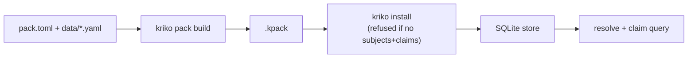

# The pack contract

A pack is a directory under `packs/`: what `src/kriko/pack/manifest.py`
enforces on load, plus what a pack grows into past the minimum. For someone
shipping a pack for a new product category.

Enforcement: `src/kriko/tests/test_pack_contract.py` — loads every pack under
`packs/`, checks the rules below, plus a guard of >1 pack in repo (one example
proves nothing). Failing pack? Fix the pack, not the test.

## The required minimum

1. **`pack.toml`** with `[pack]` declaring `id` (stable, e.g.
   `org.kriko.drill`), `name`, `version`. `publisher`/`license`/`origin` read,
   not enforced. Plus, once a pack ships searches: `languages` (codes, most
   important first, e.g. `["en", "tr"]`; first = primary, assumed for queries
   with no `lang`; default `["en"]`) and `markets` (free-form, e.g.
   `["TR", "EU"]`; into the brief, never interpreted). Both reach agents via
   the brief — undeclared mixed-language seeds produce searches returning
   nothing. **Shipping `research/templates.yaml` requires declaring
   `languages`.**
2. **Non-empty `[identity]`**: each subject kind (`product`, `part`,
   `battery_platform`) → ≥1 attribute key making that kind distinct.
3. **`data/`** with ≥1 `*.yaml` (recursive). No rows = not a pack.
4. **`README.md`**: what it covers, in prose.

`packs/drill/` (five YAMLs + README) is this floor and passes.

## Why `[identity]` is the most consequential declaration

It decides "same product". Two packs describing the same drills merge rows
only if they hash a drill identically. Too narrow → collisions; too specific
→ one product split across subjects whose claims never meet. Both silent.
Empty `[identity]` is rejected: without keys "every subject of a kind would
hash to the same id." No single correct shape (cars: 7 keys for `product`;
drill: `brand`+`model`, plus single-key `battery_platform`). Divergent shapes
aren't wrong — rows union by attribute overlap (see
`src/kriko/tests/test_lookup.py`) instead of collapsing.

## The optional parts

Unenforced; each buys what a mature pack needs.

- **`vocabulary/`** — gate/adapter terms the generic ranking/gating reads as
  pack rows, not Python. (drill + cars)
- **`research/`** — per-category agent research, read by name (`kriko/pack/
  build.py` decides `.kpack` contents): `principle.md` (what's worth
  surfacing; quoted verbatim into briefs + generated skill); `templates.yaml`
  (searches with `{label}`/`{alias}`/identity keys; two mixable shapes:
  `"{alias} common problems"` in the primary language, or `query:`+`lang: tr`
  in a declared one — undeclared `lang` or non-ASCII *word* in a
  single-language pack fails; brief groups by language as seeds, not script;
  **effectively required** — without it the brief never says what to look for;
  `kriko pack scaffold` derives starters from identity keys); `skill.md`
  (optional identity-resolution method → skill section).
- **`trust/`** — source trust tiers for varying-reliability ingestion. (cars;
  drill's synthetic data has none.)
- **`adapters/`** — per-site rules (`identity`, `context`, `derive`,
  `ignore_labels`) + optional **`local_panel`** (selectors, site's own words,
  English titles/hints, thresholds for client-rendered blocks; via
  `GET /api/adapters` verbatim, engine never inspects, absent = `{}`).
  **All data — a security boundary.** No JS/regex/executable strings anywhere:
  install must never grant client-page code execution. Fixed vocabulary
  interpreted by `kriko/adapters.py` + extension; gaps extend those two in
  review, never open the door.
- **`build.py`** — custom builder when generic build can't produce the
  artifact. (cars; drill uses generic.)
- **`pipeline/`** — raw sources → shipped claims. Scales with maturity
  (`packs/cars/pipeline/` ≈ bulk of ~12,900 lines; drill: none, synthetic).
- **`coverage.py`** — category coverage report. (cars; drill: none.)

## Start here

Copy `packs/drill/` for the minimum; read `packs/cars/` for the mature shape.
Only the four minimum items are required.

## Enforcement

`src/kriko/tests/test_pack_contract.py` is the authority (minimum per pack,
>1 pack, query-language declarations). Test beats document on disagreement.
