# The pack contract

A pack is a directory under `packs/`. This page is what
`src/kriko/pack/manifest.py` enforces on load, plus what a pack grows into past
the minimum. It is written for someone shipping a pack for a new product
category.

Enforcement is `src/kriko/tests/test_pack_contract.py`: it loads every pack
under `packs/`, checks the rules below, and adds a guard that fails when only
one pack exists in the repo, because one example proves nothing. A failing pack
is fixed in the pack, not in the test.

## What is in a pack, and where does it go?

Four items are required. The rest is optional and buys maturity. Bright boxes
are the floor; dark boxes may be absent.

```mermaid
%%{init: {"theme":"base","themeVariables":{"fontFamily":"ui-monospace, SFMono-Regular, Consolas, monospace","primaryColor":"#090E1B","primaryTextColor":"#F2F5FF","primaryBorderColor":"#1F4FFF","lineColor":"#86A3FF","secondaryColor":"#1739C2","tertiaryColor":"#080B16","noteBkgColor":"#BFE4FF","noteTextColor":"#05070F","actorBkg":"#090E1B","actorTextColor":"#F2F5FF","actorBorder":"#1F4FFF","signalColor":"#86A3FF","signalTextColor":"#86A3FF"}}}%%
flowchart LR
    subgraph DIR["packs/#lt;name#gt;/"]
        direction TB
        TOML["pack.toml<br/>[pack] and [identity]"]
        DATA["data/*.yaml"]
        README["README.md"]
        OPT["optional: vocabulary/, research/,<br/>trust/, adapters/, build.py,<br/>pipeline/, coverage.py"]
    end
    DIR --> BUILD["kriko build"]
    BUILD --> KPACK[".kpack"]
    KPACK --> INSTALL["kriko install<br/>refused with no subjects and claims"]
    INSTALL --> STORE["the SQLite store"]
    STORE --> LOOKUP["resolve, then query claims"]

    classDef brand  fill:#1F4FFF,stroke:#86A3FF,color:#F2F5FF
    classDef plain  fill:#090E1B,stroke:#3A4156,color:#C9D1EA
    classDef ice    fill:#BFE4FF,stroke:#1F4FFF,color:#05070F
    classDef danger fill:#FF6B5E,stroke:#05070F,color:#05070F
    class TOML,DATA,README brand
    class OPT,BUILD,KPACK,STORE plain
    class INSTALL danger
    class LOOKUP ice
```

## What is the required minimum?

1. **`pack.toml`** with a `[pack]` table declaring `id` (stable, and namespaced
   by whoever publishes it), `name` and `version`. `publisher`, `license` and
   `origin` are read, not enforced. Once a pack ships searches it must also
   declare `languages` (codes, most important first, so the first is the
   primary and is assumed for a query with no `lang`; the default is `["en"]`)
   and `markets` (free-form, carried into the brief and never interpreted).
   Both reach the agent through the brief, and an undeclared mixed-language
   seed produces searches that return nothing. **Shipping
   `research/templates.yaml` requires declaring `languages`.**
2. **A non-empty `[identity]`**: each subject kind maps to at least one
   attribute key that makes that kind distinct.
3. **`data/`** with at least one `*.yaml`, searched recursively. No rows is not
   a pack.
4. **`README.md`**: what it covers, in prose.

`packs/drill/` is that floor exactly, and passes.

## Why is `[identity]` the most consequential declaration?

It decides what "the same product" means. Two packs describing the same product
merge their rows only if they hash it identically. Too narrow and two different
products collide; too specific and one product splits across subjects whose
claims then never meet each other. Both failures are silent.

An empty `[identity]` is rejected, because without keys every subject of a kind
would hash to the same id. There is no single correct shape, and a pack that
differs from another is not thereby wrong: rows union on attribute overlap
(`src/kriko/tests/test_lookup.py`) instead of collapsing into one.

## What are the optional parts?

Unenforced. Each buys what a mature pack needs, and a pack that has none of them
is still a valid pack.

- **`vocabulary/`** — the gate and adapter terms that generic ranking and
  gating read as pack rows rather than as Python.
- **`research/`** — the pack's own agent research, read by name
  (`kriko/pack/build.py` decides what goes into a `.kpack`): `principle.md`
  (what is worth surfacing, quoted verbatim into briefs and into the generated
  skill), `templates.yaml` (the searches, with `{label}`, `{alias}` and
  identity keys; two mixable shapes, a phrase in the primary language or an
  explicit `query:` with a declared `lang`, and an undeclared `lang` or a
  non-ASCII word in a single-language pack fails; the brief groups searches by
  language as seeds, not by script; effectively required, because without it
  the brief never says what to look for), and `skill.md` (an optional
  identity-resolution method, which becomes a section of the skill).
  `kriko pack scaffold` derives starters from the identity keys.
- **`trust/`** — source trust tiers, for ingestion whose sources vary in
  reliability. A pack of synthetic data has none and needs none.
- **`adapters/`** — per-site rules (`identity`, `context`, `derive`,
  `ignore_labels`), plus an optional **`local_panel`** holding selectors, the
  site's own words, English titles and hints, and thresholds for blocks the
  page renders with scripting. It is served verbatim by `GET /api/adapters`;
  the engine never inspects it, and an absent block means `{}`.
  **All of it is data, and that is a security boundary.** No JavaScript, no
  regular expression and no executable string, anywhere: installing a pack must
  never grant code execution on a page. The vocabulary is fixed and interpreted
  by `kriko/adapters.py` and the extension; a gap is closed by extending those
  two in review, never by opening the door.
- **`build.py`** — a custom builder, for a pack whose data shapes the generic
  builder cannot produce.
- **`pipeline/`** — raw sources into shipped claims. Scales with maturity, and
  is the largest part of a pack that has one.
- **`coverage.py`** — the pack's own coverage report.

## Where do I start?

Copy `packs/drill/` for the minimum, then read a pack that has grown up for the
mature shape. Only the four minimum items are required.

## Which file is the authority?

`src/kriko/tests/test_pack_contract.py` is the authority: the minimum per pack,
the more-than-one-pack guard, and the query-language declarations. On a
disagreement between this page and that file, the file is right.
