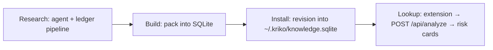

# Kriko — Usage Guide

Kriko is a local-first knowledge engine for manufactured products. It ships as a desktop app; the `cars` pack surfaces known reliability risks for used cars on Sahibinden.com through a Chrome extension. This guide covers running it and growing the knowledge base.



## Prerequisites

- **Nothing to install** for the desktop app: it carries its own Python. No Docker, no Postgres, no service — the store is `~/.kriko/knowledge.sqlite` and interface history is `~/.kriko/app.sqlite`.
- **Python 3.14+** only for checkout work (pipeline, CLI, tests).
- **MISTRAL_API_KEY** — LLM extraction + judge gates (`ministral-8b-latest`), pipeline only.
- **EXA_API_KEY** — web source discovery (Exa neural search), pipeline only.

## 1. Run it

**As a desktop app** — install `Kriko_<version>_amd64.deb`, `Kriko_<version>_amd64.AppImage`, `Kriko_<version>_aarch64.dmg`, or `Kriko_<version>_x64-setup.exe` from the `desktop` workflow's artifacts and launch it. It starts a sidecar on an OS-chosen port, waits for `/api/health`, and shuts it down on close. See `tauri/README.md`.

**From a checkout**, for development:

```bash
cd ~/kriko
.venv/bin/python -m uvicorn app.web.app:create_app --factory --port 8000
```

Check it's healthy:
```bash
curl http://127.0.0.1:8000/api/health
# → {"ok":true,"store":"~/.kriko/knowledge.sqlite","app_state":"~/.kriko/app.sqlite", ...}
```

Stop with Ctrl-C. No Docker: `test_the_app_stays_standalone` (in `src/app/pipeline/tests/test_repo_invariants.py`) fails if a Dockerfile, compose file, or Postgres driver returns — remove leftovers from that era.

## 2. Chrome Extension

**From the app.** Open **Check → Browser extension**, press *Add the extension* (staged under `~/.kriko/extension/` — browsers remember unpacked extensions by path, and updates replace the install directory). The page turns green when the extension first reaches the app (`Origin: chrome-extension://<id>`).

**From a checkout**, `extension/` works as well:

1. Open Chrome → `chrome://extensions` → enable **Developer mode**
2. Click **Load unpacked** → select `~/kriko/extension/`
3. Visit any Sahibinden.com listing for a supported car (Renault Megane IV)
4. The Kriko panel appears automatically after ~1.5 seconds

After an app update, *Add again* plus the browser's **Reload** is the repair. The extension talks to `127.0.0.1:8787` only — neither `python -m app.web` nor the desktop app takes a different port. If something else holds 8787, the desktop app logs to stderr and opens anyway; stop the other listener.

## 2b. Connect a coding agent to the installed app

*Coverage → Research* writes a **brief** (what to look for, what counts as evidence) and gathers nothing — research runs on a coding agent you already pay for. Open **System → Connect an agent**. Per harness (Claude Code, Claude Desktop, Cursor, VS Code): *Not connected* (no `kriko` server), *Connected* (names this window's store), *Points elsewhere* (names a different `knowledge.sqlite` — findings land where this window never reads), *Config unreadable* (won't parse; nothing written). *Connect* merges one key (re-serialised, never overwritten). *Verify* runs a real MCP `initialize` handshake plus tool listing — catches moved venvs and missing modules. Restart the harness afterwards.

### The research skill

Wiring MCP says which tools exist, not when they apply. That is a skill at `~/.claude/skills/kriko-research/SKILL.md`, assembled from installed packs (`research/principle.md` each; also `GET /api/agent-skill`). Only harnesses with a skill mechanism get one (today: Claude Code). The same binary serves both roles:

```bash
kriko-sidecar --mcp --store ~/.kriko/knowledge.sqlite   # installed
python -m app.sidecar --mcp                             # from a checkout
```

Findings enter as drafts through `app/findings.py` (refuses quotes not found in the cited document). After any `extension/` change, hit reload (↺) on Kriko at `chrome://extensions`.

## 2c. Operate from the terminal

Everything on the dashboard's Settings, Sites, Verify and Knowledge screens is also a `kriko` subcommand. `packs`, `install`, `uninstall`, `enable`, `build` and `lookup` need only the store; the rest attach to a running app or start an engine for one command. When neither works: one stderr line, non-zero exit.

```bash
kriko prefs                               # providers chosen; --model gpt-4o changes one
kriko costs                               # spend so far, and the next estimate
kriko sites                               # readability + requests
kriko sites register example.com          # teach a new site (starts a job)
kriko sites forget example.com            # drop a locally-learned adapter
kriko verify --list                       # past fact-checks, by verdict
kriko verify --pack org.kriko.cars        # re-read every claim's sources (starts a job)
kriko drafts                              # agent-written pack drafts
kriko drafts show acme-drill
kriko drafts amend acme-drill --note "the 18V line is missing"
kriko drafts install acme-drill
kriko operations                          # live feed, newest first
kriko bench --cases 5                     # measure the research planes
```

`--url http://127.0.0.1:PORT` (or `KRIKO_URL`, also read by `kriko tui`) targets a specific engine; `--no-start` fails rather than starting one.

## 3. Install knowledge pipeline tools (one-time)

```bash
cd ~/kriko
pip install -e ".[pipeline]"
```

Set keys in `deploy/.env` and export locally:
```bash
export MISTRAL_API_KEY=...
export EXA_API_KEY=...
```

## 4. Add a new car model (part-centric "Lego" pipeline)

Each **part revision** (K9K engine, EDC gearbox) is researched once; claims assemble per variant at sync time. Figures Wikipedia lacks (power, trim years) are derived or the row fails open — never hand-filled.

### 4.0 The default path — hand a model to the research agent ($0)

Tell the `kriko_research` agent the make and model:

```
use the kriko_research agent to onboard renault megane_4
```

It calls `onboard_model`, researches the TR trim lineup, submits it with `submit_trims` (writes variants + fitment YAML), researches each part, and runs one `run_pipeline_pass`. Cost: $0. Then run Step 5 to sync. **The server is the referee** — every prompt rule is enforced at the write path (a prompt-only rule is one a cheap model breaks and hears "OK" for):

- **No guessed figures** — unsourced power/displacement → `draft: true` (build skips it; coverage raises `draft_variant`).
- **No fabricated citations** — `submit_findings` rejects quotes absent from the submitted `document_text`.
- **No trim-shaped lineups** — a row is a *powertrain*; ids name the engine (`packs/cars/pipeline/catalog/identity.py`).
- **No description codes** — `"7-speed DSG"` refused; find the unit code (`dq381`) or drop the row.
- **No low-value rows** — warning lights always refused; ekspertiz-routine refused unless config-specific or citing an official recall; unanchored generic advice refused (`src/kriko/gates.py`, `packs/cars/vocabulary/gates.yaml`). Rejections name the fix; never retry one reworded.
- **Not currently enforced** — DTC litanies, rephrasing checks, per-part budgets, forum blocks (backlog; don't rely on them).

Repair identity damage already on disk ($0, idempotent; CI fails if fixables remain):

```bash
python -m packs.cars.pipeline.catalog.doctor          # report, all cars
python -m packs.cars.pipeline.catalog.doctor --fix    # repair
```

The CLI steps below are the manual fallback the agent path ultimately drives.

### 4.1 Manual/CLI path

**Step 1 — Catalog discovery + variants scaffold** (discovery also prints the Step 4 part codes):

```bash
python -m packs.cars.pipeline.catalog.discover --make renault --model megane_4 --write-variants
# → K9K (k9k, diesel), H5H (h5h, petrol), EDC (edc, transmission) …
```

Reads the model's Wikipedia infobox and writes a **draft** `packs/cars/data/variants/{make}_{model}.yaml` (power/trim years unset, never guessed; skipped if the file exists; `--dry-run` previews).

**Step 3 — Fitment YAML** (variant_id → part codes, extra keys preserved):

```bash
python -m packs.cars.pipeline.catalog.discover --make renault --model megane_4 --write-fitment
```

**Step 4 — Run the pipeline per part:**

```bash
# Acquire: Exa/YouTube discovery → fetch → ingest to the ledger (no LLM)
python -m app.pipeline.ledger_run acquire --part k9k --part-type engine --fuel diesel
python -m app.pipeline.ledger_run acquire --part edc --part-type transmission
# Ledger pipeline: extract → resolve → cluster → verdict → export
python -m app.pipeline.ledger_run all
# Re-run gates/promotion only — zero fetches, zero extraction tokens
python -m app.pipeline.process --part k9k --part-type engine --skip-extraction
```

> **Retired 2026-08-03 (B16 swap):** judge/promote is gone — promote steps raise, pointing at the ledger path. Serving goes through the ledger verdict only.

**Step 4b — Auto-remediation loop (backlog B19):** the coverage report triggers unattended gap-filling (schedule it; each pass appends one line to `logs/remediation.jsonl`; non-part findings reported, never silently fixed):

```bash
python -m app.pipeline.ledger_run remediate --dry-run   # what would it fix?
python -m app.pipeline.ledger_run remediate --max-usd 2.0
tail -f logs/remediation.jsonl
```

**Step 4c — Pipeline + cost panel** (spend, cost-to-finish, catalog + coverage, recent runs — check before paid runs, ~$0.10/new model):

```bash
python -m app.pipeline.panel
```

**Step 4d — kriko-hub dashboard (web edition):**

```bash
.venv/bin/python -m app.web          # then open http://127.0.0.1:8787
```

Tabs: **Models** (onboarding control room), **Claims** (inspector; votes land in `logs/claim_signals.jsonl`, never edit the catalog), Overview, Parts, Sources, Run (extract capped, import verdicts, $0 pass, remediate, export, stop), Ledger, Coverage. Polls every second; `127.0.0.1`-only. `GET /api/state` snapshots without the page. Models tab: **Make → Model → Generation → Run**. Makes/models come from the installed pack. Generation is researched first (**Find generations →**, via `submit_generations`; uncited lineups rejected) into `packs/cars/pipeline/catalog/generations/{make}_{model}.yaml`. Onboarding arms only on a real model key (`POST /api/onboard` 400s otherwise, blocking slug-shaped keys like `volkswagen_vw_cc_1_4_tsi`); phase 1 also resolves display slugs (`vw_cc_1_4_tsi` → `canonical_model: passat_cc`, alias kept). Steps 4–5 preview the exact command via `POST /api/agent-preview`:

```
$ /home/beraat/.nvm/.../opencode run --agent kriko_research \
    -m opencode-go/kimi-k3 onboard audi q2_1
```

Models come from the harness (`opencode models`): **flat rate** (~26 subscription models, the $0 plane) vs **⚠ pay-per-token** (~380, unlocked by `DEEPSEEK_API_KEY`, `MISTRAL_API_KEY`, `OPENROUTER_API_KEY` in `.env`). Runs validate make/model (`[a-z0-9_]{1,40}` / `[A-Za-z0-9_./:-]{1,80}`, argv never shell), use fixed templates, and share one run slot with pipeline runs.

> The opencode agent needs `mode: all` — `mode: subagent` silently falls back to `build`, which has permissions the researcher is denied.

**Step 4e — LLM-driven control (MCP server + research agent):** pipeline-side view of the §2b server. Tools granted are one tuple, `render.MCP_TOOLS` in `packs/cars/pipeline/agent/render.py` (a test fails if any is not callable on `app/mcp_server.py`). Two shape the method: `research_brief` (the pack's `research/principle.md` + `research/templates.yaml`) and `submit_findings` (the only write surface; quotes grounded via `app/findings.py`).

```bash
# opencode — committed: opencode.json -> mcp.kriko
opencode            # then: use the kriko_research agent
# Claude Code — committed: .mcp.json (approve it on first run)
claude              # then: use the kriko_research agent
```

Installed app: use **System → Connect an agent** (§2b). Codex — add to `~/.codex/config.toml`:

```toml
[mcp_servers.kriko]
command = "/home/beraat/kriko/.venv/bin/python"
args = ["-m", "app.mcp_server"]
env = { PYTHONPATH = "/home/beraat/kriko" }
```

Cline — add to `cline_mcp_settings.json`:

```json
{
  "mcpServers": {
    "kriko": {
      "command": "/home/beraat/kriko/.venv/bin/python",
      "args": ["-m", "app.mcp_server"],
      "env": { "PYTHONPATH": "/home/beraat/kriko" }
    }
  }
}
```

One prompt source: `packs/cars/pipeline/agent/kriko_research.md`; harness files (`.opencode/agents/`, `.claude/agents/`) are generated (`kriko_`-prefixed in opencode, `mcp__kriko__`-prefixed in Claude Code):

```bash
python -m packs.cars.pipeline.agent.render          # rewrite the harness files
python -m packs.cars.pipeline.agent.render --check  # CI: are they current?
```

**Step 5 — Build and install the pack** (no separate sync step):

```bash
python -m app.cli build packs/cars
python -m app.cli packs
```

## 5. Add page sources manually

Append to `packs/cars/pipeline/sources/curated/{make}_{model}_{gen}.yaml`:

```yaml
- type: page
  url: "https://www.enginefinders.co.uk/renault-1-5-dci-k9k-engine-problems"
  site_or_channel: "enginefinders.co.uk"
  notes: "K9K injector fouling — specialist remanufacturer"
  status: pending
  added_at: "2026-06-26"
  processed_at: null
```

Sources weigh equally; the LLM gates are the sole quality filter. ≥2 independent gated sources auto-verify; one lands in `review` for human confirm.

## 6. Process pending sources

```bash
# Preview (no writes)
python -m app.pipeline.process renault megane 4 --dry-run
# Full run
python -m app.pipeline.process renault megane 4
# Re-run gates/promotion on cached candidates — zero fetches, zero extraction LLM calls
python -m app.pipeline.process renault megane 4 --skip-extraction
```

Runs fetch → LLM extract → dedup → gate → score → claims YAML → sync DB. Candidates cache to `packs/cars/pipeline/cache/{make}_{model}_{gen}_candidates.json`; `--skip-extraction` replays it. High-severity claims always need manual review. Rebuild the pack afterwards (`python -m app.cli build packs/cars`) — processing writes YAML; nothing serves until installed.

### What buyers see (serving model)

| Status | Shown as | Meaning |
|--------|----------|---------|
| `verified` | **Confirmed** (green) | ≥2 independent sources, or hand-vetted seed |
| `review`   | **Reported · N source(s)** (amber) | cleared gates but thin/high-severity |
| `held`     | **Reported · N source(s)** (amber) | genuine but zero sources passed gates |
| `rejected` | not served | tombstoned junk |
| `draft`    | not served | not pipeline output |

Only claims with **≥1 grounded source** are served. `/api/analyze` counts "confirmed issues" and "unverified reports" separately — single-source reports are surfaced labelled, never as known issues; the ≥2-source bar is not lowered.

### Promoting & rejecting claims — retired (automation principle, 2026-08-03)

Statuses are pipeline-owned (ledger verdict stage + product-value gate) — hand-editing `status`/`promoted_by` is banned. Fuel grounding: fuel-specific claims (K9K/dCi → diesel, TCe/H5x → petrol, AdBlue → diesel) ground to same-fuel variants only; fuel-agnostic claims (A/C, electrical) span all variants. A `held` claim does not auto-upgrade on later corroboration — cross-run accumulation is out of scope.

## 7. Check the store

```bash
# All claims currently served
sqlite3 ~/.kriko/knowledge.sqlite \
  "SELECT c.claim_id, t.title, c.severity
     FROM claims c JOIN claim_text t USING (claim_id, pack_id)
    WHERE t.lang = 'en' LIMIT 20;"
# What is installed, and how big
sqlite3 ~/.kriko/knowledge.sqlite \
  "SELECT pack_id, version, built_at FROM packs;"
# Subjects a pack knows about
sqlite3 ~/.kriko/knowledge.sqlite \
  "SELECT subject_id, kind FROM subjects LIMIT 20;"
```

`/api/health` reports both file paths; the **Store** screen shows the counts. Full payloads (what a buyer saw, and why) are in `logs/analyses.jsonl`:

```bash
# Pipeline state, spend, and recent activity
python -m app.pipeline.panel
```

`GET /debug/analyses?limit=20&model=golf` mirrors the JSONL over HTTP but is **off (404) by default** — set `ENABLE_DEBUG_ENDPOINT=true` in `deploy/.env` only temporarily.

## 8. Eval the LLM gates (optional)

```bash
DEEPSEEK_API_KEY=... python -m packs.cars.pipeline.ledger.eval_verdict
```

Checks verdict quality over `packs/cars/pipeline/gold/gold.yaml`; extend `gold.yaml` as you run the pipeline.
