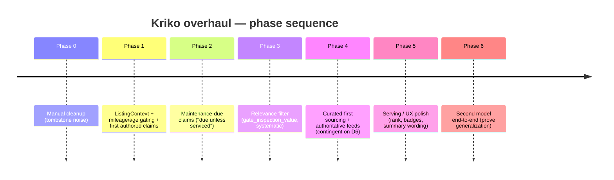

> TL;DR (archived 2026-09-25): Umbrella roadmap turning Kriko from "extracts whatever a blog
mentioned" into config- and mileage-specific buyer risk. Two beliefs (curated domain knowledge;
relevance as a function of the listing), schema v2 (`kind`/`applies_when`/`maintenance`/`value_tier`),
phases 0–6, open decisions D1–D6 (D2 resolved), non-goals. Phase mechanics live in
`docs/historical/claim_relevance_plan.md`. Timeline of the phase sequence below.

# Kriko — System Overhaul Plan

The umbrella roadmap for turning Kriko from "extracts whatever a blog mentioned" into a tool
that surfaces **the config- and mileage-specific risks a buyer can't cheaply get from the
standard pre-purchase inspection** (the principle — see `CLAUDE.md`).

Strategic map. Phase mechanics for claim relevance live in
`docs/historical/claim_relevance_plan.md`; this doc adds sourcing, serving, scaling.



---

## 0. The core reframing

1. **Valuable claims are curated domain knowledge, not scraped text** ("cam belt due by X km", "EDC clutch wears past Y km"). The blog pipeline is a *lead generator*, not the source of truth.
2. **Relevance is a function of the listing** (mileage, age, ad text). The backend receives all of it (`mileage_km`, `annual_km`, `description`, `equipment`, `damage_info`) and throws it away.

---

## 1. Current state (honest snapshot)

**Done:** labelled `Confirmed`/`Reported` strengths (summary never asserts unverified reports; `has_source` filters noise); fuel-aware grounding; `sync.py` prunes removed YAML claims (was upsert-only); pipeline unblocked (zstd fetch, truncated-JSON salvage, gates judge source text); manual cleanup tombstoned brake-fluid/ESP/injector-tuning noise.

**Not yet true:** nothing mileage/age aware; no maintenance-due concept; relevance not systematic (noise returns next run); few hand-authored seeds; sourcing leans on ToS-restricted blogs, no recall/TSB feed.

---

## 2. Target system ("done" looks like)

Panel ranked for *this* car at *this* mileage: **Confirmed known issues** (engine/gearbox) → **Due maintenance** ("unless the ad/service record proves otherwise") → nothing the ekspertiz routinely catches. Powered by a context-aware resolver (`ListingContext`), claim schema v2, and a curated-first claim set (blog pipeline demoted to leads).

---

## 3. The claim model (schema v2) — the spine of the overhaul

Backward-compatible; all new fields optional (omitted = today's behaviour):

```yaml
id, claim_key, title, domain, severity, confidence, rationale, inspection_advice,
status, promoted_by, variants[], sources[]   # identity / content (existing)
kind: known_issue | maintenance | recall      # default known_issue
applies_when:                                 # Phase 1 — flat, nullable columns
  min_mileage_km: 120000
  max_mileage_km: null
  min_age_years: 6
maintenance:                                  # Phase 2 — JSON column
  interval_km: 90000
  interval_years: 6
  evidence_keywords: ["… değiş*", "… replaced"] # change-specific, never bare part name
value_tier: core | routine_inspection | generic_warning   # Phase 3 — relevance
```

DB: nullable columns for `kind`, `applies_when.*`, `value_tier`; JSON column for `maintenance`. `sync.py` loads, `models.py` declares, resolver consumes.

---

## 4. Roadmap (phases — one at a time)

### Phase 0 — Manual cleanup ✅ done
Tombstoned inspection-covered / generic-warning noise.

### Phase 1 — Context plumbing + mileage/age gating + first authored claims
`ListingContext` from `ad_metadata` into `resolve_claims`; `applies_when` gating, fail-open on missing data; ~4 real mileage-tagged Megane-4 claims (e.g. EDC wear `min_mileage_km: 120000`; AdBlue/EGR/DPF on diesels).

### Phase 2 — Maintenance-due claims
`kind: maintenance`, interval logic, ad-evidence **downranks (never hides)**, "Due unless serviced" label, per-engine belt-vs-chain grounding.

### Phase 3 — Relevance filter (systematic)
Offline `gate_inspection_value` + extended `gate_generic` → `value_tier`; noise dropped at source. Re-grade cache with `--skip-extraction`.

### Phase 4 — Sourcing overhaul (curated-first + authoritative feeds)
- Hand-authoring as a documented per-model workflow (belt/chain, clutch type, emissions hardware, weak points, mileage thresholds).
- ToS-clean authoritative tier: EU Safety Gate/RAPEX, KBA, NHTSA recalls/TSBs as `kind: recall`.
- Blog pipeline → **lead generator**. **Contingent on D6** (pulls against the `Reported` tier — resolve first).

### Phase 5 — Serving / UX polish
Rank Confirmed core → Due → Reported with mileage/age as the "why"; "Due unless serviced" badge; summary only mentions non-empty buckets; distinguish MATCHED_NO_DATA vs 0 risks.

### Phase 6 — Scale to new models
Second model end-to-end with schema v2 + authoring checklist.

---

## 5. Cross-cutting / deferred (not blocking the phases)

- Cross-run corroboration accumulation (held claim upgrades on later independent sources; runs independent today).
- Merge loosening (turbo≈turbocharger) — deferred; feeds the Confirmed badge now, precision matters.
- Date-aware ad parsing ("belt changed in last N years") — free text rarely dates work; evidence downranks only.
- Per-variant power/year precision beyond fuel + mileage/age.

---

## 6. Open decisions

- **D1** Maintenance label: distinct "Due unless serviced" badge (recommended) vs folded into Confirmed.
- **D2** *Resolved:* ad mentions service → downrank, never hide.
- **D3** Phase 3 mechanism: LLM gate vs curated stoplist vs both.
- **D4** Phase order (default 1→2→3, then 4–6).
- **D5** Phase 4 registries first; manual import vs scripted.
- **D6** *(big fork)* Does **Reported** survive curated-first? Keep-labelled (Reported only for Phase-3-passing claims) vs Confirmed + Due only (thinner panel). Phase 4 contingent on this.

---

## 7. Non-goals

- Real-time per-request LLM on the serving path (stays DB lookup).
- Reliability / pricing advice — flags risks, says "get an inspection", never good/bad verdicts.
- Lowering the verify bar to manufacture Confirmed claims.
