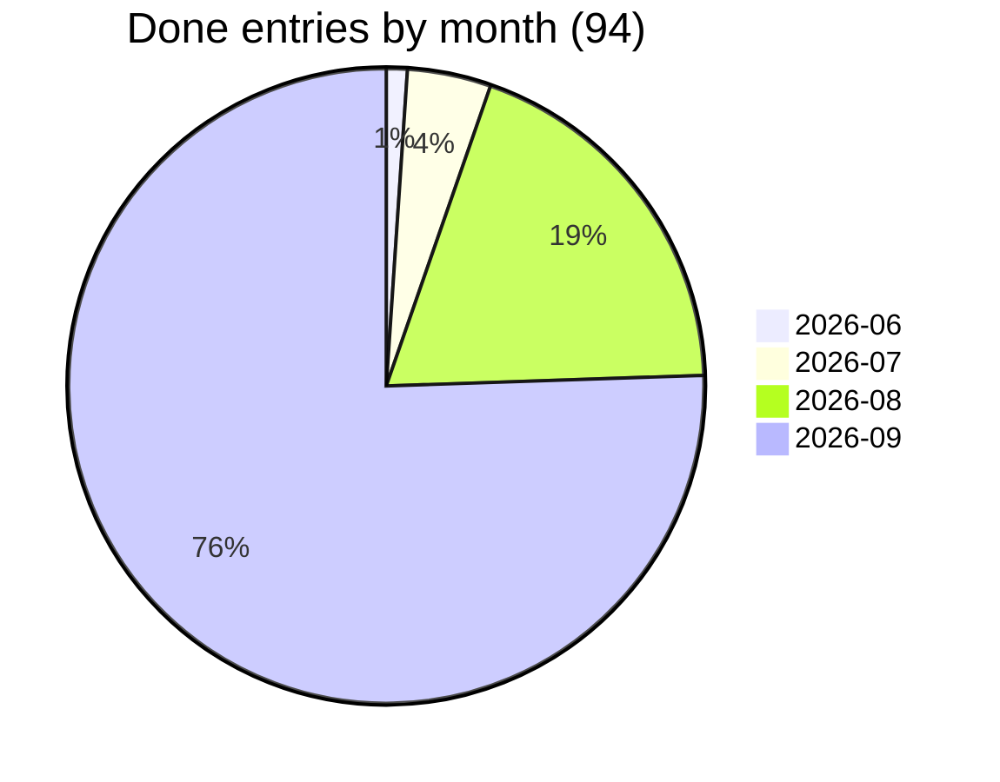

# Kriko — Done

Completed work, newest first. Entries move here from `backlog.md` with date + commit.
Seeded 2026-07-16 from git history; older history lives in `git log` and
`docs/historical/pipeline_postmortem.md`.

---




| Month | Entries | Versions | B-IDs |
|---|---|---|---|
| 2026-06 | 1 | - | 1 |
| 2026-07 | 4 | - | 10 |
| 2026-08 | 18 | - | 26 |
| 2026-09 | 71 | 0.10.0, 3.1, 1.4, 2.10, 3.2, 3.3, 3.4, 2.5 | 99 |

_Full verbose logs live in git history (`git show 27799af:done.md`). Entries compressed 2026-09-25: problem, decision/measurement._


### 2026-09-24 — the implementing and testing doctrine (`b4b37e0`, reviewed and corrected in the next commit)
*"Many implementations haven't worked the first try … let's determine the implementing and testing doctrine.
I mean it, we lack that."*
`docs/DOCTRINE.md`, linked first in `CLAUDE.md` and from `CONTRIBUTING.md`.
It fixes three answers that had none: what was asked (a backlog entry quoting the reader, with **Where** / **Done when** / **Not this**, read back before code), what counts as done (the end result observed, on the screen named, on `main`, and on Windows when it differs there), and who checks (proof in the PR, and a second agent reviewing against the request).
Also: which kind of test proves what, reproduce-before-fix, ask tools for their facts, one area per agent and a daily merge.
The PR template now asks for the quoted request, what was observed, a screenshot and the review verdict.
`test_every_new_backlog_item_says_when_it_is_done` fails the suite on an item from B141 on without **Done when** (shown red, then green).
B141 (the research-limit sliders, which had never been written down), B142 (a self-hosted Windows runner) and B143 (journey checks) are the first items in the new shape.

### 2026-09-23 — the Agents screen, pressed in a browser
*"Set a runner and check each function/button is working as intended and is fast.
Writing LLM names by ourselves instead of pulling from the harnesses."*
**A runner.** `tools/walk.sh` + `tools/walk/walk.mjs`: every screen the rail lists, every button on it, in a real Chromium against the real server on a throwaway home, timed.
Its runs over the 14 screens measured the slowness below and found the dead copy buttons.
**LLM names come from the CLIs.** Claude Code's list was a tuple in `harness.py` — `opus, sonnet, haiku` — while the installed CLI names `fable, opus, sonnet` and `claude-fable-5` in its own `--model` help.
The paid plane got the same treatment: `modelcatalogue. offered` always took a `discovered` mapping that nothing passed, so `app/modeldiscovery.py` asks each keyed provider's `GET /models` (in the background, cached an hour; a settings page never waits on it).
**Fast.** `/api/prefs` and `/api/research-planes` ran every CLI's `models` serially on every read *and every save*: with two installed CLIs, choosing a dropdown value took 6 s.
Now cached per binary (path + mtime, ten minutes), asked concurrently, warmed at startup, and shared by concurrent callers: 8 ms after warm-up.
**Re-ask the CLIs** forces a fresh ask.

### 2026-09-23 — live interactions: a run the reader can answer, and a panel that shows it working
**A reply box on a running job, and a reply that reaches the agent.** `POST /api/jobs/{id}/say` writes a `job_messages` row; the handler reads it between steps (`Progress.replies`).
The first cut stopped there, and a line written to a one-shot `claude -p` goes into a stdin nothing reads.
So a CLI that declares `--input-format` now runs conversationally: brief as the first stream-json message, each reply as the next.
A reply typed mid-turn is queued behind it, the way Claude Code does it.
A turn that *ends* on a question holds the pipe open for up to `ANSWER_WAIT_SECONDS`, and the run is never kept past its own timeout.
A child that is silent for `CONVERSATION_START_SECONDS` is re-run the ordinary way (B125).
Proven live on Windows through the `.cmd` shim: a reply sent during turn one came back as turn two in 7.7s.
Other harnesses (vibe, gemini, opencode, agy) still take a reply only as a note: none of them declares a streaming input.
**The panel's research card follows a run live** (stage line and feed aside, `hover_lite_live.test.js`).

### 2026-09-21 — the mark at 1024px, and three gates that were green on nothing
**The icon was pixelated because it was a 16x16 drawing scaled up.** The mark is a pixel grid, and a pixel grid is right at 16, 32 and 48 — nearest-neighbour integer scale, crisp cells.
Tauri derives every Windows icon from `icons/icon.png`, and that file was the same grid blown up, so the installer, the taskbar and the app rail all showed a blurred letter.
There are now two sources: `logo-mark.svg` (16x16, the tile) and `logo-mark-large.svg` (64-unit viewBox, `rect` and `polygon` only), rasterised to a 1024px master by a 4x supersampled scanline filler in `packaging/render_icon.py`.
`docs/BRAND.md` says which size comes from which source.
**`path.read_text()` means cp1252 on a Turkish Windows box.** Not a style point — a crash.
`k9k.yaml` holds a curly quote in a claim's prose, and sixty tests died at once with `UnicodeDecodeError: charmap codec`.
Every gate we had missed it because CI is Linux, where the guess happens to be UTF-8, so the class was invisible on exactly the platform the reader runs.
111 call sites took an explicit `encoding="utf-8"` (48 reads, 63 writes — writing is the same bug pointed the other way: a pack authored here would ship mojibake with nothing raising), and `test_no_file_is_read_in_the_platform_s_default_encoding` walks the tree's AST so it cannot come back.
**`write_text` translates " " to " " on Windows**, so both brand render scripts rewrote every line of files whose content had not changed — the third
sighting of the defect behind `aa795e6` and `bea9e88`. `newline=""` on all

### 2026-09-19 — per-harness LLMs, benchmark buttons, provider self-test, site activation
Four reader items, each finished to the mechanism:
**Models inside the harnesses.** Not one global field: claude offers its documented aliases, agy lists what `agy models` actually prints on this machine, opencode takes provider/name per its documented `--model`.
Stored per harness, overridden per run, CLI default when empty — and three namespaces means no cross-harness fallback, ever.
The run card, the brief and Settings all offer the same dropdown; a harness with no verified switch says so instead of pretending.
**Benchmark as buttons.** Planes, protocols, searches and LLMs are multi-chips, scale is three presets, everything else steppers and dropdowns; the only typing left is the saved grid's name.
**Providers prove themselves.** Settings gained a Test button per provider: a cheap live call, server-side so keys never leave, counted in the operations feed with tokens and priced USD, every error path distinct.
The frozen `kriko.exe` import error was traced to a stale/foreign install (this tree's wheel is sound) and the frozen spec now declares its console imports with a test holding it.
**Site activation on screen.** The extension already reconciled dynamic sites and reported activation; the app stored it; nobody showed it.
The Sites screen now renders the verdict per site, including the Grant step only the extension can perform. arabam.com and mobile.de were probed and both refuse automation (403/empty fetch), so no adapter ships — authoring stays with the reader's browser via the existing agent path.

### 2026-09-18 — the 0.10.0 completion audit (agent options, Cancel, panel research, styling)
The 0.10.0 merge claimed 20 of 23 items.
Three of the twenty were preferences without execution, buttons without wiring, and search without research.
This pass closed the gap between the claim and the tree, on the reader's own machine, with the reader's own CLIs.
**Agent options, made real.** Per-role models were saved by the UI and ignored by execution (`prefs.for_role` had no production caller).
**Antigravity CLI verified, Vibe/Gemini gated honestly.** `agy` was driven for real: prompt-as-`-p`-value (piped stdin is ignored there, an empty `-p` eats the next flag), `stream-json` events parsed into findings/usage/narration, `--model` per-run selection, a disposable working directory, and the key finding — headless runs auto-deny anything needing approval, so a fetch denial fails the run with the allow-rule fix rather than reporting "researched, found nothing".
**Cancel that cancels.** Queued start/cancel lost a race and started cancelled work; the paid plane and benchmark cases never saw the flag; the benchmark sandbox progress adapter could not run a case at all.
All three fixed, with "Stopping…" states and retained-partial semantics stated honestly.
Research runs the consent form first (cost shown before the press), works for known subjects and for unknown products via an explicit product-only draft that is never auto-installed, and Cancel reads "Cancelled", not "Research failed".
Two whole-file line-ending rewrites (CRLF) reverted to LF.

### 2026-09-17 — the 0.10.0 work order (§3.1, and §1.4/§2.10's missing half)
**§3.1 — the extension rebuilt, function and UI together.** Four commits, and the first three were subtraction and mechanism (see their own messages).
*The four match states are drawable now.* `/api/analyze` has returned `verdict`, `score`, `considered` and `next_step` since §1.1 landed and the panel rendered none of them — claims or a blank, for four different situations.
A recognised page still gets no banner, because one on every successful answer is one nobody reads by the third.
The other three get a card that says which one happened, what was weighed, and what to do:
**Every sentence is the engine's.** `next_step.say` is rendered verbatim and `action` is a closed vocabulary the panel turns into a button.
*§2.10's other half.* Search is in the panel: a field in the header, results from `GET /api/search`, and **every row carries its identity**.
Pressing one opens the app at `#/subject/<id>`, a route the app gained for this: it opens that row rather than filtering to it, because "this one among the others" is what somebody searching a catalogue came for.
*§1.4's other half.* Pressing Analyze on a site nothing reads used to do nothing at all — deliberately, and right for the automatic run at page load where nobody asked anything.
**And the gate stopped depending on the developer's machine.** Three `test_cli.py` cases assert what the CLI does with no engine running, and `attach()` scans the one fixed port the extension is allowed to assume — so they were asking whatever was serving on 8787.

### 2026-09-16 — the 0.10.0 work order (§3.2, §3.3, §3.4)
**§3.4 — the logo.** The mark is a slab K on the 16-cell grid `packaging/render_icon.py` already rasterised, and its upper arm is the whole accent rather than a joint: an earlier draft put the amber on one terminal block and below about 48px it read as a detached square, because a corner touch is not a join.
Taking the arm gives the letter a stroke that rises out of it the way a step chart does, which is the product in a glyph.
*The extension's four toolbar PNGs are now rendered rather than hand-drawn.* They were a rasterised glyph beside a grid of rects — two people drawing one letter — and `test_the_app_and_the_extension_show_the_same_letter` existed to catch them diverging.
*The lockup is generated too* (`packaging/render_lockup.py`), and it reads the mark out of `logo-mark.svg` rather than repeating its coordinates — a copy would be the same two-drawings failure one file along.
`logo-wordmark.svg` and `logo-mark-textbox.svg` are gone — both still carried the "Lemonaide" identity this product stopped being in 0.3.1, and nothing referenced either.
*And a defect worth the entry on its own.* The first mark shipped with `--n-2` inside its XML comment.
Two hyphens cannot appear in an XML comment, so the file was invalid, every browser drew a broken-image glyph in the rail, and all eleven brand tests passed — `render_icon.py` reads the file with a regular expression, not a parser.
`test_every_brand_asset _actually_parses` closes it, verified by putting the bug back; it is the same lesson as `test_the_shell_is_valid_rust`, arrived at the same way.
**§3.2 — the rail.** `sites` and `bench` had no glyph, and `NavIcon.svelte` renders nothing for an unknown name by design, so two rows had been shipping with an empty icon column and no test could see it.

### 2026-09-16 — the 0.10.0 work order (§2.5, §2.6, §2.10 engine, §3.5 part)
**§2.5 — live runs.** Most of it existed: four named stages with `waiting` states, an event stream, per-stage counts, rows before stream.
A run's terminal state was a word — "failed" tells somebody watching a four-minute run that it is over and nothing else — so each state now carries what it means and what to do next, and an unknown state reads as *not* finished because a view that calls a running thing done stops watching it.
And a run that put questions to the reader flags them on the job row, where the questions already are.
`STAGES` is a closed vocabulary and `open_stage` raises on anything outside it, so every run reaching the loop would have died — and no test saw it, because the loop only fires when a finding is refused for a fixable field *and* the plane has a `repair` method.
Verified by putting the bug back.
**§2.6 — benchmark scoping.** Models were not an axis at all, which is the one §2.6 names first;
`POST /bench/estimate` says what a grid would run and roughly cost — a separate endpoint, so asking what something costs can never start it — refusing to guess where nothing has been measured and pricing only the paid half.
**§2.10 — product search, engine half.** `kriko/lookup/find.py` searches labels, aliases *and* identity values, where `/subjects?q=` searched labels only.
**§3.5 — part.** `docs/STYLE.md` is the house style as rules, with the three things it does not apply to carved out.
Commits `e63db72`, `31c122e`, `f81d41d`, `104601e`.

### 2026-09-16 — the 0.10.0 work order, P1 so far (§2.1–§2.4, §2.9)
**§2.1 — the agent asks, once, and does not wait.** `app/disambiguate.py` runs one short call before the expensive research: is this name one product or several?
The hard part was not asking but asking without breaking the automation principle, so nothing waits — every question carries a default and its reasoning, the run proceeds immediately, and the reader gets a statement of what was assumed rather than a gate.
"Built for maker Acme, market TR, power mains — of which market was assumed, not confirmed." An assumed scope that is invisible was the actual bug.
**§2.2 — a model you can choose, priced from a file you can edit.** `app/models.toml` is copied to `~/.kriko` once and never rewritten, so a corrected price survives updates.
Discovery cannot replace it — `GET /v1/models` returns ids and nothing else — so the two merge, and an unlisted model stays usable while reporting no price.
Anthropic needed its own adapter: there is no compatibility endpoint, so `llm.py` could not reach it by configuration.
**§2.3 — one dial.** Quick / Standard / Deep / Custom, each a bundle of the knobs that already existed and an estimate from this installation's own measured runs.
The preset's ceiling applies only when a scale is *named*: the existing budget test caught the default silently rising from $0.20 to $1.00 for every caller that never asked for a dial, the agenda included.
**§2.4 — spend as it happens.** `app/meter.py` tallies per stage and per model while the run goes, sorted by cost so "what is expensive here" is the first row.
Commits `fd14366`, `a4b4882`, `cfcd182`, `7fae2bf`, `0f23aca`.

### 2026-09-16 — the 0.10.0 reader work order, P0 (§1.1–§1.4, §1.6, §1.7)
These are the launch blockers; §1.5 and everything in P1 and P2 are still open, tracked in `backlog.md` under *The 0.10.0 work order*.
**§1.1 — "the pack exists but the extension can't see it."** `_resolve_in_pack` intersected identity attributes exactly, so one value differing by a word emptied the candidate set, and an empty set is indistinguishable from never having heard of the product.
**§1.2 — cancel.** `except Cancelled` wrote CANCELLED with no result, so everything a run had gathered and paid for died with the stack frame.
`Progress.partial` checkpoints as work happens and a cancelled run keeps it.
A second press could write `cancelling` over `cancelled`; the guard is in the WHERE clause now.
**§1.3 — "rationale is 0 chars".** Two names for one concept, bridged nowhere: the gate measured `rationale`, the store wrote `body`, and the paid plane only ever filled the second.
So the gate refused everything that plane produced — while an agent that filled `rationale` passed the gate and had its explanation dropped on the way into the store, landing a claim with a title and nothing under it.
**§1.4 — site registration.** Three defects.
**§1.6 — `ModuleNotFoundError: No module named 'kriko'`.** The tree's packaging is sound: a clean-environment wheel install imports and runs here, so the fault is in the reader's artifact or environment and `docs/INSTALL_WINDOWS.md` has the three commands that tell those apart.
Commits `bb67237`, `4892fd3`, `7323e1d`, `64b1a91`, `08820e5`, `52d9354`,
`052c471`.

### 2026-09-16 — the three that were parked, and a decision reversed (B136, B137, B138)
The overhaul's own report left three things open as "real scope, not a blind change".
Two of them turned out to be cheaper than that once measured rather than estimated, which is its own lesson about parking work on an estimate.
**`cargo` was available all along.** B137 had been filed as needing a Windows host, and `cargo check` never reaches the link phase — so the gate now compiles the shell natively *and* cross-compiled for Windows, sub-second warm.
Proven by injecting a type error (caught, `error[E0308]`) and a `Cargo.toml` feature the crate does not have (refused before anything compiled) — the exact class the per-file `rustc` gate could never see.
It skips with a printed remedy where a toolchain is missing, because a gate that cannot run is worse than none.
**trafilatura was already a dependency.** B136 had been filed as needing new page-metadata extraction; the library that does it was installed, and the research plane an agent drives had the date available for about one function call before throwing it away with the rest of the markup.
Both doors now read it, bounded, and neither substitutes the fetch time — which is the whole reason the column is worth having.
**The linter's first run paid for itself.** `.lstrip("www.")` strips a set of characters, not a prefix, so `webflow.io` became `ebflow.io` in the domain comparison that decides whether two sources are independent — a corroboration bug, found by a tool, in the same week another corroboration bug was found by hand.
Also a stale function reference that would have been a runtime `ImportError`, invisible to pytest because that call is monkeypatched in its own test.

### 2026-09-16 — the overhaul: seven planes, and the silences between them (0.10.0)
The reader's brief was "the bugs are everywhere, features aren't working well; agent ops do something but web extension cannot match them. everything seems fucked." Seven planes were audited at once, each owning a disjoint slice of the tree.
What follows is what was actually wrong, because almost none of it was a crash: this was a release held together by things that failed without saying so.
**An agent-authored pack could never be read from a listing page (the reader's first complaint, and the worst defect found).** The draft contract accepted a site adapter only as `.yaml`; the pack builder read `adapters/*.json` and nothing else.
The first fix put the tree-kill after the drain-thread join and cancel still waited out the full timeout -- closing a pipe takes the same lock the blocked reader holds, so the teardown was waiting on the very process it was abandoning.
**`claude.cmd` could never have been spawned.** `CreateProcess` needs a PE image, and npm's global install produces exactly that shim -- so the code that carefully *finds* it on Windows handed it to a call that cannot start it.
A subject the line-up never named is now quarantined with its reason recorded -- neither shipped nor silently dropped, which is how a watch got into a headphones pack.
**Nothing had ever read `refuted_by`.** The verdict model has been naming refuted sources by index all along, exactly as its prompt asked; every source shipped as supporting, so the sharpest signal in the health view had zero live hits.
At narrow widths the panel was a fixed overlay by design, which is the one thing it may not be.
**The benchmark declared three kinds of case and ran one.** Bulk and validation are real now, the instruction slot and the search provider are swept axes rather than constants, and the chooser reads Wilson intervals instead of a fixed margin -- two runs may answer "not yet measured" rather than pick.
Refs: B40, B45, B46, B47, B49, B50, B51, B114, B116, B118, B126, B131, B132.

### 2026-09-15 — the skill on disk follows the code, and the agent choice is where agents are (B135)
Two corrections, both of which the reader was right about from where they were standing.
**"You did not make any changes to skill text."** The text changed; their copy did not.
The skill is *generated* — from the installed packs and from this app's code — and it was written exactly once, when Connect was pressed.
So every overhaul since, every new tool, and every pack update reached the app and never reached the agent.
From the machine's side nothing had changed, and nothing ever would have.
`agentskill.stamped()` now writes a content digest into the file;
`agentconfig.skill_status` compares what is on disk with what this build would write;
`/api/agent-targets` reports it per harness; and **startup rewrites every wired copy that has fallen behind**.
**"No preferred agent thingy."** It existed, in Settings — which is not where anyone goes to think about agents.

### 2026-09-15 — the bulk pass: sites, choices, costs, ground truth (B115/B117/B118/B126/B132/B133)
Six rows, built rather than filed.
**Sites — "I cannot open the web extension on the pages that aren't registered".** The panel was never missing; the *site* was.
An adapter says how to read one website, packs ship them, and the only way to add one was to author a whole pack — a disproportionate answer to "this listing site also sells cars".
`app/sites.py` merges a **local adapter** behind the engine's own lookup: kept in `app.sqlite` by the two-file rule (a site this reader taught their copy about is not pack content, must not enter a `content_digest`, and must not travel to anyone else's install as though an author had reviewed it), and a pack's adapter for the same host always wins.
`/api/adapters` carries learned sites too, which is what makes the browser actually inject on them: the seam that "it only opens on sahibinden" was describing.
**Three choices that were facts (B117).** The harness plane took the first CLI it found, the paid plane took whatever `LLM_MODEL` said, and search meant Exa because Exa was the only provider with code.
`app/prefs.py` makes each a decision, defaulting to exactly the old behaviour.
**Tavily** is wired beside Exa, and `keys.ready()` now accepts *either* search key — requiring both would have made adding a provider a way to break an installation that was working.
**What it costs (B118).** Measured spend by plane, and an estimate from this installation's own runs — not a vendor price list, which goes stale and cannot know the reader's model.
Refs: B126, B133.

### 2026-09-15 — 0.9.0: the authoring loop gets its missing verbs (B127-B130)
*"Agents are avoiding some work."* They were, and the instructions told them to.
Decision 4 of the authoring brief opened with **"Two or three real subjects"** — so a category with twenty products came back with three, and nothing anywhere recorded the other seventeen.
That is not a model being lazy; it is a specification being obeyed.
**The line-up is now data (B130).** The brief asks for `lineup` — every product in the category the agent can name, covered or not — *before* any claim is written, because naming is cheap and research is what is expensive.
Kriko subtracts the subjects it actually wrote and writes the remainder into the draft as `research/coverage.yaml`.
Two more things the same run got wrong are enforced rather than requested: a subject must be an instance of the category (the reader's headphones pack contained a watch; neighbours go under `coverage.out_of_scope`), and the pack's `name` is a **name** — six words at most, no "common problems".
"Samsung Galaxy Buds and wireless headphones common problems" is a sentence about a pack, and in a list of packs it is the row nobody can scan.
**Amending, which is the verb that was missing (B127).** *"It includes 19 products and lacks the 20th.
**Verify the knowledge here (B128).** Half of it existed: one claim, on a press.
Refs: B129.

### 2026-09-15 — 0.8.7: the installer may not be named for a version it does not contain (B134)
From the reader's own build log:
Compiling kriko v0.8.0 (C:\Users\beraat\Desktop\kriko\tauri\src-tauri) ...
Running makensis to produce ...\Kriko_0.8.5_x64-setup.exe
`-Version` is stamped into `tauri.conf.json`, and that is what names the bundle.
Everything else — the crate, pyproject, the frozen sidecar's own metadata — comes from the tree.
So a stamp on a checkout that had not been pulled produced an installer *called* 0.8.5 containing 0.8.0 of everything.
That is the whole explanation for a session's worth of confusing reports: the terminal fixes were missing because they were not in it, and "you forgot to update the version number" was the app honestly reporting the version it was built from.
The label was the only thing that moved.
The script now refuses the mismatch before compiling anything and names the two moves that resolve it — `git pull`, or `tools/bump.py <version>` — because which one is right depends on whether the tree or the intention is behind, and the build cannot know.

### 2026-09-15 — 0.8.6: the prompt stops going through a pipe (B125)
The reader's run failed with
Warning: no stdin data received in 3s, proceeding without it Error: Input must be provided either through stdin or as a prompt argument
on a machine where a pack-authoring run had worked minutes earlier.
Stdin was chosen in B92 because `--allowedTools` is variadic and ate a trailing prompt.
It fixed that and introduced a pipe — and on Windows the pipe crosses a `claude.cmd` shim into node.
When it does not arrive the CLI waits three seconds, proceeds **with no prompt at all**, and then fails with B92's own message, which is why this reads as a regression of a fix that is still in place.
`--` ends option parsing, so the prompt goes back on the command line without B92's defect: no argument order can consume it, nothing has to survive a shim, and an argument cannot arrive three seconds late.
Verified against the real CLI, and the free empty-prompt gate now runs the vector `_run` actually builds, `--` included — the previous gate tested a shape the code was no longer sending.
Stdin stays for a prompt over 24,000 characters: Windows caps a command line at 32,767, and a plane that cannot start is worse than a pipe that is usually fine.
Refs: B126, B127, B128, B129, B133.

### 2026-09-14 — 0.8.5: measure first, then choose (B111, B123, B124)
Three rows, and they are one argument: *how an operation should spend a model is a ratio, and a ratio is a measurement or it is a guess.*
**B111 — the benchmark.** `kriko bench`, `POST /api/bench`, `app/bench.py`.
* **The cases are derived, never enumerated.** A fixed list of subjects in Python would name cars, go stale the week a pack changed, and mean nothing for any pack that is not `cars` — the scalability rule, one layer out.
A benchmark that grew the pack it measured would make its second run incomparable with its first, and would fill a reader's store with runs they never asked to keep.
**B123 — protocols.** A *protocol* is how much of a document goes into one call and how many documents go into one call.
The shape is `kriko.research.Spend` (three numbers, in the engine) and the choosing is `app/protocols.py` (which reads this installation's `bench_runs`), because choosing means reading interface state and `kriko/` may not.
Same split `app/providers/` makes for sockets.
Two rules keep the picker honest: nothing is promoted on fewer than two runs, and a candidate is compared against the *default measured on the same model* — without that, one mediocre measurement of one protocol promotes it, which is how a benchmark comes to recommend the only thing anybody bothered to run.
**B124 — can a coding-agent CLI be driven as a function at all?** The reader's hypothesis, and it deserves a test rather than an argument.

### 2026-09-14 — 0.8.4: the operations feed (B122)
*"We still need to see those MCP operations in the app itself in real time, what's coming what's going, see the details."*
B121 made a run **Kriko starts** visible while it runs.
This is the other half, and the bigger one: the door the reader prefers is their own coding agent talking to the MCP server — the terminal is for the person, the app is for the operations — and that door was visible only afterwards, only as a `submissions` row, and only when the operation happened to *be* a submission.
An **operation** is now a row (`docs/AGENT_OPERATIONS.md` §1 named it): `app/operations.py` opens it before the work and closes it after, so a call in flight reads `running` and a hung one says so.
Three doors write it — every MCP tool through one wrapper in `app/mcp_server.py`, every job through `JobRunner._run`, every `/api/analyze` — because "what is this installation doing" is one question and `door` is the answer to "who asked".
`digest()` replaces any long string with its own measurement.
The page already has a table (B120) and this one must not become the largest thing in `app.sqlite`.
* **Recording can never change the outcome.** Every failure in the recorder is swallowed, the same rule `log_submission` follows — a reader losing a feed row is a worse feed; a researcher losing a finding to the feed is a defect.
`GET /api/operations` pages by id and `/stream` is SSE polling the table, for the reason the jobs stream polls: the MCP server is a *different process* writing the same `app.sqlite`, so there is no in-process queue to subscribe to.

### 2026-09-14 — 0.8.3: the document is kept, and the run is watchable (B120, B121)
Two questions, one shape: the thing that happened was not kept.
**B120 — the document that proved the quote.** An agent submits `document_text`;
`app/findings.py` used it for exactly one thing, `is_grounded(document, quote)`, and then dropped it.
It is now kept: a `documents` table in `app.sqlite`, keyed by `source_id` so two findings from one page share a row, bounded at 5000 rows, written from `log_submission` — which already runs on both doors, so a document is kept on the same terms whether the finding arrived through MCP or through an in-app job, and acceptance still never opens the interface's database.
`findings.regrounded()` re-runs the check offline and answers one of three things per quote: `grounded`, `ungrounded`, or `not_kept`.
The last of those is B112's second enforcement becoming possible at all: "a `source_url` that was never fetched is a fabrication with a plausible shape" needs something that knows which documents were fetched, and nothing did.
`app.sqlite` and not the store, which is the load-bearing half: a page one installation happened to read must not enter a pack's `content_digest`, or two readers who researched the same subject would disagree about whether the next update is a republish.
**B121 — an agent run that tells nobody anything.** `harness.py` ran the CLI with `subprocess.run(capture_output=True, timeout=600)`, which is a decision to learn nothing until the process is over.
Narration is capped at 400 lines, never fatal (a log that cannot be written must not destroy a completed run of real research), and the transcript is bounded at 512 KB.

### 2026-09-14 — 0.8.2: a second read of the terminal, before it is tested again
The 0.8.1 install could not be tested properly, so the terminal path was read again rather than waited on.
Two weaknesses, neither of them the reported bug, both of the kind that would have made the *next* report ambiguous.
**One `isalive()` sample decided the session was over.** `_pump` concluded on a single empty-read-plus-not-alive, and the verdict it produced — "exited without producing any output" — is indistinguishable from a genuinely dead shell.
A pty that answers `False` once while a spawn settles would therefore end the terminal for a reason nobody could argue with, on exactly the platform where the evidence is thinnest.
It is now sampled twice with a 50ms gap: a shell that has really gone is reported one interval later, which costs nothing, and a flicker costs nothing at all.
Tested with a pty that is dead on the first ask and alive after.
**A fixed 20ms poll, forever.** Fifty wake-ups a second for a shell sitting at its prompt, for as long as the app is open.
So: fast (20ms) while anything is happening, backing off to 200ms after two quiet seconds, and **`write` resets the clock**, because a keystroke is the strongest available signal that a byte is about to arrive.
Neither changes POSIX at all: `ptyprocess.read()` blocks and never returns empty, so the branch these live in is never taken there.

### 2026-09-14 — nine ideas filed (B111-B119), one of them a bug with a root cause
Written down the evening before the 0.8.1 install was tried.
Filed rather than built, with two exceptions.
**B114 — "Open with web extension" opens a browser with no extension.** Root cause found and fixed the same day.
Chrome disabled `--load-extension` by default as an anti-malware measure: the `DisableLoadExtensionCommandLineSwitch` feature turns the flag into a silent no-op, so the window opens, the landing page loads, and the extension is absent — every visible step having worked, which is the worst shape a failure can take.
Measured rather than recalled.
Chromium 141 (the one this container ships) was launched with `--remote-debugging-port` and its target list counted: **0** `chrome-extension://` targets without `--disable-features=DisableLoadExtensionCommandLineSwitch`, **2** with it.
The flag is now in `launch_with_extension`'s argv with the measurement in the test.
It is a stopgap and is filed as one — a switch re-enabling a switch, itself on the way out.
It costs money, exposes a developer identity, and submits this code to someone else's review; it also interacts with B18, since a listed extension that reads one named site is a more visible artefact than a local one.
**HUMAN DECISION #9**: publish to the Chrome Web Store, or keep load-unpacked
Refs: B111, B112, B113, B115, B116, B117, B118, B119.

### 2026-09-14 — 0.8.1: three defects from the first real 0.8.0 install
The installer built, installed and opened.
Three things were wrong, and the first two had gates that could not see them.
**The panel never hid.** "I cannot close the terminal and it invades the rest of the app" — and it is one CSS rule.
`.terminal-panel { display: flex }` is an author rule, so the author rule wins and a fixed, full-height panel stayed over the whole app with a close button that visibly did nothing.
Fixed with `.terminal-panel[hidden] { display: none }`, and the new test asserts *computed* display — behind a canary (`position` must be `fixed`) so that if jsdom ever stops applying the component's styles the file fails loudly instead of passing for the wrong reason.
**`EOFError: Pty is closed`, and it was an empty read.** `ptyprocess.read()` blocks until there is something and raises `EOFError` at the end, so an empty return never happens on POSIX and `_pump` treated one as end-of-file.
`pywinpty` does not work that way: it returns `''` the moment there is nothing *yet*, which on a freshly spawned `cmd.exe` is immediately.
**A shell that exits was a dead end.** Typing `exit` is ordinary; on that Windows install the shell died on its own at every open.
Either way the session stayed `ended` for the life of the app, `/stream` returned at once, and the panel had nothing to offer.
`test_terminal_http.py` answers the way `pywinpty` does, and the test fails

### 2026-09-14 — the build script's first stage, and the gate that should have read it
The first real hand build of 0.8.0 died at `=== Tools` with
.venv\Scripts\python.exe is not on PATH.
which is the wrong sentence for the right problem.
`-Python` is normally a *path*, and it was being checked in the same loop as `node` and `rustc`, which are names — so a path that does not exist reported itself as a PATH problem and sent the reader to look at their PATH.
The actual cause: the venv was made inside WSL, so the tree has `.venv/bin/python` and no `Scripts/python.exe` at all — and a WSL interpreter would have produced a *Linux* sidecar anyway, since PyInstaller cannot cross-compile.
The interpreter is now resolved separately, and a missing one says where it looked and what to do (`py -3.13 -m venv .venv`, or name a Windows interpreter).
Two checks were added beside it, because the interpreter is frozen into the sidecar and is therefore the *reader's*, not just this build's: it must satisfy pyproject's floor, and it must be a final release — a pre-release passes every visible step and then ships a sidecar that raises on import (B110), which PyInstaller would freeze without complaint.
**And the gate that should have caught this class.** Every other assertion about this script reads it as *text*, which can only prove a string is present — the exact hole B89 went through, where twelve tray tests passed on a `main.rs` that could not be parsed.
`test_every_powershell_script_parses` now runs PowerShell's own parser over every `.ps1` (skipping where there is no `pwsh`, never passing).

### 2026-09-14 — the Windows build, pre-flighted from Linux (and a stale lock that would have stopped it)
The installer still has to be built on Windows — PyInstaller cannot cross-compile — but most of what *breaks* a Windows build is not Windows-specific.
All of that is now checked from Linux, and written down in `tauri/README.md` under "Pre-flight, from a machine that is not Windows".
* `packaging/freeze.sh` — the frozen sidecar and all ten smoke checks, including `terminal ok` (B109's HTTP terminal in a frozen binary) and `mcp ok`.
And `cargo check --target x86_64-pc-windows-gnu`, which is the one worth having: `kill_tree` is `#[cfg(windows)]`, so a Linux check never reads it, and B89 is the case for caring — twelve tray tests passed on a `main.rs` that could not be parsed, found nine minutes into a hand build by the first `cargo` that ever read it.
* `npm --prefix tauri run tauri build` — a real `Kriko_0.8.0_amd64.deb` and `.AppImage`.
* `packaging/smoke_app.py` under `xvfb` — the bundled shell opens, stays up 25 seconds without panicking, and spawns its engine.
That is the v0.2.4 class of failure (built green on three runners, then would not open) ruled out on Linux.
**And it caught one that would have stopped the build.** `desktop.yml` runs `cargo metadata --locked` so that a lock which has fallen behind `Cargo.toml` is a red job rather than a silent rewrite.
The committed `Cargo.lock` still said `kriko 0.7.6` against a tree at 0.8.0 — stale since 0.7.7, four bumps — and that command exits 101.

### 2026-09-14 — the frozen console, actually run (two bugs)
`packaging/freeze.sh` on this branch, then the frozen `kriko-sidecar --tui` driven under a real pty: draw a frame, press `q`, read what came out.
The smoke suite passed all ten checks — including `terminal ok: the shell said something back`, which is B109's HTTP terminal working in a frozen binary for the first time.
`--tui` survived the freeze, which was the open packaging risk: `app.tui` is imported inside a function in `sidecar.py`, the exact shape PyInstaller's analysis can miss, and a miss there is the 0.7.4 `winpty-agent.exe` failure again — every test in the tree passing while the shipped binary lacks the code.
It also found two bugs that no test in the tree could have:
**A log line printed over the console.** The frozen binary's first line of output was `INFO root: logging to …`.
`app.tui.main` calls `silence_stderr()`, but from `app.sidecar` that is too late — `logs.configure()` has already attached the handler *and* already logged that line.
Silencing now happens before configuring, and the key-count banner (a bare `print`, which no handler could have suppressed) is skipped in console mode.
**The header broke on a narrow terminal.** A pty that reports no window size clamps to 20 columns, and `pad` then sliced with a negative width — which slices from the *end* — so a 17-character title rendered as its first character and the header was a bare URL.
`pad` refuses non-positive widths; the header drops the address before the name; and the tab bar, the one row with no padding to absorb an overflow, falls back to bare numbers and then truncates.

### 2026-09-14 — the floor drops to 3.13 (B110), and the console becomes one click
**B110 resolved by lowering `requires-python` to `>=3.13`.** The `>=3.14` floor was unsatisfiable in practice: 3.13 was refused by the line itself, and 3.14.0rc2 — the only 3.14 many platforms can fetch — raises on `import fastapi` because the pinned `pydantic==2.13.4` cannot run on its `typing._eval_type`.
So there was no interpreter on which a clean `tools/setup.sh` succeeded, and the only way round that is a hand-built environment nobody else can reproduce.
Nothing was relaxed on a hunch.
The whole of `tools/gate.sh` — pytest, both JS suites, svelte-check, the stale-bundle check — passes on 3.13, so the floor was not load-bearing for anything the tests cover.
`pyproject.toml` says why, in place, so the next person to raise it has to state a reason a test can hold.
**`desktop.yml` moved with it, and that one is not cosmetic.** Its three `setup-python` steps pinned `"3.14"`, which resolves to whatever is newest in that line — including a release candidate the pinned pydantic dies on.
PyInstaller would freeze it happily and the reader would get a sidecar that fails on its first request.
**The console is a thing you double-click.** `installer.nsh` gained `NSIS_HOOK_POSTINSTALL`, which writes a **Kriko Console** shortcut into the Start menu pointing at `$INSTDIR\kriko-sidecar.exe --tui`, and `NSIS_HOOK_POSTUNINSTALL`, which removes it.
No second artifact ships: that binary is the `externalBin` Tauri installs anyway, and `app/tui/` is already frozen inside it.

### 2026-09-14 — the console goes standalone, and the loop gets three commands
**`kriko tui` is a command now, and so is `kriko-sidecar --tui`.** The console landed in 0.8.0 reachable only as `python -m app.cli tui` — from a source checkout, with a working Python.
For a tool whose whole reason for existing is that a *window would not open on the reader's machine*, that was close to a joke.
* `[project.scripts] kriko = "app.cli:main"` — every document written for someone who installed the wheel said `kriko tui`, and without this that was simply false.
* `--tui` on `app.sidecar`.
`app/tui/` is already in the wheel and therefore already inside the frozen binary the installer ships, so this is one branch and no new build artifact: a machine with no Python, no Node and no working WebView2 runs the same .exe with one argument and gets the console.
**A bug the console would have shipped with**, found writing the test rather than in the field: with nothing serving, it starts an engine in-process, and `create_app` calls `logs.configure()` — whose stderr handler writes straight onto the alternate screen, under a frame differ with no idea it must repaint that row.
**The development loop is three commands** (`CONTRIBUTING.md`, "The loop"):
It is now `.venv/bin/python -m app.sidecar --mcp`, relative, and verified by an `initialize` handshake.
**`tools/setup.sh` caught itself.** Its first version reported "ready" on a venv where `import fastapi` raised — every check it had passed, because the interpreter was new enough and the lock installed cleanly.
Refs: B110.

### 2026-09-13 — 0.8.0: `kriko tui`, the operator console — and `ci.yml` deleted
**The TUI (`src/app/tui/`).** A fourth interface beside `cli`, `web` and `mcp`, and the first one whose audience is not the reader of a car listing.
Agent operations were invisible: "research does nothing", "the terminal says disconnected" and "it reported success and kept nothing" were three symptoms of one condition — the operator plane had no instruments, and through six releases of B107/B109 the reader had no working surface of any kind, because the surface itself was the broken thing.
`curses` is not an option — absent on Windows, which is where the reader and the harness problems are.
* **Discovery attaches before it starts.** `--url`, then `KRIKO_URL`, then the fixed `EXTENSION_PORT` — a running desktop app is always serving there, so `kriko tui` with the app open shares its engine, store, jobs and shell.
* **Three tabs and a shell.** *Planes* names the harness binary `locate()` found, with its path — and where it looked when it found none, which is the B108 diagnosis on screen.
Tested where it can be (34 cases, `src/app/tests/test_tui.py`): key decoding and the frame differ are pure;
`screen.render` is a pure function of state, so every layout decision is a unit test rather than a screenshot;
**`ci.yml` deleted, and this is the uncomfortable half.** The 1.0.0 audit found four reported defects that every automated gate passed, and the answer was more gates running more often — which is why the workflow was un-paused on 2026-09-08.
`CLAUDE.md`'s app-first rule 1 now names the gate rather than pytest alone.

### 2026-09-13 — 0.7.12: the terminal stops being a WebSocket, and the harness stops depending on PATH (B109, B108)
**B109 — the transport was the bug.** Six releases (0.7.4–0.7.11) closed six real paths inside `terminal_ws`, and after each one the reader reproduced and saw the same bare `[disconnected]`.
0.7.10's banner finally carried the deciding fact — close code **1006**, "the opening handshake never finished" — while the fifth backlog entry's raw-socket probe had already proved the *same frozen binary on the same machine* answers a hand-made `Upgrade: websocket` with `101` and real PTY bytes.
The upgrade is refused above the application, so no seventh fix inside the handler could have worked either.
It was also the only one in the tree: everything else live in this app (`/api/jobs/{id}/stream`) is Server-Sent Events over ordinary HTTP with a polling fallback, and that transport demonstrably works in the reader's install — it is how they watch a research job run.
`wsUrl()` rebuilt an absolute one from `location.host`, which was a second chance to disagree about where the server is.
Three properties the socket could not have: a dropped connection now loses latency rather than output (a reader who opens the panel after the shell died sees its dying words); a failure is a *field*, readable by one GET, not a frame someone had to be connected to receive; and there is one live transport in this app instead of two.
including a real PTY end-to-end over HTTP — the transport-level test whose absence let B107/B109 run for six releases).
**B108 — `PATH` is why "agent operations do nothing" can happen silently.** `available()` was `shutil.which(...)` and nothing else.
The sidecar's `PATH` is the one the file manager handed the desktop shell *at login*, so a reader who installs Claude Code and comes straight back to Kriko has `claude.exe` on disk (`%USERPROFILE%/.local/bin`, where its own installer puts it) and no harness plane at all — with nothing in the UI able to say why, because nothing in the process knew there was anything to say.
`test_terminal_ws.py` is replaced by `test_terminal_http.py` (9 tests,

### 2026-09-11/12 — Kriko_0.7.7_x64-setup.exe: the terminal-error-visibility fix, actually in the reader's hands (B109)
The reader's second live report the same day was a screenshot still showing a bare `[disconnected]` and a pasted traceback (`OAuth session expired and could not be refreshed`).
Both were explained rather than re-fixed:
**The screenshot was 0.7.6, not a failed fix.** The terminal-error-visibility
CLAUDE.md's app-first-phase rule 4 ("ship to the reader, not to the branch") was still unmet.
So it was shipped: version bumped to 0.7.7, full suite green, and `packaging/build_desktop.ps1 -Version 0.7.7` run by hand on the Windows host this WSL2 box exposes via `/mnt/c` — the same path `done.md`'s 0.5.0-0.5.2 entries used.
**The traceback was not B108.** `harness.py`'s `_run()` subprocess pattern (prompt on `stdin=`, never an argv arg) was reproduced directly against the real `claude.exe` found on that same Windows host (`C:\Users\beraat\.local\bin\claude.exe`) — no stdin race, in two independent attempts.
`backlog.md`'s B108 and B109 entries corrected: an earlier "no Windows access" claim in both was wrong (the WSL `$PATH` lacking `cmd.exe`/`powershell.exe` is not the same as those binaries being unreachable by full path — they are).
**The hand build itself found three real bugs in building from the WSL-mounted path, none in the app**: `ui/node_modules` held POSIX symlinks a Windows `npm ci` can't `rmdir` over the `\\wsl.localhost` 9p mount (fixed: delete and let Windows reinstall);
Built clean: `Kriko_0.7.7_x64-setup.exe`, 25.2 MB, smoke passed (shell stayed up 25s, no panic).
work below (B109) had only ever been merged (`ab47091`) — never built into an
Refs: B64.

### 2026-09-11 — A route's own exception, invisible in app.log until now (B109, in progress)
The 0.7.5 hotfix below fixed a real, confirmed bug, and the reader still saw the terminal fail — now as an explicit "disconnected" state instead of a bare black screen, but still broken.
Their `app.log` after reproducing had nothing in it: no exception, no traceback, not even a line from the terminal router.
The cause was `app.sidecar`'s `uvicorn.Config(...)` call, not the terminal itself.
Its default `log_config` runs `logging.config.dictConfig`, which gives `"uvicorn"` its own stderr handler and `propagate=False`.
An unhandled exception in *any* route logs through the child logger `"uvicorn.error"`, which — with no handler of its own — climbs to `"uvicorn"` and stops: it never reaches the root logger `app.logs.configure()` attaches to `~/.kriko/logs/app.log`.
It still printed to stderr, but nothing has read this app's stderr since the window opened (see `src/app/sidecar.py`'s module docstring), so every route crash past startup was silently unrecorded — not just the terminal's, any of them.
Fixed by passing `log_config=None` to `uvicorn.Config` in `src/app/sidecar.py` — this skips the `dictConfig` call entirely, so `"uvicorn.error"` keeps its default `propagate=True` and no handler of its own, and its records reach root like everything else's.
`log_level="warning"` still applies: `uvicorn.Config` sets it on these loggers independently of `log_config`.
Verified two ways: confirmed the swallow with a minimal repro (a raising websocket route + the same `uvicorn.Config` kwargs, in and out of `.venv`) before touching the real file, then added `test_an_unhandled_exception_in_a_route_reaches_the_app_log` to `src/app/tests/test_sidecar.py` — a real subprocess, `SHELL` pointed at a binary that does not exist so `TermSession.start()` raises for real, and the traceback is asserted present in a `KRIKO_LOG`-redirected file.
Refs: B109.

### 2026-09-11 — The terminal's own shell, missing from the 0.7.4 it shipped in, as 0.7.5 (B107 hotfix)
0.7.4 opened onto a black rectangle with a blinking cursor and nothing else — reported by the reader within the hour, on the same machine the installer was built on.
`winpty.PtyProcess.spawn()` on Windows loads `winpty.dll`, and that DLL launches `winpty-agent.exe` — a separate binary, found beside itself — to actually own the pseudo-console.
`winpty.dll` (and its own dependency `conpty.dll`) rode into `kriko-sidecar.exe` for free: PyInstaller's binary walker reads `_winpty.cp314-win_amd64.pyd`'s import table and follows both automatically, the same mechanism that has quietly done the right thing for every other native extension in this build.
`winpty-agent.exe` is invisible to that walker on purpose — nothing imports it, `winpty.dll` finds it with `CreateProcess` at a runtime-relative path — so it shipped for zero of the three DLLs, one of the four files a working PTY needs, and everything above it looked fine: the socket opened, `websocket.accept()` ran, and only then did `SESSION.start()` raise inside the handler and close the connection before a single byte reached the reader.
`packaging/kriko-sidecar.spec` now stages it explicitly into `binaries=` next to the two DLLs the walker already finds, resolved off the installed `winpty` package's own `__file__` rather than a hardcoded path, so a future pywinpty upgrade that moves the file breaks the build loudly instead of shipping quietly broken again.
**Found by running the frozen exe, not by reading the spec.** `pyi-archive_viewer -l dist/kriko-sidecar.exe` listed `winpty.dll` and `conpty.dll` and not the agent — the same kind of evidence `test_the_shell_is_valid_rust.py`'s docstring argues for elsewhere in this codebase: a guard that reads source can only prove a string is present, and this file was never a string anyone checked for.
**`packaging/smoke_sidecar.py` gained the check that would have caught this before it ever reached the reader.** Every existing check in that file confirms the frozen binary *starts* something (a handshake, a health line, an MCP `initialize`); none of them opened the terminal socket, so 0.7.4 passed every one.
`terminal_ws_ok()` connects to `/api/terminal/ws` and asserts a `data` frame arrives unprompted — only a live shell prints its own prompt with nobody sending it anything — which is a bar 0.7.4's build would have failed here, in CI, rather than on the reader's desktop.
**A separate, still-open finding from the same report**: running a task through the `claude` harness (not opencode) failed with the exact stdin-race error B106's `_run` fix was written to close.
Refs: B108.

### 2026-09-11 — A real terminal, one keystroke away, as 0.7.4 (B107)
B106 fixed one CLI's stdin race; the class of problem underneath it is that a harness sometimes needs a one-time *interactive* step — `claude login` after an OAuth session expires, `opencode auth login`, an npm 2FA prompt — that no API call can do on the app's behalf, and until now the only way to run one was to leave the app for the OS's own terminal, find the right working directory, and come back.
That is exactly the friction Kriko exists to remove.
**The Console is gone.** It was a safe, API-only prompt that dispatched a fixed command set through the same endpoints the UI already called — never a real shell, on purpose, back when nothing the app did needed one.
`Agents.svelte` (78 lines, two lenses) collapses to a 17-line delegate to `Connect.svelte` alone.
**A real, always-reachable terminal replaced it**, backed by an actual PTY — `src/app/providers/termpty.py` spawns the reader's own shell (`$SHELL`/`ComSpec`) and holds one session for the process's life, the same "one shell per app session" choice `sidecar.py` already makes for the engine itself.
`POST /api/terminal/ws` (`src/app/web/routers/terminal.py`) is a WebSocket, not a REST verb — a shell is a duplex byte stream, not a request/response pair — framed as `{"type":"data"|"resize", ...}` JSON, and checked by a new `origins.terminal_origin_is_allowed()` — the same loopback/shell-origin rule `origins.py` already enforced elsewhere, minus the extension schemes that rule allows: a shell is not something a browser extension gets to open.
**The frontend is `@xterm/xterm` + `@xterm/addon-fit`**, mounted once by `ui/src/lib/shell/TerminalPanel.svelte` on first open and never torn down — closing the panel only sets `hidden`, the same lazy-mount-then-keep pattern `Agents.svelte` used for the old Console, for the same reason: an unmounted terminal is a cleared one.
Open state lives in `lib/shell/terminal.ts`, a plain `writable` shared between the rail's toggle button (`Sidebar.svelte`) and the panel itself (`App.svelte`, mounted as a root-level sibling, not a routed view) — closed by default, and reachable from anywhere with `Ctrl+``/`Cmd+``` or the rail button, never by navigating.
**Mounted outside `.view` on purpose.** `App.svelte`'s `focusTheView()` existed because a navigation `viewEl.focus()` once stole focus from the Console's autofocused prompt (the bug `App.focus.test.ts` guards).

### 2026-09-11 — The extension's own button, and a Windows stdin race, as 0.7.3 (B106)
The reader's report: pressing Research in the extension went straight to "done" with nothing found, and their pasted job log showed the *real* harness run failing underneath it — `Claude Code exited 1: Warning: no stdin data received in 3s...`.
Two independent bugs, both closed here.
**The extension asked the wrong question.** `tasks.default_backend()` already preferred `harness` when a CLI was on PATH;
`GET /api/extension/research-plane` did not — it checked only the paid `api` plane's keys and otherwise always answered `agent`, the plane that writes a brief and returns nothing by design.
`hover_lite.js` compounded it: even when the server did say `harness`, `researchSubject()` hardcoded `"agent"` as the fallback for anything that wasn't `"api"`.
**Claude Code's own stdin, from a Windows spawn, lost the race.** `HarnessResearcher._run()` wrote the prompt with `subprocess.run(..., input=prompt)` — a pipe the child reads once it starts polling, and a Windows named pipe's readiness timing is not POSIX's.
The prompt now goes into a temp file opened for read and handed to `subprocess.run(..., stdin=stdin_read)`, which removes the race by removing the pipe.
**opencode is back as a harness, on a leash.** It was excluded from `available()` because `opencode run` had no flag restricting which tools the agent could use — the same allowlist requirement every other harness meets.
`opencode agent create --tools/--permissions` (present since 1.18) closes that gap: `_ensure_opencode_agent()` now writes a restricted `~/.opencode/agents/kriko-harness.md` profile (`bash: deny`, `edit: deny`, `webfetch: allow`, `websearch: allow`) the first time opencode is chosen, and `opencode run --agent kriko-harness` is bound to it.

### 2026-09-11 — A failure a reader can act on, and a spawn that is actually sandboxed (B105)
The reader pressed **Author a pack**, typed `Gaming Monitors`, and got two thousand characters of the CLI's init banner: its tool list, its session id, its model, and no reason.
`RuntimeError: Claude Code exited 1: [{"type":"system", "subtype":"init",...`.
**The detail was the front of the output.** `_run` reported `(done.stderr or done.stdout)[:2000]`, which is the right instinct for a CLI that fails on stderr and exactly wrong for one that prints a message stream on stdout: the reason a run stopped is always the *last* message.
**"The spawned agent gets no MCP config" turned out not to mean "no MCP servers".** Their banner says `"mcp_servers":[{"name":"kriko","status": "failed"}]` — their own global configuration, loaded because B92 deliberately put the working directory in their home.
Both are **feature-detected** from the installed CLI's own `--help` and cached per executable: the report came from `claude_code_version 2.1.261`, versions are not ordered the way flag support is, and a reader on an older build must not lose the plane over a flag it never heard of.
`command_for()` is a named function so the free gate that runs the real CLI judges the vector that actually runs — the shape-only assertions are what let B92 ship a plane that could not start.
**And authoring had been given one subject's research ceiling.** 600s is sized for three searches and four pages.
Authoring a pack is a category read from scratch, four decisions made from what was read, and two or three subjects researched before a single character is printed; measured against the real CLI it runs past ten minutes.
`HINTS` is a closed vocabulary of CLI failure classes — usage limit, not logged in, billing, out of turns, cannot start — and a recognised one appends what to do: wait, log in, switch plane, send the log.

### 2026-09-10 — The installer carries its own knowledge, as 0.7.1 (B104)
Found while checking that B101's queries fix had actually reached the reader.
It had not, and could not: their `~/.kriko/knowledge.sqlite` held `org.kriko.cars 0.1.1` with 68 `attribution_safe` aliases and **zero** `search_name` rows, because `packaging/kriko-sidecar.spec` carried the frontend, the store's DDL and the browser extension — and no pack at all.
The only two ways a pack had ever reached a store were a file the reader found themselves and an update index that answers 404 while this repository is private (B63).
So a defect whose fix lives in a pack's *rows* could not be delivered by any release, and a fresh install opened onto an empty engine.
`src/app/bundledpacks.py`, three rules and nothing else: missing gets installed; newer gets installed and older never does; a failure here is never why the app will not start.
A `.kpack` is a SQLite database, so each carried artifact's identity is read out of its own `packs` row rather than from its file name — trusting the name is how a renamed file installs as something it is not.
Version ordering is borrowed from `kriko/pack/updates.py` rather than written a second time, and a store holding something *newer* is left alone: an app upgrade that walked a hand-installed 0.9.0 back to the 0.2.0 it happened to carry would be destroying the reader's own work to deliver ours.
`source_dir()` is deliberately narrower than `extension.source_dir()`, which falls back to the checkout.
This one writes into a store, and both reasons not to do that from a checkout are real: a developer's `dist/` holds whatever they last built — the first run of this module found a `drill.kpack` frozen before `gate_terms` existed in the schema, which rule 3 logged and skipped — and the 28 tests that start a lifespan would each have a 2 MB cars pack installed into their temp store by the act of starting the app.

### 2026-09-10 — The 0.6.0 reader report: five defects, shipped as 0.7.0 (B99–B103)
The reader installed 0.6.0, pressed Research on a Golf, and got seven queries that found nothing, then a crash.
Their words: *"run nothing again… did nothing again, am i doing simething wrong, package bulding still expects user raw input to create which i said many times, its gotta be automated with agents man… this section is still car fixated. bro please fix this completely and make agent usage very easy and fast I beg… queries are still fucked up."*
**B99 — the harness never received the prompt.** `claude --help` declares `--allowedTools, --allowed-tools <tools...>`, *variadic*.
**B100 — Research defaulted to the plane that fetches nothing.** `backend` was `agent` by omission, and `agent.gather()` returns `[]` by design: it writes a brief for somebody else to run.
**B101 — queries were catalog spellings, not searches.** The queries the reader watched find nothing were `Volkswagen Golf 1.5_TSI 150 hp common problems` — a phrase nobody has typed.
The taste ships as pack data (`packs/cars/build.py` decides what people type); the mechanism is the engine's (prefer `search_name`, fall back to the label, narrowest first, cap at `MAX_QUERY_NAMES`).
`packs/cars` is 0.1.2 because the tier is in the artifact, not only in the code.
**B102 — a pack an agent writes, from a category in plain words.** The reader said "its gotta be automated with agents man" more than once, and the screen still asked for a directory, a pack id, a name and an identity table before it would write anything.
**B103 — the claim bar now says whose bar it is.** The four bullets the reader called "still car fixated" are `packs/cars/research/principle.md`, quoted verbatim, and that is the design: what counts as worth surfacing is a property of the category, so it ships as pack data (`packs/drill/` states a different bar, and `pack/scaffold.py`'s placeholder is generic — a new pack inherits nothing car-shaped).

### 2026-09-10 — The 0.5.3 reader audit, closed end to end (B92–B98)
Seven rows, four commits, shipped as 0.6.0.
The reader had installed 0.5.3, pressed Research and got *"research does nothing… it says done but logs return nothing. plus the researches making turkish-english queries, agent should decide the queries… plus the pack building must be guided with agents.
`app/agentconfig.py` wrote MCP config *into* coding-agent harnesses so a harness could call Kriko — and nothing anywhere called a harness.
So Research could only render a brief and stop, while the job reported `succeeded / 0 claim(s) kept` for a run that structurally could not do anything.
`app/providers/harness.py` is the missing direction: it finds a coding-agent CLI on PATH and drives it.
**B94 — queries were half Turkish and nothing declared a language**
A pack that ships `research/templates.yaml` must now declare `languages`; a `lang` the manifest does not name is a contract failure, and so is a non-ASCII *word* in a single-language pack — the same rule the client is held to, one layer in.
**NULL is not zero** — a plane that cannot count writes NULL and the screen says "not counted", because "$0.00" is the figure a reader would quote back and it would be wrong in the direction that flatters us.
scheduler driving a no-op is worse than no scheduler, because it would fill the runs table with successful nothing." `app/web/schedule.py` is a pure `decide()` plus a thread that sleeps and calls it, so every rule is an assertion rather than a wait.
**B92 — no plane drove a harness** (`e9f6eb9`). The headline finding. Kriko had
**B93 — a run that gathers nothing now says what to do next** (`e9f6eb9`). The
(`e9f6eb9`). The cars pack shipped seed queries in two languages with no
Refs: B95, B96, B97, B98.
Hashes: 2b4ed8e, 7de3699, ff807c6.

### 2026-09-10 — The docs the phantom names came from (B91)
Branch `docs-name-real-symbols`.
B90 fixed the brief; this fixes where the brief was written from.
`docs/USAGE.md` Step 4e held a second written copy of the MCP surface — nineteen tools, `ledger_status`, `submit_trims`, `add_document`, `add_evidence`, `run_pipeline_pass` and the rest, none of them defined anywhere in the tree.
`AgentResearcher.brief` had been written against that list, so the cost of the stale paragraph landed on a reader pressing Research, not on whoever wrote the sentence.
Step 4e now names the single source for each thing it describes rather than restating it: `render.MCP_TOOLS` for the granted tools, `research_brief(subject_id, pack_id)` and `submit_findings(subject_id, pack_id, findings)` with their real signatures, §2b for the wiring, and the retired nineteen kept in a blockquote as history.
`docs/INTERNALS.md`'s "Variant matcher" section was the same defect one layer down — it documented `normalize_fuel`, `normalize_make`, `normalize_model` and `normalize_transmission`, four functions that could not come back, since `kriko/` may not hold a car-shaped anything.
The mechanism is `src/app/tests/test_docs_name_real_symbols.py`.
The vocabulary is scraped (~2,970 symbols), never listed, because a hand-kept list is the exact failure being closed and enumerating one would reproduce it a layer out.
Out of scope by rule: `docs/historical/` (being stale is its content), `docs/superpowers/specs/` (dated records — a spec describes the tree on the day it was written), and blockquoted lines, which is how this repo already marks a superseded passage.

### 2026-09-10 — The research brief pointed agents at tools that do not exist (B90)
Branch `agents-are-actually-reachable`.
The reader installed 0.5.2, it opened, and the report was: *"research buttons do nothing, no connection with the agents and no agents guidline for brand new packages. furthermore, agents seem to not integrated."* Three separate defects, all confirmed against a copy of their own store, and one of them is the answer to the other two.
**Where the names came from, which is the more useful finding.** `docs/USAGE.md`'s Step 4e documents a pipeline MCP server under `packs/cars/` with nineteen tools, `add_document` and `add_evidence` among them.
**`app/agentskill.py` had it right the whole time**, and that is why nothing caught it.
Five documents are in scope — the brief, the generated skill, `app/agenda.py`'s row actions, `ui/src/lib/agenda.ts`, and every pack's own `research/skill.md` and agent prose, globbed so a second category is held to the first's rule.
Host prefixes pass by rule, not by list: `mcp__kriko__submit_findings` ends in a real tool's name.
Mutation-verified both ways: RED with `add_evidence` back in a literal, GREEN with it only in prose.
**And the scaffold never wrote `research/templates.yaml`.** `plan_task` renders a brief's searches from that file, so every pack authored through `kriko pack scaffold` rendered **zero** queries — a brief that says what to keep and never says what to look for.
The scaffold now writes one, derived from the identity keys the author just declared rather than from a category it cannot know, and the brief states the absence instead of omitting the section when a pack still ships none.

### 2026-09-10 — The shell had not compiled since B83 (B89)
Branch `shell-parses-as-rust`.
The reader asked why the installer needed their machine.
**So the build ran, and it failed.** `tauri/src-tauri/src/main.rs:110` held three adjacent string literals with no `concat!` and no commas.
`release: 0.5.2` commit, and was found by the first `cargo` that ever read it, nine minutes in, after PyInstaller had already frozen a sidecar.
Nothing reached a reader: `v0.5.2` was never tagged and no installer was ever built from it.
**The twelve tray tests passed on it, and that is the finding.** Every guard over `tauri/` reads `main.rs` as text and asserts that some string is present — and code that does not compile still contains its strings.
Confirmed by restoring the shipped file: the new gate RED, `test_the_shell_runs_in_the_tray.py` GREEN.
**The mechanism.** `test_the_shell_is_valid_rust.py` parses every `.rs` with `rustc` alone.
0.12s, and it would have caught this on the commit that introduced it.
errors from one cause. It shipped in `a062b86` (B83), survived the
Still open: `581e76d` bumped both version files to 0.5.2 and never tagged, so
Refs: B64.

### 2026-09-10 — The client stops speaking the site's language (B88)
hardcoded Turkish part-name regexes and alert thresholds;
`extension/content.js` held the damage-state words and the equipment categories.
**The words come off the pack now.** `packs/cars/adapters/sahibinden.json` declares a `local_panel` block: block/item selectors, the site's own words for each damage state, the English titles/tones/hints the panel prints, the equipment categories, a `measures` entry with its own currency table, and 11 alert rules with their thresholds.
Two format rules earn their keep: array order is precedence, because "lokal boyalı" contains "boyalı" and the narrower state must be declared first; and `unless: [<rule-id>]` is an else-branch written as data, which bought the one bit of control flow the alerts needed without giving the format boolean expressions.
**The presentation rides in `listing.panel`** — the half of the scrape that `background.js` documents as never going on the wire.
So the pack's titles and thresholds reach the renderer without reaching the engine, which has no rule for any of this and should not acquire one.
**The rewrite passed the pre-existing suite 12/12 after one plumbing fix**, and that is the finding.
`extension/tests/local_panel.test.js` is 15 tests that assert values, reading the *shipped* adapter rather than a copy, because a test carrying its own copy of the rules cannot notice the shipped ones going stale.
**Two gates, so the next one fails the suite.** `test_the_extension_speaks_no_sites_own_language` strips comments and lone delimited non-ASCII characters (a character fold — both `foldTerm`s need one) and flags any remaining non-ASCII *letter*: a character is a fold, a word is vocabulary.
Branch `local-panel` (`ed3bb15`). `extension/hover_lite/hover_lite.js` held

### 2026-09-09 — Building knowledge, as a system rather than a possibility (B86)
and said they still could not tell how they would build knowledge with their agents — with the agenda, the research plane, the acceptance path and the MCP tools all already shipped.
So this is two things at once: the second plane the system was missing, and the screens that admit any of it exists.
**Two planes, one acceptance path.** `kriko/research/` had the abstraction and one implementation.
Whatever either plane finds goes through the same grounding check (`quote not in document.text` → dropped) and the same `app/findings.py`, tagged with the plane.
**The budget is a hard stop.** All accounting stays in `_charge`, held by two gates: a behaviour test that overshoots a 15¢ ceiling and asserts the *second* query never ran, and an AST gate requiring every `except BudgetExceeded` in `src/app/` to reach a `raise`, `break` or `return`.
**Keys are a file, not a keychain.** `~/.kriko/env` at mode 0600, loaded into `os.environ` at sidecar startup so precedence falls out for free.
**Provenance in `app.sqlite`, never the engine store.** `research_runs` and `research_run_claims` record plane, completion API, search provider, budget, spend and which claims a run wrote.
**The unattended run is inline, on purpose.** `app/web/jobs.py` has a single worker, so a job that submits jobs waits behind itself forever — a queue that never drains and rows spinning, which reads as slowness rather than as a bug.
**Undo landed before the loop that needs it.** `retract_claim` removes a claim and its evidence and leaves `sources` alone, because a source row is shared between claims and a dangling `source_id` is worse than an unreferenced row.
Branch `knowledge-building` (`0ab613d`, `b945408`). The reader looked at 0.5.1
Refs: B79.

### 2026-09-09 — The engine outlives the window, and the three defects a reader could see (B83, B84, B85)
Three things the reader reported from a screenshot of 0.5.1 running, and the one that was architectural came with an approval gate before any code.
This inverts an invariant CLAUDE.md documents and four tests enforced, so the trade is held together by twelve gates in `test_the_shell_runs_in_the_tray.py`, all mutation-verified: the tray is built in `setup` with `?` (a shell that cannot show one refuses to start rather than trapping the reader), it has a Quit, Quit calls `kill_engine` *before* `app.exit`, `RunEvent::Exit` still kills, and `installer.nsh` stops `Kriko.exe` before `kriko-sidecar.exe` in both hooks.
**Unverified on hardware** — no Rust toolchain touches this tree and `desktop.yml` has no credits, so nobody has seen the tray yet; that needs a 0.5.2 hand build on the Windows host.
active-tab bar was a JS-measured element that re-measured on navigation only, and its three real drift sources are not navigations: `font-display: swap` means first paint measures fallback metrics, the `max-height: 820px` breakpoint changes row height, and `.rail-nav` scrolls independently of routing. jsdom sees none of it, which is how 391 tests passed while the bug shipped.
The mechanism is deleted in favour of `.nav-link.active::before`, laid out by the browser's ordinary pass.
The white blocks under the gray line were *document*-level scrollbars: `.shell` clips its own overflow but nothing told `html`/`body` they could not scroll, which a WebView2 that cannot parse `dvh` or a DPI rounding difference is enough to expose.
"was this ever set up" is a different question and the router now answers it with `ever_connected`.
"Not now" also lived in component state, so dismissal was forgotten on every launch — it is a row in `app.sqlite` now, keyed by step id so declining one suggestion does not silence a later one.
**B87 — the one click opens a listing, not a copy of the app.** The reader: "open with extension just opens the app interface in the web browser, exact copy of the standalone app.
**B83 — the engine keeps serving after the window closes** (`85c0ced`). Closing
**B84 — the rail marker and the stray scrollbars** (`2f9a995`). The yellow
**B85 — "Add the extension" stops asking readers who already did** (`69a1789`).
Hashes: 81c145a.

### 2026-09-09 — An installer built with no runner, and two defects in the build's own reporting (B52)
Branch `b52-installer-report`.
`Kriko_0.5.1_x64-setup.exe` (22.6 MB) exists, built by `packaging/build_desktop.ps1 -Version 0.5.1` on the Windows host with no CI at all — the v0.5.0 tag's jobs died in three seconds with no runner assigned, which is what a spending cap looks like from the inside, so B81's hand-run path is now the path rather than the fallback.
The bundled shell's smoke passed: it stayed up 25s and did not panic.
0.5.1 was cut rather than building unstamped, because an unstamped build inherits `0.5.0` and would put a second file with that name, containing different code, beside the stale one.
Running it for real found two defects in the script that no test could have found from the outside, and each ships the gate that was missing:
**The Done step listed installers it did not build.** `Get-ChildItem` over the bundle directory reports whatever is on disk, so a `tauri build` that produced nothing at all would still print a success report naming the previous release's `.exe`.
`test_the_script_reports_only_what_this_run_produced` and `test_the_script_proves_a_requested_stamp_arrived` assert the ordering and the filter in the script's source; stashing the fix fails exactly those two.
**Printed text was garbling on the console the script actually runs on.** The verification build's own output read `engine spawned: not seen ù the webview may not have run`: Windows console codepage 1254, an em-dash, and mojibake in the one line a reader would consult.
B81's first defect was the same encoding in `.ps1` *source*; this is one layer down, in the Python the script calls.
Refs: B52.

### 2026-09-09 — The agent is told what to research next (B82)
Branch `b82-research-agenda`, spec `docs/superpowers/specs/2026-09-09-research-agenda-design.md`.
The last row of the reader's 0.5.0 list, and the one that was not a UI change: an agent arriving at the MCP door was told what it *accepts* and nothing about what this installation actually needs.
`coverage_gaps` answered a version of that already — alphabetically, which is to say it answered "what is missing" and never "what is missing that anyone has asked for".
`src/app/agenda.py` computes a ranked agenda on read, from four signals kept separate: demand out of `analyses.jsonl` (the designated demand corpus, which survives clearing history, and whose *position* is exact recency in an append-only file — the record carries no timestamp, so the window is the newest 500 records rather than a date range), subjects with no claims, claims with one source, and `fact_checks` whose quote has gone missing.
No score: the row kind and the demand count are shown separately, same principle as `ClaimHealth`.
**`NOT_MATCHED` is the strongest signal we had and the only one nothing could see.** A reader bringing us a product the catalog cannot name is invisible to every gap list, because a gap list can only name subjects that exist.
It ships as an `unknown_subject` row with no `subject_id` at all — so `submit_findings` cannot be aimed at a neighbour — and both the MCP docstring and the copyable prompt say in as many words that it is not a task for an agent.
Three doors on one computation: the `research_agenda` MCP tool (its docstring opens "**Call this first.**"), `GET /api/agenda`, and the generated skill, which now leads its loop with `research_agenda` and says that if the skill's snapshot and the tool disagree, the tool is right.
The Agents screen shows the same rows above "What the agent is told", each copyable as a prompt for a harness that is not wired to MCP at all.

### 2026-09-09 — The 0.5.0 usability pass: shell, rail, one-click install, fact check
Branch `ui-0.5.0-shell-and-agents`, four commits.
All from one reading of the app by the reader: a browser scrollbar down the right edge of a desktop window, a yellow marker sitting next to the wrong rail entry, fifteen rail entries, an extension you install by following six numbered steps, and no way to ask whether a cited page still says what the pack quotes.
not to scroll the document; the *view* was not, so a long report grew the body and Chromium drew its own scrollbar over the shell's chrome.
The marker lagged because it animated from the entry that was active *before* navigation.
question asked at three depths — the Subjects/Coverage/Health mistake again.
Every retired route still resolves through `ALIASES`, because `#/coverage` is a link the extension and this app's own older hints hand out.
`POST /api/extension/launch` stages *and* opens in one request, because one press must not be able to half-succeed — and `launched` never means "installed": the extension's own call to `/api/adapters` remains the only proof, both shortfalls answer 200 with prose, and the manual steps stay on screen.
`app/factcheck.py` fetches a claim's cited page and looks for the pack's own quote: `quoted / missing / unreadable / unreachable`.
`missing` is inert — it ranks nothing, hides nothing, and says the page changed rather than that the claim is false; and the verdict lives in `app.sqlite`, so one reader's dead link cannot move a `content_digest` or travel to the next install.
**The window stops being a web page** (`c2121d3`). The rail was already told
**Fifteen rail entries become twelve** (`94b8651`). Five System entries were one
**One click opens a browser with Kriko loaded** (`363b768`). No browser lets an
Hashes: 2d2ee08.

### 2026-09-09 — B81: the installer stops needing GitHub's permission
The v0.5.0 tag produced nothing.
Every job in both workflows exited in three seconds with `runner_name: ""` and `steps: 0` — GitHub never assigned a runner, which is what a spending cap looks like from the inside.
That is the app-first phase's rule 4 failing on a technicality: *ship to the reader, not to the branch*.
A fix that is not in an installer they can double-click is not a fix yet — and it turns out neither is a release.
**`packaging/build_desktop.ps1`** runs the workflow's windows leg on a Windows box, in one command: install from `requirements.lock`, build the UI, freeze the sidecar, smoke the handshake, place it as `kriko-sidecar-<triple>.exe`, generate icons, configure the updater, `tauri build`, launch the bundled shell.
Plus the two order invariants a subset check cannot see — freeze before place before bundle (Tauri embeds whatever is in `binaries/` at bundle time, so the wrong order ships the *previous* run's sidecar, green and silent), and sidecar smoke before bundle before app smoke.
Windows PowerShell 5.1 decodes a BOM-less `.ps1` with the system ANSI codepage, not UTF-8; this machine is codepage 1254, so one em-dash in a comment became three bytes, one of them a quote — and the failure surfaced in the *next* string literal.
`.ps1` files are now ASCII-only, checked over `git ls-files '*.ps1'` (a worktree glob reaches `.venv/`, which nobody here can fix).
`pwsh` 7.3+ has `$PSNativeCommandArgumentPassing` and 5.1 has nothing.
Refs: B81.

### 2026-09-08 — the 1.0.0 audit, part two: the subsystem, the sites, and the long tail
rows: B57's Python half, the pipeline event spine and its view, runtime site registration, and the independent findings B70–B80.
Same rule as part one — every behavioural fix ships with the gate that was absent.
**B69 — adding a listing site was a manual manifest edit.** The server learned about a site the moment its adapter file existed; the extension learned about it when somebody edited `manifest.json` — a scalability-principle violation sitting in the one file nobody thinks of as data.
**B70 — a site redesign was invisible.** `unmapped_labels` was computed on every lookup and dropped.
**B74 — nothing verified the keyboard walk.** The audit row's claim was too strong: the rail is real anchors, the skip control was already first in the tab order, focus already moved into the view on navigation.
**B75 — a content script pulled a font from Google.** On every listing the reader opened, from the one component running where that is observable: it told a third party which cars they were looking at, and it failed offline, which is the state the product is designed for.
**B80 — 197 KB in one chunk, which nobody had decided.** `src/app/tests/test_bundle_budget.py` makes it a decision.
**B57 — the fourth dependency surface.** Three were already closed: all three `package-lock.json` files are committed and `desktop.yml` uses `npm ci`.
**B71 — closed without a change.** The audit row was written from a screenshot
`release/1.0.0-readiness`, commits `53f0ac0`, `9e4a376`, `39a7c50`, `56af236`,
`414ae74`, `e5ef22f`, `42dbab8`, `bc7ae01`, `23ecfb5`, `f2a310a`, `6070657`
— [PR #12](https://github.com/Berbadov/kriko/pull/12). The rest of the audit's
Refs: B44, B53, B63, B64, B65, B67, B68, B72, B73, B77, B78, B79.
Link: https://*/*
Hashes: cb27d13, d362769.

### 2026-09-08 — the 1.0.0 audit: four defects, four missing gates
Every automated gate was green at the time — pytest, vitest, node, svelte-check — and all four passed all of them.
That is the finding: not four bugs, four missing *categories* of gate.
**B55 — nothing was written down.** `log_analysis_jsonl` reported its failures through `log.warning` into a root logger with no handler, so two months of `PermissionError` on every append produced output nowhere at all.
**B58 — the Console could not be typed in.** Route changes moved focus to the view container, stealing it from the prompt the route exists to offer.
**B59/B60 — "Open in App" claimed a window it could not see.** The link was replaced by a posted route months ago; what remained was a *claim*.
**B61/B62/B76 — the rail scrolled as a document.** `grid-template-rows: auto minmax(0, 1fr) auto` is the entire fix: a track's automatic minimum is its content, so plain `1fr` refuses to shrink and pushes the overflow back out to the parent.
The rail clips, only `.rail-nav` scrolls, and its scroll shadows auto-hide through four backgrounds with `background-attachment: local, local, scroll, scroll` — two caps that scroll with the content, two shadows fixed to the frame, no script and no ResizeObserver.
**B56 — the port answered anyone.** Grouped with B59 because it touches the same request path and should not be opened twice.
`Host` stops DNS rebinding, where the attacker's own domain resolves to 127.0.0.1 and is therefore genuinely same-origin.
`release/1.0.0-readiness`, commits `1f3978e`, `ae70e39`, `3343126`. Four
Refs: B63, B64, B65, B66, B67, B80.

### 2026-09-08 — a pack's name is content, and the digest now says so
`fix/digest-covers-the-manifest`.
The generated agent skill still described the cars pack as "Cars (TR market)" long after `pack.toml` was corrected to "Used cars".
`agentskill.py` was not at fault — it reads the installed store, which is the right source — and neither was the build, which produced the corrected name deterministically.
The gap was in `ids.content_digest`, which hashed sorted row ids and nothing else, so the pack's own manifest was outside the value that identifies "this version of what Kriko knows".
The evidence: v0.3.0 and v0.3.3 published the same pack id at version `0.1.0`
`updates.decide` compares version then digest, so it answered `UP_TO_DATE`, and **no metadata-only correction could ever reach an installed store** — not a name, not a licence, and not the identity keys that decide which of a pack's rows merge with another author's.
`content_digest(row_ids, manifest)` now hashes the declared manifest alongside the rows, canonicalised so key order does not move it.
`manifest` is required rather than optional on purpose: a pack may bring its own builder, and an argument a builder can omit is one a builder will omit, invisibly, until the next metadata fix fails to travel.
Omitting it is a TypeError at build time.
with the byte-identical digest `d34e72d5db23e32b…` and two different names.

### 2026-09-07 — the twenty-eight, in five phases (this commit)
A read of the whole app produced twenty-eight findings.
None were bugs: every one was a place where the product could do something and had not been given the surface to do it, or where it knew something and told nobody.
**The buyer's half** stopped at "here is a verdict, here are cards, here is a print button".
**The author and agent half** was missing its consequences.
`/api/settings` had no screen; and authoring a pack — the thing the platform exists for — was the one task with no door in the app.
All five have one now, and the marks half **closes B54**: `state.mark_signals` splits `wrong` (a knowledge problem, feeding the research job the app already runs) from `not_applicable` (a matching problem), and attributes the latter to the door the subject came through.
**The extension** got a keyboard shortcut behind the same function as the toolbar button, an options page for the one setting `apiBase()` has always read from a key nothing could write, and two ways back into the app.
A hash router replaces one document's contents: no load event, so a screen reader is told nothing, and focus stays wherever it was — in the rail, groups above the thing that just appeared.
There is a live region now (outside the keyed subtree: one replaced in the same paint as its text announces nothing), focus moves to the view on navigation and *not* on first render, and a skip control sits first in the tab order — a button rather than `<a href="#main">`, because the app is hash-routed and the standard accessible pattern would have navigated to "No such view".
five phases, one commit each — `3284315` (buyer), `2bf60d2` (author and
agent), `a55ac7a` (extension), and this one (shell, and closing the trust

### 2026-09-07 — the reader's eight, and the loop back from the panel
A reader listed eight things wrong with the app.
The interesting ones were not bugs: they were places where the product could see but not be told anything.
Traced to one literal in `packs/cars/pack.toml` — correct, in that the engine holds no category words — but the deeper fault was that the skill was *thin*: it named the loop and nothing an agent needed to run it, so an agent invented plausible identity keys.
`src/app/agentskill.py` now derives all of it from the store: identity keys per subject kind (off `attributes.is_identity`, not the manifest), the pack's own domains and predicates, its holdings, its gap count, a runnable `research_brief(...)` example against a real claim-less subject, and every reason `app/findings.py` can refuse a finding.
`test_the_skill_generator_types_no_ category_words` walks the generator's source to keep it that way.
- **"See in app" opened a browser tab.** A page cannot raise a native window, so the route travels instead: the extension POSTs it to `/api/focus`, the engine prints `KRIKO_FOCUS <route>` on stdout, `tauri/` raises the window without ever parsing the route, and the SPA polls `/api/focus` and navigates.
The route is validated by a closed regex — it is the one untrusted input in the path.
- **Marking knowledge from the panel.** Every risk card asks "was this any use?"; the verdict goes to `claim_marks` in **`app.sqlite`**, never the engine store, so a reader's opinion cannot move a pack's `content_digest` and uninstalling a pack cannot erase it.
- **Researching a gap from the panel.** `/api/analyze` was returning claims with no identity at all, which is why the panel could describe a claim but never point at one.

### 2026-09-05 — the four bugs 0.3.1 shipped with (this commit)
A reader opened v0.3.1 and got 500s on most views, `[PYI-24700:ERROR] Could not create temporary directory!` under "Does it actually run?", no way to build a pack, and a lemon where the K should be.
Four reports, three causes, all of them things the test suite agreed with.
- **Every store-backed view 500s.** `sqlite3.ProgrammingError: SQLite objects created in a thread can only be used in that same thread`.
With one idle worker they coincide, which is why a sequential sweep of all 21 endpoints was green and the UI's `Promise.all` was not.
`sqlite3.threadsafety == 3` is what makes that sound.
- **…and then `database is locked`.** Surfaced by the new concurrency test on its first run: `connect()` ran `executescript(schema.sql)` and `PRAGMA journal_mode = WAL` on *every* connection, so every read was a writer taking an exclusive lock.
Now: `busy_timeout`, a read before the WAL switch, and the schema applied only when `PRAGMA user_version` disagrees with a fingerprint of the schema text (`kriko.store.db.schema_stamp`) — fingerprint rather than a number because a hand-bumped constant is the step that gets forgotten, and `app.sqlite`'s schema has already grown once.
- **Verify killed the binary it was verifying.** `handshake()` launched the advertised command with `{"PATH": ...}` and nothing else.
A PyInstaller onefile binary unpacks itself through `TEMP`/`TMP` before parsing an argument, so on Windows it died with PYI-24700 and the app reported it as the reader's configuration being wrong.

### 2026-09-05 — an extension the app can actually install
Until now the extension shipped in the repository and nowhere else: a reader with an installer had no way to get it, and the docs answered with `git clone`.
**Check → Browser extension** does the four things a native app is permitted to do here — no browser lets an application install an extension, deliberately, and `chrome://extensions` cannot even be opened from a command line, so the last three steps stay the reader's.
- **Stage** — `POST /api/extension/stage` writes a loadable copy to `~/.kriko/extension/`.
Beside the store, not inside the install directory: a browser holds an unpacked extension *by path*, and an install directory is replaced wholesale by the next installer, so staging there would silently uninstall the extension on every app update.
Replace-never-merge, because a stale file the browser still loads is worse than a missing one.
- **Reveal** — opens the folder, best-effort, and returns the path either way.
A box with no file manager is not worth a red banner when the path is already on screen and copyable.
- **Guide** — the load steps, with `chrome://extensions` and friends as copy buttons, because a browser will not open its own settings page on an app's say-so.
There is no registration handshake and there should not be one; instead a middleware records `Origin: chrome-extension://<id>`, a header only a browser can stamp, sent as a side effect of the extension doing its actual work.

### v0.3.1 — the palette and the extension, in an installer — 2026-09-05 (this commit)
A patch with two reasons: 0.3.0's installer opens looking like 0.2.6, and it has no way to hand over the browser extension.
The theme correction landed an hour after that tag was cut, and a fix nobody can double-click is not a fix yet.
**The self-updater does not carry this one, and cannot.** 0.3.0 was built with `TAURI_SIGNING_PUBLIC_KEY` unset, so `configure_updater.py` took the updater plugin back out — those binaries have no update client compiled in and no endpoint to ask.
There is nothing to fix in 0.3.1 that would change that; the missing half is in the already-shipped app.
0.3.1 is a manual download, and if the signing key is set before its build runs it becomes the first release that *can* update, with 0.3.2 the first update anyone receives.
Ordinary for a first-updater release, and worth writing down so the next session does not read the empty `latest.json` as a bug.

### 2026-09-05 — the app opens wearing the extension's face (`2e45c31`)
S2 shipped a theme ported from `extension/colors_and_type.css` — a stylesheet nothing loads.
The extension has no HTML outside its test fixtures;
`manifest.json` injects `hover_lite/hover_lite.css` into a shadow root, and that file is near-black `#0a0b0d` with a gold `#e8c04b` accent in IBM Plex, not cream and lemon in Sora.
The port was faithful to a dead file, and the default theme was never switched, so 0.3.0 opens looking exactly like 0.2.6.
The reader noticed before any test did.
- `themes/panel.css` — ported from the live sheet, reusing slate's alias names so no component changed.
It takes bare `:root` (slate gives it up), because whichever sheet holds that is what paints the first frame before JS runs — a blue flash then a fade to near-black is worse than either theme alone.
- `DEFAULT_THEME = "panel"`.
- `test_the_app_wears_the_extension_palette` is the mechanism half — it reads ground and accent straight off `hover_lite.css` and fails when either window is restyled without the other.

### v0.3.0 — the app you can actually set up — 2026-09-05 (this commit)
The five changes below, in an installer.
A minor rather than a patch because three of them are capabilities the app did not have: it can update itself, it can wire an agent to its own store, and the extension and the app now know they are the same product.
The engine did not move — `kriko/` is untouched across all five, which is G6 doing its job: every one of these is an interface change.
The release gate is unchanged and is still the only one that counts: does the installer open on Windows, and does a check return claims.
`desktop.yml` builds it from this tag.

### 2026-09-05 — the usability pass, five specs (`ce79771`, `9516785`, `a14e664`, `3adc2cc`, this commit)
Five changes the app needed before anyone but its author could run it, taken one at a time.
**S1 — self-update and a version surface.** The updater was configured but unreachable;
**S2 — the theme is a file.** The extension's palette became `ui/src/styles/` tokens plus one theme sheet per look, with `tokens.test.ts` failing the suite on a colour literal in any other sheet.
**S3 — the extension and the app know about each other.** `/api/analyze` records which door a run came in by (`origin`, a `Literal`, so an unknown one is a 422 rather than a row); the panel links to the stored result in the app; a refused connection now says "Kriko is not running" instead of arriving as the same red banner a 500 does — `fetch` rejects rather than resolves there, so the two are only separable at the call site.
**S4 — connect an agent in one click.** `app/agentconfig.py` finds the four harnesses on this machine, reports each as connected/stale/absent/unreadable (*stale* is the load-bearing one: wired, but pointing at a different `knowledge.sqlite`, which passes "is kriko in the config?" while being worse than absent), and merges one key atomically.
`app/agentskill.py` renders the research protocol from the packs installed *right now*, so the protocol versions with the knowledge rather than the binary.
`POST /api/agent-verify` runs the advertised command and completes an MCP handshake.
**S5 — motion and guidance.** `ui/src/styles/motion.css` holds every animation in the app, with `tokens.test.ts` failing on a raw duration or curve anywhere else — the colour rule one axis over.
Reduced motion now lands each animation on its *end* state; the blanket `animation-duration: 1ms !important` it replaced froze a skeleton mid-pulse.

### v0.2.6 — the app that reads like an app — 2026-09-03 (81f0cb8)
The design pass below, in an installer.
Nothing in the engine moved: the whole diff is `ui/` plus its committed bundle, so this is the first build where the gate is entirely "does it open, and does it read right" — the two questions v0.2.4 and v0.2.5 were spent on separately.

### 2026-09-03 — the app design pass (`docs/superpowers/specs/2026-09-03-app-design-and-ia.md`)
Seven flat tabs became a grouped rail over one route table; the report leads with a derived verdict and prints; the describe-it form stages what it asks for; first run offers the pack index; two checks compare side by side.
One design-token sheet with a guard test that fails on a colour literal anywhere else — which is the mechanism, not the cleanup: `#e5e5e5` in `.history` is the class of bug it now catches.
No Python diff, no new endpoint, no layer crossed.

### v0.2.5 — the app that panicked before it had a window — 2026-09-01 (053fa51)
v0.2.4 installed on Windows 11 and then did nothing at all when opened.
Not a blank window: no window, and no dialog — the panic went to a stderr a double-click does not have.
`packaging/configure_updater.py` removes `plugins.updater` from any build without a signing key — every fork, every local build, and every release cut so far, since the minisign keypair was never generated.
`main.rs` registered `tauri_plugin_updater` on the *builder*, where a plugin is initialized before `build()` returns and its failure lands in `.expect("failed to start Kriko")`.
Two guard tests existed on either side of the gap (`test_the_committed_config_ships_no_updater` asserted the config has no updater) and neither could see the other.
Rule 2 of `main.rs`: a shell that cannot check for updates still has to open.
**The mechanism**, because "the installers built" was never evidence that the app starts — v0.2.4 was green on all three runners: `packaging/smoke_app.py` launches the bundled shell, holds it 25s, and fails on a panic or an early exit.
Wired into `desktop.yml` after the bundler on Linux (under xvfb) and Windows; it deliberately asserts nothing about *windows*, since a headless webview is a flakier question than the one that broke, and macOS is skipped because a Tauri binary run outside its `.app` is a different question there.
Verified green on both runners before the tag.
Refs: B53.

### v0.2.4 released — mcp freezes without its cli extra — 2026-09-01 (6b63c3c, 20a4ffa)
v0.2.3's bundles failed identically on all three runners at the freeze step: `collect_submodules("mcp")` walks the package by *importing* each submodule, and `mcp.cli` raises "typer is required" when the `[cli]` extra is absent — which it is in the sidecar's frozen environment.
The exclusion now lives in `packaging/freeze_imports.py` (`MCP_EXCLUDED_PREFIXES`, applied via `collect_submodules`'s pre-import `filter=`), not in the spec, so `src/app/tests/test_freeze_imports.py` can pin it — including a guard that the spec never grows a second collection of its own.
A widening now fails in pytest instead of ten minutes into a release build; the smoke test's `--mcp` handshake catches a submodule that went missing in the job that produced the binary.
**v0.2.4 is on GitHub Releases** with all four bundles (x64 setup.exe, amd64 .deb, amd64 .AppImage, aarch64 .dmg) plus `packs.json`, `cars.kpack`, `drill.kpack` — one download now carries the installer fixes *and* the agent path.
Still unsigned (no minisign key), so self-update stays inert.

### The install that failed, and the extension that could not find the app — 2026-09-01 (this commit)
A reader ran the v0.2.1 Windows installer and got "Error opening file for writing: ...\kriko-sidecar.exe";
*Ignore* then produced an app that did not open.
Three distinct bugs behind one dialog, all fixed as mechanisms:
- **The orphan.** `src/app/sidecar.py` promised in its own docstring to die with its parent and did not.
`installer.nsh` kills it in `NSIS_HOOK_PREINSTALL` for machines where one already leaked, and `offer_update` now kills before installing rather than after — on Windows the update *is* an NSIS run over the running sidecar's own file, unattended.
A guard test asserts it, because "the app does not open" is the one outcome `main.rs`'s rule 2 forbids and the only one with no evidence.
- **The unreachable extension.** `extension/background.js` hardcodes `127.0.0.1:8787` because a page cannot be told a random port, while the desktop sidecar only ever bound an OS-chosen one.
`uvicorn.Server.run` takes a list of sockets, so the sidecar serves both: the announced port for the shell, `EXTENSION_PORT` for the extension, skipped with a stderr line if taken.
And the other half of the same gap: **an agent had no address for an installed app.** The research protocol was fully written down — the MCP tool set, and `app/findings.py` refusing a quote it cannot find in the document — but `.mcp.json` pointed at a source checkout, so a reader who *installed* Kriko had a Research button producing briefs nothing could act on.

### Two clocks: packs update themselves, and so does the app — 2026-09-01 (`1bf7af9` + this commit)
The store had carried `origin_url`, `version` and `content_digest` on every pack row since the schema was written and nothing read them.
Now `kriko/pack/ updates.py` decides (index parsing, version+digest comparison, the same republished-version refusal `packstore.install` enforces — moved early enough that it costs a comparison rather than a download), `app/packsource.py` fetches and verifies, and `app/web/tasks.py:pack_update` installs through the ordinary acceptance path.
Checking is a request, updating is a job, both on the Packs screen.
CI builds every pack and publishes `packs.json` with tag-pinned asset URLs.
The app's own update rides Tauri's updater, whose minisign key is independent of OS code signing — applied at build time so a tree without the secret still produces installers.

## 2026-09-01 — Four installers, and the three bugs CI had to find first
The desktop workflow ran for the first time (as PR #3 — `workflow_dispatch` is unavailable until the workflow reaches the default branch).
It failed three times, and every failure was real:
- **The catalog was scanned in directory order.** `Path.glob` returns whatever the filesystem hands back, so `_find_make_model_for_part("k9k")` — a part fitted to both `clio_5` and `megane_4` — answered differently on CI than here, from identical data.
All 11 unsorted scans under `src/` and `packs/` are sorted now, with `test_the_catalog_is_never_scanned_in_directory_order` walking the AST for the next one (`# any-order: <why>` to opt out).
- **Six files could not be checked out on Windows or macOS.** An unrelated GUI program wrote `imgui.ini` layouts into the repo root under non-UTF-8 names and a `git add -A` committed them.
`test_every_tracked_path_is_checkoutable_on_windows_and_macos` applies Windows' rules to every tracked path.
- **`uvicorn.run(fd=…)` is POSIX-only.** Windows printed `KRIKO_PORT 58378` and never served it — precisely the failure reserve-then-announce exists to prevent.
`uvicorn.Server(config).run(sockets=[sock])` passes the socket object, which needs no re-creation anywhere.
**Result**: `Kriko_0.1.0_amd64.deb`, `Kriko_0.1.0_amd64.AppImage`, `Kriko_0.1.0_aarch64.dmg`, `Kriko_0.1.0_x64-setup.exe`.
`4bec392`, `165cff3`, `264551d`, `e27404d`. B52's build verification.

## 2026-09-01 — The frozen sidecar, proven (and a wheel bug it found)
B52 verification work.
- **`packaging/freeze.sh`** builds the sidecar with PyInstaller and immediately smokes the binary, so the class of failure that only exists in a build — a missing hidden import, an undeclared data file — has a local reproduction and a name.
No Rust toolchain needed; it stops short of the Tauri bundle.
- **`packaging/smoke_sidecar.py` now goes past liveness**: a real `/api/lookup`, a `POST /api/research` that must return a job id, and that job reaching `done` in state `failed` *without* `ModuleNotFoundError` in its log.
It runs the binary in a temp directory with `KRIKO_STORE` / `KRIKO_APP_STATE` redirected — a lookup that passes only because the developer has the cars pack installed proves nothing.
- **The bug it found on the first run**: `kriko/store/schema.sql` is read from disk at every `connect()`, and `pyproject.toml` declared only `app.web/static`.
The frozen binary answered `/api/health` and 500'd on the first query with `FileNotFoundError`;
**a non-editable `pip install` was broken the same way** and no test could see it.
Fixed in `pyproject.toml`, in the spec's `datas`, and generalised: `test_every_data_file_under_src_is_declared_as_package_data` walks `src/` for non-`.py` files and fails on any that `package-data` does not cover.

## 2026-09-01 — The standalone app, phases 2–5: advice, jobs, and a desktop shell
`docs/superpowers/specs/2026-09-01-standalone-app-ui-design.md` (B52).
response, two renderings, and the split lives entirely in the frontend (`ui/src/lib/mode.ts`, `report.ts`, `Report.svelte`): no request carries a mode and no endpoint branches on one, so the engine cannot grow a second answer shape to keep in sync.
Triage checkmarks live in `app.sqlite` and are deleted with their lookup.
pasted URL; an unreadable host answers with which sites the packs *can* read, from `/api/adapters`.
The guided form is built from `/api/identity-keys/{pack}` and the pack vocabulary at runtime, names what is still missing rather than failing on submit, and autocompletes off installed subjects.
A `jobs` table in `app.sqlite`, a single-worker runner (`app/web/jobs.py`), the two handlers in `app/web/tasks.py`, `POST /api/research`, `POST /api/packs/build`, SSE over a poll of the row with a polling fallback in the client, and cooperative cancel.
`submit_findings`'s grounding and gate logic moved to `app/findings.py` so a browser-started job and the MCP plane share one acceptance path — provenance must not depend on which door a claim came in.
- **Phase 5 — the desktop shell.** `src/app/sidecar.py` binds an OS-chosen port and prints `KRIKO_PORT <n>`: the child picks the port because a parent that finds a free one has already lost it by the time the child binds.
`tauri/src-tauri/` spawns it, polls `/api/health`, shows a hidden window only when healthy, renders the captured stderr when not, and kills the child on close *and* on exit — an orphaned uvicorn holds the WAL lock and breaks the next launch.
`127ec40`, `54c2ecf`, and this commit. Spec:
- **Phase 2 — a result reads as advice** (`127ec40`). One `/api/lookup`
- **Phase 3 — the JSON textarea is gone** (`127ec40`). `Check.svelte` takes a

## 2026-09-01 — The standalone app, phases 0–1: a Svelte frontend that remembers
`docs/superpowers/specs/2026-09-01-standalone-app-ui-design.md`; plan: `docs/superpowers/plans/2026-09-01-standalone-app-ui-phase-0-1.md`.
The 443-line `app.js` control plane is gone.
`ui/` is a Svelte 5 + Vite + TypeScript app built into the committed bundle at `src/app/web/static/`, and a lookup now has a URL that survives a reload.
A typed client (`ui/src/lib/api.ts`) replaces fifteen `innerHTML` string builders; loading, error and empty are three visible states rather than a blank div.
Ask still builds its form from `/api/identity-keys` and the pack vocabulary — asserted by a test now, not just by convention.
pack vocabulary appears in `ui/src/`, and a CI job rebuilds and diffs the committed bundle so a stale one cannot ship.
Both were verified by injecting the violation they exist to catch.
`ui/package-lock.json` is committed so the diff is reproducible.
- **Phase 1 — persistence**: `src/app/web/state.py` over `~/.kriko/app.sqlite`, deliberately *not* the engine's `knowledge.sqlite` — uninstalling a pack must not drop your history, and a history row must not affect a `content_digest`.
Thirteen tasks, `c4b3b8b`..`1170e13`. Spec:
- **Phase 0 — parity** (`c4b3b8b`..`05c5ba3`): all seven views ported behind a
- **The invariants are mechanisms, not rules** (`f563edc`): a grep fails when

## 2026-08-31 — Knowledge-tree observability: reading the evidence back out
Kriko can now answer "how well supported is this claim" as well as "what is missing" — `weakest_claims()`/`subject_tree()` in `src/kriko/lookup/tree.py` report four signals (contradiction, corroboration, best-source trust, staleness) separately, ordered lexicographically, never collapsed into a score.
and `subject_tree()`, `ClaimHealth.concern` as the public sort key, reusing `rank.py`'s `tier_lookup`/`trust_lookup`/`tier_of` rather than re-resolving trust.
Claims with no evidence are excluded from `weakest_claims()` (that's the coverage report's question) but stay visible in `subject_tree()`.
An absent `retrieved_at` sorts last, not first.
ledger exporter from `documents.fetched_at`, `packs/cars/build.py` from the source dict, `src/app/mcp_server.py` from the submission time.
Nothing was backfilled — the 193 legacy sources stay blank and render as "unknown".
- **Task 3 — `GET /api/health/weakest` and `GET /api/health/subject/{id}`**
`tree.py`'s `health_json`/`tree_json`.
Renamed the web app's inline liveness closure `health()` → `liveness()` so it stops shadowing the imported router module.
Six tasks, `9903083`..`bd72788`. Spec: `.superpowers/sdd/2026-08-31-knowledge-tree-observability/`.
- **Task 1 — `kriko/lookup/tree.py`** (`11b21c7`, `e2544fe`): `weakest_claims()`
- **Task 2 — producers write `retrieved_at`** (`d1935bf`, `2fce7bf`): the
Refs: B45, B49.
Hashes: 39dded3, ecfa9ea.

## 2026-08-31 — Decontamination and packaging: seven tasks, then a review pass fixed what it found
`pip install`-able and the engine's own prose and tests stop leaking cars.
the project; every command in it verified to run.
Task 4 found, fixed — generic mechanisms restated without pointing at `packs.cars.pipeline.*` by module path.
Two review rounds followed: round 1 fixed a fixture swap that had silently stayed within the cars category (Toyota/Corolla, same keys, same site) and rescaled car-magnitude numbers that had only been relabelled (a torque field carrying Mégane's displacement_cc, a "charge_cycles" field carrying model years); round 2 fixed an invented pack term (`chuck_type` — the pack declares `chuck_size_mm`) and reconstructed `test_range_bounds_disambiguate_identical_digit_patterns`, whos...
**Known coverage loss, accepted, not fixed:** the original test disambiguated two *different*, independently-plausible readings sharing one digit-grouped format (`"1.461 Nm"` a plausible torque, `"148.000"` a plausible mileage, same dot-grouping, decided only by which field the label put it in).
Drill's magnitude profile (torque ~1–200, charge cycles ~0–2000) has no such pair — any dot-grouped integer plausible for one field is implausible for the other — so round 2's replacement demonstrates accept/reject on one shared value instead: `"1.200"` fed to both fields, believed as `charge_cycles` and correctly absent from `max_torque_nm`.
Filed as **B41** (below).
- **Review-round fix (this pass) — the Critical and four Important findings** from the branch review: `DEFAULT_STORE` renamed from `packs.cars.pipeline.sqlite` (a leftover of a mangled rename) back to `knowledge.sqlite`, with a non-destructive one-time stderr warning when another `*.sqlite` file sits at the default location — never auto-selects or migrates either file; the gate gained plural stemming (`cars`, `vehicles`, `gearboxes`, `models` now match their singular BANNE...
CI and CONTRIBUTING.md's claim of a Dockerfile-invariant test that does not exist was corrected; this `done.md` entry and backlog items B40–B44 (below) were added.
Seven tasks, `ac685a1`..`122b54e`, plus a follow-up review round
(`9832643`..`7c3a687`) and this pass's own fix wave (see below). Kriko becomes
- **Task 1 — `src/` layout and `pyproject.toml`** (`ac685a1`): `kriko/` and
Hashes: 09fddfa, 11c8b6f, 11cb189, 2f0d061, 343a591, 641b4b2, 844f670, 91c82c8, ac4f98a, cadd33b.

## 2026-08-30 — Simplification and readability pass: 14 tasks, gates.py rewired then deleted
baseline number was wrong at the start — `pytest.ini` already sets `-q`, so a bare `pytest -q` passes it twice and pytest drops the "N passed" summary line, so nobody had actually read the count before writing 610 into the spec; caught by
Fixed, plus a real bug found in the process: `_vocabulary()` did not fail open on a mis-shaped `gates.yaml` (would raise instead of degrading).
`packs/cars/pipeline/agent/gates.py` held rules that are not vocabulary and so could not become rows — a title-length limit, a rationale-length minimum, and the config-specificity anchor rule.
`kriko.gates.structural_reasons` now expresses these three as rule shapes the engine evaluates; the pack keeps only the numbers (its `limits` rows).
The orphan's other two rules — a DTC-code shape check and a minimum-evidence threshold — were not ported; see `docs/USAGE.md`'s "Removed, not currently enforced" and backlog B34.
Restoring it broke the `covered`/`generic` specificity escapes (a claim naming a real config detail was being rejected as generic); fixed by adding an `exempt` vocabulary category, then narrowing `exempt` to waive only `covered` (matching the original scope, not the wider one a first pass gave it — the `docs/USAGE.md` sentence describing this was still wrong until Task 14 fixed it, below).
`submit_findings`'s docstring was updated to tell agents to send `component` so the specificity check has something to anchor on (grew the function to 155 lines — filed as backlog B37).
Two of the deleted `gates.py`'s three public functions were not ported — filed as backlog B34 (see below) rather than silently dropped.
`docs/INTERNALS.md`'s "Knowledge Plane: Pipeline" section rewritten end to end — it still described the pre-ledger `extract.py`/`dedup.py`/`judge.py`/`promote.py` design, all four either moved or replaced by the ledger's `acquire.py` -> `resolve.py` -> `verdict.py` -> `export.py` -> `parity.py` stages well before this pass; every `knowledge/`-prefixed path in it repointed to `packs/cars/pipeline/`.
Fourteen tasks, `aa61266`..`63d2466` (docs) plus this entry. The plan's own
the Task 1 implementer (`6dbf196`) and corrected to the real baseline, 594. Ends
- **Task 1 — the `title_sim` fork deleted** (`34424bb`): a pack-local copy of
Hashes: 0343f27, 1d16149, 1d3b450, 2746830, 2a88372, 2ea068b, 367e62f, 40daf3f, 637b3f6, 73ec95f, 886d309, 8b1238b, 8f75136, 9fb8171, ac4579a, d72cfa4, e05508b, e85f11b, f260d34.

## 2026-08-27 — Phase 6a of the pivot: backend/ deleted, catalog into the pack
and 3 minutes -> 16 seconds now that nothing starts Postgres.
- **`backend/` and `deploy/` deleted** — sync ETL, SQLAlchemy models, the 650-line resolver, matcher, normalize, recover, equipment, the FastAPI api, the Dockerfile and compose stack.
`ops/{hub,mcp,reports,swap.py}` went with them.
- **The car catalog moved** to `packs/cars/data/`, and every reader was repointed rather than left to guess.
- **`ops/reports/coverage.py` -> `packs/cars/coverage.py`.** Its one engine dependency went away with it: it imported `SERVABLE_STATUSES` from the deleted resolver, and now derives servability from the pack manifest's `[status_confidence]` table — the same authority `build.py` uses, so the report and the builder can no longer disagree about what "servable" means.
Four invariants enforced in `test_repo_invariants.py`, plus a ratchet asserting `backend/` stays deleted — a package deletion is easy to undo by accident.
- **`README.md` and `CLAUDE.md` rewritten** for the pack architecture.
- **A contradicting identity attribute was silently dropped once the candidate set was down to one** (`kriko/lookup/match.py`).
Live effect: a Sahibinden ad for a 1.6 TDI Golf 7 saying "Otomatik" resolved `exact` onto the sole manual variant, returned **zero** gearbox claims, and raised no flag — the quiet zero G3 exists to prevent.
Commits `e5d7951` (code) and this one (docs + one engine bug). Suite 534 -> 536,
Refs: B19.

## 2026-08-26 — Phase 0 of the knowledge-engine pivot: demolition
First commit of goal **G6** (see `backlog.md`).
Baseline established at 768 passing, then 12 files and ~1,500 LOC removed; suite 768 -> 741 (27 tests deleted with their modules) and 52s faster.
- **`ops/auto.py` (635) deleted.** The legacy curated-YAML pipeline.
Its only importer was `ops/tests/test_auto_cap.py`.
- **`knowledge/discover.py` (532) deleted.** A Textual TUI for approving YouTube sources by hand — a human in the data path, which G5 forbids.
Its only importer was `ops/auto.py:272`; the two went together.
B17 had already dropped the whole recall-feed effort.
- **`add_car.sh` and `scripts/run_local.sh` deleted** — superseded onboarding and serving wrappers.
That is B19's loop, which was supposed to own this anyway.

## 2026-08-22 — Refactor pass: delete the archaeology, derive the hand-lists
(14 obsolete tests deleted, 17 added).
Every phase verified with the full suite before the next started.
transform already ran on the checked-in YAML (`migrate_v3`, three `backfill_*`, `add_part_code`, `strip_fitment_field`) and three zero-reference source modules (`sources/forums.py`, `recalls.py`, `specialists.py`).
Its name and location both misdescribed it: a domain rule, not a catalog migration.
These genuinely cannot be catalog-derived — `discover.py` runs *before* a model has a catalog row and exists to create one — so the fix is data, not derivation.
**The planned six-router split is not possible**: endpoints read `DATA_DIR`/`RUNS_LOG`/`CLAIM_SIGNAL_LOG`/`AGENT_RUN_LOG` from module scope and `test_hub_web.py` patches them via `monkeypatch.setattr(web, ...)`.
Verified by diffing the 28-route table before and after.
**Two latent bugs surfaced by the dedup pass and fixed separately:**
Now one implementation in `knowledge/catalog/emissions.py` (knowledge layer, because `backend/` may import it but not the reverse), plus a Dockerfile COPY line the invariant test demanded.
Seven commits (`dfe2469`..`0caaa64`). ~1,100 lines removed, suite 765 -> 768
- **854 LOC of spent code deleted** (`dfe2469`). Six one-shot migrations whose
- **`reclassify_maintenance.py` -> `knowledge/maintenance.py`** (`c2b4695`),
Hashes: bc4aa6a, bf8590c, c647b8e, de6202a.

## 2026-08-21 — CI, contributor protocol, structural invariants
No `.github/` existed: nothing verified a branch before merge.
- **The documented test command was wrong.** `python -m pytest backend knowledge` in the README collected **576 of 761** tests once `ops/` existed — every `ops/tests` file skipped, silently, without failing.
- **The layering rule became a test, not a CI script.** Duplicating the greps into CI would let them drift from `CLAUDE.md`.
Each was verified to **fail on an injected violation** — a guard that cannot fail is not a guard.
- **CI** (`.github/workflows/ci.yml`): the suite with no secrets (verified: all 761 pass in a stripped environment), the node tests, and a `docker build` that imports the serving app inside the image — covering the breakage class the suite structurally cannot see.
- **`CONTRIBUTING.md`**: branches, the commit convention already in the history, the test gates, the layering rule.
**CI is two jobs, ~3 min/push.** The docker-build job was dropped after the fact: the repo is private so Actions minutes are billed, and the build was 3-5 of ~10 minutes per push.
Its value is preserved statically — `test_dockerfile_copies_every_knowledge_module_the_serving_path_imports` computes the transitive closure of `knowledge/` imports reachable from `backend/` (12 files today) and asserts `deploy/Dockerfile` copies each.
Verified by deleting the `title_sim.py` COPY, which is the near-miss that happened for real during the refactor.

## 2026-08-21 — Codebase organisation: five phases, backend/knowledge cycle broken
Spec: `docs/superpowers/specs/2026-08-21-codebase-organisation-design.md`.
Baseline before: 760 passed / 1 failed, 52 dirty files, 463 tracked files.
The pre-existing test failure was a harness bug, not a product bug: `test_hub_web.py` regex-scans `hub.js` for `$('#id')` selectors without stripping comments, so a comment *documenting* a past selector bug read as a live lookup.
Now strips `//` and `/* */` first.
- **Phase 2 — git hygiene.** `knowledge/ledger.db` was gitignored *and* tracked; gitignore never untracks, so the 6.9 MB binary re-diffed on every commit and rode along in three.
Untracked with the hub run log and `sahibinden_example/` (152 files, 7.8 MB, referenced by nothing).
- **Phase 3 — seven dead modules deleted** (`knowledge/` 21 → 13).
Five were already on the 2026-07-07 ledger plan's delete list, which was only half executed.
`CLAUDE.md` and `README.md` both listed `kriko_build_plan.md`, which exists nowhere — dangling reference dropped.

## 2026-08-19 — B24: agent methodology overhaul — rules move to the write path
The first live agent onboarding (VW Golf 8) wrote four **marketing trims** (Impression/Life/Style/R-Line) describing two powertrains, with `7-speed DSG` as a part code and `generation: null`.
`submit_trims` returned success; the breakage surfaced hours later in `backend/tests/test_catalog.py` — a test the agent never runs.
Root cause, generalized: **every rule that lives only in a test or a prompt is a rule the agent can break and be told "OK".**
- **`knowledge/catalog/identity.py`** — one definition of what makes two cars different: `find_overlaps` (imported by `backend/tests/test_catalog.py`, so CI and the write gate cannot disagree), `collapse_duplicates`, the code vocabulary (`code_errors` refuses descriptions like `7_speed_dsg` and sibling-shared families like `dsg`), and `canonical_variant_id`.
- **`knowledge/catalog/doctor.py`** — the same rules applied to the catalog already on disk, for every car, unattended: normalize codes, rename trim-shaped ids, merge duplicate powertrains, prune orphan fitment rows, fail open (`draft: true`) on an unresolvable code.
**Preserves the B16 fitment remap** rather than re-projecting fitment from variant fields (which would have silently pointed `megane4_h5f_100` back at a part file the swap merged away — caught by a test).
- **`knowledge/agent/gates.py`** — the CLAUDE.md product principle enforced at `add_evidence`/`add_document` instead of requested in a prompt: warning-light items, ekspertiz-routine items, DTC litanies, filler rationales, blocked forum/spec-farm sources, the 5-document per-part budget, and rephrasings of a chronic already on file (dq200 carries ~30 rows of the same two failures — the B5 volume problem at its source).
Reuses `stoplists.py`, with its specificity escape valve, so the agent path and the LLM path judge value alike.
Calibrated against the live catalog: 10 of 699 claims rejected, each one a row the product principle says should not exist — pinned as a test.
Commit `e5c00de`. 754 tests (was 698 + 1 failing).

## 2026-08-19 — B25: kriko-hub — claim inspector, catalog doctor, real HTML page
- **The review queue is gone.** Approve rewrote `status: review` → `verified` inside a part YAML: a human decision in the data path, which G5 rules out, and unusable at scale anyway — the live queue holds **696** claims, which nobody was ever going to hand-approve.
It becomes a **claim inspector**: each claim carries the deterministic gate's verdict *with its reasons* (the same `knowledge/agent/gates.py` the MCP write path runs), and agree/disagree records a labelled example in `claim_signals.jsonl`.
A rule that collects disagreement is a rule to fix in `gates.py` — where the fix applies to every car.
- **Catalog doctor over HTTP** — `/api/doctor` (findings split auto-fixable vs needs-research) and `/api/doctor/repair` ($0 deterministic pass), surfaced on the Coverage tab.
`/api/agent-runs` shows what agent passes achieved.
- **The page is a real `static/index.html`**, not a Python string that once
tests: every element `hub.js` reaches for exists, and every tab it switches between has both a nav button and a page div — the second found a live drift on the first run.
- **Repo hygiene**: nine `imgui.ini` files committed under garbage names (`Constant with a value of 2`, `\240b\235\017`) by the deprecated DearPyGui hub, plus `ops/hub/app.py` itself and its `dearpygui` requirement, retired.
The web hub has been the live one since 2026-08-04.
took the whole dashboard out via a stray escape (49aa90c). Two consistency
Commit `89ba247`. 759 tests.

## 2026-08-16 — B23: agent-driven model onboarding (closes B21, deprioritizes B22)
Onboarding a car no longer requires a human to hand-type a Python dict.
B21's agent could only start from a coverage finding that already named a `part_id`, so a car with no scaffold was unreachable — and building that scaffold meant editing `TR_MARKET_TRIMS` in `knowledge/catalog/write_variants.py`, the exact hand-enumerated per-model list the scalability rule forbids.
The researcher agent now supplies the trim lineup from the web instead.
- **`write_variants.run(trims=...)`** — injection point;
`TR_MARKET_TRIMS` demoted to CLI fallback.
Row content verified identical for every already onboarded car (only pre-existing `notes` drift on `volkswagen_golf_7`).
- **`validate_trims()`** — deterministic structural checks (fuel/transmission/ emissions vocabularies, year and power ordering, identity keys, duplicate ids).
An **unsourced figure is not an error**: the row is written `draft: true`, `backend/sync.py` skips it, the coverage report raises `draft_variant`.
Fail open rather than guess — a guessed figure is a silent wrong answer to a buyer.

## 2026-08-04 — B20 + B21: kriko-hub desktop dashboard + MCP control layer
- **B20 — `ops/hub/`** (DearPyGui, deps: `dearpygui`): six clickable windows — Overview (spend bar-plot, cost-to-finish, log tails), Model & Make (parts → claims/variants/findings), Sources (documents → raw text), Extraction (run buttons spawning `ops.ledger_run` with `--max-usd` caps, streaming output), Ledger browser (generic read-only SQLite explorer), Scaffold (coverage findings). ~1s read-only DB poll;
GUI-free `metrics.py` pinned by tests;
`run.py` gained `verdict --import-only`.
- **B21 — `ops/mcp/server.py`** (stdio MCP, `mcp>=1.0,<2.0` — 2.0 dropped FastMCP): 13 tools, read + $0 write.
`add_document` (hash-idempotent) → `add_evidence` (extractor_version=1, (doc_id,title) deduped) → `run_pipeline_pass` (resolve/cluster/import-verdicts/export, logged `model=agent, usd=0`).
Import-verdict predicate generalized `{0}` → `⊆ {0,1}` so agent evidence never queues a paid verdict (extractor-version-2 evidence still does).
Wired in `opencode.json` (`mcp.kriko`, type local, `.venv/bin/python`), agent loop in `.opencode/agents/kriko_research.md` (coverage → part → research with native web tools → write ≤5 docs → pipeline pass → verify).
- **Effect**: new-model onboarding drops from ~$0.17–0.20 to **$0.00** via the agent;
DeepSeek API demoted to optional accelerator.

## 2026-08-03 — B16 catalog swap LANDED ($0 gate policy; no commit yet)
- **Acceptance gate PASSES** under the $0 policy: 0 lost claims (sourceless legacy claims = unverifiable provenance; in-ledger/pending = adjudicated;
YouTube URLs = retry-owned by the remediate loop), 0 match-loss serving regressions on the 43-listing replay (current-vs-post-swap), coverage findings 18→9.
- **Swap applied in-place**: backend/data/parts/ now serves the ledger export (699 claims, 21 parts incl. dw5/dw6 with 17 claims each — the empty-gearbox gap closed);
25 legacy files superseded (power-split deleted, non-split overwritten), fitment remapped k9k_110→k9k etc.
Serving DB re-syncs on deploy.
- **Two swap-caught bugs fixed**: (a) `code_family_extra` sibling aliases (r9m/M9R) were lost in the power merge — `component_part_meta` copies them and `apply` preserves them from superseded legacy files;
(b) resolver `_best_in_cluster` mutated persisted ORM claims (first analysis rewrote the DB row → replay nondeterminism) — merged views now built on transient copies.
- **Legacy gate stack retired**: judge.py, promote.py, purge_*.py ×4, translate_claims.py, eval_judge.py, review_tool.py + 7 test files (75 tests) deleted;
`ops.process` promote steps raise with a pointer to `ledger.run remediate`.

## 2026-08-03 — Remediate loop live run + parity-lost self-closing (no commit yet)
- **First live remediate run** (coverage-driven, budget-capped): researched the 9 zero-claim parts (dw5/dw6 now have 10/16 exported claims), 389 LLM calls for $0.17; backfilled the legacy cache (+234 docs, +1138 evidence rows); export regenerated (19 parts, dw5/dw6 covered).
- **Parity re-classification**: legacy claims with zero source URLs (~331 — mostly body/elec era claims) were counted as "never extracted"; they are unverifiable provenance — no URL means no evidence path, and the ledger's ≥1-grounded-source bar would never serve them.
New category "no source URLs in legacy claim (unverifiable provenance)" in `parity.explain_only_old` — attributable, not lost.
Gate lost count: 124 → 49.
- **Lost-source self-closing loop** (`remediate.lost_source_urls` / `ingest_lost_sources`): every parity-lost claim's cited URLs are fetched + ingested into the ledger (target_hint = claim's part stem) before the extract/cluster/verdict pass — the 49 remaining losses are now ingestible pages, not orphans.
- **Second live run**: ingested the 49 lost pages (+50 docs total), then hit **`Insufficient Balance` on the DeepSeek API** — extraction/verdicts pending, fully resumable.
Once funded: `python -m ops.ledger_run remediate --max-usd 2.0` → `python -m ops.swap check`.

## 2026-08-03 — B16 swap mechanism + automated acceptance gate (no commit yet)
- **Export regenerated from the ledger** — the checked-in `ledger_export/` had gone stale (15 files, missing dq200/dq250/dq381/ea211/ea888/k9k, one bare-list artifact).
Fresh run: 19 parts, 536 claims;
`golf7_cool_cooling` correctly skip-and-reported (no catalog identity).
Each part file now carries `legacy_part_ids` (which legacy power-split files it supersedes) — pipeline-derived via the power-collapse rule, no hand list.
- **`ops/swap.py`** — `plan` derives the legacy→merged fitment remap from the export, classifies every legacy file (superseded/retained), counts fitment edits;
`apply` writes export files into `parts/<type>/`, deletes superseded power-split files, overwrites non-split ids in place (fixes a delete-pass bug that rglob'd away the fresh export files), rewrites fitment axes, defaults to a temp copy unless `--in-place`;
`check` = the automated acceptance gate: parity loss (every absent legacy claim attributable to a named gate), serving monotonicity (baseline replayed against current AND post-swap catalogs on fresh DBs — 0 match-loss regressions allowed), coverage must not add findings.
Tests: `test_ledger_swap.py`; suite 589.
- **Live gate state: FAIL, data-gated** — 119 lost claims (75 never extracted, 23 never ingested, 21 no matching evidence) → B19 remediate loop targets; serving: 21/43 listings differ vs current serving, 0 regressions; coverage 18→11.

## 2026-08-03 — B11 data safe + B19 auto-remediation loop landed (no commit yet)
- **B11 (data, fail-open)**: hand-typed `emissions`/`aftertreatment` removed from all 8 Megane 4 variant rows — the unverified `scr` value on `megane4_k9k_110_edc` (wrong for 2016–18) no longer serves.
All variants fail open (no SCR grounding) until evidence-derived values exist.
- **B11 (mechanism)**: year-split `emissions` segments in `write_variants.py` — list of `{year_from, year_to, emissions}` per trim emits one variant row per era (`{id}__{emissions}` suffix), per-segment aftertreatment derivation, window validation.
Tests: `test_write_variants_emissions.py`.
- **B11 (visibility)**: new `variant_no_emissions` coverage finding for diesel variants without an emissions value — the gap is reported, never a quiet wrong value.
Tests added to `test_coverage_tool.py`.
- **B19 (driver)**: `python -m ops.ledger_run remediate` (`ops/remediate.py`) — coverage findings (zero_claim_part / missing_part / auto_variant_no_tx_part, now carrying `part_id`+`axis` metadata) drive an unattended acquire → extract → resolve → cluster → verdict → export pass.
Budget-capped (`--max-usd`), resumable, `--dry-run` prints the plan, empty plan spends nothing.
Every pass appends `logs/remediation.jsonl`.

## 2026-08-03 — Priority reorganization: full automation + systemic-only (no commit — doc-only)
Two project rules changed in `CLAUDE.md` and the backlog, per the owner:
Where a value can't be derived automatically, fail open + log the gap.
- **Generalization principle (strengthened)** — per-model fixes do not exist: no per-model research runs, YAML audits, or spot-checks.
Every fix is a mechanism that runs for all cars, or the feature is cancelled.
- **B17 dropped** — all official recall feeds retired (TR SGM, EU Safety Gate, NHTSA).
- **B11 sign-off cancelled** — HUMAN DECISION #7 resolved: emissions values derive from evidence or fail open (no AdBlue claims when unknown); year-split rows where mid-life changes exist; hand-typed Megane 4 values must not serve as-is.
- **B19 created** — auto-remediation loop (coverage-report findings + B6 contradiction signals auto-enqueue ledger acquire/extract + catalog regen).
Absorbs former B2 (dw5/dw6) and B3 (EDC-auto gap, "manual only in TR" audits), whose manual steps are cancelled.
- **B16** — human spot-review sub-step replaced by an automated acceptance gate (parity --explain categories + coverage report + serving-baseline replay).
HUMAN DECISION #6 resolved (drop). Ingested rows stay in `ledger.db` as history;
Refs: B9, B18.

## 2026-08-02 — Serving-resolution fix + B15/B16/B17/B8 + B11 mechanism (wave 2)
- **Resolver fixed** — EDC Megane analyses stopped resolving transmission claims: `_resolve_part_claims` returned IDs instead of claim objects, and the missing `_fuel_compatible` import broke the fuel filter.
Introduced `_servable_invariants` (source-requirement + high-severity-unreviewed gates) shared by both serving paths.
- **B3 (patch) + B6 (mechanism)**: added `megane4_k9k_110_edc` variant + fitment via the catalog pipeline; matcher/transmission-gap tests now pin EDC ads → EDC variant with `tx_mismatch false`.
B6's coverage-gap test stays green via generic fixture variants.
- **B15 (done)**: deploy-staleness guard — `GIT_COMMIT`/`GIT_BUILD_TIME` stamped at image build (Dockerfile ARG/ENV, docker-compose, `scripts/run_local.sh`), surfaced via `/health`, `/analyze` (`build` field), and the extension footer.
Recurrence guard for the B4 stale-image class.
- **B11 (mechanism landed; data at sign-off checkpoint, HUMAN DECISION #7)**: emissions/ aftertreatment columns + `_scr_compatible`/`_default_aftertreatment` grounding gate in `backend/sync.py`; generator support in `write_variants.py`;
- **B17 (EU half done;
TR blocked, HUMAN DECISION #6)**: Safety Gate feed rewritten to the official weekly-report XML after the reverse-engineered JSON API died (404); validated live — 50 Renault alerts ingested into `ledger.db`, idempotent.
Refs: B8, B16.

## 2026-07-22 — DB rebuild + evidence-ledger landing (B1/B12, G2/G4)
- **Serving DB rebuilt from YAML after accidental volume deletion** — no data loss by design (YAML is the source of truth;
`logs/analyses.jsonl` and `knowledge/ledger.db` both survived).
Rebuild surfaced a real deploy bug:
fresh Docker builds crashed at startup (`sync.py` imports the consequence-tier module, but the Dockerfile's knowledge/ slice predated the serving overhaul).
The recreate-from-scratch path had been silently broken since the overhaul landed (B15 class).
Serving baseline fixture captured for future serving diffs (`backend/tests/fixtures/serving_baseline_2026-07-22.json`, 43 logged listings).
blockers fixed on-branch:
only-in-existing claims (126 shipped under rewritten titles, ~230 gate drops working as designed, ~120 never ingested/extracted → tracked as B16's pre-swap review).
Artifact: `docs/historical/thoughts/ledger_acceptance_parity_2026-07-22.txt`.
- **fix(deploy): add knowledge/consequence_tier.py to the image slice** (`56cb8af`) —
- **B1: evidence-ledger Stage 1 landed to main** (`80edf94`, G4: one trunk). Main
merged into the branch (`bea0f5a`, one `.gitignore` conflict), then the two
Refs: B12.
Hashes: 767dc82, 84c2462.

## 2026-07 (branch `model-year-claim-windows`, pending merge — backlog B12)

### Backlog wave 1 (2026-07-16/17, subagent-driven — merged into the branch)
gearbox matches no candidate variant's transmission and no same-engine alternative row exists, the resolver emits a degraded coverage note and logs a catalog-gap signal instead of falling back silently.
maps variant → fitment parts → per-part claim counts and flags any non-`manual` transmission/engine code that resolves to a zero-claim part;
`sync.py` prints the same warning.
The "would it recur?" mechanism for the dw5 hole (B2).
already binds in code; the 39-risk DSG Golf came from a stale deployed Docker image
`/analyze` regression tests pinning the cap.
The remaining real fix (make a stale deploy visible) is new backlog **B15**.
`python -m ops.reports.demand` aggregates `no_match` `/analyze` log rows into a make/model onboarding-demand table, reason-classified (`not_onboarded` / `catalog_gap` / `missing_fields`), catalog-derived via `normalize.py` (no hardcoded car names).
Review fix rounds: shared `observability.load_records` reader hardened against non-dict lines (also hardens `read_recent`/`read_by_id`), `missing_fields` derived from `ad_metadata` not matcher prose, fixture-catalog tests, majority-casing group labels, data-derived table widths.
- **Ad-vs-catalog transmission contradiction surfaced (B6)** (8990d99) — when the ad's
- **Coverage report + loud sync guard (B7)** (c8201f4) — `python -m ops.reports.coverage`
- **Per-listing risk-cap regression net (B4)** (22c9117) — investigation proved the cap
Refs: B10.
Hashes: 0463869, 08f00a5, 0ada2d6, 123b2b7, 19d62db, 2960759, 3672eaa, 4a173cc, 52aafa6, 59b22c2, 60c307d, 6f64eb8, 980e90f, a780f82, b3c769b, c483cb5, d697ee3, f2481c8.

## 2026-07 (branch `evidence-ledger-stage1`, unmerged — backlog B1)
extraction with budget enforcement, deterministic per-component evidence clustering, single batched verdict per cluster (migrated to DeepSeek, hash-cached, concurrent), resumable CLI with dry-run + cost report, validated YAML export, parity diff + gold-set verdict eval.
11/11 gold, resolved the acceptance blocker.
German-language evidence leak flagging.
backlog B11.
- **Evidence-ledger Stage 1 pipeline** (24 commits, ~50c9ed1..434f9ec) — chunked cached
- **Deterministic product-value gate over the verdict model** (b9f0b0d) — eval_verdict
- **Data-quality pass** (16dab04, b131d6d) — unreliable-source-domain blocklist,
- **AdBlue/SCR variant-scoping design spec** (434f9ec) — spec only; implementation is

## 2026-06 → 2026-07 (on `main`)
- **Part-centric "Lego" pipeline** — parts researched once (`backend/data/parts/**`), assembled per variant at sync via fitment YAML; catalog discovery scaffolds variants and fitment from Wikipedia.
- **Sync-time grounding guards** — transmission-code registry derived from the part catalog (no hardcoded code lists), fuel/drivetrain/powertrain compatibility checks stop cross-config contamination broadcasting (`backend/sync.py`).
- **Serve-time gates** — equipment gate, ad-stated-transmission gate (manual ad never sees DSG-mechanism claims), high-severity human-review gate, title-similarity dedup with strongest-signal merge (`backend/core/resolver.py`).
- **Observability** — `logs/analyses.jsonl` + `ops.reports.analyses` / `replay` (branch `observability-analyses-log`, merged content on current branch).
- **Docs** — `docs/INTERNALS.md`, `docs/USAGE.md`, `docs/design_flaws.md` (Flaws 1–4 addressed;
5–6 tracked as backlog B13), `docs/historical/pipeline_postmortem.md`.