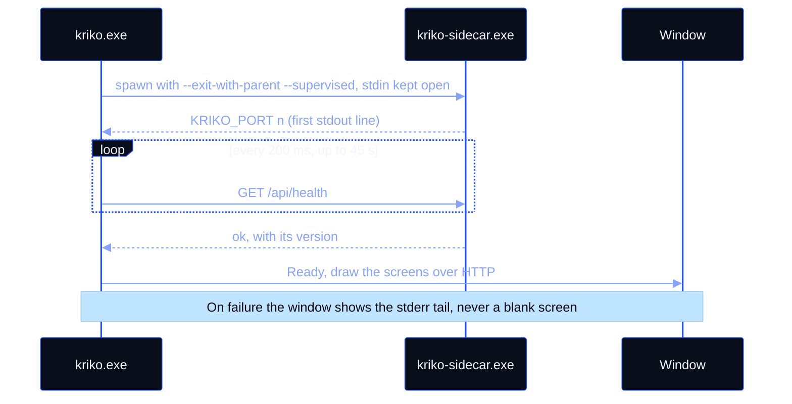
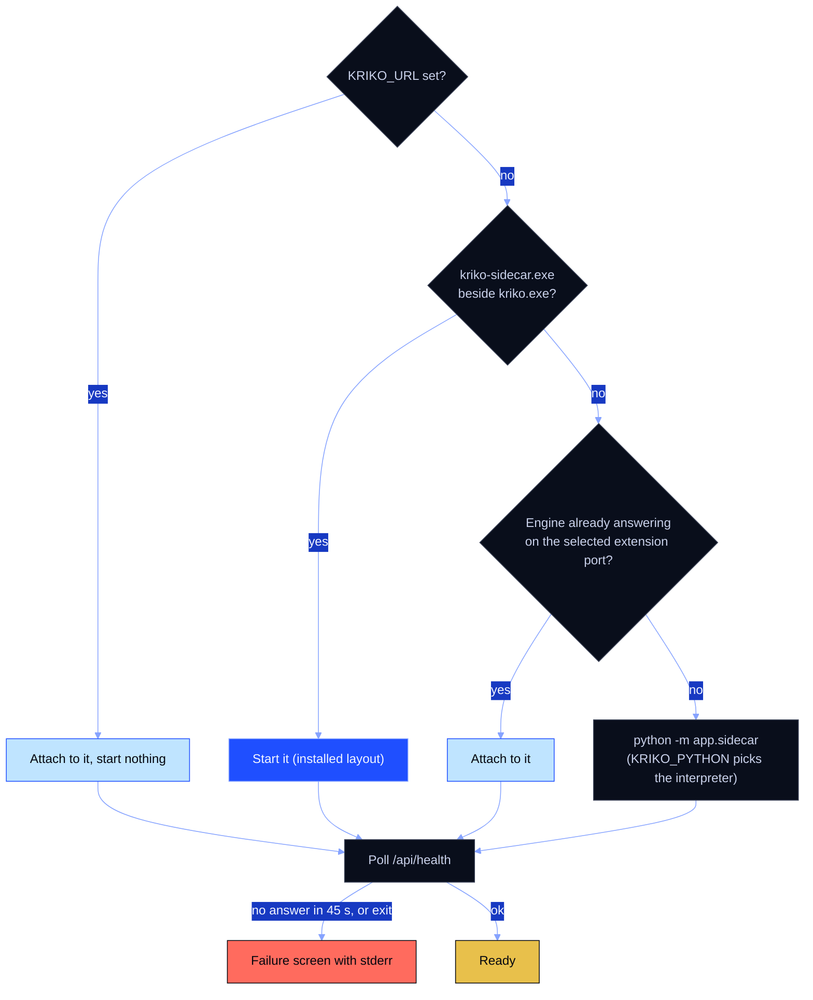

# Kriko for GPUI

The desktop app: Rust and GPUI 0.2.2 on the Kriko design system. It supervises
the engine (the sidecar) and draws every screen from the engine's HTTP API; it
holds no engine logic. The browser extension stays TypeScript and is untouched
by this crate. Palette tokens live in `src/theme.rs`, and the diagrams in these
documents wear them (see `docs/STYLE.md`).

Run it from a source checkout:

```
cargo run --release
```

Everything it draws — the three fonts, the nav icons, the dithered sky images,
the wordmark — is embedded in the binary with `include_bytes!`, so the exe
runs from any working directory with no asset paths to install.

## Layout

- `src/theme.rs` — the whole look: colour tokens, shadows, and the small
  builders (key, plate, well, LED matrix, tag, verdict, meter, switch, agent
  tile, hero, frost, input, keycap, badge, titlebar). Written against only
  the primitives GPUI has: fills, gradients, 1px borders, outer shadows,
  images, SVG alpha masks. No backdrop blur, no inset shadows, no text-shadow.
- `src/dock.rs` — the live actions bar: the needs-you requests with their
  answering keys, the working-now lanes, the feed, and the reply field.
- `src/app.rs` — the shell: the sidebar (brand block, nav groups, the
  needs-you badge on Activity), the hero with the page head, keyboard
  actions, and the text fields.
- `src/data.rs` — the screens' fixed words: the navigation, the history page
  size and the compare suggestions. Every number a screen shows comes from
  `src/live/`, which holds what the engine says, one file per area.
- `src/engine.rs` — the engine supervisor (below).
- `src/shell.rs` — the tray, close-means-hide, and one Kriko per machine.
- `src/api.rs` — the engine's HTTP API from the window's side: loopback only,
  one blocking request at a time, called through `Kriko::fetch`.
- `src/screens/*` — one file per tab, each a function over the shared
  `Kriko` state; every change goes through `cx.listener`, so the app
  re-renders from one place.

## The engine: how the app starts it and ends it

The app is a supervisor, not a second engine. `src/engine.rs` finds the
engine, waits until it answers, and ends it with the app.



Where the engine comes from, first match wins:



| Moment | What happens |
|---|---|
| Handshake | The first stdout line holding `KRIKO_PORT` names a port the engine already holds. |
| Crash belt | `--exit-with-parent` makes the engine watch its stdin. The app keeps the write end for the whole run, so if the app dies in any way, the pipe closes and the engine follows. |
| Failure | The engine could not start, never answered, or stopped: the window shows its stderr tail (24 KiB kept). If it said nothing, the exit code. |
| Close the window | Hides it. The engine keeps serving, because the extension needs it. Without a tray, closing quits instead. |
| Quit (tray: Open, Quit) | Ends the engine, then the app. On Windows the kill is a tree kill (`taskkill /F /T`), because a one-file bundle re-executes: the pid spawned is the bootloader. |
| Attached engine | Left alone on exit. It was not ours to end. |
| Second launch | Raises the first window and exits before starting a second engine. |

## The window and the dock

The system titlebar is gone (`appears_transparent`); the app draws its own
merged strip: the mark, the app name and the current crumb drag the window,
and minimize / restore / close sit on the right as Kriko-style wells. The
restore icon flips to the maximize icon with the window state.

The live actions dock is the right-hand bar, on every tab (the LIVE ON/OFF
toggle in the titlebar collapses it): needs-you requests each carry their
answer key (Sign in, Allow, Approve), the working lanes show live meters,
and the reply field at the bottom posts straight into the feed.

## The screens

Three screens, in the order the rail opens them:

| Screen | What is on it |
| --- | --- |
| Activity | the needs-you callout (tag, two lines, "Open agents" key), the filter input, the TODAY feed (time, text, kind tag per row) |
| History | search input with the verdict/pack filter plates, the checks table (check, verdict chip, confidence meter, agent tiles, took, when), pagination with Previous/Next |
| Settings | 2x2 glass cards: General and Shortcuts left, Privacy and Danger zone right; switches, `~/.kriko` chip, ctrl+N/K/B keycaps, the two-step erase |

The rest of the rail follows the same system: Home (totals, waiting callout,
latest checks, frost start box on the hero), Run (phase stepper, agent lanes,
decision card, feed), Browser extension (steps, pairing code, switches),
Overview (totals, packs with switches, support, gaps), Browse (table plus the
evidence drawer), Sites (add field, trust grades), Benchmark (wide run plate,
LED bars), About.

Compare and Local LLM are the workbenches, and carry the most:

- **Compare** — named drafts (new / save / delete), four pick-a-check slots,
  the answer slab said from the lined-up columns, the specifications and the
  known risks cell by cell (DIFFERS chips, BACKED/DISPUTED trust icons,
  MINOR/SERIOUS/CRITICAL severity chips, one detail row open at a time), a
  drawing board over the shortlist (pen strokes and pinned notes stored as
  fractions, so a mark stays on its column through a resize; undo, clear,
  close), and follow-up questions: type one or press a suggestion, and the
  agent answers while you keep reading.
- **Local LLM** — the server card (address, search service, the LLM picker,
  the wait timeout), the model table with parameters, quantization, context
  window, VRAM fit status and tok/s meters, the tuning card (temperature,
  max tokens, GPU layers, auto unload, CPU fallback), the GPU memory card,
  and the one-tap model test that runs a grounding pass and reports what it
  proved.
- **Agents** — the table carries last-seen and run counts; the detail card
  carries the MCP port chip, latency, the allowed-in-run switch, per-tool
  permissions (read pages, take part in Run, answer questions) and a
  reconnect key.

Setting `KRIKO_VERIFY=compare|risks|local|agents|dock` seeds one page's state at
startup (tab, board with strokes and a note, open sections, finished test)
so it can be captured without driving the mouse on a busy desktop.

## Motion

The design system's four animations all run, and Reduce motion (Settings)
freezes every one of them:

- **Boot** — live tags' LED dots wake with the staggered k-boot flicker.
- **Blink** — needs-you tags pulse; a live meter's leading segment pulses
  while a run is in flight.
- **The switch knob** slides through the --ease-mech overshoot; flipping it
  remounts the knob and the slide replays from the other side.
- **The segmented thumb** slides the same way when a view is picked.

GPUI has no keyframes, so each animation rides `with_animation` on an element
whose id carries the state it depends on — change the state, the element
remounts, the animation replays. The overshoot is applied inside the
animator (an easing function must stay within 0.0..=1.0 or the dev build's
assert fires).

## Build the installer

One command builds everything a reader can install, on Windows:

```
powershell -ExecutionPolicy Bypass -File package.ps1
```



```mermaid
%%{init: {"theme":"base","themeVariables":{"fontFamily":"ui-monospace, SFMono-Regular, Consolas, monospace","primaryColor":"#090E1B","primaryTextColor":"#F2F5FF","primaryBorderColor":"#1F4FFF","lineColor":"#86A3FF","secondaryColor":"#1739C2","tertiaryColor":"#080B16","noteBkgColor":"#BFE4FF","noteTextColor":"#05070F","actorBkg":"#090E1B","actorTextColor":"#F2F5FF","actorBorder":"#1F4FFF","signalColor":"#86A3FF","signalTextColor":"#86A3FF"}}}%%
flowchart LR
    A["Preflight<br/>tools, versions agree"]:::plain --> B["Python side<br/>pip install -r requirements.lock"]:::plain
    B --> C["Build the UI<br/>(-SkipUi reuses the bundle)"]:::plain
    C --> D["Build the packs"]:::plain
    D --> E["Freeze the sidecar<br/>PyInstaller"]:::plain
    E --> F["Sidecar answers?<br/>smoke_sidecar.py"]:::brand
    F --> G["cargo build --release"]:::plain
    G --> H["Place the sidecar<br/>beside kriko.exe"]:::plain
    H --> I["MSI<br/>cargo wix + WiX 3"]:::plain
    I --> J["App opens?<br/>smoke_app.py"]:::brand
    J --> K["Portable zip"]:::plain
    K --> L["builds/"]:::mark

    classDef brand  fill:#1F4FFF,stroke:#86A3FF,color:#F2F5FF
    classDef plain  fill:#090E1B,stroke:#3A4156,color:#C9D1EA
    classDef mark   fill:#E8C04B,stroke:#05070F,color:#05070F
```

Under `builds/` it leaves:

| File | What it is |
|---|---|
| `kriko-<version>-x86_64.msi` | The per-user installer: no administrator prompt, installs under `%LOCALAPPDATA%\Programs\Kriko`. Start-menu shortcuts "Kriko" and "Kriko Console", a desktop shortcut, the Kriko icon. No PATH entry. Upgrade-aware: a newer MSI replaces an older one, and an older one refuses. |
| `kriko-<version>-win64-portable.zip` | `kriko.exe` and `kriko-sidecar.exe`, no install. Everything the app draws is embedded, so it runs from anywhere. |

`<version>` is the tree's (`tools/bump.py --show`); `-Version` is a check, not a
stamp. Both programs ship in each, because the app starts the engine from the
folder it sits in. The installer stops a running Kriko first (the app, then
the engine; both tree kills), because a live sidecar maps its own image and
fails the copy. `kriko-gpui/wix/main.wxs` holds why.

The MSI step needs the WiX 3 toolset (`candle`/`light`) and `cargo install
cargo-wix`. If WiX is not on PATH or in `WIX`, pass its folder:
`.\package.ps1 -WixBin C:\path\to\wix314`. The exe carries the brand icon via
`build.rs` (winresource), so the taskbar and shortcuts show the mark without
any extra files. The installer is unsigned: SmartScreen warns on first run.

The icon (`assets/kriko.ico`) is the white K mark on the flat brand blue
`#1f4fff`, on a smooth rounded square, no sharp corners, at every size
from 16 to 256 px. It is the one file the exe and the installer both read,
so replacing it and re-running `package.ps1` updates the taskbar, the
shortcuts and Add/Remove Programs in one go.

## Interactions

- Every nav item switches tabs; Home's "Start check" goes to Run, Activity's
  "Open agents" to Agents, the callouts lead where they promise.
- The text fields take focus on click, type, backspace, and blink a caret;
  Reduce motion (Settings) stops the blink.
- History's search and filters narrow the rows live; the plates cycle
  verdict and pack; pagination pages through the matches.
- The switches toggle real state (packs, models, agents, privacy).
- Ctrl+N / Ctrl+K / Ctrl+B are bound app-wide, matching the Shortcuts card.
- The danger zone asks twice, then shows what was removed and links to
  Browse to rebuild.

## Fonts and images

`assets/fonts` holds Barlow Condensed 600/700 and DM Sans 400/600 — the two
faces of the design — registered at startup by `theme::register_fonts` under
app-scoped family names (`Kriko Display`, `Kriko Sans`). Labels, crumbs and
figures wear DM Sans (`theme::MONO` is `SANS`, on purpose: the reader did not
like the fixed-width face); only a run's log is set in the machine's own
fixed-width face (`theme::CODE`), so nothing is embedded for it. The scoped
names matter: a machine
with, say, a system "Barlow" installed would otherwise shadow the embedded
face. The hero sky is the dithered band (`sky-dim`, `sky-hero`, `sky-wide`,
loaded through `Resource::Embedded`, never through a path or URI) over a
matching gradient in `theme::hero`, so the fades into the titlebar above
and the content below stay smooth; nav icons are 24x24 stroke SVGs tinted
by `text_color` at 18px.

A stderr logger is installed at startup because GPUI reports asset and font
failures through the `log` crate; without a logger those failures are silent
(and they were: two shipped that way and were only found by logging).
