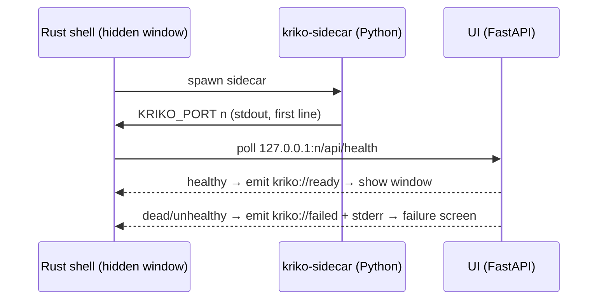

# The desktop shell

A Tauri 2 window around the same server the browser talks to. No engine logic in Rust, ever (`test_the_shell_holds_no_engine_logic`): `src-tauri/src/main.rs` is a ~180-line supervisor, every line about a failure mode.

```
tauri/
  shell-ui/index.html               boot + failure screen (no build step, on purpose)
  src-tauri/src/main.rs             spawns sidecar, reads port, waits for health
  src-tauri/tauri.conf.json
  src-tauri/capabilities/default.json   spawn the sidecar; nothing else
```

## How a launch goes



The window starts hidden on `shell-ui/index.html`, invokes `start_engine`, and only shows on `kriko://ready` — the page then replaces itself with the real UI, served by FastAPI as in a browser. **A blank window is a bug.** Closing hides the window; the engine keeps serving (the extension calls `EXTENSION_PORT` while the reader is on a listing, not in the app). An orphaned uvicorn holds `~/.kriko/knowledge.sqlite`'s WAL lock and breaks the *next* launch — invisible and later.

## Building locally

Rust (`rustup`), Node, Python. Neither wheel nor test suite needs any of it.

```bash
npm --prefix ui run build                       # UI the sidecar serves
pip install pyinstaller
pyinstaller packaging/kriko-sidecar.spec        # -> dist/kriko-sidecar
mkdir -p tauri/src-tauri/binaries
cp dist/kriko-sidecar "tauri/src-tauri/binaries/kriko-sidecar-$(rustc -Vv | sed -n 's/host: //p')"
npm --prefix tauri install && npm --prefix tauri run tauri build
```

`.github/workflows/desktop.yml` does exactly this on macOS/Windows/Linux — **by hand only** since 2026-09-13 (`push`/`pull_request` triggers removed: no Actions minutes, so they only painted false red). Recipe untrimmed; bundles **unsigned** (signing is policy, deferred). On Windows, `pwsh packaging/build_desktop.ps1` runs the whole job (lock install → UI → freeze → smoke → icons → updater config → bundle → smoke). PyInstaller can't cross-compile, so the Windows sidecar freezes on Windows regardless — the script is the same build without the middleman. `test_the_installer_can_be_built_by_hand.py` fails if the script drifts from the workflow's named artifacts.

`src-tauri/Cargo.lock` is committed (all targets fold into one file; `cargo generate-lockfile` in `tauri/src-tauri/` regenerates it — own commit, revertable). `cargo metadata --locked` runs before building so a stale lock fails instead of shipping an unreviewed graph (v0.2.4). `tools/bump.py` writes the lock too (`test_the_four_version_strings_agree`).

## Pre-flight, from non-Windows

Most Windows-build breakage isn't Windows-specific; check from Linux first (run 2026-09-14 for 0.8.0, all green):

```bash
tools/setup.sh
sudo apt-get install -y libwebkit2gtk-4.1-dev libappindicator3-dev librsvg2-dev patchelf libssl-dev xvfb mingw-w64
python -m app.cli build packs/cars  --out dist/cars.kpack
python -m app.cli build packs/drill --out dist/drill.kpack
packaging/freeze.sh                              # freeze + ten smoke checks
triple=$(rustc -Vv | sed -n 's/host: //p')
cp dist/kriko-sidecar "tauri/src-tauri/binaries/kriko-sidecar-$triple"
npm --prefix tauri ci && npm --prefix tauri run tauri icon ../packaging/icon-master.png
cd tauri/src-tauri
cargo metadata --locked --format-version 1 >/dev/null
cargo check
rustup target add x86_64-pc-windows-gnu
touch binaries/kriko-sidecar-x86_64-pc-windows-gnu.exe  # build script only checks existence
cargo check --target x86_64-pc-windows-gnu              # covers #[cfg(windows)]
cd ../..
python packaging/configure_updater.py --repo <owner/name> --version ""
npm --prefix tauri run tauri build               # real .deb + .AppImage
xvfb-run -a python packaging/smoke_app.py tauri/src-tauri/target/release/kriko
```

`-gnu` (not `-msvc`) needs only `mingw-w64`; `cfg(windows)` is true for both, which is all that matters — B89 proved it: twelve tray tests passed on an unparseable `main.rs`, found nine minutes into a hand build by the first real `cargo`.

**Only a Windows box proves:** PyInstaller vs `pywinpty` (is `winpty-agent.exe` along? — the 0.7.4 defect), NSIS bundling, the **Kriko Console** shortcut from `installer.nsh`, tray + tree-kill, WebView2 rendering.

## Nothing outlives *Quit*

Since 0.5.1 the window hides and the tray owns the process (left click reopens; menu has *Open Kriko*, *Quit Kriko*) — killing the engine on X made the extension unusable when the reader is on a listing, not in Kriko. The tray is built with `?`: a shell that can't show one refuses to start (an unstoppable engine is malware-shaped). Three belts:

1. **`--exit-with-parent`.** Sidecar watches its stdin (write end in the shell); shell gone = EOF = engine stops. Only belt covering a crash.
2. **`kill_engine` before `app.exit`** (not after — stdin-EOF is too slow for the next installer) *and* on `RunEvent::Exit` + `Destroyed` (dock quit, logout, post-update restart destroy no window).
3. **Tree kill on Windows.** PyInstaller onefile re-execs: the spawned pid is a bootloader, the child holds the image. `kill_tree` runs `taskkill /F /T /PID`; `child.kill()` alone leaks.

The failure is the *installer* (`Error opening file for writing: …\kriko-sidecar.exe` — a live sidecar keeps its own `.exe` mapped; Ignore leaves old engine beside new shell). So `src-tauri/installer.nsh` stops both in `PREINSTALL`/`PREUNINSTALL` — `Kriko.exe` first (its exit closes stdin, the designed way out), `kriko-sidecar.exe` second (`test_the_shell_runs_in_the_tray.py` pins ordering). Older build hit the dialog? Close Kriko, `taskkill /F /T /IM kriko-sidecar.exe`, reinstall.

## Two ports, one server · one store · self-update

Window: OS-chosen port it is told about. Extension: fixed `EXTENSION_PORT` (8787, `app/web/settings.py`) — a page has no channel from the shell. `uvicorn` serves both sockets; if 8787 is taken the door is skipped with a stderr line and the app opens anyway.

Store: sidecar resolves `~/.kriko/` as the CLI does — one knowledge base, not an app-private split. Updater: shell checks on startup (`offer_update`), asks, then downloads, kills the engine (running sidecar holds the WAL lock) and restarts. Config applied at build time by `packaging/configure_updater.py` from `TAURI_SIGNING_PUBLIC_KEY`; no key → plain installers, `app.updater()` error the shell ignores (so forks build). Enable: `npm --prefix tauri run tauri signer generate -w ~/.kriko-updater.key`, set secrets `TAURI_SIGNING_PRIVATE_KEY` (+`_PASSWORD`) and variable `TAURI_SIGNING_PUBLIC_KEY`; next tag publishes `latest.json`. Keep the private key — rotation strands installed copies onto manual updates.
